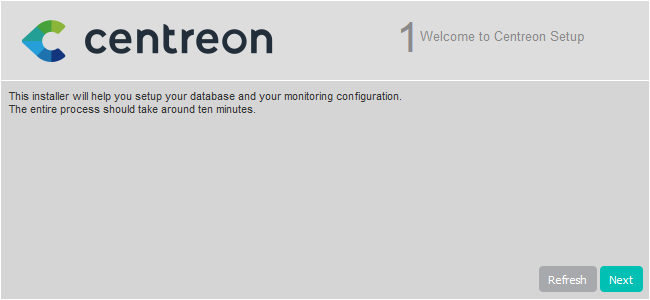
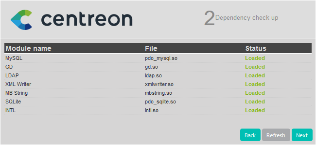
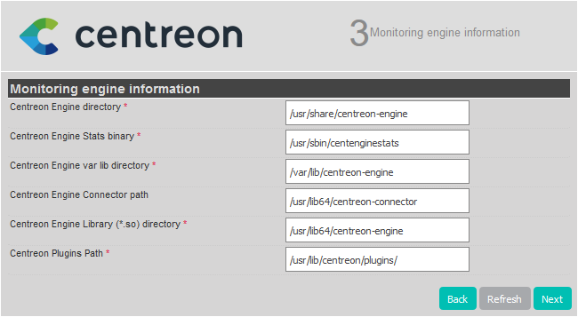
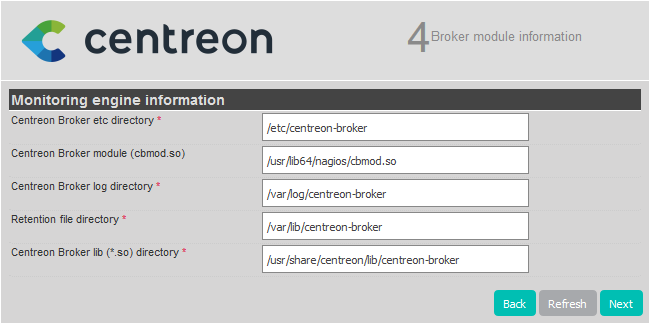
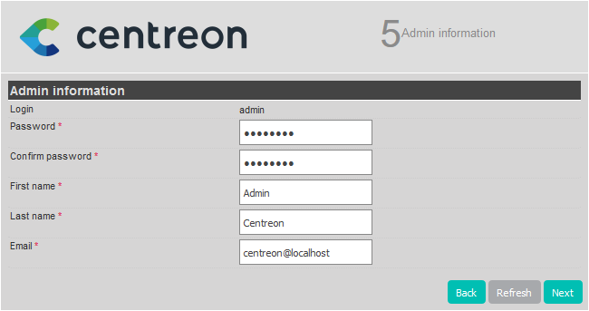
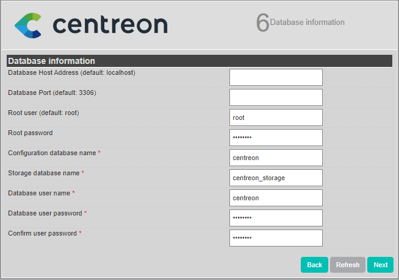
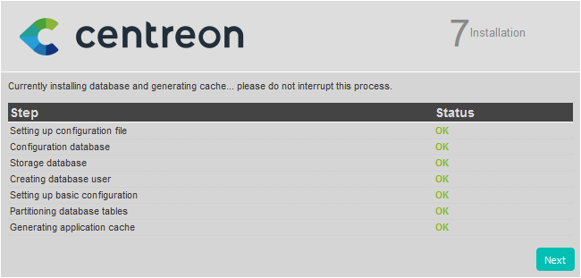
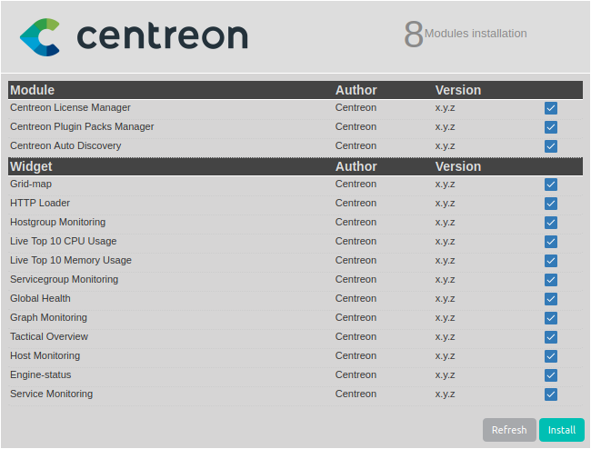
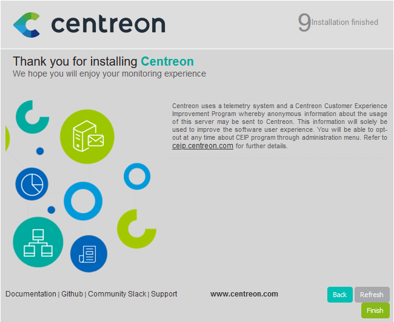
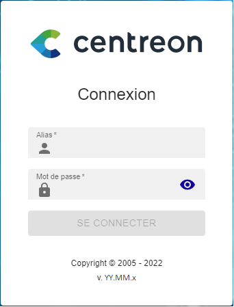

## Installation web

Connectez-vous à l'interface web via `http://<IP>/centreon`.

### Étape 1 : Welcome to Centreon setup

L'assistant de configuration de Centreon s'affiche. Cliquez sur **Next**.



### Étape 2 : Dependency check up

Les modules et les prérequis nécessaires sont vérifiés. Ils doivent tous être satisfaits.
Cliquez sur **Refresh** lorsque les actions correctrices nécessaires ont été effectuées.



Puis cliquez sur **Next**.

### Étape 3 : Monitoring engine information

Definissez les chemins utilisés par le moteur de supervision. Nous recommandons
d'utiliser ceux par défaut.



Puis cliquez sur **Next**.

### Étape 4 : Broker module information

Definissez les chemins utilisés par le multiplexeur. Nous recommandons
d'utiliser ceux par défaut.



Puis cliquez sur **Next**.

### Étape 5 : Admin information

Définissez les informations nécessaires pour la création de l'utilisateur par défaut, **admin**. Vous utiliserez ce compte pour vous connecter à Centreon la première fois. Le mot de passe doit être conforme à la politique de sécurité de mot de passe par défaut : 12 caractères minimum, lettres minuscules et majuscules, chiffres et caractères spéciaux. Vous pourrez changer cette politique par la suite.



Puis cliquez sur **Next**.

### Étape 6 : Database information

Fournissez les informations de connexion à l'instance de base de données.

- **Database Host Address** : si vous utilisez une base de données locale, laissez ce champ vide (la valeur par défaut étant **localhost**). Sinon, renseignez l'adresse IP de votre base de données déportée.
- **Root user/password** : ce compte sera utilisé pour installer les bases de données.
   - S'il s'agit du compte par défaut (**root**), le mot de passe root de la base de données est celui que vous avez défini lorsque vous avez exécuté `mysql_secure_installation` (que vous ayez effectué l'installation à partir des [paquets](installation-of-a-central-server/using-packages.md#sécuriser-la-base-de-données) ou bien des [sources](installation-of-a-central-server/using-sources.md#sécurisez-la-base-de-données)).
   - Si vous avez défini un utilisateur dédié avec des privilèges root sur toutes les bases, (par exemple pendant [l'installation d'une base de donnée déportée](../installation/installation-of-a-central-server/using-packages.md#avec-base-de-données-déportée)), utilisez celui-ci. Cet utilisateur pourra être supprimé une fois l'installation web terminée.

- **Database user name/password**: les identifiants du compte qui sera utilisé pour interagir avec les bases de données Centreon. Le compte sera créé pendant l'installation de la base.



Puis cliquez sur **Next**.

### Étape 7 : Installation

L'assistant de configuration crée les fichiers de configuration et les bases de
données.



Quand le processus est terminé, cliquez sur **Next**.

### Étape 8 : Modules installation

Sélectionnez les modules et widgets disponibles à l'installation.

Puis cliquez sur **Install**.



Une fois les modules installés, cliquez sur **Next**.


### Étape 9 : Installation finished

À cette étape une publicité permet de connaître les dernières nouveautés de
Centreon. Si votre plate-forme est connectée à Internet vous disposez des dernières
informations. Sinon l’information présente dans cette version sera proposée.



L’installation est terminée, cliquez sur **Finish**.

Vous pouvez maintenant vous connecter en utilisant le compte **admin**, et [initialiser la supervision](#initialisation-de-la-supervision).



## Initialisation de la supervision

Pour démarrer les processus de supervision :

1. Depuis l'interface web, rendez-vous dans le menu **Configuration >
Collecteurs**.
2. Sélectionnez le collecteur **Central** dans la liste et cliquez sur
**Exporter la configuration**.
3. Cochez **Déplacer les fichiers générés** en plus de la sélection par défaut
et cliquez sur **Exporter**.
4. Connectez-vous au serveur Central.
5. Démarrez/redémarrez les processus de collecte :

    ```shell
    systemctl restart cbd centengine
    ```

6. Redémarrez le gestionnaire de tâches :

    ```shell
    systemctl restart gorgoned
    ```

7. Démarrez les services de supervision passive :

    ```shell
    systemctl start snmptrapd centreontrapd
    ```

8. Si vous voulez superviser ce serveur, démarrer le démon SNMP :

    ```shell
    systemctl start snmpd
    ```

La supervision est maintenant opérationnelle.

## Ajouter une licence

Selon votre édition de Centreon, vous pouvez devoir [ajouter une licence](../administration/licenses.md).

## Installer les extensions disponibles

Rendez-vous au menu **Administration > Extensions > Gestionnaire** et cliquez sur
le bouton **Install all** :


## Sécurisez votre plateforme

N'oubliez pas de sécuriser votre plateforme Centreon en suivant nos
[recommandations](../administration/secure-platform.md).

## Premiers pas

Rendez-vous dans le chapitre [Premiers pas](../getting-started/installation-first-steps.md)
pour mettre en place votre première supervision.
