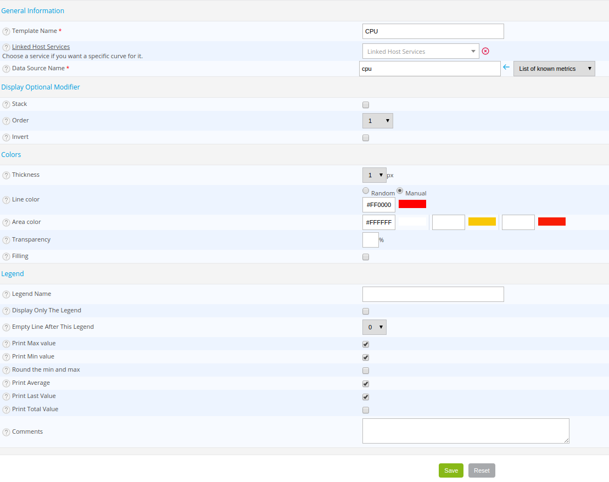

## Définition

Une courbe est la représentation de l'évolution des données de performances (métriques issues de la collecte) visible
via les graphiques de performance. Un graphique peut contenir plusieurs courbes. Il est possible de personnaliser les
courbes en modifiant certains paramètres : l'allure des courbes, la position des courbes sur le graphique, la légende
ainsi que les informations complémentaires (moyenne, valeur totale...).

## Configuration

Se rendre dans le menu **Monitoring \> Performances \> Curves**

* Le champ **Template Name** définit le nom du modèle
* Le champ **Hosts/Service Data Source** définit le service pour lequel sera utilisée cette courbe. Si ces informations
  ne sont pas renseignées, cette définition de courbe s'appliquera à l'ensemble des services dans lesquels cette métrique
  apparait
* Le champ **Data Source Name** permet de sélectionner la métrique qui utilisera cette définition. La liste
  **List of known metrics** permet de choisir les métriques déjà existantes utilisées par les services. Si vous souhaitez réutiliser une défition pour d'autres courbes, vous pouvez utiliser un point "." comme joker dans le nom. Par exemple, si vous avez DataSource-Nom1 et DataSource-Nom2, vous pouvez écrire ici DataSource-. pour appliquer les mêmes réglages à toutes les courbes dont le nom commence par "DataSource-".
* Si la case **Stack** est cochée, cette courbe s'empilera ('stacking') sur les autres (utile pour voir la proportion
  d'une métrique par rapport à une autre).
* Si la case **Stack** est cochée, la liste **Order** permet de définir l'ordre d'affichage/empilage de la courbe (plus
  le nombre est petit, plus il sera proche de l'abscisse).
* Si la case **Invert** est cochée, la courbe est inversée (opposée de la valeur absolue) par rapport à l'axe des ordonnées
  (utile pour voir la proportion du trafic entrant par rapport au trafic sortant).
* La liste **Thickness** exprime l'épaisseur de la ligne du trait de la courbe (exprimée en pixels).
* Le champ **Line color** définit la couleur de la courbe.
* Le champ **Area color** concerne la couleur de remplissage de la courbe si l'option **Filling** est cochée, (voir ci-dessous).
   Elle contient 3 champs qui correspondent respectivement aux couleurs du statut OK, WARNING et CRITICAL.
* Le champ **Transparency** définit le niveau de transparence de la couleur du contour.
* Si la case **Filling** est cochée, alors toute la courbe est remplie avec la couleur de l'aire définie en fonction du statut.

Les attributs ci-dessous concernent les informations situées en dessous du graphique :

* Le champ **Legend** définit la légende de la courbe.
* Si la case **Display only the legend** est cochée, la courbe sera masquée tandis que la légende sera visible.
* La liste **Empty lines after this legend** permet de définir un certain nombre de lignes vides après la légende.
* Si la case **Print max value** est cochée, alors la valeur maximale atteinte par la courbe sera affichée.
* Si la case **Print min value** est cochée, alors la valeur minimale atteinte par la courbe sera affichée.
* Si la case **Round the min and max** est cochée, alors les valeurs minimales et maximales seront arrondies.
* Si la case **Print Average** est cochée, alors la moyenne des points de la courbe sera affichée.
* Si la case **Print last value** est cochée, alors la dernière valeur collectée de la courbe sera affichée.
* Si la case **Print total value** est cochée, s'affiche alors la valeur totale (somme de toutes les valeurs de la courbe
  sur la période sélectionnée). 
* Le champ **Comment** permet de commenter la courbe.

## Exemples de courbes

Les courbes empilées :

Les courbes inversées :

 
Les courbes avec remplissage :

