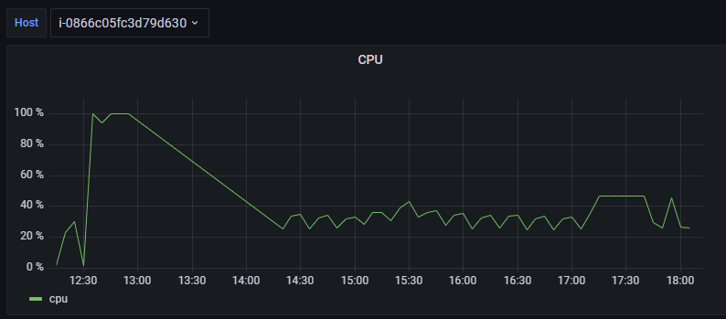

import Tabs from '@theme/Tabs';
import TabItem from '@theme/TabItem';

Le plugin Centreon pour Grafana permet de visualiser dans Grafana des données issues de Centreon. Si vous utilisez Grafana pour récupérer des données d'autres platformes de supervision, vous pourrez ainsi mettre en parallèle les données issues de Centreon avec celles-ci.

## Prérequis

Pour pouvoir utiliser le plugin Centreon pour Grafana, vous devez avoir une licence [MBI](../reporting/introduction.md) valide et le module doit être installé.

## Données disponibles

Une data source Centreon vous permet de visualiser des données de performance issues de Centreon dans vos tableaux de bord Grafana.
Pour sélectionner les données de performance à afficher, vous pouvez combiner des filtres sur divers types de ressources disponibles sur votre plateforme Centreon. Vous pouvez afficher des métriques, des métriques virtuelles et des métaservices en construisant des filtres sur les types de ressources suivants :

- Hosts
- Host groups
- Service Groups
- Services
- Business Activities (si BAM est installé et que vous avez une licence valide)
- Anomaly Detection (si le module est installé et que vous avez une licence valide)

Les données de performance sont disponibles, mais pas des données telles que les statuts des services ou des hôtes, les acquittements ou les downtimes.

## Où obtenir le plugin?

Le plugin Centreon pour Grafana est disponible sur [la page de téléchargement de Centreon](https://download.centreon.com/).

## Comment mettre en place le plugin?

Vous pouvez utiliser la data source Centreon pour Grafana en tant que plugin non signé avec votre propre installation Grafana. (Ce n'est pas possible avec une instance Cloud.)

Pour utiliser la data source Centreon en tant que plugin non signé :

1. Assurez-vous que vous disposez des droits d'administration sur la machine sur laquelle Grafana s'exécute.

2. Téléchargez le fichier zippé contenant la data source depuis la [page de téléchargement de Centreon](https://download.centreon.com/). La data source se situe dans la sous-section **Grafana** de la section **Custom platform**.

3. Si vous n'avez pas de fichier init personnalisé, faites une copie du fichier **grafana/conf/default.ini** et renommez-le **custom.ini**.

4. Extrayez la data source et placez-la dans le répertoire **plugins** de votre installation Grafana. (L'emplacement de ce répertoire est défini dans la variable **plugins** de votre fichier **grafana/conf/custom.ini**.)

5. Éditez le fichier **custom.ini** et ajoutez la data source Centreon à la liste des plugins non signés autorisés :

   ```text
   allow_loading_unsigned_plugins = centreon2-centreon-datasource
   ```

6. Redémarrez le service Grafana.

<Tabs groupId="sync">
<TabItem value="Linux" label="Linux">

```shell
systemctl restart grafana-server
```

</TabItem>
<TabItem value="Windows" label="Windows">

Dans l'onglet **Services** du gestionnaire des tâches, faites un clic droit sur le service Grafana puis cliquez sur **Redémarrer**.

</TabItem>
</Tabs>

La data source Centreon apparaît maintenant dans la liste des plugins disponibles, à la page **Configuration > Plugins** de l'interface Grafana.

## Comparer des données dans un graphique

Utiliser le plugin Centreon pour Grafana permet d'avoir accès à toutes vos données de performance dans Grafana et de pouvoir filtrer selon des groupements de données spécifiques. Par exemple, dans un même graphique, vous pouvez comparer l'évolution d'une métrique commune à différents hôtes ou aux divers hôtes d'un groupe d'hôtes donné.


Vous pouvez utiliser le caractère joker ***** pour filtrer sur plusieurs hôtes en même temps. Utiliser des [variables](https://grafana.com/docs/grafana/latest/variables/) au sein des filtres permet de créer des contextes dynamiques.

## Filtrer avec des variables

Un même tableau de bord Grafana peut contenir divers panneaux. Chaque panneau peut afficher des données provenant d'une source spécifique. Ainsi, vous pouvez comparer des données concernant le même hôte, mais provenant de différentes sources, par exemple, si vous supervisez des données différentes sur un même équipement avec divers outils.

Utilisez des [variables](https://grafana.com/docs/grafana/latest/variables/) pour sélectionner une liste de ressources correspondant à des filtres (par exemple tous les hôtes qui correspondent au groupe d'hôtes **Linux**). Dans le tableau de bord, des filtres vous proposeront automatiquement les variables correspondantes.



Vous pouvez personnaliser l'affichage des libellés des courbes : dans la section **Time Series > Standard options**, utilisez [le champ **Display name**](https://grafana.com/docs/grafana/latest/panels-visualizations/configure-standard-options/#display-name). Par exemple, si vous entrez **${__field.labels.host}: ${__field.labels.service}**, le libellé d'une courbe serait affiché de cette manière : **10.11.12.13: cpu**.
