Voir aussi [notre tutoriel sur la détection d'instances AWS EC2](../../getting-started/autodisco-aws.md).

## Créer une tâche de découverte

1. [Installez](installation.md) le module Auto Discovery.

2. Installez le [Plugin Pack](../pluginpacks.md) correspondant aux ressources que vous voulez découvrir.
    > Les fournisseurs de découverte sont amenés par l'installation de Plugin Packs
    > (Azure, Amazon AWS, VMware, etc). Pour connaître la liste complète, consultez
    > le [catalogue des Plugin
    > Packs](/pp/integrations/plugin-packs/getting-started/introduction).
    >
    > Si, à la page **Configuration > Gestionnaire de connecteurs de supervision**, vous avez réglé **Installation automatique des plugins** sur **ON**, le plugin de découverte sera installé automatiquement lorsque la tâche de découverte sera exécutée.

3. Créez une tâche de découverte pour chaque type de ressources que vous souhaitez découvrir : à la page **Configuration > Hôtes > Découverte**, cliquez sur **+AJOUTER**. 
Un assistant s'ouvre.

Vous pouvez dupliquer des tâches de découverte : survolez la tâche désirée puis cliquez sur **Dupliquer**.

## Assistant de création de tâche de découverte

### Étape 1 : Choisir un fournisseur

1. À la 1ère étape de l'assistant, entrez un nom pour la tâche (si vous n'en saisissez pas, le nom du fournisseur sera utilisé).

2. Cliquez sur le fournisseur correspondant aux ressources que vous voulez découvrir.

    

    La barre de recherche permet de chercher un fournisseur spécifique :

    

3. Cliquez sur **Suivant**. 

### Étape 2 : Définir des paramètres d'accès

Définissez le serveur de supervision depuis lequel sera faite la découverte. Le serveur qui assurera effectivement la supervision pourra être différencié pour chaque hôte à l'aide de [modificateurs](#comment-utiliser-les-modificateurs).


Certains fournisseurs demandent d'autres paramètres d'accès comme un proxy si la
découverte doit se faire sur un service en ligne et/ou des identifiants.

### Étape 3 : Définir des paramètres de découverte

Des paramètres additionnels peuvent être nécessaires pour définir la portée
de la découverte :

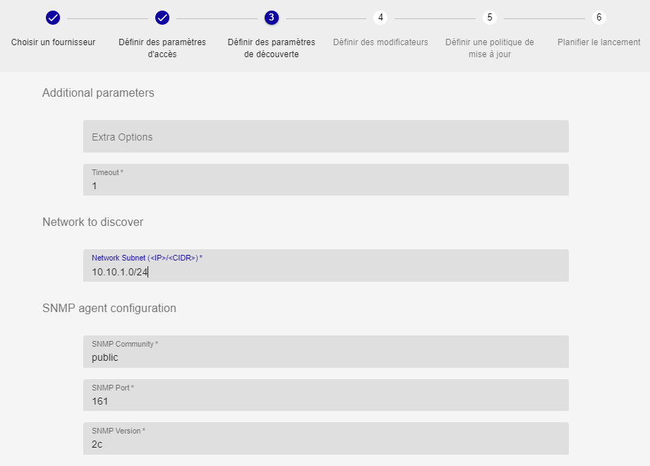

### Étape 4 : Définir des modificateurs

Les modificateurs permettent de définir la configuration des hôtes qui seront créés, ou d'inclure/exclure des hôtes de la liste des résultats. Voir la section [Comment utiliser les
modificateurs](#comment-utiliser-les-modificateurs).

Dans l'assistant, une simulation sur un jeu de données d'exemple (tableau à droite) donne un aperçu de ce à quoi
ressemblerait le résultat de la découverte :

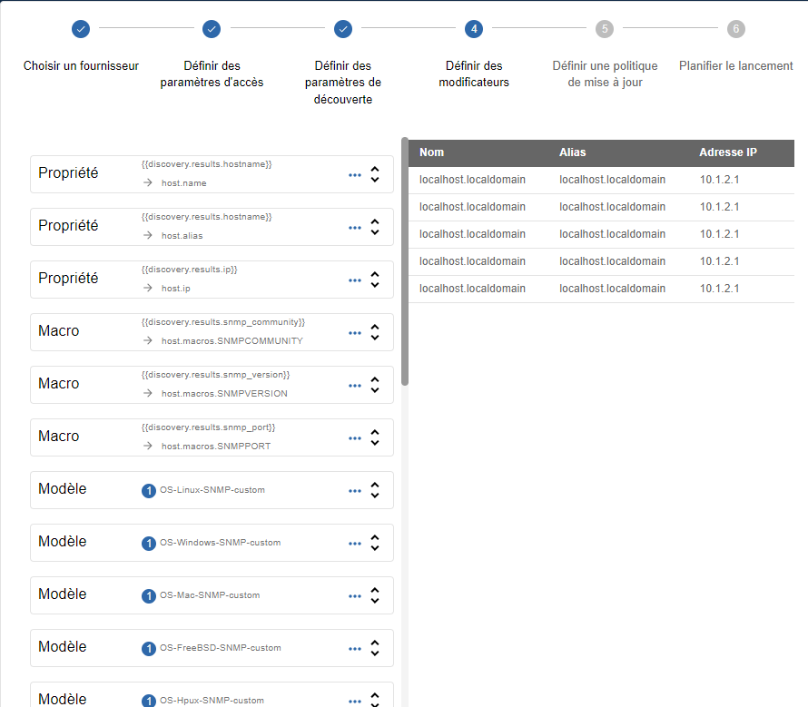

### Étape 5 : Définir les politiques d'analyse et de mise à jour

- **Analyse manuelle** : Une fois la tâche de découverte exécutée,
vous devrez choisir manuellement dans la liste des hôtes découverts quels hôtes ajouter à la liste des hôtes supervisés (visible à la page **Configuration > Hôtes > Hôtes**).
Pour plus d'informations voir la section [Analyser le résultat d'une tâche de découverte](#analyser-le-résultat-dune-tâche-de-découverte).

- **Analyse automatique** : L'analyse traitera le résultat automatiquement selon l'option sélectionnée (au moins une option doit être cochée) :

    - **Ajouter les hôtes à la configuration quand ils sont découverts pour la
          première fois** : tous les hôtes détectés pour la première fois seront créés automatiquement dans 
          la page **Configuration > Hôtes > Hôtes**.

    - **Désactiver les hôtes déjà ajoutés à la configuration si la règle de
          modification les exclut** : les hôtes déjà supervisés seront désactivés
          s'ils correspondent à une nouvelle règle d'exclusion lorsque la tâche de découverte est exécutée à nouveau.

        > Le fait que des hôtes soient non découverts (ou plus découverts) ne
        > désactivera pas les hôtes dans la configuration Centreon. Seuls les hôtes
        > découverts et dans le même temps exclus seront désactivés (voir
        > modificateur [exclusion](#exclusion)).

    - **Activer les hôtes déjà ajoutés à la configuration si ils sont découverts
          mais désactivés** :  les hôtes déjà ajoutés à la configuration mais désactivés seront réactivés

    - **Exporter et recharger la configuration des collecteurs** : une fois les hôtes créés ou mis à jour, la nouvelle configuration sera [déployée](../monitoring-servers/deploying-a-configuration.md) automatiquement, ce qui veut dire que les hôtes seront supervisés ou mis à jour immédiatement, sans devoir intervenir manuellement.

    - **Modifier les hôtes existants** : si vous effectuez des changements sur les modificateurs et exéctuez la tâche à nouveau, les hôtes existants seront mis à jour (voir [Éditer une tâche de découverte](#éditer-une-tâche-de-découverte)).

    - **Ne pas découvrir les hôtes pour lesquels les modificateurs n'appliquent aucun modèle**: si les modificateurs n'appliquent aucun modèle à certains hôtes, alors ceux-ci ne seront pas inclus dans les résultats de la découverte. Si la case est décochée, le modèle par défaut sera appliqué à ces hôtes et ils seront découverts.

    

    Voir l'[exemple ci-dessous](#exemples) pour mieux comprendre le fonctionnement des 3 premières options.

### Étape 6 : Définir l'exécution

- **Exécuter immédiatement** : L'exécution immédiate lancera la découverte juste après la création de la tâche.

- **Planifier l'exécution** : vous pouvez planifier l'exécution de la tâche de différentes manières :

    - Chaque année à des jours définis de mois définis et à une heure définie :

        

    - Chaque mois à des jours définis du mois et à une heure définie :

        

    - Chaque semaine à des jours définis de la semaine et à une heure définie :

        

    - Chaque jour à une heure définie :

        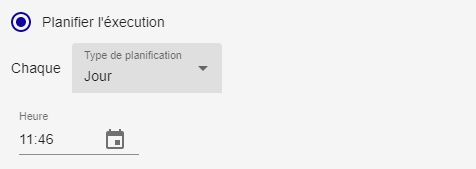

    - Toutes les x heures (à des minutes définies) :

        

    - Toutes les x minutes :

        

Cliquez sur **TERMINER** à la dernière étape de l'assistant pour créer la tâche et l'exécuter ou la planifier. La tâche apparaît dans la liste des tâches de découverte. Voir [Analyser le résultat d'une tâche de découverte](#analyser-le-résultat-dune-tâche-de-découverte).

## Gérer les tâches de découverte

Allez à la page **Configuration > Hôtes > Découverte** pour accéder à la liste des tâches de découverte.


Les états d'une tâche peuvent être :

| Icône                                                                    | état                          |
|--------------------------------------------------------------------------|-------------------------------|
|  | **Programmé**                 |
|    | **En cours**                  |
|     | **En cours d'enregistrement** |
|   | **Terminé**                   |
|     | **Échoué**                    |

- Si une tâche est dans l'état **Terminé**, cliquez sur la flèche près de son statut pour analyser le
résultat. Allez au chapitre [Analyser le résultat d'une
tâche de découverte](#analyser-le-résultat-dune-tâche-de-découverte) pour en savoir plus.

- Si une tâche est dans un état **Échoué**, survolez l'icône pour en connaître la
raison.

Plusieurs actions peuvent être réalisées sur les tâches :

| Icône                                                                          | Action                                                                                                                     |
|--------------------------------------------------------------------------------|----------------------------------------------------------------------------------------------------------------------------|
|  | **Forcer l'exécution** : réexécuter une tâche                                                                              |
|           | Supprimer une tâche. Seule la tâche sera supprimée : les hôtes ayant déjà été ajoutés à la configuration seront conservés. |
|            | Mettre en pause une tâche planifiée                                                                                        |
|           | Reprendre une tâche mise en pause                                                                                          |
|     | accéder aux résultats de la tâche de découverte                                                                            |

## Analyser le résultat d'une tâche de découverte

1. À la page **Configuration > Hôtes > Découverte**, cliquez sur la flèche  à côté du statut d'une tâche terminée pour en visualiser le résultat.

   
   
   La liste de résultats montre les hôtes découverts. Des icônes vous permettent d'identifier l'action qui sera effectuée sur l'hôte :
   
   - L'icône **plus** signifie que cet hôte n’existe pas encore et sera créé.
   - L'icône **flèche** signifie que cet hôte existe déjà et sa configuration sera mise à jour.
   > Notez que les modificateurs de type **Propriété** ne sont pas pris en compte lors du processus de mise à jour.

2. Sélectionnez les hôtes que vous souhaitez ajouter à la liste des hôtes supervisés et cliquez sur le bouton **Sauvegarder**. Cliquez ensuite sur le bouton **Retour** pour revenir à la page **Découverte**.

3. Si vous le souhaitez, vous pouvez éditer les [modificateurs](#comment-utiliser-les-modificateurs) liés à la tâche. Cliquez sur la tâche pour afficher ses paramètres. Dans la section **Modificateurs**, modifiez le modificateur en cliquant sur le bouton d'édition : 

    Les changements seront appliqués directement à la liste des résultats lorsque vous cliquerez sur l'icône **Sauvegarder** en haut à droite du panneau.
    
    Si vous aviez sélectionné **Analyse automatique** et **Modifier les hôtes existants** à l'étape 5 de l'assistant, les hôtes seront mis à jour quand vous réexécuterez la tâche (voir [Éditer une tâche de découverte](#éditer-une-tâche-de-découverte)).

4. Si vous avez sélectionné **Analyse manuelle** à l'étape 5 de l'assistant, sélectionnez les hôtes que vous voulez ajouter ou mettre à jour dans la configuration, puis cliquez
sur le bouton d'enregistrement : 

  Les hôtes sont alors créés ainsi que les services liés à leurs modèles d'hôte.

5. Allez à la page **Configuration > Hôtes > Hôtes** : les hôtes que vous venez de créer apparaissent dans la liste.

  

  Si les hôtes que vous aviez sélectionnés ne sont pas visibles dans la
liste, retournez à la liste des tâches et regardez si une erreur est
survenue pendant la tâche d'enregistrement.

6. Dans les cas suivants, [déployez la configuration](../monitoring-servers/deploying-a-configuration.md) :

   - si l'option **Analyse manuelle** a été sélectionnée à l'étape 5 de l'assistant
   - si l'option **Analyse automatique** a été sélectionnée à l'étape 5 de l'assistant, mais que l'option **Exporter et recharger la configuration des collecteurs** était décochée.

   Les nouveaux hôtes sont maintenant supervisés.

## Éditer une tâche de découverte

Certaines tâches de découverte peuvent être éditées :

- Si la tâche est réglée sur **Analyse automatique** et que vous avez sélectionné **Modifier les hôtes existants** à l'étape 5 de l'assistant, vous pouvez éditer la tâche et la réexécuter : les hôtes concernés par la tâche seront mis à jour. Pour réexécuter une tâche, allez à la page **Configuration > Hôtes > Découverte**, survolez la tâche puis cliquez sur **Forcer l'exécution**.
- Si une tâche est réglée sur **Analyse manuelle** et les hôtes correspondants sont déjà supervisés, alors éditer la tâche et l'exécuter à nouveau n'aura aucun effet.

1. À la page **Configuration > Hôtes > Découverte**, cliquez dans la ligne
de la tâche désirée. Un panneau apparaît à droite.

2. Depuis ce panneau, modifiez les paramètres de la tâche.

   Si la tâche est réglée sur **Analyse automatique**, vous pouvez mettre à jour certaines propriétés des hôtes en utilisant les modificateurs. Vous pouvez :

   - ajouter des modèles, des groupes d'hôtes ou des catégories d'hôtes
   - mettre à jour ou définir la sévérité (il ne peut y avoir qu'une sévérité)
   - mettre à jour ou définir la valeur d'une macro (une macro ne peut avoir qu'une valeur)
   - mettre à jour le serveur de supervision (il ne peut y en avoir qu'un).

  Afin de préserver la cohérence des données et la traçabilité des actions, le nom, l'alias et l'adresse IP d'un hôte ne peuvent pas être modifiés (c'est-à-dire les données apportées par les modificateurs de type **Property**).

  Une fois les modificateurs édités, si vous aviez sélectionné **Modifier les hôtes existants** à l'étape 5 de l'assistant, les hôtes seront mis à jour lorsque la tâche de découverte sera réexécutée. Si vous n'aviez pas sélectionné cette option, exécuter la tâche de nouveau ajoutera seulement les nouveaux hôtes découverts à la supervision : les hôtes existants ne seront pas mis à jour.

  Si le module d'autodécouverte découvre un hôte avec un nom déjà existant, ayant été créé manuellement à la page **Configuration > Hôtes > Hôtes**, cet hôte sera également mis à jour par le module d'autodécouverte, même s'il n'a pas été créé par autodécouverte.

2. Cliquez sur l'icône de sauvegarde en haut à droite du panneau : 

## Comment utiliser les modificateurs

Les modificateurs permettent de :

- définir la configuration des hôtes qui seront créés, en faisant correspondre une valeur découverte sur l'hôte (un attribut) à un champ dans Centreon. La liste des attributs dépend du fournisseur.

- inclure/exclure des hôtes de la liste des résultats.

| Modificateur  |   Action                                                                              |
|---------------|---------------------------------------------------------------------------------------|
| Propriété      | définir un libellé (nom, alias, adresse IP)                                           |
| Macro         | définir une macro custom pour l'hôte                                                  |
| Modèle      | ajouter des modèles d'hôtes (le modèle lié au plugin pack est ajouté automatiquement) |
| Groupe d'hôtes    | rattacher les hôtes à un groupe d'hôtes                                               |
| Catégorie d'hôte | rattacher les hôtes à une catégorie                                                   |
| Criticité d'hôte | prioriser les hôtes par sévérité                                                      |
| Supervision    | choisir depuis quel serveur de supervision les hôtes seront supervisés                |
| Exclusion     | exclure un sous-ensemble d'hôtes sur la base de leurs attributs                       |
| Inclusion     | inclure un sous-ensemble d'hôtes qui aurait été exclus                                |

Pour tous ces modificateurs, des conditions peuvent être définies pour appliquer
la modification à certains hôtes ou non. Les opérateurs de comparaison
peuvent être : *est égal à*, *est différent de*, *contient* et *ne contient pas*.

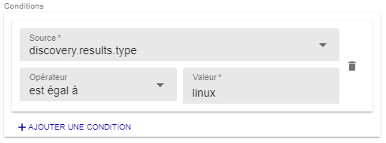

Si vous incluez plusieurs conditions dans un même modificateur, il faut que
toutes les conditions soient vérifiées pour que le modificateur s'applique.

Depuis la version 21.04, dans les modificateurs **Propriété**, **Macro**, **Groupe d'hôtes** et **Catégorie d'hôte** il est possible de concaténer un ou plusieurs
de ces attributs avec une ou plusieurs chaînes de caractères personnalisées.

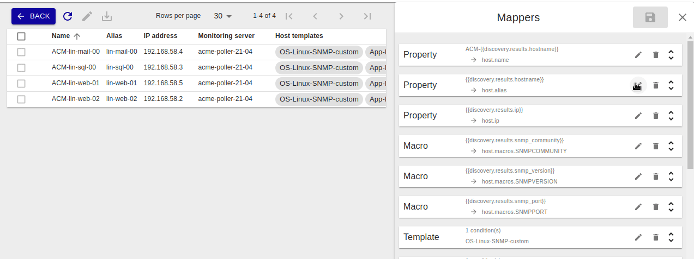

Lorsque vous définissez plusieurs modificateurs du même type et que les conditions s'appliquent à plusieurs d'entre eux, le dernier modificateur prend le pas sur les autres (ceux situés avant lui). Cela s'applique aux modificateurs suivants : supervision, sévérité, propriété, macros.

### Ajouter un modificateur

1. Depuis l'étape quatre de l'assistant de création d'une tâche, ou depuis le
panneau d'édition (dans la section **Modificateurs**), cliquez sur **+AJOUTER UN
MODIFICATEUR**.

2. Sélectionnez le type de modificateur depuis le menu déroulant, et remplissez
tous les champs requis.

3. Cliquez sur **ENREGISTRER** pour ajouter le modificateur.

### Éditer un modificateur

1. Depuis l'étape quatre de l'assistant de création d'une tâche, ou depuis
le panneau d'édition dans la section **Modificateurs**, cliquez sur l'icône
**Plus d'actions**, puis cliquez sur **Éditer**.

2. Modifiez n'importe quel champ ou le type de modificateur lui-même. Voir [Éditer une tâche de découverte](#éditer-une-tâche-de-découverte).

3. Cliquez sur **ENREGISTRER** pour enregistrer le modificateur.

### Supprimer un modificateur

1. Depuis l'étape quatre de l'assistant de création d'une tâche, ou depuis le
panneau d'édition dans la section **Modificateurs**, cliquez sur l'icône
**Plus d'actions**, puis cliquez sur **Supprimer**.

  Une fenêtre demandera de confirmer l'action.

2. Cliquez sur **SUPPRIMER** pour supprimer le modificateur.

### Dupliquer un modificateur

1. Depuis l'étape quatre de l'assistant de création d'une tâche, ou depuis le
panneau d'édition dans la section **Modificateurs**, cliquez sur l'icône
**Plus d'actions**, puis cliquez sur **Dupliquer**.

2. Entrez le nombre de copies à faire du modificateur, puis cliquez sur **Dupliquer**.

## Types de modificateur

### Propriété

Le modificateur **Propriété** est utilisé pour définir les propriétés
communes d'un hôte comme son nom, son alias ou son adresse IP. Ces trois
propriétés sont obligatoires.

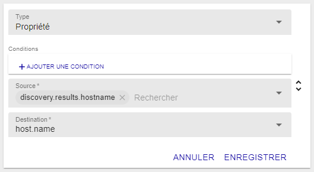

La liste **Source** permet de choisir entre les données d'identification
(credentials), les paramètres additionnels (parameters) ou les attributs
attendus dans le résultat (attributes).

La liste **Destination** permet de définir à quelle propriété la valeur sera
associée.

### Macro

Le modificateur **Macro** est utilisé pour créer des macros custom à
définir au niveau de l'hôte.

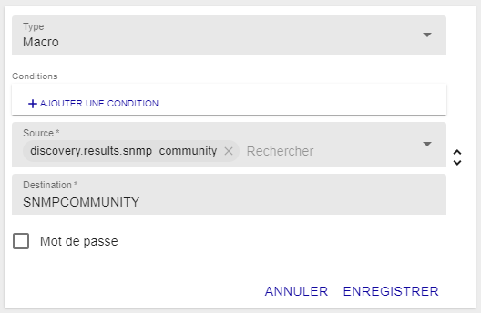

La liste **Source** permet de choisir entre les données d'identification
(credentials), les paramètres additionnels (parameters) ou les attributs
attendus dans le résultat (attributes).

Le champ **Destination** est un champ texte libre.

La case **Mot de passe** définit si la macro sera créée comme une macro "mot de
passe" ou non.

### Modèle

Le modificateur **Modèle** est utilisé pour ajouter un modèle à l'hôte. Vous pouvez ajouter
autant de modificateurs **Modèle** que vous le désirez (un modèle par modificateur).

Comme dans l'exemple ci-dessous, vous pouvez définir un modèle en fonction de certaines conditions
(ici, le modèle OS-Linux-SNMP-custom est appliqué aux hôtes de type Linux).

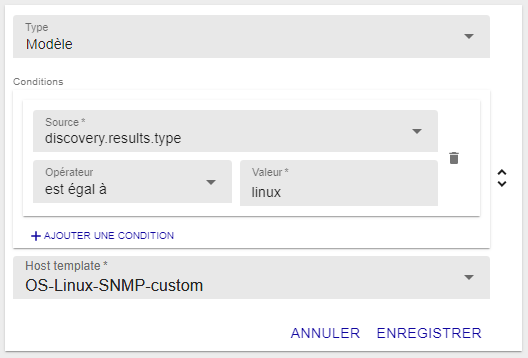

La liste **Modèles d'hôte** permet de choisir parmi tous les modèles d'hôte
définis dans la configuration.

### Groupe d'hôtes

Depuis la version 21.04, il est possible de rattacher des hôtes découverts
automatiquement à des groupes d'hôtes. Cela peut se faire de deux manières.

- Sélectionnez un groupe d'hôtes déjà existant dans le menu déroulant.

    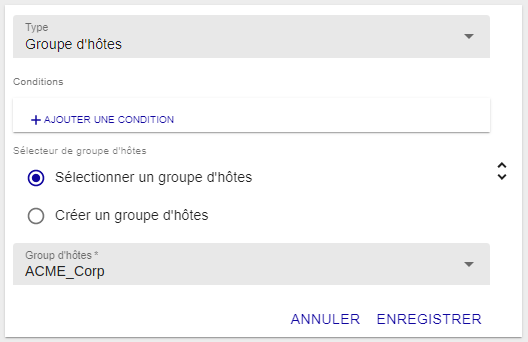

- Création de groupe d'hôtes à la volée : composez un nom de groupe à partir de chaînes de 
caractères et/ou d'informations issues de la découverte (une aide à la 
saisie propose les informations disponibles).

  

  Dans cet exemple, si l'on découvre des serveurs Linux, alors un groupe d'hôtes
`os-linux` sera créé.

  Si un groupe d'hôtes existe déjà avec ce nom, il ne sera pas recréé,
l'hôte sera simplement rattaché à ce groupe.

### Catégorie d'hôte

Depuis la version 21.04, il est également possible de catégoriser les hôtes
découverts automatiquement. Cela peut se faire de deux manières.

- Sélectionnez une catégorie d'hôtes déjà existante dans le menu déroulant.

  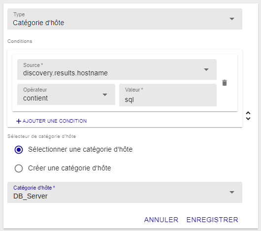

  Dans l'exemple ci-dessus, les hôtes dont le nom contient "sql" seront rattachés à la catégorie "DB_Server".

- Création de catégories d'hôtes à la volée : composez un nom de catégorie à partir de chaînes de
caractères et/ou d'informations issues de la découverte (une aide à la 
saisie propose les informations disponibles).


Si une catégorie d'hôtes existe déjà avec ce nom, elle ne sera pas 
recréée, l'hôte sera simplement rattaché à cette catégorie.

### Criticité d'hôte

Toujours depuis la version 21.04, il est également possible de hiérarchiser
les hôtes découverts automatiquement à l'aide de sévérités d'hôtes. Les 
sévérités étant constituées d'un nom et d'un niveau (numérique), celles-ci
ne peuvent pas être créées à la volée. On ne proposera que la sélection
d'une sévérité existante dans le menu déroulant.

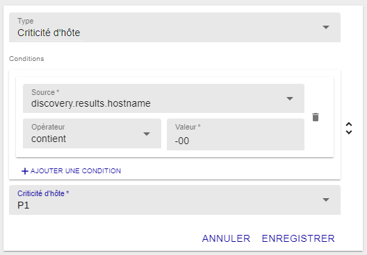

### Supervision

Le modificateur **Supervision** est utilisé pour choisir depuis quel serveur de
supervision l'hôte sera supervisé. Celui-ci est obligatoire.

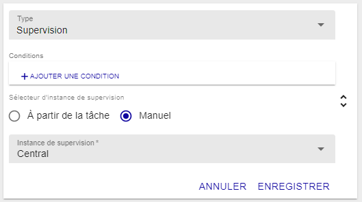

Le bouton radio **Sélecteur d'instance de supervision** permet de choisir entre
le serveur de supervision défini dans la tâche ou depuis ceux disponibles sur
la plateforme Centreon.

Si aucun modificateur de type **Supervision** ne s'applique à un hôte (à cause de conditions trop restrictives que vous auriez définies), le serveur de supervision sur lequel est exécuté le job sera sélectionné par défaut.

### Exclusion

Le modificateur **Exclusion** est utilisé pour exclure un
sous-ensemble des hôtes de la liste des résultats.


Le modificateur utilise les attributs des hôtes comme condition pour les
exclure. Dans l'exemple ci-dessus, les hôtes de type Windows seront exclus de la liste des résultats.

### Inclusion

Le modificateur **Inclusion** permet d'inclure des hôtes qui auraient été préalablement exclus par un modificateur d'exclusion. Les modificateurs **Exclusion** et **Inclusion** doivent donc être ajoutés dans le bon ordre.

 Dans l'exemple ci-dessous, imaginons que tous les hôtes aient été exclus de la liste des résultats (avec un modificateur 
 **Exclusion** *est différent de 1* par exemple). Notre modificateur **Inclusion** permettra d'inclure dans la liste des résultats tous les
 hôtes de type Linux.

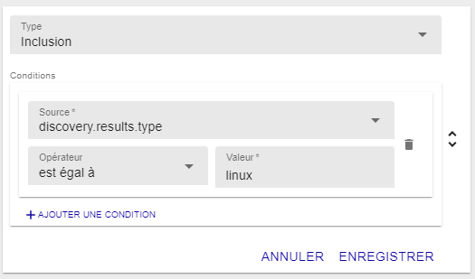

## Attributs avancés

Certains attributs fournis par la découverte, dits attributs avancés, consistent en une liste d'objets contenant des paires de propriétés. Ils peuvent être utilisés comme source pour les modificateurs **Macro**, **Groupe d'hôtes** et **Catégorie d'hôte**, et dans les conditions pour tous les types de modificateurs. En particulier avec les modificateurs de type **Inclusion** et **Exclusion**, ils permettent de filtrer le résultat de la découverte en fonction d'une paire de valeurs précise.

Exemple d'attribut avancé décrivant un hôte : les tags d'un environnement cloud. Imaginons que vos hôtes soient hébergés dans le cloud. Les hôtes ont un attribut avancé nommé **tags**. Pour un hôte ayant les tags **os: windows** et **environment: production**, Host Discovery recevra les tags de la manière suivante :

```json
"tags": [{"key": "os", "value": "windows"}, {"key": "environment", "value": "production"}]
```

**Exemples d'utilisation avec les modificateurs :**

- Dans l'attribut **tags**, la clé **environment** peut avoir la valeur **production**, **preprod** ou **test**. Vous ne voulez superviser que les instances de production, c'est à dire celles pour lesquelles la valeur ("value") **production** est associée à la clé ("key") **environment**. Utilisez un modificateur de type **Exclusion** de la façon suivante :

    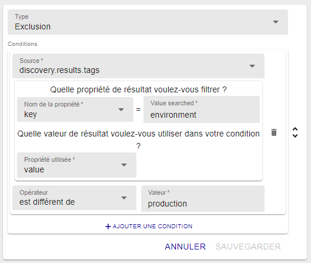

- Vous souhaitez classer des hôtes dans des groupes d'hôtes. Dans l'exemple ci-dessous, les machines seront ajoutées à un groupe d'hôtes correspondant à leur OS : par exemple, toutes les machines dont le tag **os** sera égal à **Windows** appartiendront au groupe d'hôtes **Windows**.

    Ajoutez un modificateur de type **Hostgroup** et sélectionnez **Créer un groupe d'hôtes**. Comme source du modificateur, sélectionnez l'attribut avancé (dans l'exemple: **tags**), puis configurez-le comme ci-dessous :

    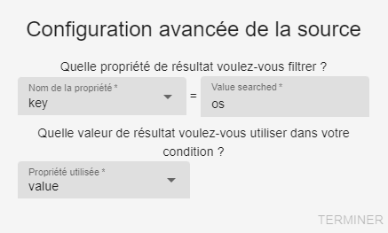

    La valeur de la propriété est indiquée dans une infobulle. Faites **Shift+clic** sur l'attribut avancé pour éditer ses propriétés :

    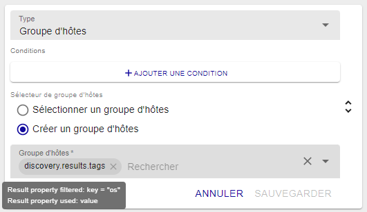

## Exemples

### Mettre à jour votre configuration dynamiquement

**Situation**

Avoir un vCenter VMware avec des machines virtuelles ajoutées, démarrées et
arrêtées dynamiquement.

**Objectif**

Mettre à jour la configuration Centreon en accord avec l'état des machines
virtuelles.

**Créer la bonne tâche de découverte**

Depuis la page principale de la découverte d'hôtes, ajoutez une tâche en
commençant par choisir le fournisseur VMware VM.

Définissez le serveur de supervision depuis lequel vous voulez faire la
découverte. Pour ce fournisseur en particulier, ce paramètre doit être en
accord avec les paramètres de découverte où vous définissez les informations
relatives aux accès au Connecteur Centreon VMware (nom d'hôte/ip et port).

Dans la plupart des cas, vous allez installer le connecteur sur le serveur de
supervision, les paramètres d'accès seront donc *localhost* et le port par
défaut *5700*.

Définissons maintenant les modificateurs et les politiques de mise à jour pour
répondre à nos besoins :

  - Premiers besoins :
    - Ajouter les nouvelles machines virtuelles (ou non encore ajoutées), (1)
    - Exclure les machines virtuelles non démarrées. (2)

  - Deuxièmes besoins :
    - Désactiver les machines virtuelles qui sont arrêtées, (3)
    - Ré-activer les machines virtuelles qui sont démarrées (après avoir été
      arrêtées). (4)

Cela va se traduire par un modificateur *Exclusion* avec la configuration
suivante :


Ainsi, toutes les machines virtuelles qui sont arrêtées ne feront pas partie du
résultat qui sera analysé. Elles ne seront pas ajoutées. (2)

En plus de ce modificateur, choisissez l'analyse automatique avec toutes les
politiques de mise à jour comme ci-dessous :


Avec la première politique, les machines virtuelles qui font partie du résultat
seront ajoutées (1).

Avec la deuxième, les machines virtuelles qui ont été ajoutées à un moment (car
dans un état démarré) seront désactivées dans la configuration Centreon si elles
se retrouvent dans un état arrêté (3).

La dernière activera les machines virtuelles qui sont de nouveau dans un état
démarré (4).

Bien sûr, les deux dernières politiques fonctionnent mieux si la tâche de
découverte est planifiée pour être exécutée plus d'une fois.

> Note : Si une machine virtuelle est amenée à être supprimée, elle ne sera pas
> supprimée (ni même désactivée) de la configuration Centreon. Seul les hôtes
> découverts et dans le même temps exclus sont désactivés dans la configuration
> (si la politique est choisie).
