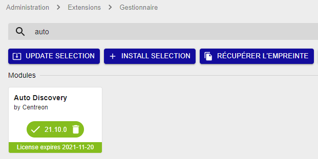

import Tabs from '@theme/Tabs';
import TabItem from '@theme/TabItem';

## Installer le module d'autodécouverte

1. Pour installer le paquet, exécutez la commande suivante sur le serveur Central :

<Tabs groupId="sync">
<TabItem value="Alma / RHEL / Oracle Linux 8" label="Alma / RHEL / Oracle Linux 8">

``` shell
dnf install -y centreon-auto-discovery-server
```

</TabItem>
<TabItem value="Alma / RHEL / Oracle Linux 9" label="Alma / RHEL / Oracle Linux 9">

``` shell
dnf install -y centreon-auto-discovery-server
```

</TabItem>
<TabItem value="Debian 11" label="Debian 11">

``` shell
apt update && apt install centreon-auto-discovery-server
```

</TabItem>
</Tabs>

2. Pour installer l'extension, connectez-vous à l’interface web de Centreon avec un compte ayant le
droit d’installer des modules et rendez-vous dans le menu **Administration >
Extensions > Gestionnaire**.

3. Assurez-vous que les modules **License Manager** et **Gestionnaire de connecteurs de supervision** sont à jour
 avant de procéder à l'installation du module **Auto Discovery**.

4. Cliquez sur l’icône d’installation correspondant au module **Centreon Auto
Discovery**. Le module est maintenant installé :

  

5. Rendez-vous dans le menu **Configuration > Gestionnaire de connecteurs de supervision** et [installez les connecteurs de supervision
](../pluginpacks.md#installation-du-pack) correspondant aux fournisseurs de découverte désirés.
