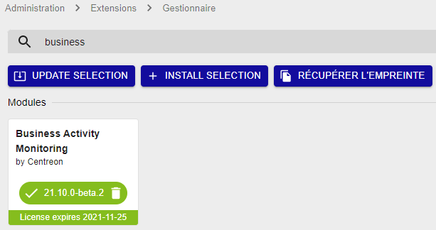

import Tabs from '@theme/Tabs';
import TabItem from '@theme/TabItem';

> Centreon BAM est une **extension** Centreon qui requiert une license
> valide. Pour plus d'information, contactez
> [Centreon](mailto:sales@centreon.com).

## Prerequisites

Voir les [prérequis logiciels](../installation/prerequisites.md#logiciels).

Installez BAM sur le serveur central.
Le serveur central et Centreon BAM doivent être dans la même version majeure (c'est-à-dire tous les deux en 23.04.x).
Si vous voulez pouvoir voir les Activités métier supervisées par un serveur distant, installez BAM également sur le serveur distant. Lorsque BAM est installé sur un serveur distant, les Activités métier n'incluent que les ressources supervisées par le serveur distant.

## Installation

### Installation du paquet

Ajouter le dépôt Centreon Business, vous pouvez le trouver sur le 
[portail support](https://support.centreon.com/hc/fr/categories/10341239833105-D%C3%A9p%C3%B4ts).

Et installer le paquet en exécutant la commande ci-dessous :

<Tabs groupId="sync">
<TabItem value="Alma / RHEL / Oracle Linux 8" label="Alma / RHEL / Oracle Linux 8">

``` shell
dnf install centreon-bam-server
```

</TabItem>
<TabItem value="Alma / RHEL / Oracle Linux 9" label="Alma / RHEL / Oracle Linux 9">

``` shell
dnf install centreon-bam-server
```

</TabItem>
<TabItem value="Debian 11" label="Debian 11">

```shell
apt update && apt install centreon-bam-server
```

</TabItem>

</Tabs>

### Charger la licence

Le fichier de licence "bam.license" est fourni par Centreon, pour
l'installer, rendez vous dans **Administration > Extensions > Gestionnaire** puis
télécharger la via l'interface.

### Installation sur l'interface

Se rendre dans le menu **Administration > Extensions > Gestionnaire** et cliquez
sur le bouton d'installation des modules suivantes :

- License Manager (si celui-ci n'est pas déjà installé)
- Business Activity Monitoring

Une fois installé et la licence ajoutée, le module aura un bandeau vert
indiquant la date de fin de validité de la licence :



> Si vous utilisez une réplication MariaDB pour vos bases de données de
> **monitoring**, lors de l'installation de Centreon BAM, une vue est
> créée. Il faut l'exclure de la réplication en rajoutant la ligne
> suivante dans le fichier my.cnf du slave
>
> ``` text
> replicate-ignore-table=centreon.mod_bam_view_kpi
> ```
>
> puis créer les vues sur le slave [avec le fichier suivant](view_creation.sql), en lançant la commande:
>
> ``` shell
> myqsl centreon < view_creation.sql
> ```
