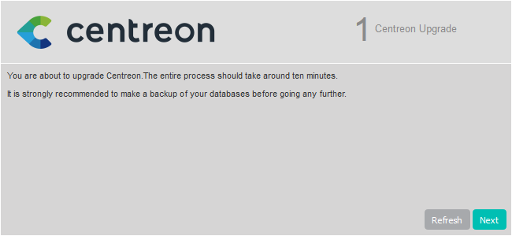
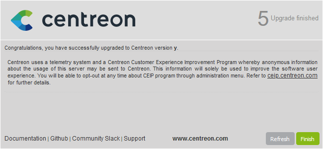

import Tabs from '@theme/Tabs';
import TabItem from '@theme/TabItem';

Ce chapitre décrit la procédure de montée de version de votre plate-forme
Centreon depuis la version 20.10 vers la version 23.04.

Vous ne pouvez pas simplement monter de version depuis une version antérieure à Centreon 20.10 et vers une version 23.04, car CentOS 7 n'est plus supporté: vous devez [migrer votre plateforme vers un OS supporté](../migrate/introduction.md).

> Lorsque vous effectuez la montée de version de votre serveur central, assurez-vous d'également mettre à jour tous vos serveurs distants et vos collecteurs. Dans votre architecture, tous les serveurs doivent avoir la même version de Centreon. De plus, tous les serveurs doivent utiliser la même [version du protocole BBDO](../developer/developer-broker-bbdo.md#switching-versions-of-bbdo).

> Si vous souhaitez migrer votre serveur Centreon vers Oracle Linux
> / RHEL 8 ou 9, vous devez suivre la [procédure de migration](../migrate/migrate-from-el-to-el.md)

> Pour effectuer cette procédure, votre version de MariaDB doit être >= 10.3.22.
> Si cela n'est pas le cas, merci de suivre avant le
> [chapitre de mise à jour de MariaDB](./upgrade-mariadb.md)

> Attention, suite à la correction d'un problème relatif au schéma de base de données, il sera nécessaire
> d'arrêter l'insertion en base de données des données collectées le temps de la mise à jour. Celles-ci seront stockées
> dans des fichiers temporaires puis insérées à la fin du processus de mise à jour.

## Prérequis

> Lorsque vous lancez une commande, vérifiez les messagez obtenus. En cas de message d'erreur, arrêtez la procédure et dépannez les problèmes.

### Sauvegarde

Avant toute chose, il est préférable de s’assurer de l’état et de la consistance
des sauvegardes de l’ensemble des serveurs centraux de votre plate-forme :

- Serveur Centreon Central,
- Serveur de gestion de base de données.

### Mettre à jour la clé de signature RPM

> Pour des raisons de sécurité, les clés utilisées pour signer les RPMs Centreon sont changées régulièrement. Le dernier changement a eu lieu le 14 octobre 2021. Lorsque vous mettez Centreon à jour depuis une version plus ancienne, vous devez suivre la [procédure de changement de clé](../security/key-rotation.md#installation-existante), afin de supprimer l'ancienne clé et d'installer la nouvelle.

## Montée de version du serveur Centreon Central

> Depuis la version 21.04, Centreon utilise **MariaDB 10.5**.
>
> Le processus suivant met seulement à jour les composants Centreon pour le
> moment.
>
> MariaDB sera mis à jour après.

### Installer les nouveaux dépôts

<Tabs groupId="sync">
<TabItem value="Alma / RHEL / Oracle Linux 8" label="Alma / RHEL / Oracle Linux 8">

1. Mettez à jour votre Centreon 20.10 jusqu'à la dernière version mineure.

2. Supprimez le fichier **centreon.repo** :

   ```shell
   rm /etc/yum.repos.d/centreon.repo
   ```

3. Installez le nouveau dépôt :

```shell
dnf install -y dnf-plugins-core
dnf config-manager --add-repo https://packages.centreon.com/rpm-standard/23.04/el8/centreon-23.04.repo
```

</TabItem>
</Tabs>

> Si vous avez une [licence offline](../administration/licenses.md#types-de-licences), supprimez également l'ancien dépôt des connecteurs de supervision, puis installez le nouveau dépôt.
>
> Si vous avez une édition Business, faites de même avec le dépôt Business.
>
> Vous pouvez trouver l'adresse des dépôts sur le [portail support Centreon](https://support.centreon.com/hc/fr/categories/10341239833105-D%C3%A9p%C3%B4ts).


### Installer le dépôt MariaDB

```shell
cd /tmp
curl -JO https://downloads.mariadb.com/MariaDB/mariadb_repo_setup
bash ./mariadb_repo_setup
sed -ri 's/1[0-1]\.[0-9]+/10.5/' /etc/yum.repos.d/mariadb.repo
rm -f ./mariadb_repo_setup
```

### Montée de version de PHP

Centreon 23.04 utilise PHP en version 8.1.

<Tabs groupId="sync">
<TabItem value="RHEL 8" label="RHEL 8">

Vous devez tout d'abord installer les dépôts **remi** :

```shell
dnf install -y dnf-plugins-core
dnf install -y https://dl.fedoraproject.org/pub/epel/epel-release-latest-8.noarch.rpm
dnf install -y https://rpms.remirepo.net/enterprise/remi-release-8.rpm
sudo subscription-manager repos --enable codeready-builder-for-rhel-8-x86_64-rpms
```

Ensuite, vous devez changer le flux PHP de la version 7.3 à 8.1 en exécutant les commandes suivantes et en répondant **y**
pour confirmer :

```shell
dnf module reset php
```

```shell
dnf module install php:remi-8.1
```

</TabItem>
<TabItem value="Alma / Oracle Linux 8" label="Alma / Oracle Linux 8">

Vous devez tout d'abord installer les dépôts **remi** :

```shell
dnf install -y dnf-plugins-core
dnf install -y https://dl.fedoraproject.org/pub/epel/epel-release-latest-8.noarch.rpm
dnf install -y https://rpms.remirepo.net/enterprise/remi-release-8.rpm
```

Ensuite, vous devez changer le flux PHP de la version 7.3 à 8.1 en exécutant les commandes suivantes et en répondant **y**
pour confirmer :

```shell
dnf module reset php
```

```shell
dnf module install php:remi-8.1
```

</TabItem>
</Tabs>

### Montée de version de la solution Centreon

> Assurez-vous que tous les utilisateurs sont déconnectés avant de commencer
> la procédure de mise à jour.

Si vous avez des extensions Business installées, mettez à jour le dépôt business en 23.04.
Rendez-vous sur le [portail du support](https://support.centreon.com/hc/fr/categories/10341239833105-D%C3%A9p%C3%B4ts) pour en récupérer l'adresse.

Arrêter le processus Centreon Broker :
```shell
systemctl stop cbd
```

Supprimez les fichiers de rétention présents :
```shell
rm /var/lib/centreon-broker/* -f
```

Videz le cache :

```shell
dnf clean all --enablerepo=*
```

Mettez à jour l'ensemble des composants :

<Tabs groupId="sync">
<TabItem value="Alma / RHEL / Oracle Linux 8" label="Alma / RHEL / Oracle Linux 8">

```shell
dnf update centreon\* php-pecl-gnupg
```

</TabItem>
</Tabs>

> Acceptez les nouvelles clés GPG des dépôts si nécessaire.

<Tabs groupId="sync">
<TabItem value="Alma / RHEL / Oracle Linux 8" label="Alma / RHEL / Oracle Linux 8">

Exécutez les commandes suivantes :

```shell
systemctl enable php-fpm
systemctl restart php-fpm
```

</TabItem>
</Tabs>

### Mettre à jour une configuration Apache personnalisée

Cette section s'applique uniquement si vous avez personnalisé votre configuration Apache. 

<Tabs groupId="sync">
<TabItem value="Alma / RHEL / Oracle Linux 8" label="Alma / RHEL / Oracle Linux 8">

Lors de la montée de version, le fichier de configuration Apache n'est pas mis à jour automatiquement : le nouveau fichier de configuration amené par le rpm ne remplace pas l'ancien. Vous devez reporter les changements manuellement dans votre fichier de configuration personnalisée.

Faites un diff entre l'ancien et le nouveau fichier de configuration Apache :

```
diff -u /etc/httpd/conf.d/10-centreon.conf /etc/httpd/conf.d/10-centreon.conf.rpmnew
```

* **10-centreon.conf** (post montée de version) : ce fichier contient la configuration personnalisée. Il ne contient pas les nouveautés apportées par la montée de version.
* **10-centreon.conf.rpmnew** (post montée de version) : ce fichier est fourni par le rpm; il ne contient pas la configuration personnalisée.

Pour chaque différence entre les fichiers, évaluez si celle-ci doit être reportée du fichier **10-centreon.conf.rpmnew** au fichier **10-centreon.conf**.

Vérifiez qu'Apache est bien configuré, en exécutant la commande suivante :

```shell
apachectl configtest
```

Le résultat attendu est le suivant :

```shell
Syntax OK
```

Redémarrez Apache pour appliquer les modifications :

```shell
systemctl restart php-fpm httpd
```

Puis vérifiez le statut :

```shell
systemctl status httpd
```

Si tout est correct, vous devriez avoir quelque chose comme :

```shell
● httpd.service - The Apache HTTP Server
   Loaded: loaded (/usr/lib/systemd/system/httpd.service; enabled; vendor preset: disabled)
  Drop-In: /usr/lib/systemd/system/httpd.service.d
           └─php-fpm.conf
   Active: active (running) since Tue 2020-10-27 12:49:42 GMT; 2h 35min ago
     Docs: man:httpd.service(8)
 Main PID: 1483 (httpd)
   Status: "Total requests: 446; Idle/Busy workers 100/0;Requests/sec: 0.0479; Bytes served/sec: 443 B/sec"
    Tasks: 278 (limit: 5032)
   Memory: 39.6M
   CGroup: /system.slice/httpd.service
           ├─1483 /usr/sbin/httpd -DFOREGROUND
           ├─1484 /usr/sbin/httpd -DFOREGROUND
           ├─1485 /usr/sbin/httpd -DFOREGROUND
           ├─1486 /usr/sbin/httpd -DFOREGROUND
           ├─1487 /usr/sbin/httpd -DFOREGROUND
           └─1887 /usr/sbin/httpd -DFOREGROUND

```

</TabItem>
</Tabs>

#### Configuration Apache personnalisée : activer la compression du texte

Pour améliorer le temps de chargement des pages, vous pouvez activer la compression du texte sur le serveur Apache. Le paquet **brotli** est nécessaire. Cette configuration est optionnelle mais vous fournira une meilleure expérience utilisateur.

Ajoutez le code suivant à votre fichier de configuration Apache, dans les éléments `<VirtualHost *:80>` et `<VirtualHost *:443>` :

```shell
<IfModule mod_brotli.c>
    AddOutputFilterByType BROTLI_COMPRESS text/html text/plain text/xml text/css text/javascript application/javascript application/json
</IfModule>
AddOutputFilterByType DEFLATE text/html text/plain text/xml text/css text/javascript application/javascript application/json
```

### Montée de version du serveur MariaDB

Les composants MariaDB peuvent maintenant être mis à jour.

> Référez vous à la documentation officielle de MariaDB pour en savoir
> davantage sur ce processus :
>
> https://mariadb.com/kb/en/upgrading-between-major-mariadb-versions/

#### Mettre à jour le dépôt Centreon

> Cette étape est nécessaire seulement si votre environnement comprend une base de données déportée.
> Si le serveur central Centreon et
> MariaDB sont hébergés sur le même serveur, sautez cette étape.

Exécutez la commande suivante sur le serveur de base de données dédié :

<Tabs groupId="sync">
<TabItem value="Alma / RHEL / Oracle Linux 8" label="Alma / RHEL / Oracle Linux 8">

```shell
dnf install -y dnf-plugins-core
dnf config-manager --add-repo https://packages.centreon.com/rpm-standard/23.04/el8/centreon-23.04.repo
```

</TabItem>
</Tabs>

#### Mettre à jour MariaDB

Il est nécessaire de désinstaller puis réinstaller MariaDB pour changer de version majeure (c'est-à-dire pour passer d'une version 10.3 à une version 10.5).

1. Arrêtez le service mariadb :

    ```shell
    systemctl stop mariadb
    ```

2. Désinstallez la version actuelle :

    ```shell
    rpm --erase --nodeps --verbose MariaDB-server MariaDB-client MariaDB-shared MariaDB-compat MariaDB-common
    ```

    > Pendant cette étape de désinstallation, vous pouvez rencontrer une erreur parce qu'un ou plusieurs paquets MariaDB sont manquants. Dans ce cas, vous devez exécuter la commande de désinstallation sans inclure le paquet manquant.

    Par exemple, vous obtenez le message d'erreur suivant :

    ```shell
    package MariaDB-compat is not installed
    ```

    Comme le paquet **MariaDB-compat** est manquant, vous devez exécuter la même commande sans citer **MariaDB-compat** :

    ```shell
    rpm --erase --nodeps --verbose MariaDB-server MariaDB-client MariaDB-shared MariaDB-common
    ```

  > Assurez-vous d'avoir [installé le dépôt officiel de MariaDB](./upgrade-from-20-10.md#installer-le-dépôt-mariadb) avant de poursuivre la procédure.

3. Installez la version 10.5 :

    ```shell
    dnf install MariaDB-server-10.5\* MariaDB-client-10.5\* MariaDB-shared-10.5\* MariaDB-common-10.5\*
    ```

4. Démarrer le service mariadb :

    ```shell
    systemctl start mariadb
    ```

5. Lancez le processus de mise à jour MariaDB :

    ```shell
    mysql_upgrade
    ```

    Si votre base de données est protégée par mot de passe, entrez :

   ```shell
    mysql_upgrade -u <utilisateur_admin_bdd> -p
    ```

    Exemple : si votre utilisateur_admin_bdd est `root`, entrez:

    ```shell
    mysql_upgrade -u root -p
    ```

    > Référez vous à la [documentation officielle](https://mariadb.com/kb/en/mysql_upgrade/)
    > pour plus d'informations ou si des erreurs apparaissent pendant cette dernière étape.

#### Activer MariaDB au démarrage automatique

Exécutez la commande suivante :

```shell
systemctl enable mariadb
```

### Finalisation de la mise à jour

<Tabs groupId="sync">
<TabItem value="Alma / RHEL / Oracle Linux 8" label="Alma / RHEL / Oracle Linux 8">

Avant de démarrer la montée de version via l'interface web, rechargez le serveur Apache avec la commande suivante :

```shell
systemctl reload httpd
```

</TabItem>
</Tabs>

Connectez-vous ensuite à l'interface web Centreon pour démarrer le processus de
mise à jour :

Cliquez sur **Next** :



Cliquez sur **Next** :


La note de version présente les principaux changements, cliquez sur **Next** :


Le processus réalise les différentes mises à jour, cliquez sur **Next** :


Votre serveur Centreon est maintenant à jour, cliquez sur **Finish** pour
accéder à la page de connexion :



> La présentation de l'interface ayant été modifiée dans la version 22.10, vous devez vider le cache de votre navigateur pour afficher le nouveau thème.

Si le module Centreon BAM est installé, référez-vous à la [documentation
associée](../service-mapping/upgrade.md) pour le mettre à jour.

### Actions post montée de version

1. Montée de version des extensions :

   Depuis le menu **Administration > Extensions > Gestionnaire**, mettez à jour
   toutes les extensions, en commençant par les suivantes :

   - License Manager,
   - Gestionnaire de connecteurs de supervision,
   - Auto Discovery.

   Vous pouvez alors mettre à jour toutes les autres extensions commerciales.

2. [Déployer la configuration](../monitoring/monitoring-servers/deploying-a-configuration.md).

3. Redémarrez les processus Centreon :

   ```shell
   systemctl restart cbd centengine centreontrapd gorgoned
   ```

## Montée de version des Remote Servers

Cette procédure est identique à la montée de version d'un serveur Centreon
Central.

> En fin de mise à jour, la configuration doit être déployée depuis le serveur Central.

## Montée de version des collecteurs

### Mise à jour des dépôts

Exécutez la commande suivante :

<Tabs groupId="sync">
<TabItem value="Alma / RHEL / Oracle Linux 8" label="Alma / RHEL / Oracle Linux 8">

```shell
dnf install -y dnf-plugins-core
dnf config-manager --add-repo https://packages.centreon.com/rpm-standard/23.04/el8/centreon-23.04.repo
```

</TabItem>
</Tabs>

### Montée de version de la solution Centreon

Videz le cache :

```shell
dnf clean all --enablerepo=*
```

Mettez à jour l'ensemble des composants :

```shell
dnf update centreon\*
```

> Acceptez les nouvelles clés GPG des dépôts si nécessaire.

Démarrez et activez **gorgoned**:

```shell
systemctl start gorgoned
systemctl enable gorgoned
```

Redémarrez **centengine**:

```shell
systemctl restart centengine
```
