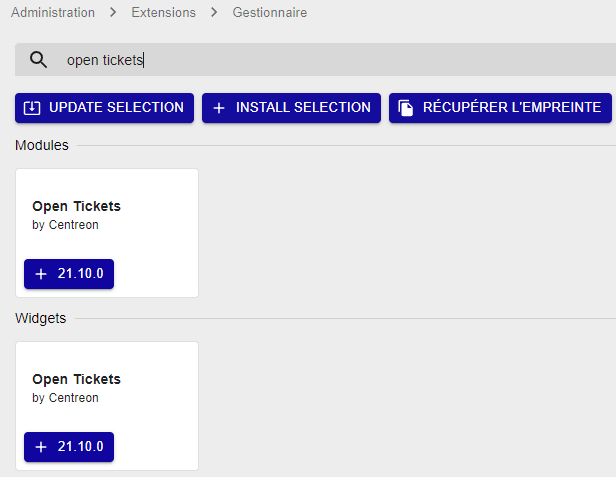
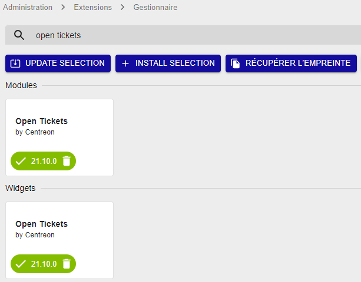

import Tabs from '@theme/Tabs';
import TabItem from '@theme/TabItem';

**Centreon Open Tickets** est un module communautaire développé pour
créer des tickets vers une plateforme ITSM à l'aide des API.

Une fois la configuration du fournisseur de service effectuée, le module
permet à un opérateur de créer des tickets pour les ressources dans un
état non-ok à l'aide d'un widget dédié. En effet, un bouton associé
permet à Centreon de se connecter à l'API et de créer un ticket tout
acquittant les ressources dans Centreon.

Concernant la configuration du widget, il est possible de voir les
tickets créés en présentant l'ID des tickets ainsi que la date de
création de ceux-ci.

## Installation des paquets

Exécutez la commande suivante :

<Tabs groupId="sync">
<TabItem value="Alma / RHEL / Oracle Linux 8" label="Alma / RHEL / Oracle Linux 8">

``` shell
dnf install centreon-open-tickets
```

</TabItem>
<TabItem value="Alma / RHEL / Oracle Linux 9" label="Alma / RHEL / Oracle Linux 9">

``` shell
dnf install centreon-open-tickets
```

</TabItem>
<TabItem value="Debian 11" label="Debian 11">

``` shell
apt install centreon-open-tickets
```

</TabItem>
</Tabs>

## Installation via l'interface

Après avoir installé le rpm, vous devez terminer l'installation du
module via l'interface Web. Rendez-vous dans le menu
`Administration > Extensions > Manager` et recherchez **open tickets**.
Cliquez sur **Install selection**:



Le module est maintenant installé.



## Sauvegarder votre configuration personnalisée de fournisseur OpenTicket

Si vous devez [mettre à jour](../update/update-centreon-platform.md) ou [monter de version](../upgrade/introduction.md) Centreon, sauvegardez d'abord vos configurations personnalisées de fournisseurs Open Ticket afin de ne pas les perdre.

* Faites une sauvegarde des dossiers **/usr/share/centreon/www/modules/centreon-open-tickets** et **/usr/share/centreon/www/widgets/open-tickets**.
* Après avoir fait la mise à jour, copiez-collez le(s) fichier(s) **register.php** dans le répertoire **/usr/share/centreon/www/modules/centreon-open-tickets/providers/**.

