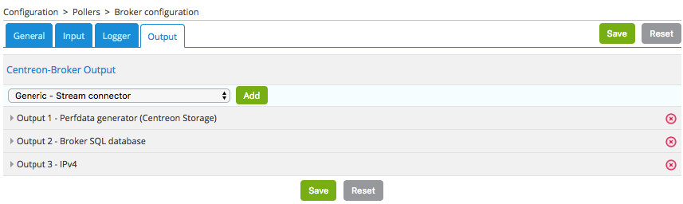
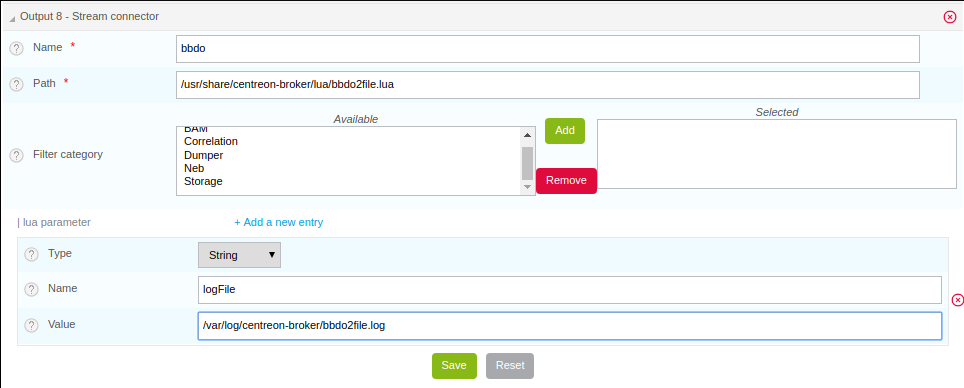
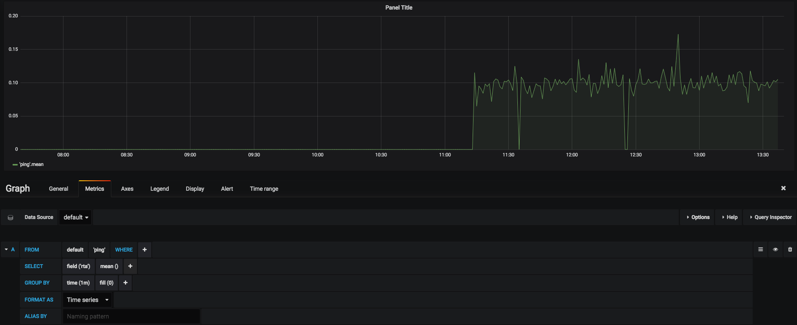

## Vue d'ensemble

Centreon Stream Connector est une fonction introduite dans Centreon 3.4.6. Elle permet d'exporter les données Centreon (événements et métriques) vers un stockage ou une application externe comme ElasticSearch, Splunk, InfluxDB, des fichiers, etc.

Dans une plateforme Centreon, le composant qui transporte les informations entre les collecteurs distants et le serveur central Centreon est appelé Centreon Broker. Ce broker stocke les données reçues dans le stockage local de Centreon : MariaDB et RRDtool.

Le schéma suivant explique le transfert des données collectées et leur insertion dans les stockages :


La fonctionnalité Stream Connector est un nouvel output de Centreon Broker qui récupère les données de Centreon Broker Master (également connu sous le nom de Centreon Broker SQL) pour les agréger et les transmettre à un stockage externe.

Cet output charge un script Lua appelé un Stream Connector, dont la tâche consiste à traiter, agréger et enrichir les données avant de les transmettre au protocole défini :


Comme il s'agit d'un output de Centreon Broker, le principe de la création de fichiers de rétention lors de l'interruption de l'accès au stockage externe est conservé. De la même manière, il est possible de filtrer les entrées sur les catégories de flux à traiter.

## Prérequis

Pour utiliser la fonctionnalité Centreon Stream Connector, vous devez disposer au minimum de la version 3.4.6 de Centreon :

* Centreon Web >= 2.8.18
* Centreon Broker >= 3.0.13
* Lua >= 5.1.x

## Création d'un nouveau script Lua

La documentation technique complète est disponible [ici](developer-broker-stream-connector.md). Dans ce mode d'emploi, nous allons écrire deux scripts :

* Le premier, simple, qui explique les bases des Stream Connectors. Son objectif est d'exporter les données vers un fichier journal.
* Le second est plus exigeant pour le lecteur, il exporte les données de performance vers la TSDB InfluxDB mais est facilement adaptable pour exporter vers une autre TSDB.

## Migration d'un Stream Connector de BBDO 2 vers BBDO 3

La documentation technique de la migration est disponible [ici](developer-broker-stream-connector-migration.md). Ce mode d'emploi donne plusieurs conseils pour réussir la migration et présente un petit exemple.

### Langage de programmation

Centreon a choisi le langage de programmation Lua pour vous permettre de manipuler, d'agréger et de transférer des données. Lua est un langage de programmation facile à utiliser. De plus amples informations sont disponibles avec la [Documentation officielle Lua](https://www.lua.org/docs.html).

### Stockage des scripts Lua

Les scripts Lua de Broker peuvent être stockés dans tout répertoire lisible par l'utilisateur **centreon-broker**.

Nous recommandons de les stocker dans **/usr/share/centreon-broker/lua**.

### Écrire toutes les informations dans un fichier

#### Stocker les données brutes

Commençons par le premier script. Notre objectif est de stocker tous les événements donnés par Broker dans un fichier journal. Nous allons appeler notre Stream Connector **bbdo2file.lua**.

Comme nous l'avons dit précédemment, nous allons stocker ce fichier dans le répertoire **/usr/share/centreon-broker/lua** sur le serveur central Centreon.

Si le répertoire n'existe pas, en tant que root, nous pouvons le créer avec la commande suivante :

```Shell
mkdir -p /usr/share/centreon-broker/lua
```

Centreon Broker propose plusieurs fonctions de journalisation pour écrire les journaux, les avertissements ou les erreurs dans un fichier. Nous utiliserons une de ces fonctions *info()* pour écrire les événements de Broker. [Consultez la documentation technique pour plus d'informations](developer-broker-stream-connector.md#lobjet-broker_log).

La fonction *info()* fait partie de l'objet *broker\_log*. Pour l'appeler, la syntaxe est la suivante :

```LUA
broker_log:info(level, text)
```

* *level* est un nombre entier de 1 (le plus important) à 3 (le moins important).
* *text* est le texte à écrire comme journal.

> Avez-vous remarqué que le séparateur entre **broker\_log** et **info** est un double point ? Les fonctions des objets, aussi appelées *methods* sont appelées comme ceci en Lua.

Commençons notre script. La fonction la plus importante dans un Stream Connector est la fonction **write()**. Chaque fois qu'un événement est reçu d'un collecteur via Broker, cette fonction est appelée avec l'événement comme argument.

> Vous n'aurez jamais à appeler la fonction **write()** par vous-même, c'est toujours à Broker de le faire. Et ce serait une erreur de faire un tel appel. En d'autres termes, il ne doit pas y avoir d'appel à la fonction **write()** dans votre script. [Consultez la documentation technique pour plus d'informations](developer-broker-stream-connector.md#la-fonction-write).

Voici la première version de **bbdo2file.lua** :

```LUA
function init(conf)
  broker_log:set_parameters(3, "/var/log/centreon-broker/bbdo2file.log")
end

function write(d)
  for k,v in pairs(d) do
    broker_log:info(3, k .. " => " .. tostring(v))
  end
  return true
end
```

> Les informations sur l'initialisation de la fonction de journalisation du Broker et ses paramètres sont données ici : [consultez la documentation technique](developer-broker-stream-connector.md#lobjet-broker_log).

Expliquons ce que nous faisons dans ce script.

Nous devons fournir une fonction **init()**, elle est décrite dans la [documentation technique](developer-broker-stream-connector.md#lobjet-broker_log).

Cette fonction est appelée pendant l'initialisation du Stream Connector. Ici, nous l'utilisons pour initialiser l'objet **broker\_log**. Pour cela, nous appelons la méthode **broker\_log::set\_parameters()** qui nécessite deux paramètres :

* Un niveau max (de 1 à 3). Si vous indiquez 2 ici, seuls les journaux des niveaux 1 et 2 seront retournés.
* Un fichier dans lequel écrire les journaux. Ce fichier doit se trouver dans un répertoire accessible en écriture pour l'utilisateur **centreon-broker**.

La deuxième fonction est la fonction **write()**. Nous avons déjà dit que son argument est un événement de Broker. Ce type d'objet est une collection de clés/valeurs. Par exemple :

```JSON
{
    "check_hosts_freshness": false,
    "active_host_checks": true,
    "category": 1,
    "event_handlers": true,
    "instance_id": 1,
    "last_command_check": 1522836592,
    "type": 65552,
    "global_service_event_handler": "",
    "obsess_over_services": false,
    "passive_service_checks": true,
    "last_alive": 1522836593,
    "active_service_checks": true,
    "check_services_freshness": true,
    "flap_detection": false,
    "global_host_event_handler": "",
    "notifications": true,
    "obsess_over_hosts": false,
    "passive_host_checks": true,
    "element": 16
}
```

Tous les événements comprennent les valeurs *category*, *element* et *type*.

* Les informations sur la *catégorie* se trouvent [dans la documentation bbdo](developer-broker-bbdo.md#catégories-dévénements).
* L’*élément* est la *sous-catégorie* (également appelé *type* dans la documentation bbdo).
* Le *type* est un nombre dérivé de la *catégorie* et l’*élément* (concaténation binaire).

Dans cet exemple, la *catégorie* est 1 et l’*élément* est 16. Ainsi, en lisant la documentation, nous pouvons dire que cet événement est un événement NEB avec la sous-catégorie *instance-status*.

Pour terminer avec la fonction **write()**, nous faisons une boucle sur les paramètres de l'événement **d**. Pour chaque étape, *k* est une clé et *v* est la valeur correspondante. Et nous envoyons au fichier journal une chaîne `k .. " => " .. tostring(v)` qui signifie la *concaténation*  de *k*, *\=>* et *v*  convertie en une chaîne de caractères. Voici un exemple du résultat ci-dessous.

Une autre possibilité serait d'utiliser la fonction **broker.json\_encode(d)** qui convertit tout objet Lua en une représentation de chaîne *json* de celui-ci. Ainsi, nous pourrions écrire la fonction comme ceci :

```LUA
function write(d)
  broker_log:info(3, broker.json_encode(d))
  return true
end
```

> On constate que **broker.json\_encode(d)** est composé de **broker** et **json\_encode(d)** séparés par un *point* et non un *double point*. C'est parce que **broker** n'est pas un objet Lua. En fait, vous pouvez le voir comme un ensemble de fonctions fournies par *Centreon Broker*.

Une fois que votre fichier **/usr/share/centreon-broker/lua/bbdo2file.lua** est prêt, vérifiez qu'il est lisible par l'utilisateur **centreon-broker** (ou l'utilisateur **centreon-engine** qui est le propriétaire du groupe **centreon-broker**), si ce n'est pas le cas, en tant que root vous pouvez entrer :

```Shell
chown centreon-engine:centreon-engine /usr/share/centreon-broker/lua/bbdo2file.lua
```

Ensuite, configurez le nouvel output dans l'interface Web Centreon dans **Configuration > Collecteurs > Configuration de Centreon Broker > Central Broker**. Dans l’onglet **Output**, sélectionnez **Generic – Stream connector**, puis cliquez sur **Ajouter** :



Définissez le nom de cet output et le chemin vers le connecteur Lua :


Cliquez ensuite sur **Sauvegarder** et générez la configuration, puis redémarrez **cbd**.

Une fois que le Centreon Broker sera redémarré sur votre serveur central Centreon, les données apparaîtront dans votre fichier journal **/var/log/centreon-broker/bbdo2file.log** :

```Shell
mer. 28 mars 2018 14:27:35 CEST: INFO: flap_detection => true
mer. 28 mars 2018 14:27:35 CEST: INFO: enabled => true
mer. 28 mars 2018 14:27:35 CEST: INFO: host_id => 102
mer. 28 mars 2018 14:27:35 CEST: INFO: last_time_ok => 1522240053
mer. 28 mars 2018 14:27:35 CEST: INFO: state => 0
mer. 28 mars 2018 14:27:35 CEST: INFO: last_update => 1522240054
mer. 28 mars 2018 14:27:35 CEST: INFO: last_check => 1522240053
mer. 28 mars 2018 14:27:35 CEST: INFO: execution_time => 0.005025
mer. 28 mars 2018 14:27:35 CEST: INFO: acknowledged => false
mer. 28 mars 2018 14:27:35 CEST: INFO: service_id => 778
mer. 28 mars 2018 14:27:35 CEST: INFO: active_checks => true
mer. 28 mars 2018 14:27:35 CEST: INFO: notify => false
mer. 28 mars 2018 14:27:35 CEST: INFO: max_check_attempts => 3
mer. 28 mars 2018 14:27:35 CEST: INFO: obsess_over_service => true
mer. 28 mars 2018 14:27:35 CEST: INFO: check_type => 0
mer. 28 mars 2018 14:27:35 CEST: INFO: last_hard_state_change => 1522165654
mer. 28 mars 2018 14:27:35 CEST: INFO: category => 1
mer. 28 mars 2018 14:27:35 CEST: INFO: perfdata => used=41986296644o;48103633715;54116587930;0;60129542144 size=60129542144o
mer. 28 mars 2018 14:27:35 CEST: INFO: check_interval => 5
mer. 28 mars 2018 14:27:35 CEST: INFO: output => Disk /var - used : 39.10 Go - size : 56.00 Go - percent : 69 %
mer. 28 mars 2018 14:27:35 CEST: INFO: check_command => check-bench-disk
mer. 28 mars 2018 14:27:35 CEST: INFO: check_period => 24x7
mer. 28 mars 2018 14:27:35 CEST: INFO: type => 65560
mer. 28 mars 2018 14:27:35 CEST: INFO: last_hard_state => 0
```

> Ce fichier journal va grossir rapidement, n'oubliez pas d'ajouter une rotation du journal.

#### Utiliser les paramètres

Les fonctions de journalisation de Centreon Broker ne doivent être utilisées que pour la journalisation. Pour écrire dans un fichier, nous devons utiliser la fonction dédiée de Lua. En outre, il est possible d'utiliser des paramètres pour définir le nom du fichier journal.

Il est donc temps d'améliorer notre Stream Connector :

```LUA
function init(conf)
  logFile = conf['logFile']
  broker_log:set_parameters(3, "/var/log/centreon-broker/debug.log")
end

function writeIntoFile(output)
  local file,err = io.open(logFile, 'a')
  if file == nil then
    broker_log:info(3, "Couldn't open file: " .. err)
  else
    file:write(output)
    file:close()
  end
end

function write(d)
  for k,v in pairs(d) do
    writeIntoFile(k .. " => " .. tostring(v) .. "\n")
  end
  return true
end
```

Avez-vous remarqué l'expression `local file,err = io.open(logFile, 'a')` ?

Lua est capable de stocker plusieurs variables en même temps. En outre, les fonctions Lua peuvent retourner plusieurs variables.

Par exemple, si vous voulez échanger les variables *a* et *b*, vous pouvez entrer :

```LUA
a, b = b, a
```

Un autre exemple qui illustre plusieurs valeurs retournées :

```LUA
function fib(a, b)
  return b, a + b
end
```

Ainsi, cet appel à **io.open** renvoie deux variables, une première variable **file** qui est un *descripteur de fichier* utilisé pour accéder au fichier et une seconde variable pas toujours définie qui contient l'erreur s'il y en a une ou **nil** (non défini) sinon.

La fonction **init()** permet d'obtenir des paramètres et de les définir à partir de l'interface web Centreon. Consultez la documentation technique pour plus d'informations. Ici, nous ajoutons la possibilité de choisir le nom du fichier de destination. La table **conf** possède une clé *logFile* définie dans l'interface web. La valeur correspondante est le nom du fichier utilisé pour stocker les événements.

Modifiez votre output Broker pour déclarer ce paramètre :



Il est important que le nom du paramètre dans l'interface web corresponde au nom de la clé dans la table **conf**. Il s’agit ici de *logFile*.

Cliquez ensuite sur **Sauvegarder** et générez la configuration, puis redémarrez **cbd**.

Les données sont stockées dans le fichier journal **/var/log/centreon-broker/bbdo2file.log** comme ceci :

```Shell
name => error
category => 3
interval => 300
rrd_len => 3456000
value => 0
value_type => 0
type => 196612
ctime => 1522315660
index_id => 4880
element => 4
state => 0
category => 3
interval => 300
rrd_len => 3456000
is_for_rebuild => false
service_id => 1056
type => 196609
ctime => 1522315660
host_id => 145
element => 1
is_for_rebuild => false
metric_id => 11920
```

#### Manipuler les données

Ici, nous continuons à améliorer notre Stream Connector en choisissant les événements à exporter et aussi en améliorant les outputs.

Nous ne retiendrons que la catégorie NEB et les événements concernant le statut des hôtes et des services.

Nous savons que NEB est la catégorie 1, que le statut du service est la sous-catégorie 24, et que le statut de l'hôte est la sous-catégorie 14.

Donc, seuls les événements répondant aux critères suivants nous intéressent :

* catégorie = 1
* élément = 14 ou élément = 24

De plus, nous préférerions avoir un nom d'hôte au lieu d'un ID d'hôte et une description de service au lieu d'un ID de service.

Enfin, nous aimerions obtenir des informations sur le statut et les outputs.

Les événements NEB avec les éléments 14 et 24 nous donnent presque toutes les informations que nous voulons sauf les noms d'hôtes et les descriptions de services.

Pour obtenir ces deux informations, nous devrons utiliser l'objet **broker\_cache**. Celui-ci est rempli lorsque les collecteurs sont redémarrés ou rechargés. Donc, n'oubliez pas de redémarrer vos collecteurs si vous voulez avoir quelque chose dans votre objet **broker\_cache** !

Si le cache est bien rempli, il est facile d'obtenir un nom d'hôte à partir de l'ID d'hôte :

```LUA
broker_cache:get_hostname(host_id)
```

Il est également facile d'obtenir la description du service à partir de l'ID d'hôte et de l'ID de service :

```LUA
broker_cache:get_service_description(host_id, service_id)
```

Pour installer le filtre sur les événements, il existe une fonction utile appelée **filter()** qui prend en compte deux paramètres : *category*, *element*.

Cette fonction, si elle est définie, est appelée juste avant **write()**. Si elle retourne **true**, la fonction **write()** sera appelée, sinon, l'événement sera rejeté.

Complétons notre script Lua :

```LUA
function init(conf)
  logFile = conf['logFile']
  broker_log:set_parameters(3, "/var/log/centreon-broker/debug.log")
end

local function writeIntoFile(output)
  local file,err = io.open(logFile, 'a')
  if file == nil then
    broker_log:info(3, "Couldn't open file: " .. err)
  else
    file:write(output)
    file:close()
  end
end

function write(d)
  local output = ""

  local host_name = broker_cache:get_hostname(d.host_id)
  if not host_name then
    broker_log:info(3, "Unable to get name of host, please restart centengine")
    host_name = d.host_id
  end

  if d.element == 14 then
    output = "HOST:" .. host_name .. ";" .. d.host_id .. ";" .. d.state .. ";" .. d.output
    writeIntoFile(output)
    broker_log:info(output)
  elseif d.element == 24 then
    local service_description = broker_cache:get_service_description(d.host_id, d.service_id)
    if not service_description then
      broker_log:info(3, "Unable to get description of service, please restart centengine")
      service_description = d.service_id
    end
    output = "SERVICE:" .. host_name .. ";" .. d.host_id .. ";" .. service_description .. ";" .. d.service_id .. ";" .. d.state .. ";" .. d.output
    writeIntoFile(output)
    broker_log:info(output)
  end
  return true
end

function filter(category, element)
  -- Get only host status and services status from NEB category
  if category == 1 and (element == 14 or element == 24) then
    return true
  end
    return false
end
```

Juste quelques remarques sur ce nouveau script avant de montrer ce que nous obtenons.

Dans la fonction **init()**, nous accédons à la clé *logFile* dans la table *conf* en utilisant `conf['logFile']`. Tandis que dans la fonction **write()**, nous accédons à la clé *element* dans la table *d* en utilisant `d.element`.

En fait, les deux syntaxes sont autorisées : `d.element` est la même valeur que `d['element']`.

Autre remarque, dans la fonction **write()**, on peut voir quelque chose comme :

```LUA
if not host_name then
```

Et dans la fonction **writeIntoFile()**, on peut voir que :

```LUA
if file == nil then
```

Les deux syntaxes ont-elles la même signification ? Où est la différence ?

Vous devez savoir qu'en Lua, une variable est considérée comme **true** si elle est définie et non **false** :

Ainsi, le code suivant

```LUA
if foo then
  print("Good")
else
  print("Bad")
end
```

écrira *Good* si *foo* est défini et n'a pas une valeur **false**. Plus précisément, il écrira *Good* dans les cas suivants :

* foo=12
* foo=true
* foo="Une chaîne"
* foo=0 (surprenant !)

Il écrira *Bad* dans les cas suivants :

* foo=nil (par défaut, une variable est nil, ce qui signifie non définie)
* foo=false

Le fichier **/var/log/centreon-broker/bbdo2file.log** contiendra désormais :

```Shell
HOST:srv-DC-djakarta;215;0;OK - srv-DC-djakarta: rta 0.061ms, lost 0%
SERVICE:mail-titan-gateway;92;disk-/usr;623;0;Disk /usr - used : 42.98 Go - size : 142.00 Go - percent : 30 %
SERVICE:mail-sun-master;87;memory-stats;535;0;Memory usage (Total 13.0GB): 0.12GB [buffer:0.00GB] [cache:0.01GB] [pages_tables:0.00GB] [mapped:0.00GB] [active:0.07GB] [inactive:0.00GB] [apps:0.02GB] [unused:12.88GB]
SERVICE:mail-saturn-frontend;86;traffic-eth1;512;0;Traffic In : 4.73 Mb/s (4.73 %), Out : 4.79 Mb/s (4.79 %) - Total RX Bits In : 396.01 Gb, Out : 393.88 Gb
SERVICE:mail-saturn-frontend;86;memory-stats;515;0;Memory usage (Total 16.0GB): 8.89GB [buffer:0.43GB] [cache:0.95GB] [pages_tables:0.27GB] [mapped:0.15GB] [active:3.92GB] [inactive:0.29GB] [apps:2.88GB] [unused:7.11GB]
SERVICE:mail-neptune-frontend;80;traffic-eth1;392;0;Traffic In : 4.82 Mb/s (4.82 %), Out : 6.48 Mb/s (6.48 %) - Total RX Bits In : 398.40 Gb, Out : 396.44 Gb
HOST:srv-DC-casablanca;207;0;OK - srv-DC-casablanca: rta 2.042ms, lost 0%
SERVICE:mail-neptune-frontend;80;memory-stats;395;0;Memory usage (Total 9.0GB): 0.54GB [buffer:0.03GB] [cache:0.00GB] [pages_tables:0.01GB] [mapped:0.00GB] [active:0.48GB] [inactive:0.00GB] [apps:0.01GB] [unused:8.46GB]
SERVICE:mail-mercury-frontend;82;traffic-eth1;432;0;Traffic In : 8.28 Mb/s (8.28 %), Out : 1.23 Mb/s (1.23 %) - Total RX Bits In : 397.71 Gb, Out : 400.34 Gb
SERVICE:mail-mercury-frontend;82;memory-stats;435;0;Memory usage (Total 12.0GB): 1.58GB [buffer:0.00GB] [cache:0.63GB] [pages_tables:0.00GB] [mapped:0.00GB] [active:0.75GB] [inactive:0.00GB] [apps:0.19GB] [unused:10.42GB]
SERVICE:mail-mars-frontend;84;traffic-eth1;472;0;Traffic In : 7.24 Mb/s (7.24 %), Out : 3.36 Mb/s (3.36 %) - Total RX Bits In : 399.93 Gb, Out : 395.67 Gb
SERVICE:mail-mars-frontend;84;memory-stats;475;0;Memory usage (Total 3.0GB): 1.19GB [buffer:0.01GB] [cache:0.59GB] [pages_tables:0.00GB] [mapped:0.00GB] [active:0.15GB] [inactive:0.04GB] [apps:0.39GB] [unused:1.81GB]
SERVICE:mail-jupiter-frontend;85;traffic-eth1;492;0;Traffic In : 1.41 Mb/s (1.41 %), Out : 9.08 Mb/s (9.08 %) - Total RX Bits In : 388.86 Gb, Out : 394.85 Gb
SERVICE:mail-jupiter-frontend;85;memory-stats;495;0;Memory usage (Total 12.0GB): 0.57GB [buffer:0.04GB] [cache:0.23GB] [pages_tables:0.02GB] [mapped:0.02GB] [active:0.07GB] [inactive:0.03GB] [apps:0.16GB] [unused:11.43GB]
SERVICE:mail-io-backend;88;traffic-eth1;547;0;Traffic In : 1.51 Mb/s (1.51 %), Out : 7.12 Mb/s (7.12 %) - Total RX Bits In : 389.61 Gb, Out : 390.54 Gb
SERVICE:mail-io-backend;88;diskio-system;551;0;Device /dev/sda: avg read 4.78 (MB/s) and write 9.08 (MB/s)
```

## Exporter les données de performance vers InfluxDB

Vous avez déjà appris beaucoup de choses sur les Stream Connectors. Il est temps de créer quelque chose de plus utile !

[InfluxDB](https://www.influxdata.com/) est une base de données de séries chronologiques (TSDB) Nous utiliserons ce stockage pour insérer les données de performance collectées par la plateforme Centreon. Pour cet exemple, nous allons utiliser le [InfluxDB Docker](https://hub.docker.com/_/influxdb/) prédéfini.

Pour envoyer des données à InfluxDB, nous avons besoin de paramètres pour accéder au stockage InfluxDB :

* **http\_server\_address** : adresse IP du stockage
* **http\_server\_port**: 8086 par défaut
* **http\_server\_protocol** : HTTP ou HTTPS
* **influx\_database**: nom de la base de données
* **influx\_user** : utilisateur qui accèdera à la base de données si défini
* **influx\_password** : mot de passe de l'utilisateur qui accèdera à la base de données si défini

Afin de ne pas saturer le stockage, nous ajouterons tous les événements dans une file d'attente et une fois que sa taille maximale sera atteinte, nous enverrons les données en vrac.

Nous devons définir la taille de la file d'attente et le délai maximal avant l'envoi des événements :

* max\_buffer\_size
* max\_buffer\_age

Pour créer cette file d'attente, nous introduisons un code un peu plus compliqué. Nous créons un objet **event\_queue**. Il est composé de paramètres tels que *events*, *influx\_database* et des méthodes telles que *new()*, *add()*.

Pour comprendre comment créer un tel objet en Lua, nous recommandons la documentation Lua [pour les classes](https://www.lua.org/pil/16.1.html) et [pour les métatables](https://www.lua.org/pil/13.html).

Pour envoyer des données à un serveur, nous fournissons un objet **broker\_tcp\_socket**.

Son API est très simple. Ce *socket* est un socket TCP, il ne prend pas en charge le chiffrement et il peut être délicat d'envoyer des données en HTTP. Voici un exemple :

```LUA
-- Here, we create our socket
local socket = broker_tcp_socket.new()

-- We establish the connection with the server
socket:connect(address, port)

-- Now, we can send data
socket:write("This is a text to send")

-- If, we want an answer, we also have a function to read
local content = socket:read()

-- When exchanges are finished, we can close the socket
socket:close()
```

Dans notre cas, nous n'utilisons pas **broker\_tcp\_socket** en raison de ses limitations. Nous voulons être en mesure d'envoyer des données à un serveur HTTPS.

Un prérequis est d'installer la [bibliothèque lua-socket](http://w3.impa.br/~diego/software/luasocket/). Cette bibliothèque fournit plusieurs fonctionnalités, nous avons besoin de deux d'entre elles :

* socket http
* ltn12

Pour y accéder, Lua fournit la fonction **require**.

Introduisons le début de notre nouveau Stream Connector.

### Les paramètres de la file d'attente

```LUA
-- We declare the objects to import here
local http = require("socket.http")
local ltn12 = require("ltn12")

-- Here are predefined queue parameters
local event_queue = {
  __internal_ts_last_flush    = nil,
  http_server_address         = "",
  http_server_port            = 8086,
  http_server_protocol        = "http",
  events                      = {},
  influx_database             = "mydb",
  influx_user                 = "",
  influx_password             = "",
  max_buffer_size             = 5000,
  max_buffer_age              = 5
}
```

Dans ce tableau, nous donnons des valeurs par défaut aux paramètres qui peuvent éventuellement être modifiés lors de l'appel **init()**. Cette table sera utilisée pour stocker des données importantes pour le script et est également notre objet de file d'attente.

### Une méthode pour créer la file d'attente

Pour déclarer cette table comme un objet Lua, nous avons besoin d'un constructeur. Le voici :

```LUA
-- Constructor of the event_queue
function event_queue:new(o, conf)
  o = o or {}
  setmetatable(o, self)
  self.__index = self
  for i,v in pairs(conf) do
    if self[i] and i ~= "events" and string.sub(i, 1, 11) ~= "__internal_" then
    broker_log:info(1, "event_queue:new: getting parameter " .. i .. " => " .. v)
    self[i] = v
    else
    broker_log:warning(1, "event_queue:new: ignoring parameter " .. i .. " => " .. v)
    end
  end
  self.__internal_ts_last_flush = os.time()
  broker_log:info(2, "event_queue:new: setting the internal timestamp to " .. self.__internal_ts_last_flush)
  return o
end
```

> Dans cette fonction, nous utilisons une astuce Lua « o = o ou {} » qui signifie que *o* reste le même s'il est **true**, sinon il est affecté d'un tableau vide `{}`.
> 
> Un autre point à noter est l'opérateur **~=** qui signifie **différent de**.
> 
> Et pour finir sur cette fonction, la variable **self** est implicitement définie lorsque nous déclarons la méthode d'un objet. Sa signification est la même que celle de **this** en Java ou en C++. Elle représente l'objet sur lequel nous travaillons.

### Une méthode pour ajouter un événement dans la file d'attente

Nous avons un objet de file d'attente. Ce serait formidable de l'utiliser comme ceci :

```LUA
-- We construct it
local queue = event_queue:new(nil, conf)

-- We add an event to it
queue:add(event)

-- When the queue is full, we would like to do something like this
queue:flush()
```

C'est parti ! Ci-dessous, nous présentons une méthode **add()** qui récupère un nom d'hôte et une description de service dans le cache, crée une chaîne à partir de l'événement et la place sur sa pile.

```LUA
function event_queue:add(e)
  local metric = e.name
  -- time is a reserved word in influxDB so I rename it
  if metric == "time" then
    metric = "_" .. metric
  end

  -- retrieve objects names instead of IDs
  local host_name = broker_cache:get_hostname(e.host_id)
  local service_description = broker_cache:get_service_description(e.host_id, e.service_id)

  -- what if we could not get them from cache
  if not host_name then
    broker_log:warning(1, "event_queue:add: host_name for id " .. e.host_id .. " not found. Restarting centengine should fix this.")
    host_name = e.host_id
  end
  if not service_description then
    broker_log:warning(1, "event_queue:add: service_description for id " .. e.host_id .. "." .. e.service_id .. " not found. Restarting centengine should fix this.")
    service_description = e.service_id
  else
    service_description = service_description:gsub(" ", "_")
  end

  -- we finally append the event to the events table
  metric = metric:gsub(" ", "_")
  broker_log:info(3, 'event_queue:add: adding  ' .. service_description .. ",host=" .. host_name .. " " .. metric .. "=" .. e.value .. " " .. e.ctime .. '000000000" to event list.')
  self.events[#self.events + 1] = service_description .. ",host=" .. host_name .. " " .. metric .. "=" .. e.value .. " " .. e.ctime .. "000000000\n"

  -- then we check whether it is time to send the events to the receiver and flush
  if #self.events >= self.max_buffer_size then
    broker_log:info(2, "event_queue:add: flushing because buffer size reached " .. self.max_buffer_size .. " elements.")
    self:flush()
    return true
  elseif os.time() - self.__internal_ts_last_flush >= self.max_buffer_age then
    broker_log:info(2, "event_queue:add: flushing " .. #self.events .. " elements because buffer age reached " .. (os.time() - self.__internal_ts_last_flush) .. "s and max age is " .. self.max_buffer_age .. "s.")
    self:flush()
    return true
  else
    return false
  end
end
```

### Une méthode pour vider la file d'attente

Une fois les événements ajoutés dans la file d'attente et la taille maximale de la file ou le délai d'attente atteint, les événements seront envoyés au stockage InfluxDB.

Cette fonction crée des données à partir de la file d'attente et les envoie au stockage. Si une erreur se produit, elle introduit une erreur dans le journal.

C'est ici que nous utilisons les objets **http** et **ltn12** chargés au début du script.

```LUA
  function event_queue:flush()
    broker_log:info(2, "event_queue:flush: Concatenating all the events as one string")
    --  we concatenate all the events
    local http_post_data = ""
    local http_result_body = {}
    for i, raw_event in ipairs(self.events) do
      http_post_data = http_post_data .. raw_event
    end
    broker_log:info(2, 'event_queue:flush: HTTP POST request "' .. self.http_server_protocol .. "://" .. self.http_server_address .. ":" .. self.http_server_port .. "/write?db=" .. self.influx_database .. '"')
    broker_log:info(3, "event_queue:flush: HTTP POST data are: '" .. http_post_data .. "'")

    -- build url
    local influxdb_url = self.http_server_protocol .. "://" .. self.http_server_address .. ":" .. self.http_server_port .. "/write?db=" .. self.influx_database
    -- add authentication if needed
    if string.len(self.influx_user) >= 1 and string.len(self.influx_password) >= 1 then
      influxdb_url = influxdb_url .. "&u=" .. self.influx_user .. "&p="..self.influx_password
    end

    local hr_result, hr_code, hr_header, hr_s = http.request{
      url = influxdb_url,
      method = "POST",
      -- sink is where the request result's body will go
      sink = ltn12.sink.table(http_result_body),
      -- request body needs to be formatted as a LTN12 source
      source = ltn12.source.string(http_post_data),
      headers = {
        -- mandatory for POST request with body
        ["content-length"] = string.len(http_post_data)
      }
    }
    -- Handling the return code
    if hr_code == 204 then
      broker_log:info(2, "event_queue:flush: HTTP POST request successful: return code is " .. hr_code)
    else
      broker_log:error(1, "event_queue:flush: HTTP POST request FAILED: return code is " .. hr_code)
      for i, v in ipairs(http_result_body) do
        broker_log:error(1, "event_queue:flush: HTTP POST request FAILED: message line " .. i .. ' is "' .. v .. '"')
      end
    end

    -- now that the data has been sent, we empty the events array
    self.events = {}
    -- and update the timestamp
    self.__internal_ts_last_flush = os.time()
  end
```

### La fonction init() pour obtenir les paramètres et créer la file d'attente

Dans ce cas, la fonction **init()** crée la file d'attente avec les paramètres définis par les utilisateurs dans l'interface web ou utilise les paramètres par défaut déjà définis dans la file d'attente. Cette alternative est gérée par le constructeur de la file d'attente.

```LUA
  function init(conf)
    broker_log:set_parameters(1, "/var/log/centreon-broker/stream-connector-influxdb.log")
    broker_log:info(2, "init: Beginning init() function")
    queue = event_queue:new(nil, conf)
    broker_log:info(2, "init: Ending init() function, Event queue created")
  end
```

> **queue** n'est pas définie comme locale, ceci est important pour qu'elle soit accessible depuis toutes les fonctions.

### La fonction write() pour insérer les événements dans la file d'attente

La fonction **write()** est uniquement utilisée pour insérer des événements filtrés dans la file d'attente :

```LUA
  function write(e)
    broker_log:info(3, "write: Beginning write() function")
    queue:add(e)
    broker_log:info(3, "write: Ending write() function\n")
    return true
  end
```

### La fonction filter() pour sélectionner uniquement les événements de données de performance

Pour sélectionner uniquement les données de performance, nous devons sélectionner la catégorie 3 (« Storage ») et l'*element* 1 pour *metric* :

```LUA
  function filter(category, element)
    if category == 3 and element == 1 then
      return true
    end
    return false
  end
```

### Script complet

Le script complet peut être téléchargé [ici](https://github.com/centreon/centreon-stream-connector-scripts/blob/master/centreon-certified/influxdb/influxdb-metrics-apiv1.lua).

### Configurer Centreon Broker

Configurez le nouvel output dans l'interface Web Centreon dans **Configuration > Collecteurs > Configuration de Centreon Broker > Central Broker**. Dans l’onglet **Output**, sélectionnez **Generic – Stream connector**, puis cliquez sur **Ajouter** :


Définissez le nom de cet output et le chemin vers le connecteur Lua :


Cliquez ensuite sur **Sauvegarder** et générez la configuration, puis redémarrez **cbd**.

> N'oubliez pas de redémarrer également « centengine » pour créer le cache de Centreon Broker.

Si vous installez le tableau de bord [Grafana](https://grafana.com/), vous pouvez visualiser les données stockées :



## Découvrez d'autres Stream Connectors Centreon

Centreon fournit un dépôt Github pour héberger les scripts Lua développés par Centreon et la communauté. Rendez-vous sur le [Github dédié](http://github.com/centreon/centreon-stream-connector-scripts).

Vous avez besoin d'aide pour développer votre Stream Connector ? Vous voulez partager votre expérience avec la communauté ? Rejoignez le [canal Slack de la communauté Centreon](https://centreon.github.io/).