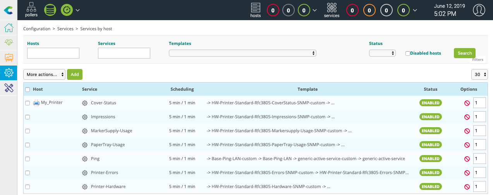
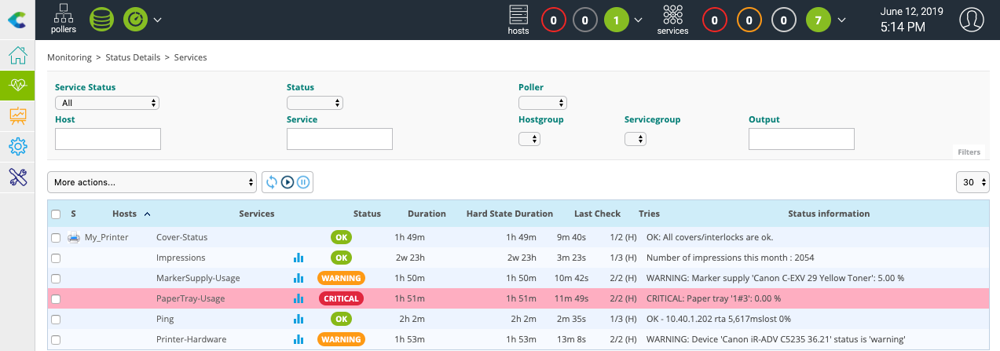

Rendez-vous dans le menu **Configuration > Gestionnaire de connecteurs de supervision** et installez le connecteur de supervision **Printer Standard** :

Rendez-vous maintenant dans le menu **Configuration > Hôtes > Hôtes** et cliquez sur le bouton **Ajouter** :

Renseignez les informations suivantes :

* Le nom de votre serveur
* Une description de votre serveur
* Son adresse IP
* La communauté et la version SNMP

Cliquez sur le bouton **+ Ajouter une nouvelle entrée** pour le champ **Modèles** puis
sélectionnez le modèle **HW-Printer-standard-rfc3805-custom**.

Cliquez sur le bouton **Sauvegarder**.

Votre équipement a été ajouté à la configuration de la supervision :

Rendez-vous dans le menu **Configuration > Services > Services par hôte**. Un ensemble d'indicateurs a été déployé
automatiquement :

Il est maintenant temps de [déployer la supervision](first-supervision.md#déployer-une-configuration).

Rendez-vous ensuite dans le menu **Supervision > Détails des statuts > Regroupement par hôte** et sélectionnez la valeur **Tous** pour le
filtre **Afficher les détails**. Après quelques minutes, les premiers résultats de la supervision apparaissent :

