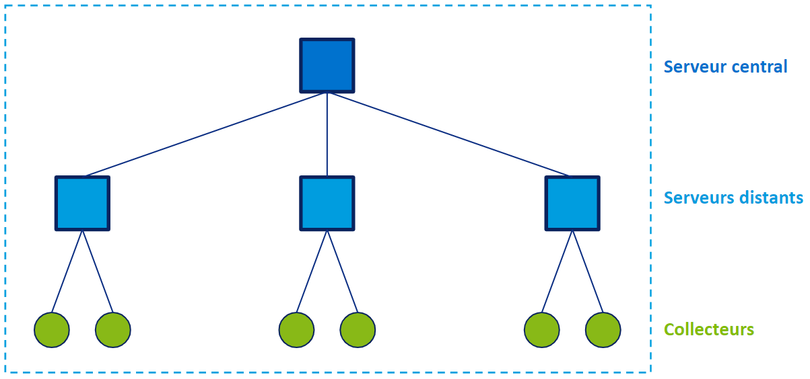

Selon vos besoins, votre plateforme peut être constituée de plusieurs éléments : un [serveur central](#serveur-central), un ou plusieurs [serveurs distants](#serveur-distant), et un ou plusieurs [collecteurs](#collecteur).

- Si vous ne supervisez que quelques ressources, vous n'aurez besoin que d'un serveur central.
- Si vous supervisez un grand nombre de ressources, répartissez la charge sur une [architecture distribuée](#architecture-distribuée).

## Serveur central

Dans Centreon, le serveur central est la console principale de votre supervision. Il permet :

- de configurer toute la supervision de votre infrastructure,
- de superviser des ressources,
- de consulter la supervision de tous les serveurs Centreon (serveur central, [serveurs distants](#serveur-distant) et [collecteurs](#collecteur)) dans son interface web.

## Serveur distant

Un serveur distant est rattaché à un [serveur central](#serveur-central). Des collecteurs peuvent être rattachés à un [serveur distant](#serveur-distant).

- Un serveur distant supervise des ressources. Il possède un moteur de supervision.
- Il a une interface graphique, mais pas de menus de configuration.
- Les ressources qu’il supervise s’affichent dans son interface et dans l’interface du serveur central auquel il est rattaché.

## Collecteur

Un collecteur peut être rattaché à un [serveur distant](#serveur-distant) ou bien directement à un [serveur central](#serveur-central).

- Un collecteur Centreon supervise des [ressources](#ressource). Il possède un [moteur de supervision](#moteur-de-supervision).
- Il n’a pas d’interface graphique : les ressources qu’il supervise s’affichent dans l’interface du serveur central et du serveur distant auxquels il est rattaché.

## Architecture distribuée

Voir aussi [**Architectures**](../installation/architectures.md).
