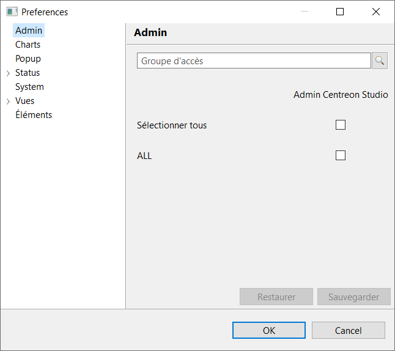
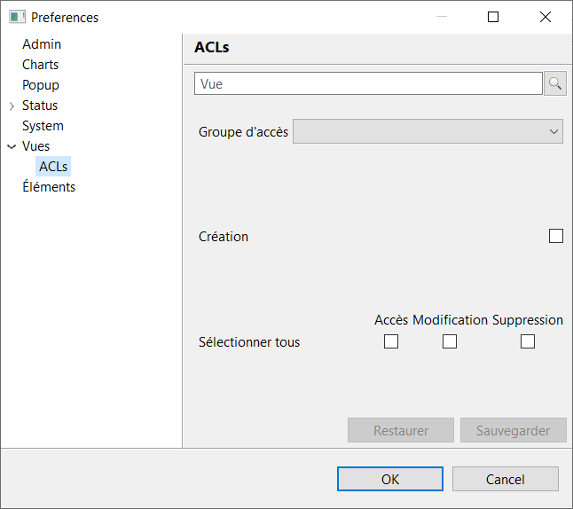
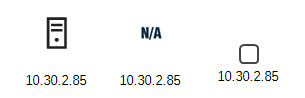
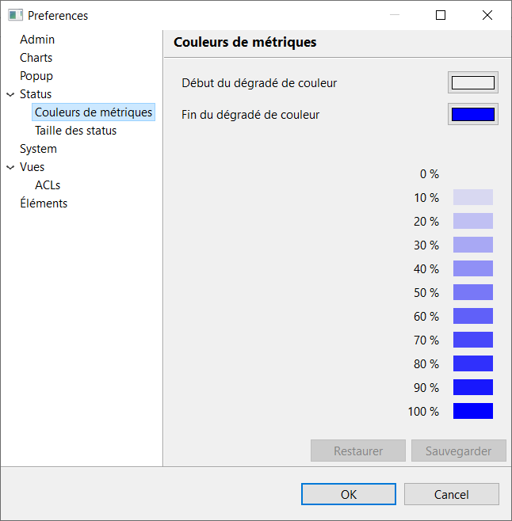
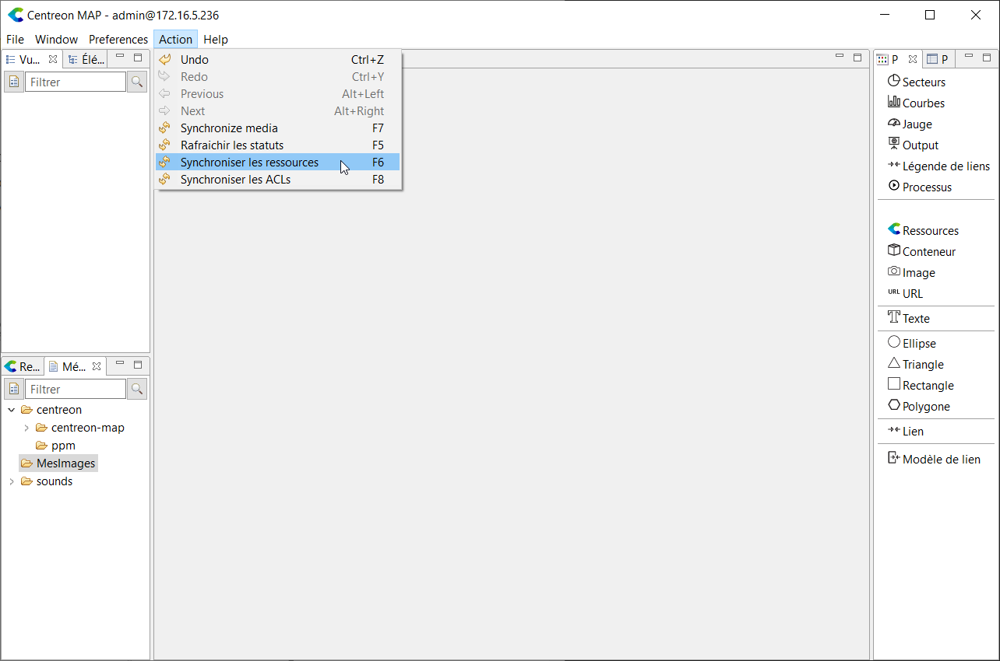
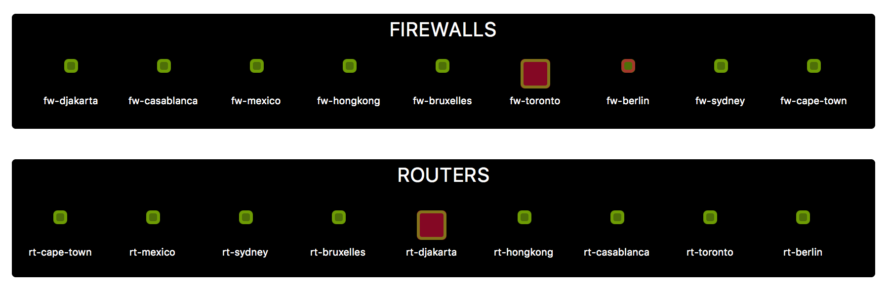
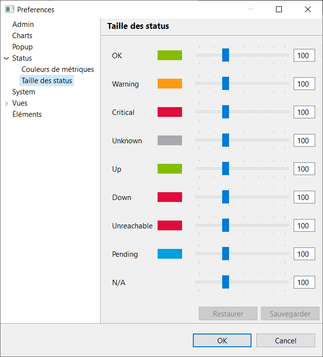
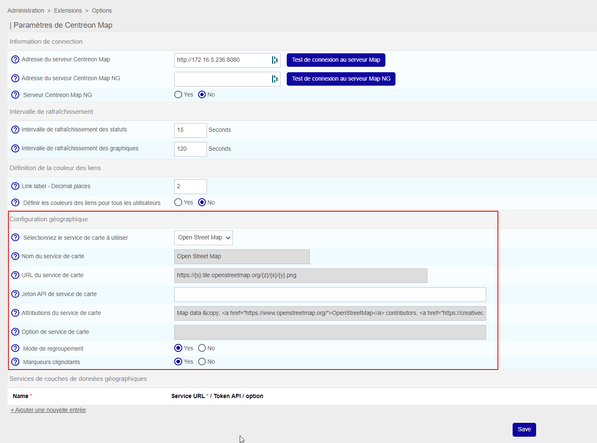
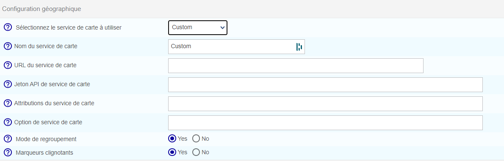
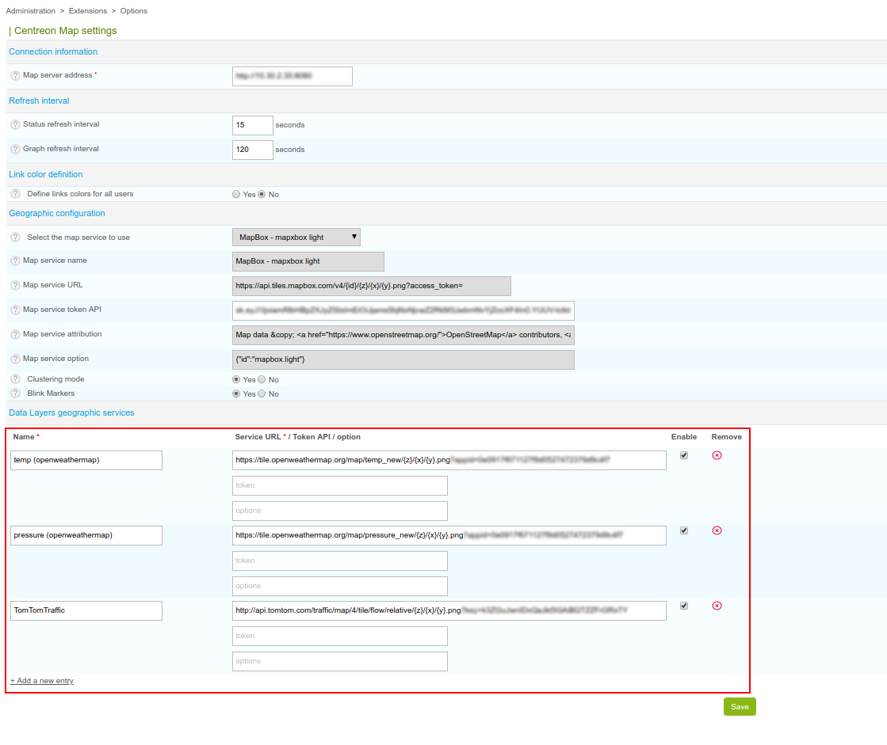

## Administrer les droits des utilisateurs

Il existe deux types d'administrateurs, les administrateurs Centreon et les administrateurs MAP.

Lors d'une nouvelle installation, seuls les administrateurs Centreon existent.

Les administrateurs Centreon peuvent accorder le privilège "administrateur MAP" par le biais de groupes ACL définis dans Centreon.

Tout utilisateur contenu dans ce groupe devient alors un administrateur MAP.

### Gérer les administrateurs MAP

Pour accorder le privilège "administrateur MAP" sur un groupe ACL :

Allez dans **Préférences > Préférences** puis sélectionnez l'onglet **Admin**.



### Donner l'accès aux vues à d'autres utilisateurs et gérer leurs privilèges

Par défaut, les utilisateurs non-administrateurs n'ont pas accès aux vues et n'ont aucun privilège.

Les administrateurs peuvent accorder ces accès et privilèges à un ensemble spécifique d'utilisateurs par le biais de groupes ACL.

Les groupes ACL peuvent être autorisés à visualiser, créer, modifier et supprimer une ou plusieurs vues indépendamment.

Allez dans **Préférences > Préférences** et sélectionnez ensuite l'onglet **Vues > ACLs**.



Sélectionnez, dans la liste, le groupe ACL que vous souhaitez configurer. Ensuite, pour chaque vue, définissez les droits spécifiques à attribuer.

**GeoViews**

Deux règles simples s'appliquent à ce type de vue :

- Tout utilisateur accédant à la page **Supervision > MAP** sera en mesure de voir toutes les GeoViews créées.
- Les utilisateurs qui ont le privilège "Création" (par le biais du groupe ACL sur le client lourd Centreon MAP) ont tous les privilèges sur les GeoViews.

## Charger les ressources désactivées (ou non)

> Des erreurs de modification de fichiers de configuration peuvent entraîner des dysfonctionnements du logiciel. Nous vous recommandons de faire une sauvegarde du fichier avant de le modifier et de ne changer que les paramètres conseillés par Centreon.

Vous pouvez décider de charger ou non les ressources désactivées dans le client lourd Centreon MAP.
Si vous le faites (ce qui est la configuration par défaut), toutes les ressources désactivées apparaîtront dans la liste des ressources.
Vous pourrez également les utiliser dans vos vues.

Elles n'auront pas de statut et apparaîtront comme montré dans la capture d'écran suivante :



Vous pouvez modifier cette configuration en ouvrant le fichier **/etc/centreon-studio/studio-config.properties** et en ajoutant la ligne suivante :

```text
resource.load.enabled.only=true
```

Redémarrez ensuite le serveur Centreon MAP :

```shell
systemctl restart centreon-map
```

## Définir les vues et les paramètres de calcul du statut

Le serveur Centreon MAP vous offre la possibilité de personnaliser la façon dont le statut hérité est calculé et rendu dans les vues.
Vous pouvez utiliser les paramètres suivants pour adapter le comportement du calcul du statut hérité à votre cas d'utilisation.

| Paramètre                           | Valeur possible | Valeur par défaut | Description                                                                                                 |
| ----------------------------------- | --------------- | ----------------- | ----------------------------------------------------------------------------------------------------------- |
| drilldown.useHardState              | true or false   | false             | Utiliser uniquement la valeur de l'état HARD pour la propagation de l'état hérité.                           |
| drilldown.ignoreElementInDowntime   | true or false   | false             | Ne pas propager l'état des ressources en temps d'arrêt                                                      |
| drilldown.ignoreElementAcknowledged | true or false   | false             | Ne pas propager le statut des ressources acquittées                                                          |
| drilldown.ignoreSeveritySuperior    | integer         | 0                 | Ne pas propager le statut des ressources dont la sévérité est supérieure à cette valeur.                     |
| gate.useResourcesAccess             | true or false   | true              | Centreon MAP doit-il tenir compte des ressources ACL lors du calcul du statut hérité du contenu de la vue ? |

Les paramètres suivants peuvent être configurés dans **/etc/centreon-studio/studio-config.properties**.

Si vous ajoutez, supprimez ou mettez à jour un paramètre, veillez à redémarrer **centreon-map**.

**Qu'est-ce qu'un statut hérité ?**

Un statut hérité est un statut personnalisé de Centreon MAP associé à certains objets, et qui est basé sur le pire statut de ses enfants. Voici les règles :

- Un hôte a deux statuts : son propre statut (up/down/pending) et un statut hérité qui est basé sur le pire état de ses services.
- Un groupe d'hôtes n'a qu'un statut hérité correspondant au pire état de ses enfants (hôtes, services).
- Un groupe de services n'a qu'un état hérité : le pire état de ses enfants (services).
- Un conteneur n'a qu'un statut hérité : le pire statut de ses enfants (hôtes, services, méta-services, host groups, service groups, BA, widgets).

**Personnalisation du statut hérité**

Le serveur Centreon MAP vous donne la possibilité de personnaliser la façon dont ce statut hérité est calculé et rendu dans les vues.
Vous pouvez utiliser les paramètres suivants pour adapter le comportement du calcul du statut hérité à votre cas d'utilisation :

Spécificité de **gate.useResourcesAccess** : Régler ce paramètre sur **False** peut améliorer considérablement les performances de Centreon MAP, voici pourquoi :

- gate.useResourcesAccess = false : tous les utilisateurs voient le même statut et les mêmes ressources dans les vues, peu importe les ressources ACL dont ils disposent, elles sont ignorées.
  Dans ce cas, faites attention à qui vous donnez l'accès aux vues.
- gate.useResourcesAccess = true : les utilisateurs voient des états et des vues différents en fonction des ressources ACL (entraîne une baisse des performances car vous devez avoir une instance de chaque vue pour chaque utilisateur).

Pour configurer ces paramètres, vous devez modifier le fichier de configuration du serveur Centreon MAP suivant (modifier ou ajouter les paramètres manquants), puis redémarrer Centreon-Map :

```shell
vi /etc/centreon-studio/studio-config.properties
systemctl restart centreon-map
```

## Changer les couleurs du lien

> Cette propriété ne sera appliquée qu'à l'utilisateur qui la modifie sur le client lourd.

Vous pouvez modifier la couleur de début et de fin d'un lien en fonction d'une métrique.
Ces couleurs représentent une échelle de 0% à 100% pour la ou les métriques associées au lien.



## Comprendre le fonctionnement de la synchronisation des ressources

Chaque fois que vous apportez des modifications à la configuration de Centreon et que vous poussez la configuration vers un poller, la configuration est analysée et mise à jour sur Centreon MAP.

Toutefois, si vous apportez des modifications (ajout/suppression/mise à jour) aux ressources de Centreon et que vous souhaitez que ces modifications soient immédiatement synchronisées sur votre Centreon MAP sans pousser la configuration, vous pouvez forcer une synchronisation des ressources à partir du client lourd Centreon MAP via le menu suivant : **Action > Synchroniser les ressources**.

Cette opération peut prendre quelques secondes. Une fenêtre pop-up vous indiquera quand la synchronisation sera terminée.



### Problèmes de mise en évidence

> Cette propriété ne sera appliquée qu'à l'utilisateur qui la modifie sur le client lourd.

Vous pouvez modifier la taille des éléments en fonction de leur statut afin de mettre en évidence un problème. Cela ne fonctionne que lorsque les éléments sont exprimés dans le style géométrique.



Pour utiliser cette fonctionnalité, modifiez la propriété **Taille des statuts** dans le menu **Préférences**.
Allez dans **Statut > Taille des statuts** pour le configurer globalement.



## Configuration des GeoViews

### Configuration du fournisseur de tuiles

Vous pouvez choisir le fournisseur de services de tuiles ou même ajouter votre propre fournisseur dans **Administration > Extension > Map | Options**.
Par défaut, les GeoViews de Centreon MAP proviennent de Open Street Map & Mapbox.

Veuillez consulter [ce lien](https://operations.osmfoundation.org/policies/tiles/) pour comprendre la politique d'utilisation des tuiles Open Street Map.

Pour modifier le fournisseur de tuiles, sélectionnez-en un dans la liste et cliquez sur **Enregistrer**.



Si vous souhaitez utiliser votre propre fournisseur de services de tuile, si par exemple vous disposez d'un serveur interne Open Street Map, allez dans le menu **Administration > Extension > Map | Options** et choisissez le style "Personnalisé".

Définissez les paramètres nécessaires, puis enregistrez.



### Configurer les couches de données

Vous pouvez ajouter toute couche de données externe à Centreon GeoView en allant dans **Administration > Extension > Carte**.
Le mécanisme de couches est le même que celui du fournisseur de tuiles : MAP est compatible avec les cartes de tuiles (TMS).

La plupart du temps, configurer la couche de données consistera à :

- Définir l'URL,
- Définir votre jeton,
- Ajouter tout paramètre supplémentaire au format JSON.



## Créer et lier un compte Mapbox

> Des erreurs de modification de fichiers de configuration peuvent entraîner des dysfonctionnements du logiciel. Nous vous recommandons de faire une sauvegarde du fichier avant de le modifier et de ne changer que les paramètres conseillés par Centreon.

Si vous voulez avoir un arrière-plan géographique sur les vues standard et/ou l'utiliser comme fournisseur de services de tuiles dans GeoView, vous devez avoir un compte Mapbox et le lier à votre Centreon MAP.

**Créer un compte**

Mapbox est un service qui génère des cartes attrayantes et personnalisables. Vous pouvez utiliser Mapbox avec Centreon MAP gratuitement :

1. Créez un compte [sur Mapbox](https://www.mapbox.com/).
2. [Récupérez un jeton privé](https://docs.mapbox.com/help/how-mapbox-works/access-tokens/#creating-and-managing-access-tokens) à partir de votre compte Mapbox et ajoutez-le à la configuration du serveur MAP Centreon (ou pendant l'installation).

Lors de la création du jeton, il vous est demandé de sélectionner des propriétés, sélectionnez :

- Public scopes : **styles:read** et **styles:tiles**.
- Scopes secrets : **styles:list**.

Votre compte permet une utilisation gratuite et limitée du service jusqu'à 50k tuiles/mois.

Une tuile est une image utilisée pour composer la vue géographique.

Si vous avez besoin de plus de tuiles, vous pouvez mettre à niveau votre compte (voir [pricing](https://www.mapbox.com/pricing/)).

**Configuration sur le serveur Centreon MAP**.

Insérez le jeton dans le fichier **/etc/centreon-studio/studio-config.properties** :

```text
##### GEO
mapbox.token=sk.xxxxxxxx
```

Puis redémarrez **centreon-map** :

```shell
systemctl restart centreon-map
```
