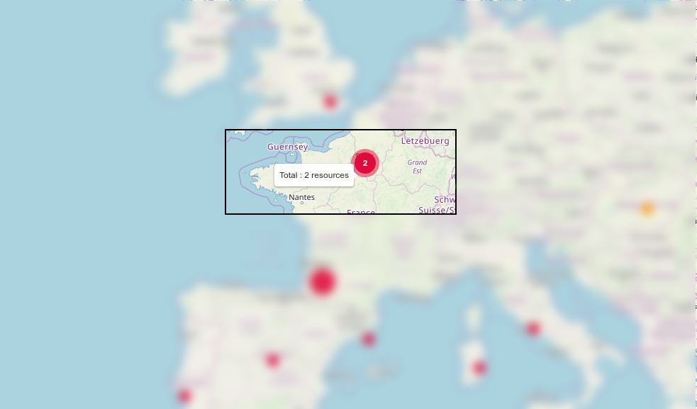

## Créer une vue géographique

Certains utilisateurs peuvent créer des vues géographiques (GeoViews) en utilisant l'interface web (administrateurs Centreon, administrateur Centreon MAP, utilisateur ayant le droit de créer une vue) :

1. Allez à la page **Supervision > Map** et cliquez sur le "+" de la section **Geographique**.
2. Donnez un nom à la vue puis définissez les ressources à afficher sur la vue.
3. Après avoir configuré ces paramètres, les ressources apparaîtront sur cette vue géographique.

Les ressources suivantes peuvent être affichées sur une GeoView :

- Hôtes appartenant à un ou des groupes d'hôtes
- Activités Métier appartenant à une ou plusieurs Business Views
- Un ou plusieurs groupes d'hôtes

Prérequis : Définir les coordonnées (latitude et longitude) dans le formulaire de configuration des ressources pour l'hôte, les groupes d'hôtes ou l'activité métier.

Exemple avec un hôte :

## Comment les limitations de contrôle d'accès (ACL) sont gérées

Dès que vous donnez accès à **Supervision > Map** ou à une vue personnalisée contenant un widget MAP, les GeoViews sont accessibles à tout utilisateur de Centreon.
Un utilisateur ne verra que les ressources qu'il est autorisé à voir, en fonction de son profil ACL.

## Comment les ressources sont affichées

Lorsqu'une ressource (hôte, groupe d'hôtes ou activité métier) est positionnée sur une vue géographique, elle est affichée sous la forme d'un cercle dont la couleur est définie par les règles suivantes :

- Hôte : état le plus défavorable entre l'hôte et ses services.
- Groupes d'hôtes : état le plus défavorable des hôtes appartenant aux groupes d'hôtes.
- Activité métier : état actuel

*Ordre des pires états : Critique (rouge) \> Indisponible (rouge) \> Alerte (orange) \>
Inconnu (gris) \> Injoignable (gris) \> OK (vert) \> Disponible (vert) \> En attente (bleu)*

### Regroupement

Lorsque plusieurs ressources sont géographiquement proches et que vous êtes à un "certain" niveau de zoom, elles sont regroupées en un seul cercle affichant deux choses :

- L'état de l'objet le plus mauvais (affiché via une couleur, soit le vert, l'orange, le rouge ou le gris).
- Le nombre de ressources dans cet état.

*Ce comportement peut être désactivé dans les paramètres globaux de Centreon MAP*.

### Ressources clignotantes

Si une ressource est dans un état "non-ok", elle clignote.

*Ce comportement peut être désactivé dans les paramètres globaux de Centreon MAP*.

## Couches de données dans les Geoviews

Centreon MAP vous donne la possibilité d'afficher des "couches de données" supplémentaires sur les cartes afin d'ajouter un contexte à l'état de votre infrastructure informatique en temps réel.

Vous devez d'abord ajouter des couches de données dans les options de Centreon MAP, puis, si la couche de données est activée, vous pouvez la rendre visible ou non en la cochant à l'aide de l'icône en haut à gauche.

**Exemples**

