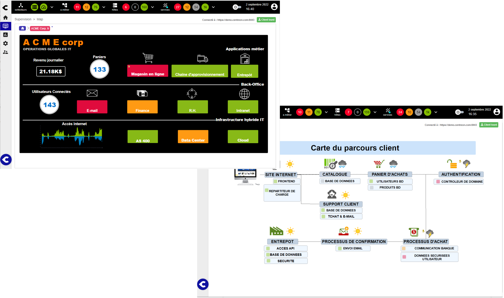
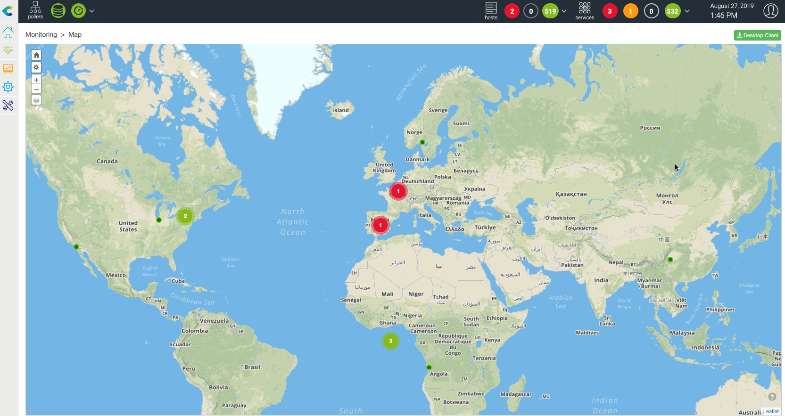

> **À partir de Centreon 24.10, MAP Legacy ne sera plus disponible.** Si vous utilisez encore MAP Legacy, consultez la page [Fin de vie de MAP Legacy](https://docs.centreon.com/fr/docs/graph-views/map-legacy-eol/).

Centreon MAP est un outil de visualisation et de cartographie de données conçu pour les administrateurs et les développeurs de la gestion des opérations informatiques (ITOM).
Il est capable d'afficher des aperçus graphiques efficaces et de cartographier des données corrélées dans des vues personnalisées pertinentes pour l'utilisateur.

> Centreon MAP est une **extension** Centreon qui nécessite une [licence](../administration/licenses.md) valide.
> Pour en acquérir une et récupérer les dépôts nécessaires, contactez [Centreon](mailto:sales@centreon.com).

## Aperçu de l'interface

Voici un aperçu de MAP (Legacy). Vous devez d'abord créer des vues logiques à l'aide du client lourd :

Vous pouvez ensuite les visualiser directement dans votre navigateur :

Vous pouvez également utiliser la vue géographique pour afficher les ressources de la manière dont votre informatique est répartie dans une ville, un pays ou le monde.

Les deux types de vues peuvent être affichés dans la même interface utilisateur web Centreon :

- Soit à partir de l'interface utilisateur dédiée Centreon MAP, qui comprend également une fonction de recherche.
- Soit dans une vue personnalisée, à l'aide du widget Centreon MAP dédié.

## Procédures

Les procédures suivantes permettent d'utiliser et de gérer Centreon MAP (Legacy).

### Gérer MAP (Legacy)
  - [Installer Centreon MAP (Legacy)](install.md) décrit les prérequis et les procédures d'installation de MAP (Legacy), également appelé client lourd Map4.
  - [Mettre à jour l'extension](update.md) décrit le processus de mise à jour de MAP (Legacy).
  - [Monter de version l'extension](upgrade.md) décrit le processus de montée de version de MAP (Legacy).
  - [Migrer l'extension](migrate.md) décrit comment migrer le serveur MAP (Legacy) vers un autre serveur.
  - [Configurer les droits](configuration.md) explique comment gérer les droits des utilisateurs et décrit les paramètres de personnalisation.
  - [Installer MAP (Legacy) sur un serveur distant](remote-server.md) explique comment installer MAP (Legacy) sur un serveur distant.
  - [Configuration avancée](advanced-configuration.md) décrit les procédures avancées pour configurer MAP (Legacy).
  - [Problèmes connus sur MAP (Legacy)](known-issues.md) est une liste d'incidents que vous pouvez rencontrer en utilisant MAP (Legacy).
  - [Dépannage de MAP (Legacy)](troubleshooter.md) vous aide à résoudre certains problèmes survenant dans MAP (Legacy).

### Utiliser MAP (Legacy)
  - [Créer une vue standard](create-standard-view.md) en utilisant MAP (Legacy). Cette page décrit également les bonnes pratiques et limitations.
  - [Créer une vue géographique](create-geo-views.md) en utilisant l'interface web. Cette procédure explique comment afficher vos ressources dans une zone géographique définie.
  - [Afficher les vues](display-view.md) depuis l'interface Web. Cette page décrit également les fonctions dédiées.
  - [Partager une vue](share-view.md) vous permet de partager des vues avec un groupe limité de personnes.
