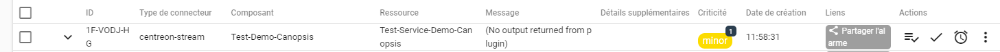

import Tabs from '@theme/Tabs';
import TabItem from '@theme/TabItem';

Le stream connector Canopsis Events vous permet d'envoyer des données d'évènements 
depuis Centreon vers Canopsis via un protocole HTTP REST API.

## Avant de commencer

- Dans la plupart des cas, vous enverrez les données depuis le serveur central. 
Il est également possible de les envoyer depuis un serveur distant ou un collecteur 
(par exemple si vous voulez éviter que le serveur central ne représente un point de 
défaillance unique, ou bien si vous êtes un MSP et vous installez le stream connector 
sur un collecteur ou un serveur distant dans l'infratructure de votre client).
- Par défaut, le stream connector Canopsis Events envoie des évènements Broker 
**[host_status](https://docs.centreon.com/fr/docs/developer/developer-broker-mapping/#host-status)**,
**[service_status](https://docs.centreon.com/fr/docs/developer/developer-broker-mapping/#service-status)**
et **[acknowledgement](https://docs.centreon.com/fr/docs/developer/developer-broker-mapping/#acknowledgement)**.
Ces formats d'événement sont décrits **[ici](#event-format)**.
- Ces évènements sont envoyés à chaque contrôle sur l'hôte ou le service. Des paramètres 
dédiés vous permettent de [ne pas envoyer certains évènements](#filtering-or-adapting-the-data-you-want-to-send-to-canopsis).

## Compatibilité

Ce stream connector est conçu pour être compatible avec l'API v.4 de Canopsis, et plus précisément les versions suivantes de Canopsis : 22.10, 
23.04, 23.10 et 24.04.

## Installation

Faites l'installation sur le serveur qui enverra les données à Canopsis (serveur central, 
serveur distant, collecteur).

1. Connectez vous en tant que `root` sur le serveur Centreon central en utilisant votre 
client SSH préféré. 
2. Exécuter la commande adaptée à votre système :

<Tabs groupId="sync">
<TabItem value="Alma / RHEL / Oracle Linux 8" label="Alma / RHEL / Oracle Linux 8">

```shell
dnf install centreon-stream-connector-canopsis
```

</TabItem>

<TabItem value="Alma / RHEL / Oracle Linux 9" label="Alma / RHEL / Oracle Linux 9">

```shell
dnf install centreon-stream-connector-canopsis
```

</TabItem>

<TabItem value="Debian 11" label="Debian_11">

```shell
apt install centreon-stream-connector-canopsis
```

</TabItem>
</Tabs>

## Configuration de Canopsis 

Vous devrez paramétrer votre équipement Canopsis pour qu'il puisse recevoir des données 
de la part de Centreon. Reportez-vous au [guide d'utilisation Canopsis](https://doc.canopsis.net/guide-utilisation/)
, notamment vérifiez que les droits de création, lecture et suppression sont activés (voir la documentation d'
[administration des droits](https://doc.canopsis.net/guide-utilisation/menu-administration/droits/) et celle d'
[administration de la planification](https://doc.canopsis.net/guide-utilisation/menu-administration/planification/) 
dans le cas des downtimes). 
Pour l'utilisateur associé à la "authKey" il faut modifier la matrice de droits "Mandatory" :

> Pour les trois sections :
> 
> droits API > PBehavior > PBehaviors
> 
> droits API > PBehavior > PBehaviors Reason
> 
> droits API > PBehavior > PBehaviors Types
>
> “create”, “read”, “delete” doivent être cochés
>

Assurez-vous que Canopsis puisse recevoir les données envoyées par Centreon : les flux 
ne doivent pas être bloqués par la configuration de Canopsis ou par un équipement de sécurité.

## Configurer le stream connector dans Centreon

1. Sur votre serveur central, allez à la page **Configuration > Collecteurs > Configuration de 
Centreon Broker**. 
2. Cliquez sur **central-broker-master** (ou sur la configuration du Broker correspondant si les 
évènements seront envoyés par un serveur distant ou un collecteur). 
3. Dans l'onglet **Output**, sélectionnez **Generic - Stream connector** dans la liste, puis cliquez 
sur **Add**. Un nouvel output apparaît dans la liste. 
4. Remplissez les champs de la manière suivante :

| Champ           | Valeur                                                     |
|-----------------|------------------------------------------------------------|
| Name            | Canopsis events                                            |
| Path            | /usr/share/centreon-broker/lua/canopsis2x-events-apiv2.lua |
| Filter category | Neb                                                        |

5. Pour permettre à Centreon de se connecter à votre équipement Canopsis, remplissez les 
paramètres obligatoires suivants. La première entrée existe déjà. Cliquez sur le lien **+Add 
a new entry** en-dessous du tableau **Filter category** pour en ajouter un autre.

| Type   | Nom              | Explication de "Value"                      | Exemple de valeur |
| ------ |------------------|---------------------------------------------|-------------------|
| string | canopsis_authkey | Clé d'authentification à l'API Canopsis | `an_authkey`      |
| string | canopsis_host    | Adresse de l'hôte Canopsis                | `a host`          |

6. Renseignez les paramètres optionnels désirés (en utilisant le lien **+Add a new entry**) :

| Type   | Nom       | Explication de "Value"                                  | Valeur par défaut                                  |
| ------ |-----------|---------------------------------------------------------|----------------------------------------------------|
| string | logfile   | Fichier dans lequel les logs sont écrits                | /var/log/centreon-broker/canopsis-events-apiv2.log |
| number | log_level | Niveau de verbosité des logs : de 1 (erreurs) à 3 (debug) | 1                                                  |

7. Utilisez les paramètres optionnels du stream connector pour [filtrer ou adapter les 
données que vous voulez que Centreon envoie à Canopsis](#filtering-or-adapting-the-data-you-want-to-send-to-canopsis).
8. [Déployez la configuration](https://docs.centreon.com/fr/docs/monitoring/monitoring-servers/deploying-a-configuration/). 
9. Redémarrez **centengine** sur tous les collecteurs :

   ```shell
   systemctl restart centengine
   ```

   Canopsis reçoit maintenant les données de Centreon.

<div id='filtering-or-adapting-the-data-you-want-to-send-to-canopsis'/>

### Filtrer ou adapter les données que vous voulez envoyer à Canopsis

Tous les stream connectors ont un jeu de [paramètres optionnels](https://github.com/centreon/centreon-stream-connector-scripts/blob/master/modules/docs/sc_param.md#default-parameters) 
qui vous permettent de filtrer les données que vous enverrez à Canopsis, de reformater 
les données, de définir un proxy...

Chaque paramètre optionnel a une valeur par défaut, qui est indiquée dans la documentation 
correspondante.

* Pour remplacer la valeur par défaut d'un paramètre, cliquez sur le lien **+Add a new entry** 
en-dessous du tableau **Filter category**, afin d'ajouter un paramètre personnalisé. 
Par exemple, si vous ne voulez envoyer à Canopsis que les évènements liés à un hostgroup
nommé "Europe", entrez :

   ```text
   type = string
   name = accepted_hostgroup
   value = Europe
   ```

* Pour le stream connector Canopsis Events, les données suivantes remplacent toujours les 
valeurs par défaut. Il n'est donc pas nécessaire de les redéfinir 
dans l'interface sauf si vous voulez en changer les valeurs (par exemple ajouter les 
plages de maintenance à la variable accepted_elements).


| Type   | Nom                              | Valeur par défaut pour le stream connector Canopsis |
|--------|----------------------------------|-----------------------------------------------------|
| string | accepted_categories              | neb                                                 |
| string | accepted_elements                | host_status,service_status,acknowledgement          |
| string | canopsis_downtime_comment_route  | /api/v4/pbehavior-comments                          |
| string | canopsis_downtime_reason_name    | Centreon_downtime                                   |
| string | canopsis_downtime_reason_route   | /api/v4/pbehavior-reasons                           |
| string | canopsis_downtime_route          | /api/v4/pbehaviors                                  |
| number | canopsis_downtime_send_pbh       | 1                                                   |
| string | canopsis_downtime_type_name      | Default maintenance                                 |
| string | canopsis_downtime_type_route     | /api/v4/pbehavior-types                             |
| string | canopsis_event_route             | /api/v4/event                                       |
| string | canopsis_port                    | 443                                                 |
| number | canopsis_sort_list_hostgroups    | 0                                                   |
| string | canopsis_sort_list_servicegroups | 0                                                   |
| string | connector                        | centreon-stream                                     |
| string | connector_name                   | centreon-stream-central                             |
| string | connector_name_type              | poller                                              |
| string | sending_method                   | api                                                 |
| string | sending_protocol                 | https                                               |
| string | use_severity_as_state            | 0                                                   |

## Event bulking

Ce stream connector est compatible avec l'event bulking. Cela signifie qu'il est capable 
d'envoyer plus d'un évènement lors de chaque appel à l'API REST Canopsis.

Pour utiliser cette fonctionnalité, vous devez ajouter le paramètre suivant à la configuration 
de votre stream connector.

| Type   | Nom             | Exemple de valeur |
| ------ |-----------------|-------------------|
| number | max_buffer_size | `3`               |

Dans cet exemple de valeur, le stream connector Canopsis conservera 3 événements et ne 
déclenchera l'envoie qu'au 4ème. 

<div id='event-format'/>

## Format des évènements

Ce stream connector envoie des évènements au format suivant :

### Exemple de sortie pour un événement service_status

```json
[
   {
      "notes_url":"",
      "host_id":"15",
      "event_type":"check",
      "service_id":"47",
      "timestamp":1708693347,
      "hostgroups":[
         "Group 1",
         "Group 2"
      ],
      "servicegroups":[
         
      ],
      "state":1,
      "connector":"centreon-stream",
      "action_url":"",
      "long_output":"Plugin's long output",
      "resource":"Service-name",
      "output":"Plugin's output",
      "source_type":"resource",
      "component":"Host-name",
      "connector_name":"Central"
   }
]
```

### Exemple de sortie pour un événement host_status

```json
[
   {
      "event_type":"check",
      "state":0,
      "component":"Host-1",
      "timestamp":1708953238,
      "host_id":"15",
      "connector":"centreon-stream",
      "source_type":"component",
      "hostgroups":[
         "Group 1",
         "Group 2"
      ],
      "action_url":"",
      "notes_url":"",
      "long_output":"OK: Host is OK",
      "connector_name":"Central",
      "output":"OK: Host is OK"
   }
]
```

### Exemple de sortie pour un événement acquittement

```json
[
   {
      "event_type":"ack",
      "component":"Host-1",
      "connector":"centreon-stream",
      "author":"admin",
      "state":1,
      "output":"Acknowledged by admin",
      "source_type":"resource",
      "long_output":"Acknowledged by admin",
      "connector_name":"Central",
      "timestamp":1709052753,
      "resource":"passif"
   }
]
```

### Format d'évènement personnalisé

Ce stream connector vous permet de changer le format des événements pour correspondre 
à vos besoins. Cela vous permet de gérer des types d'événements qui ne le sont pas 
par défaut, comme les évènements **ba_status**.

Pour utiliser cette fonctionnalité vous devez configurer un fichier json de formatage 
et ajouter un nouveau paramètre à la configuration du stream connector.

| Type   | Nom         | Valeur                                           |
| ------ |-------------|--------------------------------------------------|
| string | format_file | /etc/centreon-broker/canopsis-events-format.json |

> Le fichier de configuration de format des évènements doit être lisible par l'utilisateur **centreon-broker**.

Pour en savoir plus sur les fichiers modèle et comment formatter les évènements vous pouvez 
consulter la **[documentation dédiée](https://github.com/centreon/centreon-stream-connector-scripts/blob/master/modules/docs/templating.md#templating-documentation)**.

## Commandes Curl : tester le stream connector

Voici la liste des commandes curl qui sont utilisées par le stream connector Canopsis :

### Configuration du stream connector

Si vous voulez tester que les commandes de configuration sont envoyées correctement à Canopsis :

#### Requête de la route pbehavior-reasons

1. Connectez-vous au serveur que vous avez configuré pour envoyer les évènements à 
Canopsis (le serveur central, un serveur distant ou un collecteur)
2. Exécutez la commande suivante :

```shell
curl -X GET -H 'accept: application/json' -H 'x-canopsis-authkey: <canopsis-auth-token>' '<https_canopsis_host_url>:<canopsis_port><canopsis_pbehavior-reasons>'
```

> Remplacez tous les *`<xxxx>`* dans la commande ci-dessus par les valeurs correctes d'authentification à l'hôte Canopsis.
> Certaines valeurs sont définies par défaut dans le stream connector : canopsis_port:443 et canopsis_pbehavior-reasons:/api/v4/pbehavior-reasons.

3. Vérifiez que la commande renvoie bien une structure de données de la forme suivante :

```json
   "data":[
      {
         "_id":"XXXX",
         "name":"NAME",
         "description":"DESCRIPTION"
      }
   ]
```

#### Requête de la route pbehavior-types

1. Connectez-vous au serveur que vous avez configuré pour envoyer les évènements à 
Canopsis (le serveur central, un serveur distant ou un collecteur)
2. Exécutez la commande suivante :

```shell
curl -X GET -H 'accept: application/json' -H 'x-canopsis-authkey: <canopsis-auth-token>' '<https_canopsis_host_url>:<canopsis_port><canopsis_pbehavior-types>'
```

> Remplacez tous les *`<xxxx>`* dans la commande ci-dessus par les valeurs correctes d'authentification à l'hôte Canopsis.
> Certaines valeurs sont définies par défaut dans le stream connector : canopsis_port:443 et canopsis_pbehavior-types:/api/v4/pbehavior-types.


3. Vérifiez que la commande renvoie bien une structure de données de la forme suivante :

```json
   "data":[
      {
         "_id":"ec35c069-1651-4ee1-8944-3e5574e7b516",
         "name":"Default active",
         "description":"Default active",
         "type":"active",
         "priority":2,
         "icon_name":"",
         "color":"#2FAB63"
      },
      {
         "_id":"470c469c-77bc-402c-910f-30a8b2584343",
         "name":"Default inactive",
         "description":"Default inactive",
         "type":"inactive",
         "priority":1,
         "icon_name":"brightness_3",
         "color":"#979797"
      },
      {
         "_id":"5ea9d2d8-0f16-4e19-bcca-64b1e96e00fa",
         "name":"Default maintenance",
         "description":"Default maintenance",
         "type":"maintenance",
         "priority":3,
         "icon_name":"build",
         "color":"#BF360C"
      },
      {
         "_id":"1fb65097-ddaa-4e99-9239-8263095c156c",
         "name":"Default pause",
         "description":"Default pause",
         "type":"pause",
         "priority":4,
         "icon_name":"pause",
         "color":"#5A6D80"
      }
   ]
```
> En laissant les valeurs par défaut du stream connector Canopsis, les plages de maintenance sont classées dans le type "Default maintenance".

#### Requête de la route app-info

1. Connectez-vous au serveur que vous avez configuré pour envoyer les évènements à 
Canopsis (le serveur central, un serveur distant ou un collecteur)
2. Exécutez la commande suivante :

```shell
curl -X GET -H 'accept: application/json' -H 'x-canopsis-authkey: <canopsis-auth-token>' '<https_canopsis_host_url>:<canopsis_port>/api/v4/app-info'
```

> Remplacez tous les *`<xxxx>`* dans la commande ci-dessus par les valeurs correctes d'authentification à l'hôte Canopsis.
> Pour le port, la valeur par défaut définie dans le stream connector est canopsis_port:443.

3. Cette commande permet seulement d'accéder à la version Canopsis donc pas besoin d'inspecter tout le contenu de retour de celle-ci

### Envoyer des évènements

Si vous voulez tester que les évènements sont envoyés correctement à Canopsis :

1. Connectez-vous au serveur que vous avez configuré pour envoyer les évènements à 
Canopsis (le serveur central, un serveur distant ou un collecteur)
2. Exécutez la commande suivante :

```shell
curl -X POST -H 'content-length: 400' -H 'content-type: application/json' -H 'x-canopsis-authkey: <canopsis-auth-token>' '<https_canopsis_host_url>:<canopsis_port><canopsis_event_route>' -d '[{"hostgroups":[],"component":"Test-Canopsis","host_id":"8","event_type":"check","resource":"passif","output":"Test_passif_output","servicegroups":[],"connector":"centreon-stream","source_type":"resource","action_url":"","long_output":"Test-curl-command Passif long output","notes_url":"","connector_name":"Central","timestamp":1710843117,"service_id":"10","state":1}]'
```

> Remplacez tous les *`<xxxx>`* dans la commande ci-dessus par les valeurs correctes d'authentification à l'hôte Canopsis.
> Les valeurs par défaut définies dans le stream connector sont : canopsis_port:443 et canopsis_event_route:/api/v4/event.
3. Vérifiez que l'évènement a bien été reçu par Canopsis : les statuts doivent apparaître à la page **Alarmes > En Cours** de Canopsis.



### Envoyer des plages de maintenance

Si vous voulez tester que les palges de maintenance sont envoyées correctement à Canopsis :

1. Connectez-vous au serveur que vous avez configuré pour envoyer les évènements à 
Canopsis (le serveur central, un serveur distant ou un collecteur)
2. Exécutez la commande suivante :

```shell
curl -X POST -H 'content-length: 400' -H 'content-type: application/json' -H 'x-canopsis-authkey: <canopsis-auth-token>' '<https_canopsis_host_url>:<canopsis_port><canopsis_pbehaviors>' -d '{"tstart":1713959323,"enabled":true,"type":"5ea9d2d8-0f16-4e19-bcca-64b1e96e00fa","tstop":1713960043,"author":"admin","entity_pattern":[[{"field":"name","cond":{"value":"Test-Service-Demo-Canopsis/Test-Demo-Canopsis","type":"eq"}}]],"rrule":"","reason":"3010f2a3-f43c-421a-8c7c-e70522f0c862","name":"centreon-downtime-1-1713959345","_id":"centreon-downtime-1-1713959345"}'
```

> Remplacez tous les *`<xxxx>`* dans la commande ci-dessus par les valeurs correctes d'authentification à l'hôte Canopsis.
> Les valeurs par défaut définies dans le stream connector sont les suivantes : canopsis_port:443 et canopsis_pbehaviors:/api/v4/pbehaviors.
> 
3. Vérifiez que l'évènement a bien été reçu par Canopsis : les statuts doivent arriver à la page **Administration > Gestion des Tags** de Canopsis.
