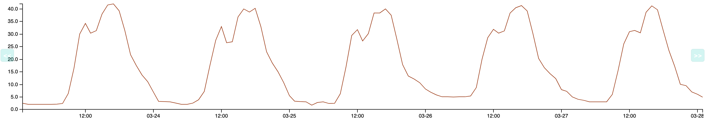
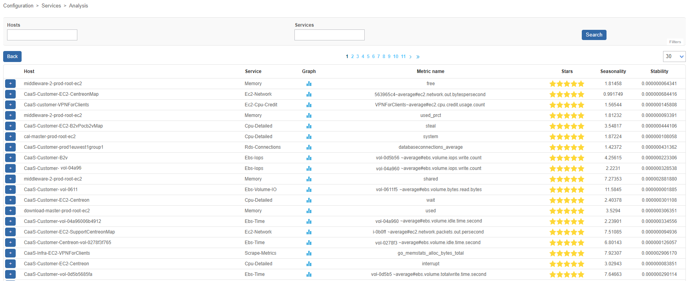

import Tabs from '@theme/Tabs';
import TabItem from '@theme/TabItem';

> Anomaly Detection est une **extension** Centreon qui requiert une [licence](../administration/licenses.md)
> valide. Pour en acheter une et récupérer les dépôts et le jeton d'accès nécessaires, contactez
> [Centreon](mailto:sales@centreon.com).

## Description

Le module **Anomaly Detection** détecte les déviations par rapport au comportement normal d'un service : il permet d'utiliser des seuils dynamiques pour déclencher des alertes.

Avec la supervision classique, les alertes sont déclenchées à partir de seuils fixes : par exemple, on alerte quand le ping sur un serveur dépasse 700 ms. Cependant, pour certains services, les valeurs "normales" varient au cours du temps, ce qui rend des seuils fixes peu pertinents. Il est possible d'utiliser la détection automatique d'anomalies lorsque le comportement du service est régulier et prévisible :



On détermine quelles sont les valeurs normales au cours du temps : la prévision permet de calculer un seuil bas et un seuil élevé. Lorsque le comportement du service dévie du modèle attendu, ces seuils sont dépassés (c'est-à-dire que la métrique descend en-dessous du seuil bas ou dépasse le seuil élevé). Le service passe en statut CRITIQUE et une notification est envoyée. Exemple: un serveur a habituellement peu de trafic la nuit. Une nuit, Centreon détecte des flux réseau plus élevés
que la normale et déclenche une alerte. Cela permet à l'entreprise de se rendre compte d'un piratage.

### Fonctionnement

1. Les données collectées sont envoyées à la plateforme SaaS de Centreon.

2. Centreon calcule un modèle de comportement régulier grâce à l'historique
de ces données.

3. Une fois le modèle calculé, les prédictions sont générées et récupérées
sur votre plateforme Centreon.

4. Les prévisions servent de seuils flottants qui sont ensuite utilisés par le
moteur de supervision pour comparer la valeur collectée avec les seuils prévus
pour mettre en évidence les écarts et générer des alertes. Pour ne pas fausser l'analyse, les données reçues pendant les plages de maintenance sont exclues du calcul des prévisions.

5. Les modèles sont recalculés régulièrement, et les prévisions s'affinent dans le temps.

## Prérequis

Pour utiliser **Anomaly Detection**, vous aurez besoin des éléments suivants :

- Un jeton fourni par Centreon pour accéder à la plateforme SaaS de Centreon,
- Une connexion internet depuis le serveur Centreon central. Le central doit pouvoir dialoguer avec le domaine `api.a.prod.mycentreon.com` sur le port 443.
- La variable d'environnement SHELL [LC_ALL](https://www.gnu.org/software/gettext/manual/html_node/Locale-Environment-Variables) ne doit pas être définie ou bien avoir la valeur `C`. Pour vérifier la valeur de cette variable, entrez :

  ```
  echo $LC_ALL
  ```

## Installation

### Étape 1 : Installation des paquets

Exécutez la commande suivante :

<Tabs groupId="sync">
<TabItem value="Alma / RHEL / Oracle Linux 8" label="Alma / RHEL / Oracle Linux 8">

```shell
dnf install centreon-anomaly-detection
```

</TabItem>
<TabItem value="Alma / RHEL / Oracle Linux 9" label="Alma / RHEL / Oracle Linux 9">

```shell
dnf install centreon-anomaly-detection
```

</TabItem>
<TabItem value="Debian 11" label="Debian 11">

``` shell
apt update && apt install centreon-anomaly-detection
```

</TabItem>
</Tabs>

### Étape 2 : Installation via l'interface

1. Allez à la page **Administration > Extensions > Gestionnaire**. Une tuile **Anomaly detection** apparaît dans la section **Modules**.

2. Cliquez sur le bouton d'installation dans la tuile **Anomaly Detection**.
  Le module est maintenant installé (le numéro de version apparaît sur fond vert avec une coche blanche).

3. Exécutez la commande suivante en tant qu'utilisateur privilégié :

  ```shell
  systemctl restart gorgoned
  ```

### Étape 3 : Ajouter votre jeton

1. Rendez-vous dans le menu **Configuration > Services > Anomaly Detection** et
cliquez sur le bouton **Add Centreon Cloud Token**.

2. Saisissez votre jeton et cliquez sur **Save**.

  > Si votre serveur Centreon Central a besoin d'une configuration proxy pour
  > accéder à Internet, cochez la case **Use proxy**.

  Votre plateforme Centreon est maintenant prête à utiliser la détection
d'anomalies Centreon.

## Configuration

Pour obtenir un service Anomaly Detection pleinement fonctionnel, il faut passer par 4 étapes :

1. [Créer un service de type **Anomaly Detection**](#étape-1--créer-un-service-anomaly-detection). Cela activera l'envoi des données collectées vers la plateforme SaaS de Centreon,
 afin de démarrer la modélisation du comportement régulier.
2. [Évaluer la pertinence des prévisions calculées](#étape-2--évaluer-la-pertinence-des-prévisions).
3. Une fois que les modèles semblent corrects, [activer les changements de statut](#étape-3--activer-les-changements-de-statut).
4. Lorsque que les changements de statut semblent pertinents, [activer le processus de notification](#étape-4--activer-le-processus-de-notification).

### Étape 1 : Créer un service Anomaly Detection

Vous pouvez créer un service Anomaly Detection manuellement, ou bien [utiliser l'assistant de création](#utiliser-lassistant-de-création).
Pour créer un service Anomaly Detection manuellement :

1. Allez à la page **Configuration > Services > Anomaly Detection** et
cliquez sur le bouton **Create manually**.

2. Remplissez les champs suivants :

    - **Description**: nom du service. Les seuls caractères spéciaux autorisés sont : slash, tiret et underscore.
    - **Statut**: permet d'activer ou désactiver le service. Si vous désactivez un service, après avoir déployé la configuration, celui-ci ne sera plus supervisé (notamment, il n'apparaîtra plus à la page **Statut des ressources**).
    - **Select host - service**: définir le couple hôte/service sur lequel le service Anomaly Detection se basera.
    - **Select metric** : sélectionnez la métrique sur laquelle appliquer la détection d'anomalie.
    - Dans un premier temps, laissez le champ **Enable notifications** à **Désactivé**. (L'option sera activée à l'étape 3.)
    - Dans la section **Categories & groups**, vous pouvez sélectionner un [**Niveau de criticité**](../monitoring/categories.md#criticité).

3. Cliquez sur **Sauvegarder**.

4. [Déployez la configuration](monitoring-servers/deploying-a-configuration.md).

   - Le service apparaît à la page **Supervision > Statut des ressources**. Pour afficher uniquement les services de type **Anomaly detection**, utilisez le filtre **Type** dans la fenêtre **Options de filtre**.
  
   - Le calcul du modèle de comportement démarre. Tant qu'un premier calcul n'a pas été effectué et que des prévisions n'ont pas été reçues, le statut du service reste INCONNU. Pour que des prédictions puissent être calculées, il faut disposer d'un minimum de 4h de données.

   - Les premières prévisions apparaîtront dans un délai de 36h maximum. Le service passera alors en statut OK et y restera tant que les alertes ne seront pas activées (étape 3).

    > Si le service sur lequel vous appliquez la détection d'anomalies a été
    > supervisé depuis un certain temps, il est possible de [transférer
    > l'historique des données](#transférer-lhistorique-des-données) pour obtenir
    > plus rapidement un modèle fiable.

### Étape 2 : Évaluer la pertinence des prévisions

Dans un premier temps, les prévisions reçues seront peu fiables : Anomaly Detection a besoin de pouvoir identifier plusieurs répétitions de motifs de données avant de mettre en place des prévisions pertinentes. La durée nécessaire varie donc suivant la saisonnalité du service (quotidienne, hebdomadaire...). En règle générale, comptez environ 6 semaines pour obtenir un modèle stable.

Pour évaluer la pertinence des prévisions, observez le graphe du service à la page **Supervision > Informations de performance > Graphiques**, ou dans l'onglet **Graphique** du panneau de détails du service à la page **Supervision > Statut des ressources**.

Si vous l'estimez nécessaire (par exemple si vous constatez trop de faux positifs, ou si au contraire les prévisions ne détectent pas assez d'incidents), vous pouvez ajuster manuellement la marge entre la courbe et les seuils.

1. À la page **Supervision > Statut des ressources**, cliquez sur le service Anomaly Detection désiré, puis rendez vous dans l'onglet **Graphique** du panneau de détails.
2. Cliquez sur l'icône **Modifier les données de détection d'anomalie** (la clé à molette) en haut à droite de l'onglet. Le graphique s'ouvre dans une pop-up.
3. Utilisez le sélecteur dans la section **Gérer la taille de l'enveloppe** pour changer la marge des prédictions : dans l'aperçu, les vérifications situées en-dehors de l'enveloppe sont matérialisées par un point rouge.
4. Cliquez sur **Sauvegarder**. La nouvelle taille d'enveloppe se met en place à partir de ce moment. Attention, l'enveloppe déjà calculée reste telle quelle (le changement n'est donc pas visible immédiatement).

### Étape 3 : Activer les changements de statut

Si, en suivant régulièrement le modèle généré et les données du menu
**Supervision > Informations de performance > Graphiques**, vous pensez que votre modèle est
stable, vous pouvez activer les changements de statut. Une fois cette option activée, le statut du service passera à CRITIQUE [SOFT](../alerts-notifications/concepts.md#types-de-statuts) dès que la métrique descendra en-dessous du seuil bas ou dépassera le seuil élevé.

1. Allez à la page **Configuration > Services > Anomaly Detection** et cliquez sur le service Anomaly Detection désiré.

2. Dans la section **Alerting options**, activez l'option **Enable change of status**.

3. Dans le champ **Detect anomalies after**, entrez le nombre de déviations à partir duquel le service passera en CRITIQUE [HARD](../alerts-notifications/concepts.md#types-de-statuts). (Les notifications, une fois activées, ne seront envoyées que lorsque le service passera de SOFT à HARD.)

4. Cliquez sur **Sauvegarder**.

5. [Déployez la configuration](monitoring-servers/deploying-a-configuration.md).

### Étape 4 : Activer le processus de notification

Lorsque vous êtes satisfait des changements de statut que vous constatez (que ceux-ci correspondent bien à des débuts ou fins d'incidents), alors votre service Anomaly Detection est pleinement opérationnel. Vous pouvez alors activer les notifications.

1. Allez à la page **Configuration > Services > Anomaly Detection** et
cliquez sur le service Anomaly Detection désiré.

2. Remplissez les champs suivants :

   - **Enable notification**: sélectionnez **Activé**.
   - **Contacts liés** : sélectionnez les contacts qui seront notifiés.
   - **Groupes de contacts liés** : sélectionnez des groupes de contacts qui seront notifiés.
   - **Intervalle de notification** : définissez la fréquence à laquelle envoyer des notifications une fois que le service est entré en  état CRITIQUE HARD et tant qu'il n'a pas été acquitté. La valeur par défaut est **0**, ce qui veut dire qu'une seule notification par changement d'état sera envoyée.
   - **Période de notification** : sélectionnez la [période de temps](../monitoring/basic-objects/timeperiods.md) pendant laquelle ces utilisateurs pourront recevoir des notifications.
   - **Type de notification** : sélectionnez les types de notification qui seront envoyées (lorsque le service passe en état CRITIQUE, et/ou quand il revient à la normale).

3. Cliquez sur **Sauvegarder**.

4. [Déployez la configuration](monitoring-servers/deploying-a-configuration.md).

### Utiliser l'assistant de création

L'assistant de création permet de mettre en avant les services
présentant soit une saisonnalité, soit une stabilité régulière (dont les valeurs sont comprises en permanence entre deux bornes).

Rendez-vous dans le menu **Configuration > Services > Anomaly Detection** et
cliquez sur **Create from analysis**.

La liste des services existant de votre plateforme Centreon est affichée ainsi
qu'un score en nombre d'étoiles : de 5 étoiles à 0, 5 étoiles représentant les
services à fort potentiel :



Après avoir sélectionné un service intéressant, cliquez sur le bouton **ADD** à
gauche de la ligne. Vous arrivez sur le formulaire de création pré-rempli :


Modifez le nom du service puis cliquez sur le bouton **Sauvegarder**.

> Si la liste est vide, c'est que le calcul afin de déterminer les services
> intéressants n'a pas encore démarré.
> 
> Celui-ci est réalisé toutes les 6 heures via un cron lancé par le processus
> **gorgoned** (défini dans le fichier **/etc/centreon-gorgone/config.d/cron.d/42-anomalydetection.yaml**).
> 
> Il est possible de lancer le premier calcul manuellement via la commande
> suivante depuis le serveur Centreon central :
>
> ```shell
> su - centreon
> perl /usr/share/centreon/bin/anomaly_detection --seasonality
> ```

## Visualiser les anomalies détectées

Une fois un service de type Anomaly Detection créé, vous pouvez le visualiser aux endroits suivants :

- À la page **Supervision > Statut des ressources**.
- À la page **Supervision > Détails des statuts > Services**.
- À la page **Supervision > Informations de performance > Graphiques**.
- À la page **Supervision > Journaux d'évènements**.
- Dans le widget **service-monitoring** via le menu **Accueil > Vues personnalisées**.
- Vous pouvez utiliser des services Anomaly Detection comme indicateurs dans [Centreon BAM](../service-mapping/ba-management.md).
- Et tous les menus où vous pouvez opérer sur les services.

## Transférer l'historique des données

> L'envoi de l'historique des données est un processus très consommateur de CPU.
> Selon le nombre de services surveillés, l'extraction des données de la base de
> données **centreon\_storage** peut prendre plusieurs dizaines de minutes. Cela
> aura un impact important sur les performances de la base de données et
> pourrait ralentir globalement la plateforme de supervision.

Pour être en mesure d'envoyer les données d'un service Anomaly Detection, un premier contrôle doit avoir été effectué. Vous pouvez [exécuter un contrôle sur le service depuis la page **Statut des ressources**](../alerts-notifications/resources-status.md#relancer-un-contrôle).

Pour envoyer l'historique des données d'un service d'anomalie à notre plateforme SaaS, connectez-vous à
votre serveur Centreon Central et accédez à l'utilisateur **centreon**:

```shell
su - centreon
```

Sélectionnez le service d'anomalie à l'aide de la commande suivante :

```shell
/usr/share/centreon/bin/anomaly_detection --list-services
```

Vous verrez la liste des services avec leur identifiant :

```shell
List of available anomaly detection services:

- id: 14, hostname: fw-beijing, servicename: anomaly-nbr-connect, metric name: connection
- id: 15, hostname: fw-brasilia, servicename: anomaly-nbr-connect, metric name: connection
- id: 17, hostname: fw-mexico, servicename: anomaly-nbr-connect, metric name: connection
- id: 18, hostname: fw-berlin, servicename: anomaly-nbr-connect, metric name: connection
- id: 22, hostname: fw-brasilia, servicename: anomaly-traffic-in, metric name: traffic_in
```

Pour envoyer l'historique des données du service d'anomalies avec l'ID 14 pour
les 4 dernières semaines, exécutez la commande suivante :

```shell
/usr/share/centreon/bin/anomaly_detection --send-history 14 --history-period 4w
```

Attendez la fin du processus :

```shell
Sending data from 2020-03-09T09:32:31 to 2020-03-10T00:00:00
Sending data from 2020-03-10T00:00:00 to 2020-03-11T00:00:00
Sending data from 2020-03-11T00:00:00 to 2020-03-12T00:00:00
Sending data from 2020-03-12T00:00:00 to 2020-03-13T00:00:00
Sending data from 2020-03-13T00:00:00 to 2020-03-14T00:00:00
Sending data from 2020-03-14T00:00:00 to 2020-03-15T00:00:00
Sending data from 2020-03-15T00:00:00 to 2020-03-16T00:00:00
Sending data from 2020-03-16T00:00:00 to 2020-03-17T00:00:00
Sending data from 2020-03-17T00:00:00 to 2020-03-18T00:00:00
Sending data from 2020-03-18T00:00:00 to 2020-03-19T00:00:00
Sending data from 2020-03-19T00:00:00 to 2020-03-20T00:00:00
Sending data from 2020-03-20T00:00:00 to 2020-03-21T00:00:00
Sending data from 2020-03-21T00:00:00 to 2020-03-22T00:00:00
Sending data from 2020-03-22T00:00:00 to 2020-03-23T00:00:00
Sending data from 2020-03-23T00:00:00 to 2020-03-24T00:00:00
Sending data from 2020-03-24T00:00:00 to 2020-03-25T00:00:00
Sending data from 2020-03-25T00:00:00 to 2020-03-26T00:00:00
Sending data from 2020-03-26T00:00:00 to 2020-03-27T00:00:00
Sending data from 2020-03-27T00:00:00 to 2020-03-28T00:00:00
Sending data from 2020-03-28T00:00:00 to 2020-03-29T00:00:00
Sending data from 2020-03-29T00:00:00 to 2020-03-30T00:00:00
Sending data from 2020-03-30T00:00:00 to 2020-03-31T00:00:00
Sending data from 2020-03-31T00:00:00 to 2020-04-01T00:00:00
Sending data from 2020-04-01T00:00:00 to 2020-04-02T00:00:00
Sending data from 2020-04-02T00:00:00 to 2020-04-03T00:00:00
Sending data from 2020-04-03T00:00:00 to 2020-04-04T00:00:00
Sending data from 2020-04-04T00:00:00 to 2020-04-05T00:00:00
Sending data from 2020-04-05T00:00:00 to 2020-04-06T00:00:00
```

## FAQ

### Combien de temps les données sont-elles hébergées ?

Les données sont conservées pendant toute la validité de la licence. Elles permettront de recalculer les modèles si
nécessaire. Un délai supplémentaire de 3 mois sera ajouté à la fin de la validité de la licence avant la suppression
de ces dernières.

### Quelles données sont hébergées par le service ?

Les données hébergées par le service de détection d'anomalies ne concernent que les données liées aux services créés
par l'utilisateur. Elles comprennent la date et l'heure du contrôle, l'identifiant de la ressource surveillée,
l'identifiant de l'indicateur associé, le nom des données de performance sur lesquelles les calculs seront effectués
ainsi que la valeur des données de performance.

### Comment l’envoi et le stockage de mes données sont-ils protégés?

L’envoi de données à notre infrastructure Cloud ne comporte aucun risque.
Les données sont chiffrées de bout en bout. Les données collectées ne contiennent que des métriques et
quelques identifiants Centreon (nom d’hôte, nom de service). Notre environnement est protégé par AWS Web
Application Firewall et AWS Shields pour prévenir les attaques DDoS. Notre architecture a été revue par les
architectes AWS (AWS Foundational Technical Review) et nous sommes un partenaire qualifié d’AWS.

### Quel est l'usage des données ?

Les données sont utilisées pour calculer des modèles de comportement. À partir de ces modèles seront générées des
prédictions utilisées comme seuils flottants par la plateforme Centreon.

### Qui a accès aux données hébergées par le service ?

Les données sont associées au jeton d'accès de l'offre de détection d'anomalies. Elles sont hébergés sur la plateforme
Centreon SaaS et partitionnées par plateforme. Un utilisateur avec un jeton n'a accès qu'à ses propres données.

### Comment puis-je demander la suppression des données ?

La suppression des données peut être demandée à tout moment. Cependant, l'historique des données est utilisé pour
créer un modèle afin de calculer les seuils flottants. Par conséquent, la participation au programme ou l'abonnement à
l'offre sera impossible.
Une demande par mail doit être faite via l'interface de support professionnel Centreon.
