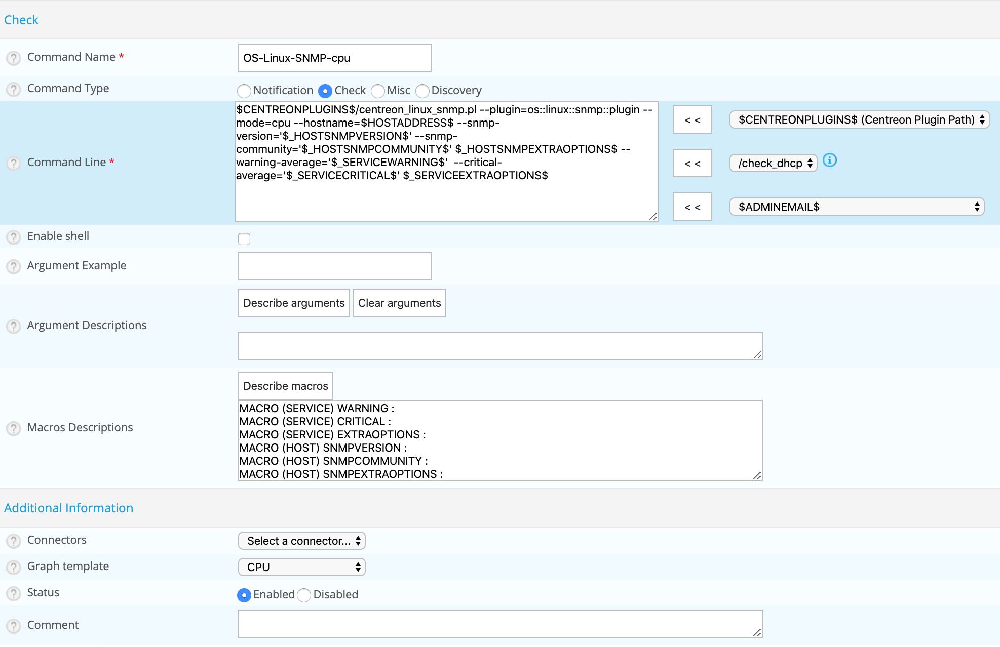

import Tabs from '@theme/Tabs';
import TabItem from '@theme/TabItem';


## Définition

Une commande est la définition d’une ligne de commande qui utilise un script ou une application afin de réaliser une
action. Il est possible d’exécuter cette commande en précisant des arguments.

Il existe quatre types de commandes :

* **Verification** sont utilisées par les ordonnanceurs afin de vérifier le statut d’un hôte ou d’un service
* **Notification** sont utilisées par les ordonnanceurs pour alerter les contacts (via mail, SMS...).
* **Discovery** sont utilisées par les règles de découverte.
* **Miscellaneous** sont utilisées par les modules complémentaires (pour effectuer certaines actions), par
  l’ordonnanceur pour le traitement des données...

Toutes les commandes peuvent être configurées au sein du menu : **Configuration > Commands**.


> Par défaut, les commandes verrouillées sont masquées. Cocher la case "Eléments verrouillés" pour les afficher toutes.

## Ajouter une commande

1. Rendez-vous dans le menu **Configuration > Commands**
2. Cliquez sur le bouton **Add**



> Les champs de configuration d’une commande sont les mêmes qu’importe le type de commande choisi.

## Les champs de configuration

* Le champ **command Name** définit le nom de la commande.
* Le champ **Command Type** permet de choisir le type de commande.
* Le champ **Command Line** indique l’application ou le script utilisé avec la commande.
* La case **Enable shell**  permet d’activer des fonctions propres à un shell tel que le pipe...
* Le champ **Argument Example** définir des exemples d'arguments (chaque argument commence par un "!")
* Le bouton **Describe arguments** permet d’ajouter une description aux arguments de type “$ARGn$”. Cette description
  sera visible lors de l’utilisation de la commande dans un formulaire d’hôte ou de service.
* Le bouton **Clear arguments** efface la description des arguments définie
* Le bouton **Describe macros** permet d’ajouter une description aux macros personalisées. Ces descriptions seront
  visibles lors de l’ajout de la commande sur un host ou un service.

* La liste de sélection **Connectors** permet de lier un connecteur à la commande. Pour davantage d’informations sur
  les connecteurs reportez-vous au chapitre [les connecteurs](#les-connecteurs).
* Le champ **Graph template** permet de lier la commande à un modèle de graphique.
* Le champ **Comment** permet de commenter la commande.

## Arguments et macros

Au sein du champ **Command Line** il est possible de faire appel à des
*[macros](macros.md)* ainsi qu’à des arguments.

Les arguments sont utilisés afin de pouvoir passer différents paramètres aux scripts appelés par les commandes. Lors de
l’exécution de la commande par l’ordonnanceur, chacun des arguments et macros sont remplacés par leur valeur respective.
Chaque macro se présente sous la forme **$valeur$** :

```shell
$CENTREONPLUGINS$/centreon_linux_snmp.pl --plugin=os::linux::snmp::plugin --mode=cpu \
--hostname=$HOSTADDRESS$ --snmp-version='$_HOSTSNMPVERSION$' \
--snmp-community='$_HOSTSNMPCOMMUNITY$' $_HOSTSNMPEXTRAOPTIONS$ \
--warning-average='$_SERVICEWARNING$' \
--critical-average='$_SERVICECRITICAL$' $_SERVICEEXTRAOPTIONS$
```

> La bonne pratique veut que nous remplacions les arguments par des
*[macros personnalisées](macros.md#les-macros-personnalisées)*.

## Les connecteurs

### Connecteur SSH

Le connecteur Centreon SSH Connector est un logiciel Centreon gratuit, disponible sous licence Apache Software License version 2 (ASL 2.0).
Utilisé avec Centreon Engine, il accélère l'exécution des contrôles faits via SSH.

#### Installation

Exécutez la commande suivante en tant qu'utilisateur privilégié :

<Tabs groupId="sync">
<TabItem value="Alma / RHEL / Oracle Linux 8" label="Alma / RHEL / Oracle Linux 8">

``` shell
dnf install centreon-connector-ssh
```

</TabItem>
<TabItem value="Alma / RHEL / Oracle Linux 9" label="Alma / RHEL / Oracle Linux 9">

``` shell
dnf install centreon-connector-ssh
```

</TabItem>
<TabItem value="Debian 11" label="Debian 11">

``` shell
apt install centreon-connector-ssh
```

</TabItem>
</Tabs>

### Perl connector

Le connecteur Centreon Perl Connector est un logiciel Centreon gratuit, disponible sous licence Apache Software License version 2 (ASL 2.0).
Utilisé avec Centreon Engine, il accélère l'exécution des scripts Perl.

#### Installation

Exécutez la commande suivante en tant qu'utilisateur privilégié :

<Tabs groupId="sync">
<TabItem value="Alma / RHEL / Oracle Linux 8" label="Alma / RHEL / Oracle Linux 8">

``` shell
dnf install centreon-connector-perl
```

</TabItem>
<TabItem value="Alma / RHEL / Oracle Linux 9" label="Alma / RHEL / Oracle Linux 9">

``` shell
dnf install centreon-connector-perl
```

</TabItem>
<TabItem value="Debian 11" label="Debian 11">

``` shell
apt install centreon-connector-perl
```

</TabItem>
</Tabs>
