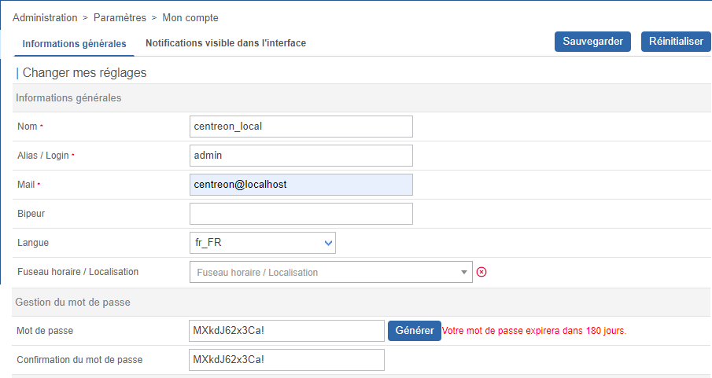

Vous pouvez optimiser votre utilisation de Centreon en profitant des fonctionnalités de personnalisation suivantes :

## Passer en mode sombre

Lors de votre première connexion, l'interface Centreon s'affiche en mode clair par défaut.

Dans le bandeau supérieur, cliquez sur l'icône profil et utilisez le bouton pour activer le mode sombre. Lorsque vous vous reconnecterez, le mode que vous avez sélectionné précédemment restera activé.

- Mode clair :


- Mode sombre :


## Changer la langue de l'interface utilisateur

Dans le bandeau, cliquez sur l'icône profil, puis cliquez sur **Editer Le Profil**:


Dans la liste de sélection des langues, sélectionnez la vôtre :


Puis cliquez sur **Sauvegarder**. Votre interface est maintenant traduite dans votre
langue.

> Si votre langue n'apparaît pas dans la liste, vous pouvez aider la communauté Centreon à traduire l'interface web.
> Rendez-vous dans le chapitre [Comment traduire Centreon](../../developer/developer-translate-centreon.md) pour plus d'informations.

## Réinitialiser le mot de passe

### Réinitialiser votre mot de passe avant expiration

Lorsque votre mot de passe va expirer dans les 7 prochains jours, un point orange apparaît dans le
bandeau à droite à côté de l'icône de profil :


Cliquez sur **Editer le profil**, puis modifiez votre mot de passe :



### Réinitialiser votre mot de passe après expiration

Si vous n'avez pas changé votre mot de passe avant son expiration, après connexion vous serez redirigé vers une page dédiée où vous pourrez le mettre à jour :


Entrez votre mot de passe actuel, définissez-en un nouveau puis cliquez sur **Réinitialiser le mot de passe**.

## Définir une page par défaut après connexion

Vous pouvez configurer la page qui sera affichée par défaut lorsque vous vous connectez à l'interface, au niveau de l'utilisateur ou au niveau du modèle de contact. Vous pouvez effectuer cette procédure soit à partir de l'interface, soit à l'aide de commandes CLAPI.

### À partir de l'interface

Suivez cette procédure pour définir une page par défaut :

<Tabs groupId="sync">
<TabItem value="Pour un utilisateur" label="Pour un utilisateur">

  1. Allez à la page **Configuration > Utilisateurs > Contacts/Utilisateurs**.

  2. Sélectionnez l'utilisateur souhaité et cliquez sur l'onglet **Authentification Centreon**.
    
  3. Dans le champ **Page par défaut**, sélectionnez le nom de la page dans la liste déroulante. Puis enregistrez vos modifications.

</TabItem>
<TabItem value="Pour un modèle de contact" label="Pour un modèle de contact">

  1. Allez à la page **Configuration > Utilisateurs > Modèles de contact**.

  2. Sélectionnez un modèle ou cliquez sur le bouton **Ajouter** pour remplir le formulaire **Ajouter un modèle utilisateur**.
      
  3. Dans le champ **Page par défaut**, sélectionnez le nom de la page dans la liste déroulante. Puis enregistrez vos modifications.
  
  Les utilisateurs créés à partir de ce modèle verront cette page par défaut lorsqu'ils se connecteront.
  
</TabItem>
</Tabs>

### Avec commandes CLAPI

> Vous devez d'abord obtenir le numéro de la "page topologique" associée à la page par défaut de l'interface. Dans cet exemple, nous devons obtenir le numéro associé à la page Statut des ressources.

1. Depuis votre terminal, connectez-vous à **MariaDB** et exécutez la commande suivante :
  
  ```shell
  use centreon ;
  ```
  
2. Récupérez le numéro de la "page topologique" pour la page Statut des ressources :
  
  ```shell
  SELECT topology_page FROM topology WHERE topology_name = "Resources Status";
  ```
  
  Vous devez obtenir le résultat suivant :
  
  ```shell
  +---------------+
  | topology_page |
  +---------------+
  |           200 |
  ```
  
3. Suivez ensuite cette procédure pour définir une page par défaut. Exécutez ces commandes avec vos identifiants personnalisés :

<Tabs groupId="sync">
<TabItem value="Pour un utilisateur" label="Pour un utilisateur">

- En modifiant un utilisateur existant (où `200` est le numéro associé à la page Statut des ressources) :
  
```shell
centreon -u admin -p 'centreon' -o contact -a setparam -v "contact alias;default_page;200"
```

- En ajoutant un nouvel utilisateur (où `200` est le numéro associé à la page Statut des ressources) :

```shell
centreon -u admin -p 'centreon' -o CONTACT -a ADD -v "user;user;user@mail.com;mypassword;1;1;en_US;local;200"
```

</TabItem>
<TabItem value="Pour un modèle de contact" label="Pour un modèle de contact">

Où `200` est le numéro associé à la page Statut des ressources :

```shell
centreon -u Admin -p 'centreon' -o CONTACTTPL -a ADD -v "new_template;new_template;user@mail.com;mypassword;1;1;en_US;local;200"
```

</TabItem>
</Tabs>
