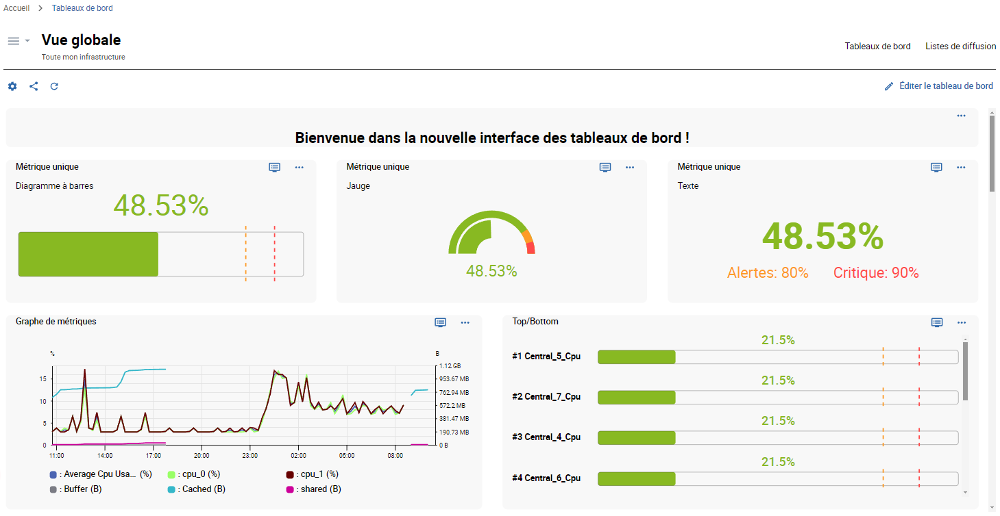

> Centreon Tableaux de bord est disponible en version bêta à partir de **Centreon version 23.10**.

Commencez par créer des tableaux de bord et ajoutez des widgets spécialement conçus pour optimiser votre expérience utilisateur. Bénéficiez ensuite d'options de visualisation de données pour afficher et suivre vos ressources en temps réel.

## Activer la fonctionnalité Tableaux de bord

L'accès à la fonctionnalité Tableaux de bord n'est pas géré au niveau de l'utilisateur, mais via des groupes d'accès ou des listes de contrôle d'accès (ACL). Vous autorisez les utilisateurs à accéder à la fonctionnalité en accordant des droits à l'ACL à laquelle ils appartiennent (en savoir plus [sur les ACL](../administration/access-control-lists.md)).

### Configurer l'ACL

> Vous devez être connecté à Centreon en tant qu'administrateur.

- Dans cet exemple, nous allons créer une nouvelle ACL appelée **Utilisateurs des tableaux de bord**. Cette ACL contiendra les utilisateurs appartenant au groupe **Guests**.

1. Allez dans **Administration > ACL > Gestion des accès aux menus**.
2. Cliquez sur le bouton **Ajouter**. Ceci ouvre le formulaire **Ajouter une ACL**.
3. Renseignez le champ **Nom de l'ACL**. Dans cet exemple : **Dashboards users**.
4. Sélectionnez **Activé** dans les paramètres **Statut**.
5. Sélectionnez les **Groupes liés** à inclure dans cette ACL. Dans cet exemple : **Guests**.
6. Dans la section **Pages disponibles**, développez le menu **Accueil**, puis le menu **Tableaux de bord**. La liste des profils à sélectionner s'affiche.

  > - **Viewer:** ne peut voir que les tableaux de bord auxquels il a accès.
  > - **Creator:** peut créer et modifier les tableaux de bord auxquels il a accès.
  > - **Administrator:** peut accéder à tous les tableaux de bord et les modifier.

7. Sélectionnez le profil à définir pour cette ACL. Dans cet exemple : **Viewer**.
8. Cliquez sur **Sauvegarder** pour confirmer vos modifications.

### Vérifier que la fonctionnalité est activée

> Vous devez disposer d'un compte d'utilisateur avec des droits d'accès à la fonctionnalité Tableaux de bord.

1. Connectez-vous à Centreon.
2. Vous devriez voir dans le menu **Accueil**, l'entrée **Tableaux de bord Beta**.

## Créer votre premier tableau de bord

> Vous devez être connecté à Centreon avec des droits d'administrateur ou de créateur.

1. Dans la page **Bibliothèque de tableaux de bord**, cliquez sur le bouton **Créer un tableau de bord**. Cela ouvre la modale **Créer un tableau de bord**.
2. Nommez le tableau de bord et renseignez une description si nécessaire.
3. Cliquez sur **Créer** pour confirmer la création.

Votre tableau de bord est maintenant ajouté ! Vous pouvez directement commencer à ajouter des widgets.

### Ajouter des widgets

> Votre tableau de bord doit être ouvert en mode édition.

- S'il s'agit de votre tout premier widget, cliquez sur la zone **Ajouter widget**.
- Sinon, cliquez sur le bouton **+ Ajouter widget** à droite de l'interface.

La majorité des widgets fonctionnent généralement selon les étapes suivantes : 

- **Étape 1 :** sélectionnez le type de widget. Les paramètres du widget dépendent ensuite du widget sélectionné.
- **Étape 2 :** sélectionnez les ressources.
- **Étape 3 :** sélectionnez les métriques.

> Assurez-vous de sauvegarder vos modifications. Si vous quittez sans sauvegarder votre tableau de bord, les modifications seront définitivement perdues.

### Autres actions

Cliquez sur le menu avec les **trois points verticaux** en haut à droite du widget pour le modifier ou pour accéder à d'autres actions :
- Actualiser
- Dupliquer
- Supprimer le widget

> En mode édition, vous pouvez facilement organiser vos widgets en les déplaçant ou en les redimensionnant. N'oubliez pas de sauvegarder vos modifications.

### Lien vers la page Statut des ressources

Depuis le tableau de bord, vous pouvez cliquer sur un pictogramme représentant un écran en haut à droite d'un widget : ce bouton vous permet de **Voir plus dans la page Statut des ressources**. Il ouvre un nouvel onglet sur la page Statut des ressources, avec des informations détaillées concernant le widget en question.

## Gérer les tableaux de bord

> Vous devez être dans la page **Bibliothèque de tableaux de bord** pour avoir une vue d'ensemble de vos tableaux de bord.

### Modifier un tableau de bord

#### Mettre les propriétés à jour

Cliquez sur le bouton **roue dentée** en bas à droite du tableau de bord pour mettre son nom et sa description à jour.

#### Modifier les widgets du tableau de bord 

1. Cliquez sur le tableau de bord pour l'ouvrir en mode vue.
2. Cliquez sur **Éditer le tableau de bord** pour accéder aux widgets et les gérer en mode édition.

### Supprimer un tableau de bord

Cliquez sur le bouton **Corbeille** en bas à gauche du tableau de bord pour le supprimer. Confirmez ensuite la suppression.

### Partager un tableau de bord

> Vous pouvez partager des tableaux de bord en utilisant l'interface **Gestion des droits d'accès**.

#### À propos des droits d'accès

Vous utilisez la fonctionnalité Tableaux de bord avec un profil de **viewer** ou **editor** :

- Les **viewers** : peuvent uniquement visualiser les tableaux de bord que vous partagez avec eux.
- Les **editors** : peuvent visualiser et modifier les tableaux de bord que vous partagez avec eux.

#### Gérer les droits d'accès

1. Cliquez sur le bouton **partager** en bas à droite du tableau de bord.
2. Dans la liste déroulante **Ajouter un contact**, sélectionnez l'utilisateur à ajouter.
3. Sélectionnez le profil **Viewer** ou **Editor**.
4. Cliquez sur le bouton **+** pour l'ajouter.
5. Répétez l'action pour chaque utilisateur que vous souhaitez ajouter.
6. Cliquez sur le bouton **Mettre à jour** pour enregistrer vos modifications.

Les utilisateurs que vous venez d'ajouter ont maintenant accès au partage de votre tableau de bord, selon le profil que vous avez défini pour eux.

> Utilisez la fonction **Copier le lien** pour partager l'URL du tableau de bord directement avec les utilisateurs qui ont accès à votre plateforme.

## Gérer les listes de diffusion

Les listes de diffusion sont des listes de tableaux de bord sélectionnés à diffuser dans l'ordre de votre choix. Cette fonctionnalité est utile par exemple lorsque vous souhaitez afficher vos tableaux de bord en plein écran dans des espaces publics.

> Cette fonctionnalité nécessite une [licence](../administration/licenses.md) valide. Pour en acheter une et récupérer les référentiels nécessaires, contactez [Centreon](mailto:sales@centreon.com).

### Créer une liste de diffusion

> Avant de créer une liste de diffusion, assurez-vous que les tableaux de bord que vous souhaitez inclure ont été créés.

1. Cliquez sur le lien **Listes de diffusion** pour accéder à l'interface des listes de diffusion.
2. Cliquez sur le bouton **Créer une liste de diffusion** (ou sur le bouton **Ajouter** s'il ne s'agit pas de votre première liste de diffusion).
3. Renseignez les propriétés :
   - **Nom**
   - **Description** 
   - Ajoutez vos tableaux de bord dans la liste déroulante **Sélectionner des tableaux de bord**.
   - Dans la section **Définir l'ordre des tableaux de bord**, glissez/déposez les tableaux de bord comme vous le souhaitez.
   - Définissez le temps de rotation en secondes.
4. Cliquez sur **Enregistrer**.
Votre liste de diffusion est maintenant ajoutée à la liste des listes de diffusion.

### Afficher la liste de diffusion

- Dans l'interface **Listes de diffusion**, cliquez sur la ligne de votre liste de diffusion.
Votre liste de diffusion est alors affichée et un bandeau de contrôle apparaît lorsque vous survolez le bas de l'interface.

> Profitez d'une meilleure visualisation en affichant la page en mode plein écran (F). 

Le bandeau de contrôle vous permet de :
- Mettre en lecture/pause la diffusion.
- Aller au tableau de bord précédent ou suivant.
- Accéder directement à un tableau de bord spécifique en cliquant sur son nom.

### Partager la liste de diffusion

> Vous ne pouvez partager votre liste de diffusion qu'avec des contacts ayant accès à votre plateforme Centreon, et les droits de viewer sur les tableaux de bord.

- Cliquez sur le bouton **Partager avec des contacts** à partir de la ligne de votre liste de diffusion.
La modale **Droits d'accès de la liste de diffusion** s'affiche.
- Vous pouvez maintenant ajouter des contacts ou des groupes de contacts et définir leurs droits en tant que viewer ou editor dans la section **Partager avec**.
- Utilisez le bouton **Corbeille** dans la section **Droits utilisateur** pour supprimer un contact ou un groupe de contacts.
- Utilisez le bouton **Copier le lien** pour partager l'URL de la liste de diffusion directement avec les utilisateurs qui ont accès à votre plateforme.

### Editer/Supprimer une liste de diffusion

Le menu d'action à trois points situé à la fin de la ligne de la liste de diffusion vous permet d'éditer les propriétés ou de supprimer la liste de diffusion.

## Liste des widgets

| Widget                   | Description                                                                                                                                                                                                                                                                                                    |
|--------------------------|----------------------------------------------------------------------------------------------------------------------------------------------------------------------------------------------------------------------------------------------------------------------------------------------------------------|
| Texte générique           | Permet d'ajouter du texte libre à vos tableaux de bord (titres de sections, informations, etc.).   |
| MAP - Afficher une vue           |  Permet de sélectionner et de visualiser une carte créée à partir du module MAP.  |
| Graphe de métriques         | Affiche les métriques pour une période donnée.                                  |
| Tableau des ressources                 | Affiche des données sur le statut des ressources et les événements, centralisées dans un tableau.|
| Métrique unique        | Affiche la valeur d'une seule métrique sous forme de texte, de jauge ou de diagramme à barres.  |
| Grille de statut    | Affiche le statut actuel des ressources sélectionnées, sous forme de grille.   |
| Top/bottom              | Affiche le top ou le bottom x des hôtes, pour une métrique sélectionnée.   |
