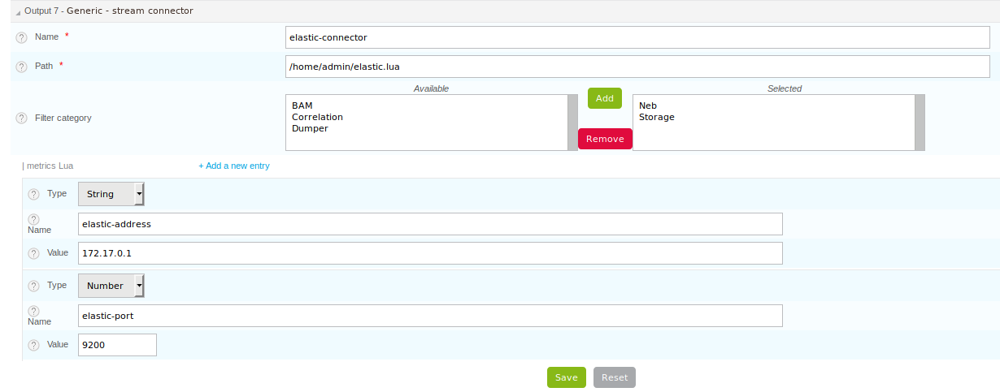

Centreon Broker fournit un Stream Connector. Si vous ne trouvez pas de connecteur approprié parmi ceux proposés, ce Stream Connector répondra certainement à vos besoins. Son principe est d’exposer une partie de l’API Centreon Broker par le biais de l’interpréteur Lua et l’utilisateur n’a plus qu’à la remplir selon ses besoins.

## Centreon Broker exposé

Voici le code Lua minimal acceptable pour fonctionner comme Stream Connector :

```LUA
  function init(conf)
  end

  function write(d)
    return true
  end
```

Nous recommandons de placer les scripts Lua dans le répertoire `/usr/share/centreon-broker/lua`. S’il n’existe pas, nous pouvons le créer. Faites juste attention à ce que ce répertoire soit accessible à l’utilisateur centreon-broker. Si un Stream Connector est composé de plusieurs fichiers (un script principal et un module par exemple), vous pouvez les placer dans ce répertoire. Si une bibliothèque dynamique (fichier `\*.so`) est utilisée par un script Lua, placez-la dans le répertoire `/usr/share/centreon-broker/lua/lib`.

Lorsque Centreon Broker démarre, il initialise tous les connecteurs configurés. Pour le Stream Connector, il charge le script Lua, contrôle sa syntaxe et vérifie que les fonctions `init()` et `write()` existent.

Centreon Broker vérifie également si une fonction `filter(category, element)` existe.

Examinons ces fonctions. La fonction `init` est appelée lorsque le connecteur est initialisé. L’argument fourni à cette fonction est une table Lua contenant les informations données par l’utilisateur dans l’interface de configuration de l'output de Broker. Par exemple, si une adresse IP est fournie avec le nom *address* et la valeur *192.168.1.18*, alors cette information sera accessible via `conf["address"]`.

La fonction `write()` est appelée chaque fois qu’un événement est reçu d’un collecteur par le biais de Broker. Cet événement est configuré pour être envoyé à ce connecteur. Cette fonction a besoin d’un argument qui est l’événement traduit sous forme de table Lua.

La fonction `write()` doit retourner une valeur booléenne **True** si les événements sont traités et **False** dans le cas contraire.

Si cette fonction ne renvoie pas une valeur booléenne, Broker déclenche une erreur.

## Le SDK Lua de Broker

Pour simplifier la vie du développeur Lua, plusieurs objets sont proposés et directement disponibles pour le script.

### L’objet *broker\_log*

1. `broker_log:set_parameters(level, filename)` permet à l’utilisateur de définir un niveau de journal et un nom de fichier. Le niveau est un nombre entier compris entre 1 et 3, du plus important au moins important. Le nom du fichier doit contenir le chemin d’accès complet. Et le fichier doit être accessible à centreon-broker. Si cette méthode n’est pas appelée, les journaux seront écrits dans les journaux de centreon Broker.
2. `broker_log:info(level, content)` écrit une *information* de journal si le niveau donné est inférieur ou égal à celui configuré. Le contenu est le texte à écrire dans les journaux.
3. `broker_log:warning(level, content)` fonctionne comme `log_info` mais écrit un *avertissement*.
4. `broker_log:error(level, content)` fonctionne comme `log_info` mais écrit une *erreur*.

Voici un exemple :

```LUA
  function init(conf)
    -- Here, we allow all logs with level 3 and set the output to
    -- /tmp/test.log.
    broker_log:set_parameters(3, "/tmp/test.log")
  end

  function write(d)
    -- For each entry, we write the key and the value.
    for k,v in pairs(d) do
      broker_log:info(3, k .. " => " .. tostring(v))
    end
    return true
  end
```

Ici, lorsque la fonction `init` est exécutée, l’objet *broker\_log* est paramétré avec un niveau max 3 et un fichier de sortie */tmp/test.log*.

Ensuite, à chaque appel de `write()`, les événements reçus sont enregistrés comme des informations. Nous obtenons un résultat comme celui-ci :

```
  Fri Jan 26 08:31:49 2018: INFO: service_id => 21
  Fri Jan 26 08:31:49 2018: INFO: type => 0
  Fri Jan 26 08:31:49 2018: INFO: host_id => 13
  Fri Jan 26 08:31:49 2018: INFO: element => 1
  Fri Jan 26 08:31:49 2018: INFO: comment_data =>
```

> Pour utiliser une méthode en Lua, le séparateur entre l’objet et la méthode est `:` ; *broker\_log* est un objet puisqu’il contient des informations telles que le niveau maximum ou le fichier de destination.

### Le socket TCP de Broker

Un socket TCP de base est disponible dans le SDK *Broker*. Voici un exemple simple :

```LUA
  local socket = broker_tcp_socket.new()
  socket:connect("10.40.1.2", 9002)
  socket:write(message)
  answer = socket:read()
  socket:close()
```

1. Dans cet exemple, le premier appel est *broker\_tcp\_socket.new()*. Il crée un nouveau socket en appelant la fonction *new()* stockée dans la table *broker\_tcp\_socket*.
2. L’étape suivante est un appel à la méthode *connect* qui nécessite deux arguments : une chaîne indiquant une adresse IP ou un nom d’hôte auquel se connecter et le port à utiliser.
3. L’étape suivante est un appel à la méthode *write* qui écrit une chaîne dans le socket. L’appel de la méthode est terminé lorsque l’intégralité du message est envoyée.
4. La méthode *read* reçoit une chaîne comme résultat.
5. Lorsque l’utilisateur a fini d’utiliser le socket, il peut le fermer avec la méthode *close()*.

Cet objet socket fournit également une méthode *get\_state()* qui renvoie une chaîne de caractères :

1. *unconnected* : le socket n’est pas connecté
2. *hostLookup*: le socket effectue une recherche de nom d’hôte
3. *connecting*: le socket a commencé à établir une connexion
4. *connected*: une connexion est établie
5. *closing*: le socket est sur le point de se fermer (des données peuvent encore être en attente d’écriture).

### La table *broker*

Plusieurs fonctions sont disponibles dans cette table. Ces fonctions ne sont pas des méthodes, *broker* est juste une table qui les contient. On peut trouver ici :

1. `json_encode(object)` qui convertit un objet Lua en json. Le json est retourné sous forme de chaîne par la fonction.
2. `json_decode(json)` qui convertit une chaîne json en objet Lua. L’objet est directement retourné par la méthode. Une deuxième valeur est également retournée. Elle n’est définie que lorsqu’une erreur s’est produite et contient une chaîne décrivant l’erreur.
3. `parse_perfdata(str)` qui prend comme argument une chaîne contenant des perfdata. Un deuxième argument booléen est disponible. Si sa valeur est *true*, la table retournée est plus grande et donne tous les détails sur les métriques ainsi que les seuils « *warning »* et *« critical »*. En cas de succès, il retourne une table contenant les valeurs récupérées à partir des perfdata. En cas d’échec, il renvoie un objet nil et une chaîne de description de l’erreur.
4. `url_encode(text)` qui convertit le *texte* de la chaîne de caractères en une chaîne encodée en URL.
5. `stat(filename)` qui appelle la fonction `stat` système sur le fichier. En cas de succès, nous obtenons une table contenant diverses informations sur le fichier (voir l’exemple ci-dessous). Sinon, cette table est `nil` et une deuxième valeur retournée est donnée et contient un message d’erreur.
6. `md5(str)` qui calcule le MD5 de la chaîne `str` et le renvoie sous forme de chaîne.
7. `bbdo_version()` qui renvoie la version BBDO configurée dans Centreon Broker.

```LUA
  local obj = {
    a = 1,
    b = 2,
    c = { 'aa', 'bb', 'cc' }
  }
  local json = broker.json_encode(obj)
  print(json)
```

qui renvoie

```JSON
  { "a": 1, "b": 2, "c": [ 'aa', 'bb', 'cc' ] }
```

Un deuxième exemple est le suivant :

```LUA
  local json = { "a": 1, "b": 2, "c": [ 'aa', 'bb', 'cc' ] }
  local obj, err = broker.json_decode(json)

  for i,v in pairs(obj) do
    print(i .. " => " .. tostring(v))
  end
```

devrait retourner quelque chose comme ceci :

```
  a => 1
  b => 2
  c => table: 0x12ef67b5
```

Dans ce cas (pas d’erreur), `err` est `nil`.

Il est également facile d’accéder à chaque champ de l’objet, par exemple : `obj['a']` donne 1, ou `obj['c'][1]` donne *aa*, ou `obj.b` donne 2.

Voici un exemple montrant les possibilités de la fonction `parse_perfdata`.

```LUA
  local perf, err_str = broker.parse_perfdata(" 'one value'=2s;3;5;0;9 'a b c'=3.14KB;0.8;1;0;10")

  if perf then
    for i,v in pairs(perf) do
      print(i .. " => " .. tostring(v))
    end
  else
    print("parse_perfdata error: " .. err_str)
  end
```

devrait retourner quelque chose comme ceci :

```
  a b c => 3.14
  one value => 2
```

Si maintenant, nous appelons la même fonction avec *true* comme deuxième argument :

```LUA
  local perf, err_str = broker.parse_perfdata("pl=45%;40;80;0;100", true)

  if perf then
    print("Content of 'pl'")
    for i,v in pairs(perf['pl']) do
      print(i .. " => " .. tostring(v))
    end
  else
    print("parse_perfdata error: " .. err_str)
  end
```

devrait retourner quelque chose comme ceci :

```
  Content of 'pl'
  value => 45
  uom => %
  min => 0
  max => 100
  warning_low => 0
  warning_high => 40
  warning_mode => false
  critical_low => 0
  critical_high => 80
  critical_mode => false
```

Attention, les clés ne sont pas triées dans les tables de hachage, donc si vous créez un tel programme, les données ne seront probablement pas dans le même ordre.

```LUA
  local str = broker.url_encode("La leçon du château de l'araignée")
  print(str)
```

devrait retourner quelque chose comme ceci :

```
  La%20le%C3%A7on%20du%20ch%C3%A2teau%20de%20l%27araign%C3%A9e
```

```LUA
  local s, err = broker.stat("filename")
  for i,v in pairs(perf['pl']) do
    print(i .. " => " .. tostring(v))
  end
```

devrait retourner quelque chose comme ceci :

```
  uid=>1000
  gif=>1000
  size=>279
  ctime=>1587641144
  mtime=>1587641144
  atime=>1587641144
```

Si une erreur se produit, `s` est `nil` tandis que `err` contient une chaîne de caractères contenant un message d’erreur.

```LUA
  local info = broker.md5('Hello World!')
  print(info)
```

doit retourner une chaîne de caractères de la forme :

```
  ed076287532e86365e841e92bfc50d8c
```

```LUA
  local v = broker.bbdo_version()
  print(v)
```

doit retourner une chaîne de caractères de la forme :

```
  2.0.0
```

### L’objet *broker\_cache*

Cet objet fournit plusieurs méthodes pour accéder au cache. Parmi les données, nous pouvons obtenir les noms d’hôtes, etc...

> Les fonctions décrites ici nécessitent que le cache soit rempli. Il est important pour cela d’activer les événements NEB, sinon ces fonctions ne feront que retourner `nil`. **Le cache est rempli lorsqu’un moteur redémarre.**

Les méthodes disponibles sont les suivantes :

1. `get_ba(ba_id)` qui obtient des informations *ba* à partir de son ID. Cette fonction retourne une table le cas échéant ou *nil* autrement.
2. `get_bv(bv_id)` qui récupère les informations *bv* à partir de son ID. Cette fonction retourne une table le cas échéant ou *nil* autrement.
3. `get_bvs(ba_id)` qui récupère tous les *bv* contenant le *ba* de l’ID *ba\_id*. Cette fonction renvoie un tableau d’ID *bv*, potentiellement vide si aucune *bv* n’est trouvée.
4. `get_check_command(host_id[,service_id])` qui retourne la commande de check configurée pour le host ou le service. Le *service\_id* est facultatif, s'il est fourni, nous voulons la commande de check d'un service, sinon  nous voulons celle d'un host. Si elle n'existe pas dans le cache, *nil* est retourné.
5. `get_hostgroup_name(id)` qui récupère dans le cache le nom du groupe d’hôtes de l’ID donné. Cette fonction renvoie une chaîne ou *nil* autrement.
6. `get_hostgroups(host_id)` qui obtient la liste des groupes d’hôtes contenant l’hôte correspondant à *host\_id*. La valeur retournée est un tableau d’objets, chacun contenant deux champs, *group\_id* et *group\_name*.
7. `get_hostname(id)` qui récupère dans le cache le nom d’hôte correspondant à l’ID d’hôte donné. Cette fonction retourne une chaîne avec le nom de l’hôte ou *nil* autrement.
8. `get_index_mapping(index_id)` qui récupère du cache l’objet de mapping d’index de l’ID d’index donné. Le résultat est un tableau contenant trois clés, `index_id`, `host_id` et `service_id`.
9. `get_instance_name(instance_id)` qui récupère dans le cache le nom de l’instance correspondant à l’ID de l’instance.
10. `get_metric_mapping(metric_id)` qui récupère dans le cache l’objet de mapping de métriques de l’ID de métrique donné. Le résultat est un tableau contenant deux clés, `metric_id` et `index_id`.
11. `get_service_description(host_id,service_id)` qui récupère dans le cache la description du service pour la paire donnée host\_id / service\_id. Cette fonction renvoie une chaîne de caractères ou *nil* autrement.
12. `get_servicegroup_name(id)` qui récupère dans le cache le nom du groupe de services de l’ID donné. Cette fonction renvoie une chaîne ou *nil* autrement.
13. `get_servicegroups(host_id, service_id)` qui obtient la liste des groupes de services contenant le service correspondant à la paire *host\_id* / *service\_id*. La valeur retournée est un tableau d’objets, chacun contenant deux champs, *group\_id* et *group\_name*.
14. `get_notes(host_id[,service_id])` qui récupère les notes configurées dans l’hôte ou le service. Le *service\_id* est facultatif, s’il est fourni, nous voulons des notes d’un service, sinon nous voulons des notes d’un hôte. Si l’objet n’est pas trouvé dans le cache, *nil* est retourné.
15. `get_notes_url(host_id[, service_id])` qui récupère l’URL des notes configurée dans l’hôte ou le service. Le *service\_id* est facultatif, s’il est fourni, nous voulons que l’*URL des notes* provienne d’un service, sinon nous voulons qu’elle provienne d’un hôte. Si l’objet n’est pas trouvé dans le cache, *nil* est retourné.
16. `get_action_url(host_id)` qui obtient l’URL d’action configurée dans l’hôte ou le service. Le *service\_id* est facultatif, s’il est fourni, nous voulons l’*URL d’action* d’un service, sinon nous la voulons d’un hôte. Si l’objet n’est pas trouvé dans le cache, *nil* est retourné.
17. `get_severity(host_id[,service_id])` qui obtient la sévérité d’un hôte ou d’un service. Si vous ne fournissez que l’*host\_id*, nous supposons que vous voulez obtenir une sévérité d’hôte. Si un hôte ou un service n’a pas de sévérité, la fonction renvoie une valeur *nil*.

## La fonction init()

Cette fonction ne doit **pas** être définie comme `local`, sinon elle ne sera pas détectée par centreon Broker.

Prenons l’exemple de cette configuration :



avec deux entrées personnalisées :

1. une chaîne de caractères *elastic-address* avec comme contenu `172.17.0.1`.
2. un numéro *elastic-port* avec 9200 comme contenu.

Ensuite, la fonction `init()` y a accès comme ceci :

```LUA
  function init(conf)
    local my_address = conf['elastic-address']
    local port = conf['elastic-port']
  end
```

## La fonction write()

Cette fonction ne doit **pas** être définie comme `local`, sinon elle ne sera pas vue par Broker.

Le seul argument donné à la fonction `write()` est un événement. Il est donné avec les mêmes données que celles que nous pouvons voir dans Centreon Broker.

Pour classer l’événement, nous avons deux données qui sont `category` et `element`. Ces deux informations sont des nombres entiers. Si nous concaténons ces deux nombres, nous obtenons un entier plus long égal à l’événement `type` également disponible dans l’événement comme `_type`.

| **entier**| **court**| **court**
|----------|----------|----------
| \_type =| catégorie| élém

Parfois, on peut vouloir le nom d’hôte correspondant à un événement mais on ne reçoit que le `host_id`. Il est possible de l’obtenir grâce à la méthode `broker_cache:get_hostname(id)`.

Par exemple :

```LUA
  function write(d)
    if d.category == 3 and d.element == 1 then
      local hostname = broker_cache:get_hostname(d.host_id)
      if hostname then
        broker_log:info("host name "
            .. hostname .. " corresponds to host id " .. d.host_id)
      else
        -- Unable to get the name, we wait for the next time, wishing
        -- the cache will contain the name. And so return 0
        return true
      end
    end
    -- Here, we can add the event processing...

    return true
  end
```

La valeur retournée par la fonction `write` est un booléen. Tant que cette valeur est *false*, Broker garde les événements envoyés en mémoire et si nécessaire en rétention. Lorsque nous sommes sûrs que tous les événements ont été traités, l’idée est que `write` retourne *true*, puis Broker libère la pile d’événements.

Grâce à cela, il est possible d’éviter de réaliser les événements un par un. La fonction `write` peut les stocker dans une pile et retourner la valeur *false*, et lorsqu’une limite donnée est atteinte, elle peut les envoyer tous à leur destination et retourner la valeur *true*.

## La fonction filter()

La fonction ne doit **pas** être définie comme `local`, sinon elle ne sera pas détectée par Centreon Broker.

Elle tient compte de deux paramètres : `category` et `element` que nous avons déjà vu dans la section précédente. La catégorie est un nombre entier de 1 à 7, ou la valeur 65535. `element` donne des détails sur l’événement, par exemple, pour la *catégorie NEB*, les *elements* sont *Acknowledgement*, *Comment*, etc... donnés comme des entiers.

## La fonction flush()

Lorsque la taille de la file d’attente de Broker atteint la taille maximale autorisée, il continue à remplir cette file dans un fichier et n’envoie plus d’événements aux flux. Tant que les événements dans la file d’attente ne sont pas acquittés, les flux ne recevront plus d’événements.

Dans plusieurs cas, cela peut entraîner des problèmes. L’idée est que le flux a gardé des événements en mémoire en attendant d’autres événements pour les envoyer à une base de données. Mais la file d’attente de Broker est pleine et Broker n’appelle plus la fonction `write` du flux puisqu’il écrit les événements directement dans ses fichiers de rétention en attendant un accusé de réception du flux qui n’arrivera pas puisque la fonction `write` n’est pas appelée.

La solution pour résoudre ce problème dans Broker est une fonction `flush` appelée régulièrement par Broker qui demande simplement au flux de vider ses données. Cette fonction renvoie un booléen qui est True si le flux est arrivé pour vider sa file d’attente. Une fois que le Broker reçoit une information sur le succès de la fonction flush, il peut à nouveau appeler la fonction `write` du flux.

```LUA
  function write(d)
    if d.category ~= 3 or d.element ~= 1 then
      return false
    end

    -- We don't send data each time. We fill a queue and when it is full we
    -- send its content with the flush() function.
    queue[#queue + 1] = serialize(d)
    local retval = false
    if #queue > max_queue_size then
      retval = flush()
    end
    -- Here, we return retval that is false except when flush has sent the
    -- queue content.
    return retval
  end

  function flush()
    -- if the queue is empty, nothing to do and we can tell Broker to empty its
    -- retention
    if #queue == 0 then
      return true
    end
  
    -- Here, we should write some code to send events stored in the queue.
    --
    -- ...
    if success then
      return true
    else
      return false
    end
  end
```

Pour plus de détails sur les types, les catégories et leurs identifiants, voir [Le protocole BBDO](developer-broker-bbdo.md).
