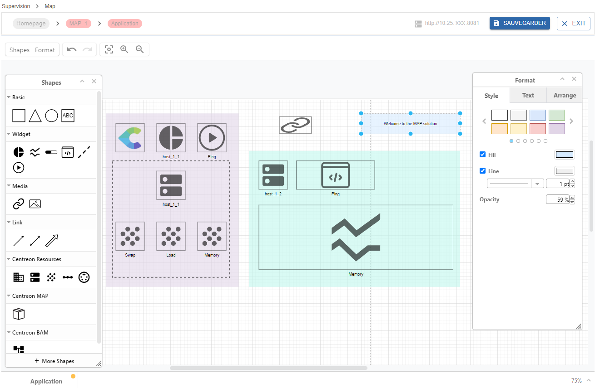

Centreon MAP est une solution intégralement disponible dans l'interface web Centreon tout en vous proposant la meilleure expérience possible pour créer, visualiser et partager des représentations graphiques de votre infrastructure supervisée.

Contrairement à la version MAP (Legacy), MAP vous fournit un outil d'édition entièrement intégré à l'interface web Centreon. Vous n'avez pas besoin d'installer quoi que ce soit sur votre machine. Vous pouvez également naviguer facilement entre le mode édition et le mode de visualisation.

> Si vous êtes déjà utilisateur de MAP (Legacy), notez que vous pouvez aisément [importer vos anciennes cartes](import-into-map-web.md) dans l'interface MAP.

> Vous pouvez consulter la procédure de gestion des vues à l'aide de l'API REST de Centreon MAP [ici](https://docs-api.centreon.com/api/centreon-map/24.04/).

## Aperçu de l'interface

Créez, personnalisez et visualisez vos cartes au sein d'une unique interface web.

Vous devez d'abord créer vos vues logiques à l'aide de l'éditeur MAP :

Vous pouvez ensuite visualiser votre carte directement dans le mode de visualisation :

Vos cartes peuvent être affichées de deux façons dans l'interface :
- Dans la page **Supervision > Map**, en mode visualisation.
- Dans la page **Accueil > Vues personnalisées**, en utilisant un [widget](../alerts-notifications/custom-views.md) MAP dédié.

## Procédures

Les procédures suivantes permettent de gérer et d'utiliser Centreon MAP.

### Gérer MAP
  - [Installer MAP](map-web-install.md) décrit les prérequis et les procédures d'installation de MAP.
  - [Installer MAP sur un serveur distant](map-web-install-remote.md) explique comment installer MAP sur un serveur distant.
  - [Mettre à jour MAP](map-web-update.md) décrit la procédure de mise à jour de MAP.
  - [Passer de MAP (Legacy) à MAP](import-into-map-web.md) explique comment migrer vos anciennes cartes vers l'interface MAP.
  - [Gérer les droits d'accès dans MAP](map-web-manage.md) décrit les différents droits et permissions sur les cartes.
  - [Problèmes connus dans MAP](map-web-known-issues.md) est une liste d'incidents que vous pouvez rencontrer en utilisant MAP.
  - [Dépannage de MAP](map-web-troubleshooting.md) vous aide à résoudre certains incidents survenant dans MAP.

### Utiliser MAP
  - [Gérer les cartes dans MAP](map-web-manage.md) vous donne des informations sur la manière de gérer des cartes à partir de l'interface Centreon MAP.
  - [Créer une carte standard](map-web-create-standard-map.md) décrit comment créer des cartes standard et comment les personnaliser à l'aide de l'éditeur MAP.
  - [Créer une vue géographique](map-web-create-geoview.md) explique comment afficher vos ressources dans une zone géographique définie.
