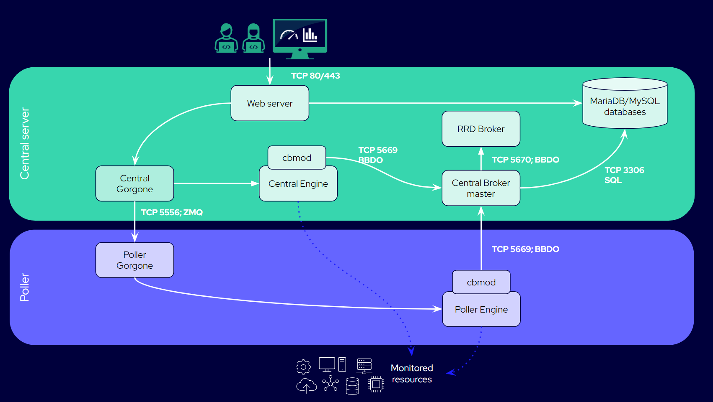

import Tabs from '@theme/Tabs';
import TabItem from '@theme/TabItem';

Voici une présentation des briques qui font marcher Centreon. Pour savoir sur quel port communique chaque brique, voir les [Tableaux des flux réseau](https://docs.centreon.com/fr/docs/installation/technical/#tableaux-des-flux-réseau).

## Schéma d'un serveur central

<Tabs groupId="sync">
<TabItem value="Serveur central avec collecteur" label="Serveur central avec collecteur">

Dans cet exemple, nous avons un serveur central (sans modules Business installés), et un collecteur qui lui est directement rattaché.

</TabItem>
</Tabs>

## Éléments d'un Centreon

### Engine

* **Engine**, (le moteur de supervision, c'est-à-dire le processus **centengine**) est le cœur de Centreon: il planifie les contrôles, les exécute, et [envoie des notifications aux utilisateurs](https://docs.centreon.com/fr/docs/alerts-notifications/notif-concept) lorsqu'un incident se produit.
* Les contrôles et les notifications sont effectués suivant la configuration faite par les utilisateurs.
* Centreon Engine est présent sur chaque serveur dans votre [architecture](https://docs.centreon.com/fr/docs/installation/architectures): [collecteurs, serveurs distants, ainsi que le serveur central](https://docs.centreon.com/fr/docs/platform).
* Pour configurer Engine, allez à la page **Configuration > Collecteurs > Configuration de Centreon Engine**. Cette page est réservée aux utilisateurs aguerris.

### cbmod

* Le module jumeau d'Engine, **cbmod**, transforme les évènements Engine en évènements Broker, et envoie toutes les données à Broker.
* Le mot évènement désigne les résultats de contrôles, une [plage de maintenance](https://docs.centreon.com/fr/docs/alerts-notifications/downtimes), un [acquittement](https://docs.centreon.com/fr/docs/alerts-notifications/acknowledge), un changement dans la configuration.
* **cbmod** est un type de [broker](#broker)et peut être configuré comme tout Broker à la page **Configuration > Collecteurs > Configuration de Centreon Broker**.

### Broker

* Il existe en réalité 2 Brokers: 1 **master Broker** et 1 **Broker RRD**.
* Seuls le serveur central et les serveurs distants contiennent des Brokers.
* Engine envoie les données au master Broker:
   * Le master Broker écrit les données dans les [bases MariaDB/MySQL](#a-mariadbmysql-database).
   * Le master Broker envoie une copie des [métriques](https://docs.centreon.com/fr/docs/monitoring/metrics) et des [statuts](https://docs.centreon.com/fr/docs/alerts-notifications/concepts) au Broker RRD afin qu'il les écrive dans la [base de données RRD](#a-rrd-databaserrd-files).
* Les données sont envoyées au [format BBDO](https://docs.centreon.com/fr/docs/developer/developer-broker-bbdo/).
* Chaque Broker a des entrées (inputs) et des sorties (outputs) que vous pouvez configurer. Par défaut, Broker est principalement installé avec des entrées et sorties IPv4 (en réalité, une sortie IPv4 vers la base RRD et une sortie Unified SQL vers la base de données MariaDB/MySQL). Cependant, il est recommandé de configurer un client et un serveur BBDO entre Engine et le master Broker, car cette configuration est plus simple.
* Pour configurer un Broker, utlisez la page **Configuration > Collecteurs > Configuration de Centreon Broker**.
* Si vous décidez que votre master Broker doit [recevoir les données en HTTPS](https://docs.centreon.com/fr/docs/monitoring/monitoring-servers/advanced-configuration/#authentification-avec-centreon-broker), alors vous devez configurer également en HTTPS chaque Engine qui communique avec ce Broker.

Voir aussi :

* [Centreon Broker dans la section Ressources développeur](https://docs.centreon.com/fr/docs/developer/developer-centreon-broker).
* [Configuration avancée de Centreon Broker](https://docs.centreon.com/fr/docs/monitoring/monitoring-servers/advanced-configuration/#pour-aller-plus-loin-avec-centreon-broker).

### Gorgone

* **Gorgone** est présent sur le serveur central, sur vos serveurs distants et sur vos collecteurs.
* Gorgone permet à l'interface de parler à l'Engine du serveur central, et de parler aux Engines de vos serveurs distants et de vos collecteurs, synchronisant les données entre eux.
* Les données de configuration sont transférées depuis le central vers les engines des collecteurs et des serveurs distants au format ZMQ.
* Quand vous [déployez la configuration](https://docs.centreon.com/fr/docs/monitoring/monitoring-servers/deploying-a-configuration), Gorgone prend les fichiers générés et les copie sur tous les engines des collecteurs et des serveurs distants, et redémarre ceux-ci.

Voir aussi : [Centreon Gorgone dans la section Ressources développeur](https://docs.centreon.com/fr/docs/developer/developer-centreon-gorgone).

### Une base de données MariaDB/MySQL

La base de données MariaDB/MySQL contient 2 bases :

   * **centreon**, qui contient la configuration (c'est-à-dire tous les objets créés par les utilisateurs : hôtes, services, etc).
   * **centreon_storage**, qui contient toutes les données temps réel reçues par Broker : données de performance ([métriques](https://docs.centreon.com/fr/docs/monitoring/metrics)), [statuts](https://docs.centreon.com/fr/docs/alerts-notifications/concepts) et [états](https://docs.centreon.com/fr/docs/alerts-notifications/concepts/#states) et la date et l'heure de tout changement, ainsi que les acquittements et les plages de maintenance.

La base de données MariaDB ou MySQL peut être intégrée à votre serveur central, ou bien [déportée](https://docs.centreon.com/fr/docs/installation/architectures/#sgbd-déporté).

### Une base de données RRD (fichiers RRD)

Les fichiers RRD contiennent les données de performance (métriques) et les statuts, et servent à générer les graphiques que vous voyez à la page **Statut des ressources**.
Les métriques et les statuts stockés ici sont une copie de ceux stockés dans la base **centreon_storage** (les RRD sont utilisés pour des raisons de performances). Si vous avez perdu vos graphes pour une raison ou pour une autre, vous pouvez [reconstruire votre base RRD](https://docs.centreon.com/fr/docs/administration/backup/#reconstruction-des-graphiques) depuis la base **centreon_storage**.

### Un serveur web

Le serveur web (processus **httpd**) présente l'interface graphique aux utilisateurs. Elle envoie les évènements à la base MariaDB/MySQL, et à Gorgone.

## Exemple: que se passe-t-il lorsqu'un hôte est créé ?

1. Un utilisateur crée un hôte dans l'interface du serveur central (via la page **Configuration > Hôtes > Hôtes**).
2. La configuration est écrite en 2 endroits :
   * **httpd** envoie la configuration de l'hôte à la base **centreon** (dans MariaDB ou MySQL).
   * Gorgone??
3. L'utilisateur [déploie la configuration](https://docs.centreon.com/fr/docs/monitoring/monitoring-servers/deploying-a-configuration):
   * Gorgone prend les fichiers générés et les copie sur tous les engines de tous les collecteurs et des serveurs distants, et relance ceux-ci.
