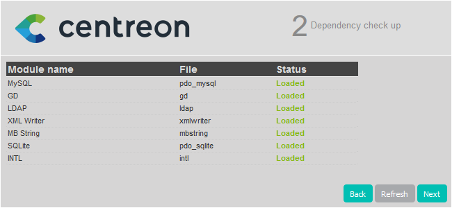
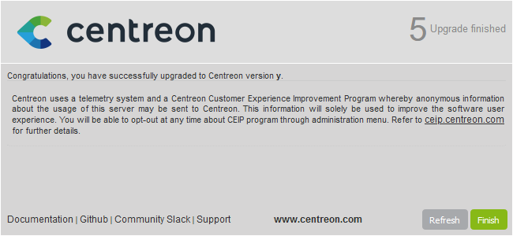

import Tabs from '@theme/Tabs';
import TabItem from '@theme/TabItem';

Ce chapitre décrit la procédure de mise à jour de votre plate-forme Centreon
24.04 (c'est-à-dire le passage de 24.04.x à 24.04.y).

## Sauvegarde

Avant toute chose, il est préférable de s’assurer de l’état et de la consistance
des sauvegardes de l’ensemble des serveurs centraux de votre plate-forme :

- Serveur Centreon Central,
- Serveur de gestion de base de données.

## Mise à jour du serveur Centreon Central

### Mise à jour de la solution Centreon

Assurez-vous que tous les utilisateurs sont déconnectés avant de commencer la procédure de mise à jour.

<Tabs groupId="sync">
<TabItem value="Alma / RHEL / Oracle Linux 8" label="Alma / RHEL / Oracle Linux 8">

Videz le cache :

  ```shell
  dnf clean all --enablerepo=*
  ```

Mettez à jour l'ensemble des composants :

  ```shell
  dnf update centreon\*
  ```

</TabItem>
<TabItem value="Alma / RHEL / Oracle Linux 9" label="Alma / RHEL / Oracle Linux 9">

Videz le cache :

  ```shell
  dnf clean all --enablerepo=*
  ```

Mettez à jour l'ensemble des composants :

  ```shell
  dnf update centreon\*
  ```

</TabItem>
<TabItem value="Debian 11 & 12" label="Debian 11 & 12">

Videz le cache :

  ```shell
  apt clean
  apt update
  ```

Mettez à jour l'ensemble des composants :

  ```shell
  apt upgrade centreon
  ```

</TabItem>
</Tabs>

Vous devez maintenant finaliser la mise à jour :

<Tabs groupId="sync">
<TabItem value="Avec l'assistant d'interface" label="Avec l'assistant d'interface">

1. Connectez-vous à l'interface web Centreon pour démarrer le processus de
mise à jour. Cliquez sur **Next** :

  

2. Cliquez sur **Next** :

  

3. La note de version présente les principaux changements, cliquez sur **Next** :

  

4. Le processus réalise les différentes mises à jour, cliquez sur **Next** :

  

5. Votre serveur Centreon est maintenant à jour, cliquez sur **Finish** pour
accéder à la page de connexion :

  

  > Si le module Centreon BAM est installé, référez-vous à la [documentation associée](../service-mapping/update.md) pour le mettre à jour.

6. Déployez ensuite la configuration du Central depuis l'interface web en
suivant [cette
procédure](../monitoring/monitoring-servers/deploying-a-configuration.md).

</TabItem>
<TabItem value="Avec l'API dédiée" label="Avec l'API dédiée">

1. Connectez-vous au serveur Central via le terminal pour poursuivre le processus de
mise à jour.

  > Vous avez besoin d'un token d'authentification pour accéder à l'endpoint de l'API. Suivez la procédure ci-dessous pour obtenir un token.

  Dans notre cas, nous avons la configuration décrite ci-dessous (vous devez adapter la procédure à votre configuration).

   - adresse : 10.25.XX.XX
   - port : 80
   - version : 24.04
   - identifiant : Admin
   - mot de passe : xxxxx

2. Entrez la requête suivante :

  ```shell
  curl --location --request POST '10.25.XX.XX:80/centreon/api/v24.04/login' \
  --header 'Content-Type: application/json' \
  --header 'Accept: application/json' \
  --data '{
    "security": {
      "credentials": {
        "login": "Admin",
        "password": "xxxxx"
      }
    }
  }'
  ```

  Voici à quoi ressemble le résultat :

  ```shell
  {"contact":{"id":1,"name":"Admin Centreon","alias":"admin","email":"admin@localhost",  "is_admin":true},"security":{"token":"hwwE7w/ukiiMce2lwhNi2mcFxLNYPhB9bYSKVP3xeTRUeN8FuGQms3RhpLreDX/S"}}
  ```

3. Récupérez le numéro du token pour l'utiliser lors de la prochaine requête.

4. Entrez ensuite cette requête :

  ```shell
  curl --location --request PATCH 'http://10.25.XX.XX:80/centreon/api/latest/platform/updates' \
  --header 'X-AUTH-TOKEN: hwwE7w/ukiiMce2lwhNi2mcFxLNYPhB9bYSKVP3xeTRUeN8FuGQms3RhpLreDX/S' \
  --header 'Content-Type: application/json' \
  --data '{
      "components": [
          {
              "name": "centreon-web"
          }
      ]
  }'
  ```

5. Cette requête ne renvoie aucun résultat. Pour vérifier que la mise à jour a bien été appliquée, consultez le numéro de version affiché sur la page de connexion à l'interface web Centreon.

</TabItem>
</Tabs>

Enfin, redémarrez Broker, Engine et Gorgone sur le serveur Central en exécutant la commande suivante :

  ```shell
  systemctl restart cbd centengine gorgoned
  ```

### Mise à jour des extensions

Depuis le menu **Administration > Extensions > Gestionnaire**, mettez à jour
toutes les extensions, en commençant par les suivantes :

- License Manager,
- Gestionnaire de connecteurs de supervision,
- Auto Discovery.

Vous pouvez alors mettre à jour toutes les autres extensions commerciales.

## Mise à jour des Remote Servers

Cette procédure est identique à la mise à jour d'un serveur Centreon Central.

> En fin de mise à jour, la configuration doit être déployée depuis le serveur
> Central.

## Mise à jour des collecteurs

<Tabs groupId="sync">
<TabItem value="Alma / RHEL / Oracle Linux 8" label="Alma / RHEL / Oracle Linux 8">

1. Videz le cache :

  ```shell
  dnf clean all --enablerepo=*
  ```

2. Mettez à jour l'ensemble des composants :

  ```shell
  dnf update centreon\* --exclude=centreon-plugin*
  ```

</TabItem>
<TabItem value="Alma / RHEL / Oracle Linux 9" label="Alma / RHEL / Oracle Linux 9">

1. Videz le cache :

  ```shell
  dnf clean all --enablerepo=*
  ```

2. Mettez à jour l'ensemble des composants :

  ```shell
  dnf update centreon\* --exclude=centreon-plugin*
  ```

</TabItem>
<TabItem value="Debian 11 & 12" label="Debian 11 & 12">

1. Videz le cache :

  ```shell
  apt clean
  apt update
  ```

2. Mettez à jour l'ensemble des composants :

  ```shell
  apt-get update && apt-mark hold centreon-pack* && apt-mark hold centreon-plugin* && apt-get install --only-upgrade 'centreon*' 
  ```

</TabItem>
</Tabs>

  > Acceptez les nouvelles clés GPG des dépôts si nécessaire.

3. Déployez la configuration du collecteur depuis l'interface web en suivant [cette
procédure](../monitoring/monitoring-servers/deploying-a-configuration.md), et
en choisissant la méthode **Redémarrer** pour le processus Engine.

4. Redémarrez enfin le service Gorgone s'il est utilisé sur le collecteur :

  ```shell
  systemctl restart centengine gorgoned
  ```

5. Exécutez la commande suivante :

<Tabs groupId="sync">
<TabItem value="Alma / RHEL / Oracle Linux 8" label="Alma / RHEL / Oracle Linux 8">

Rien à faire pour cet OS.

</TabItem>
<TabItem value="Alma / RHEL / Oracle Linux 9" label="Alma / RHEL / Oracle Linux 9">

Rien à faire pour cet OS.

</TabItem>
<TabItem value="Debian 11 & 12" label="Debian 11 & 12">

  ```shell
  apt-mark unhold centreon-pack* && apt-mark unhold centreon-plugin*
  ```

</TabItem>
</Tabs>

## Mise à jour silencieuse

Vous pouvez réaliser une mise à jour silencieuse de votre plateforme en utilisant le script **unattended.sh**.

1. Téléchargez le script avec la commande suivante :

```shell
curl -L https://download.centreon.com/24.04/unattended.sh -O /tmp/unattended
```

2. Lancez le script :

* Pour un serveur central :

```shell
bash unattended.sh update -t central -v 24.04 -r stable -s -p<my_admin_password> -l DEBUG  2>&1 |tee -a /tmp/unattended-$(date +"%m-%d-%Y-%H%M%S").log
```

* Pour un serveur distant :

```shell
bash unattended.sh update -t central -v 24.04 -r stable -s -p<my_admin_password> -l DEBUG  2>&1 |tee -a /tmp/unattended-$(date +"%m-%d-%Y-%H%M%S").log
```

* Pour un collecteur :

```shell
bash unattended.sh update -t poller -v 24.04 -r stable -l DEBUG  2>&1 |tee -a /tmp/unattended-$(date +"%m-%d-%Y-%H%M%S").log
```
