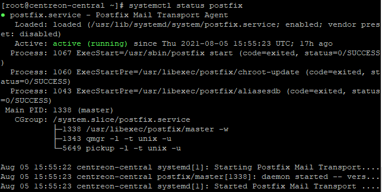

import Tabs from '@theme/Tabs';
import TabItem from '@theme/TabItem';

Pour que votre Centreon puisse envoyer des emails de notification, un serveur smtp local doit être configuré.

Cette page donne un exemple de configuration. Consultez la  [documentation officielle Postfix](https://www.postfix.org/BASIC_CONFIGURATION_README.html) pour plus d'informations.

Si votre système d'exploitation est RHEL ou Oracle Linux, Postfix est déjà installé.

Les commandes de notifications sont exécutées par le collecteur qui supervise la ressource : il est nécessaire de configurer le relais mail sur tous les collecteurs.

Nous vous recommandons d'utiliser un compte mail dédié à l'envoi des notifications.

## Étape 1 : Configurer Postfix

1. Dans le terminal de votre serveur, entrez la commande suivante :

<Tabs groupId="sync">
<TabItem value="Alma 8" label="Alma 8">

``` shell
dnf install postfix mailx cyrus-sasl-plain
```

</TabItem>
<TabItem value="Alma 9" label="Alma 9">

``` shell
dnf install postfix mailx cyrus-sasl-plain
```

</TabItem>
<TabItem value="RHEL / Oracle Linux 8" label="RHEL / Oracle Linux 8">

``` shell
dnf install mailx cyrus-sasl-plain
```

</TabItem>
<TabItem value="RHEL / Oracle Linux 9" label="RHEL / Oracle Linux 9">

``` shell
dnf install s-nail cyrus-sasl-plain
```

</TabItem>
<TabItem value="Debian 12" label="Debian 12">

``` shell
apt install postfix bsd-mailx
```

</TabItem>
</Tabs>

2. Redémarrez Postfix : 

    ```shell
    systemctl restart postfix
    ```

3. Configurez Postfix pour qu'il s'exécute au démarrage :

    ```shell
    systemctl enable postfix
    ```

3. Éditez le fichier suivant :

    ```shell
    vi /etc/postfix/main.cf
    ```

4. Ajoutez les informations suivantes :

    ```shell
    myhostname = hostname
    relayhost = [smtp.isp.com]:port
    smtp_use_tls = yes
    smtp_sasl_auth_enable = yes
    smtp_sasl_password_maps = hash:/etc/postfix/sasl_passwd
    smtp_tls_CAfile = /etc/ssl/certs/ca-bundle.crt
    smtp_sasl_security_options = noanonymous
    smtp_sasl_tls_security_options = noanonymous
    ```
    
    - Le paramètre **myhostname** est le hostname du serveur Centreon.
    - Le paramètre **relayhost** correspond au serveur de messagerie du compte qui enverra les emails.

    Dans l'exemple suivant, Centreon utilisera un compte Gmail pour envoyer les notifications :

    ```shell
    myhostname = centreon-central
    relayhost = [smtp.gmail.com]:587
    smtp_use_tls = yes
    smtp_sasl_auth_enable = yes
    smtp_sasl_password_maps = hash:/etc/postfix/sasl_passwd
    smtp_tls_CAfile = /etc/ssl/certs/ca-bundle.crt
    smtp_sasl_security_options = noanonymous
    smtp_sasl_tls_security_options = noanonymous
    ```

## Étape 2 : Configurer les identifiants du compte qui enverra les emails

1. Créez un fichier `/etc/postfix/sasl_passwd` :

    ```shell
    touch /etc/postfix/sasl_passwd
    ```

2. Ajoutez la ligne suivante, en remplaçant `identifiant:motdepasse` par les informations de connexion du compte qui enverra les emails de notification :

    ```shell
    [smtp.fai.com]:port identifiant:motdepasse
    ```

    Exemple:

    ```shell
    [smtp.gmail.com]:587 username@gmail.com:XXXXXXXX
    ```

3. Enregistrez le fichier.

3. Dans le terminal, entrez la commande suivante :

    ```shell
    postmap /etc/postfix/sasl_passwd
    ```

4. Pour plus de sécurité, changez les permissions sur le fichier `sasl_passwd` :

    ```shell
    chown root:postfix /etc/postfix/sasl_passwd*
    chmod 640 /etc/postfix/sasl_passwd*
    ```

3. Rechargez Postfix pour prendre en compte les modifications:

    ```shell
    systemctl reload postfix
    ```

## Dépanner l'envoi d'emails avec Postfix

- Pour envoyer un email de test, utilisez la commande suivante :

    ```shell
    echo "Test" | mail -s "Test" utilisateur@fai.com
    ```

    Remplacez `utilisateur@fai.com` par une véritable adresse email : le destinataire devrait recevoir l'email de test.

- Si le destinataire n'a pas reçu l'email, vérifiez le fichier de log suivant :

<Tabs groupId="sync">
<TabItem value="Alma / RHEL / Oracle Linux 8" label="Alma / RHEL / Oracle Linux 8">

    ```shell
    tail -f /var/log/maillog
    ```
</TabItem>
<TabItem value="Alma / RHEL / Oracle Linux 9" label="Alma / RHEL / Oracle Linux 9">

    ```shell
    tail -f /var/log/maillog
    ```
</TabItem>
<TabItem value="Debian 11 & 12" label="Debian 11 & 12">

    ```shell
    tail -f /var/log/mail.log
    ```
</TabItem>
</Tabs>


- Pour vérifier si votre service Postfix tourne, entrez:

    ```shell
    systemctl status postfix
    ```

    Le résultat devrait ressembler à ça :

    

## Configuration spécifique à Gmail

Pour utiliser Postfix avec Gmail, vous devez utiliser un [mot de passe d'application](https://support.google.com/mail/answer/185833?hl=fr).
