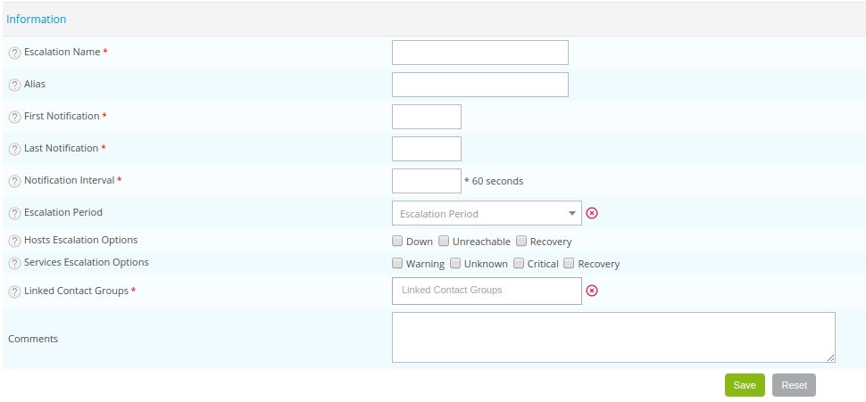

## Definition

D'une manière générale, en cas de déclenchement d'une alerte, une
notification permet de contacter un ou plusieurs contacts (ou groupes de
contacts). De même, il est possible d'envoyer plusieurs notifications
suivant un intervalle de temps régulier.

Une escalade de notifications permet de contacter différents groupes de
contacts au fil des notifications envoyées ou de changer le moyen de
notification (remplacer les mails par un SMS). La définition d'une
escalade de notification pour un hôte, un groupe d'hôte, un service, un
groupe de services ou un méta-service écrase la configuration classique
des notifications pour cet objet.

Exemple : Un service A est paramétré pour envoyer des notifications à un
groupe de contacts “A” en cas de statut non-OK. Ces notifications sont
envoyées toutes les 5 minutes. Si pendant un certain nombre de
notifications envoyées le statut du service est toujours en non-OK, il
est possible de contacter les individus du groupe de contacts “B” etc…

Les escalades de notifications sont pratiques dans les cas où il existe
dans une société une équipe de support de niveau 1, niveau 2, niveau 3…
Lorsqu'un problème survient l'équipe de support niveau 1 est contactée.
Si pendant un certain temps l'équipe niveau 1 n'a pas réussi à résoudre
le problème, l'équipe niveau 2 est avertie etc…

## Principe

Les escalades de notifications permettent deux choses :

-   Notifier des contacts différents en fonction du nombre de
    notifications envoyées
-   Changer de moyens de notifications au cours du temps

En cas d'utilisation des escalades de notifications, la récupération de
la liste de contact est quelque peu différente :

1.  Un service (ou un hôte) est vérifié à intervalle régulier en
    fonction de la période temporelle de vérification définie pour lui
2.  Lorsqu'une anomalie survient (statut non-OK), le service (ou l'hôte)
    passe en état SOFT
3.  Après que le nombre maximum de vérifications avant validation de
    l'état ait eu lieu, si le service (ou l'hôte) persiste en conservant
    son statut non-OK son état passe de SOFT à HARD. Le moteur de
    supervision met en cache le numéro de la notification pour le
    service (ou l'hôte) : c'est à dire 0.

A chaque intervalle d'envoi de notification pour le service (ou l'hôte)
et jusqu'à la fin du statut non-OK le moteur de supervision réalise les
opérations suivantes :

1.  Si aucune escalade de notification n'est définie pour le service (ou
    l'hôte) et le numéro actuel de notification, alors le traitement de
    la notification est fait de la même manière que pour une
    notification classique : le moteur de supervision utilise la
    configuration de notifications définie pour le service (ou l'hôte).
2.  Si une escalade de notification est définie pour le service (ou
    l'hôte) et le numéro actuel de notification, alors le moteur de
    supervision se base sur la configuration de l'escalade afin de
    sélectionner les contacts à notifier et les moyens à utiliser.
3.  Le mécanisme de traitement d'une notification est le même que pour
    l'envoi d'une notification normale

## Configuration

Pour ajouter une escalade de notification, rendez-vous dans le menu
`Configuration > Notifications > Escalations` et cliquez sur **Add**

-   Les champs **Escalation Name** et **Alias** permettent de définir un
    nom et un alias à l'escalade de notifications.
-   Le champ **First Notification** permet de choisir le numéro de la
    notification à partir de laquelle le groupe de contacts sera averti.
-   Le champ **Last Notification** permet de choisir le dernier numéro
    de la notification pour lequel ce groupe de contacts sera averti. Si
    le groupe de contacts est le dernier niveau de l'escalade. La valeur
    de ce champ est **0**.
-   Le champ **Notification Interval** définit l'intervalle de
    notifications entre chaque alerte.
-   Le champ **Escalation Period** définit la période temporelle de
    notifications.
-   Les champs **Hosts Escalation Options** et **Services Escalation
    Options** définissent les statuts d'hôtes et de services pour
    lesquels l'escalade est utilisée.
-   La liste **Linked Contact Groups** définit le groupe de contacts à
    contacter lors du déclenchement de l'escalade.
-   Le champ **Comments** permet de commenter l'escalade.

### Application de l'escalade

Pour sélectionner les différents objets qui seront concernés par cette
escalade, les onglets **Hosts Escalation**, **Services Escalation**,
**Hostgroups Escalation**, **Meta Service Escalation** et
**Servicegroups Escalation** permettent de choisir les objets sur
lesquels les escalades sont appliquées.
