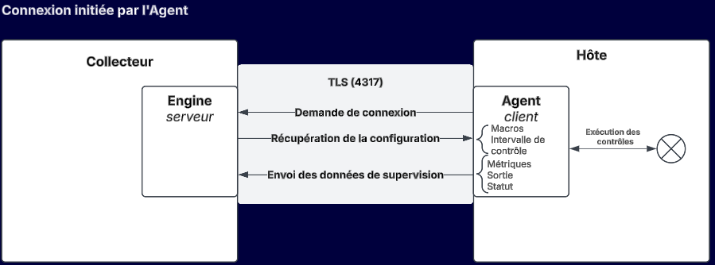
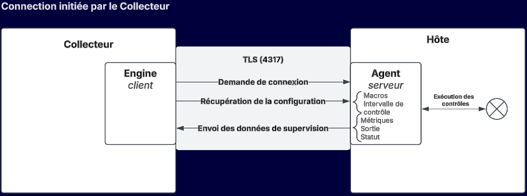

import Tabs from '@theme/Tabs';
import TabItem from '@theme/TabItem';

## Introduction

L'agent de supervision Centreon (Centreon Monitoring Agent, CMA) est un logiciel qu'on installe sur les hôtes à superviser : il collecte des métriques et calcule des statuts, et les envoie à Centreon.

L'agent peut exécuter des contrôles natifs ou utiliser des plugins Centreon pour exécuter des contrôles non natifs. Les contrôles natifs sont exécutés directement par l'agent (contrairement aux contrôles non natifs, qui nécessitent l'installation de plugins locaux sur l'hôte). Les contrôles natifs sont plus performants et ont une meilleure empreinte (réduction de l'utilisation du processeur et de la mémoire).

Les contrôles natifs et non natifs sont définis dans les connecteurs **Linux Centreon Monitoring Agent** et **Windows Centreon Monitoring Agent**. Les connecteurs fournissent des modèles qui contiennent des commandes prêtes à l'emploi, et l'agent récupère la configuration de ces contrôles à intervalles réguliers après l'établissement de la connexion.

L'agent effectue les contrôles (pour les contrôles non natifs, en utilisant les plugins locaux) et envoie les données au collecteur. La partie du moteur du collecteur qui reçoit les données de l'agent est appelée récepteur OTLP (OTLP signifie OpenTelemetry protocol).

Les plugins Centreon comme les plugins personnalisés basés sur Nagios sont compatibles avec l'agent.

## Quand utiliser un agent ?

Utilisez l'agent CMA :

* lorsque les politiques de sécurité n'autorisent que les flux sortants (aucun contrôle ne peut être effectué par les collecteurs, le SNMP n'est pas autorisé).
* sur les sites qui n'ont pas de collecteur local.
* lorsque vous avez besoin d'exécuter un script localement sur la machine supervisée pour des raisons de sécurité (droits et/ou protocoles) ou de performance.

## OS supervisables par CMA

L'agent peut être installé sur et superviser les OS suivants :

<Tabs groupId="sync">
<TabItem value="Linux" label="Linux">

* RHEL/Oracle Linux/Alma Linux 8
* RHEL/Oracle Linux/Alma Linux 9
* RHEL/Oracle Linux/Alma Linux 10
* Debian 11
* Debian 12
* Debian 13
* Ubuntu 22.04/24.04 LTS

</TabItem>
<TabItem value="Windows" label="Windows">

* Windows 10
* Windows 11
* Windows Server 2016
* Windows Server 2019
* Windows Server 2022
* Windows Server 2025

</TabItem>
</Tabs>

## Applications supervisables par CMA

* Inclus dans les connecteurs Centreon :

   * [**Hitachi E Series**](/pp/integrations/plugin-packs/procedures/hardware-storage-hitachi-eseries-cma)
   * [**Hyper-V 2012**](/pp/integrations/plugin-packs/procedures/virtualization-hyperv-2012-cma)
   * [**Linux**](/pp/integrations/plugin-packs/procedures/operatingsystems-linux-centreon-monitoring-agent)
   * [**Linux Libvirt**](/pp/integrations/plugin-packs/procedures/virtualization-linux-libvirt-cma)
   * [**Microsoft Active Directory**](/pp/integrations/plugin-packs/procedures/infrastructure-active-directory-centreon-monitoring-agent)
   * [**Microsoft Cluster Server**](/pp/integrations/plugin-packs/procedures/applications-mscs-cma)
   * [**Microsoft Exchange**](/pp/integrations/plugin-packs/procedures/applications-exchange-cma)
   * [**Microsoft SCCM**](/pp/integrations/plugin-packs/procedures/applications-sccm-cma)
   * [**Microsoft WSUS**](/pp/integrations/plugin-packs/procedures/applications-wsus-cma)
   * [**Veeam**](/pp/integrations/plugin-packs/procedures/applications-veeam-centreon-monitoring-agent)
   * [**Windows**](/pp/integrations/plugin-packs/procedures/operatingsystems-windows-centreon-monitoring-agent).

* Vous pouvez également [développer vos propres plugins](cma-custom.md).

## Comment interagissent le collecteur et l'hôte?

### Sens de connexion

Suivant le cas, soit l'agent soit le collecteur initie la connexion.
> Attention, le fonctionnement des 2 sens de connexion décrit ci-dessous ne concerne que l'établissement de la connexion. 
> Une fois celle-ci établie, le comportement de l'agent (planification des contrôles, remontée d'information) et du collecteur (alertes, envoi de la configuration) sont strictement identiques et la connexion est bidirectionnelle.

* Dans le cas d'une **connexion initiée par l'agent**, le collecteur écoute sur un port spécifique, et peut recevoir des données de n agents/hôtes. Il s'agit du mode par défaut, qui permet une configuration dynamique des agents (on peut ajouter ou retirer des agents sans changer la configuration côté collecteur).
* Vous pouvez également opter pour une **connexion initiée par le collecteur**. Ceci est pertinent dans le cas où, par exemple, l'agent n'est pas autorisé à se connecter au collecteur pour des raisons de sécurité (par exemple, lorsque l'hôte se trouve dans une DMZ). Vous devez déclarer chaque agent auquel le collecteur devra se connecter, dans le menu **Configuration > Collecteur > Configuration d'agent**.

Les deux sens de connexion peuvent être combinés au sein d'un même collecteur, en fonction de la typologie de votre parc supervisé.

<!--You can use both types of communication at the same time (for different hosts).-->

### Sécurisation de la connexion

La connexion entre le collecteur et l'agent doit être sécurisée en production. Vous devez utiliser :

- [une connexion TLS avec certificats](cma-certificates.md)
- [un jeton d'authentification](cma-setup.md#créez-un-jeton-dauthentification).

<!-- 2 options are possible:-->
<!--* TLS: the certificate is signed by a certification authority and the Common Name (CN) is verified.
* TLS insecure: the certification authority and Common Name are not verified (self-signed certificates can be used).-->

### Compatibilité entre les versions de l'agent et du collecteur

À partir de la version 25.10, la sécurisation de la connexion entre l'agent et le collecteur est renforcée : un jeton d'authentification valide est obligatoire dès que l'un des deux composants (l'agent ou le collecteur/la plateforme) est en version 25.10 ou supérieure. En version 24.10, les connexions sans jeton restent tolérées à titre transitoire.

Si vous exploitez un parc avec des agents et des collecteurs de versions différentes (par exemple lors d'une montée de version progressive), le comportement dépend de la version de chaque composant :

| Agent | Collecteur / plateforme | Sans jeton d'authentification | Avec jeton d'authentification valide |
|---|---|---|---|
| 24.10 | 24.10 | Autorisé (comportement transitoire) | Fonctionne |
| 25.10 | 24.10 | Autorisé (comportement transitoire) | Fonctionne |
| 24.10 | 25.10 | **Refusé** par le collecteur | Fonctionne |
| 25.10 | 25.10 | **Refusé** par le collecteur | Fonctionne |

> Nous vous recommandons de toujours configurer un jeton d'authentification, quelle que soit la version, afin d'éviter toute interruption de la supervision lors d'une montée de version de la plateforme.

Par ailleurs, certaines fonctionnalités de l'agent introduites en version 25.10 nécessitent un support côté Engine sur le collecteur, et ne fonctionnent donc que si l'agent **et** le collecteur sont tous les deux en version 25.10 ou supérieure :

| Fonctionnalité de l'agent (nouveauté 25.10) | Collecteur **25.10** + agent **24.10** | Collecteur **24.10** + agent **25.10** |
|---|:---:|:---:|
| Commandes personnalisées (`custom`) | ❌ | ✅ |
| Prise en compte des plages horaires de contrôle (timeperiods) | ❌ | ❌ |
| Gestion des tentatives SOFT/HARD (retry) | ❌ | ❌ |
| Chiffrement des identifiants (`encrypt::`) | ❌ | ❌ |
| Auto-enregistrement de l'hôte | ❌ | ❌ |
| Contrôle forcé (force check) | ❌ | ❌ |

Les contrôles natifs de base (CPU, mémoire, stockage, uptime, services Windows, journal d'événements, process, tâches planifiées, compteurs de performance, etc.) restent disponibles quelle que soit la combinaison de versions.

### Schéma de fonctionnement

<Tabs groupId="sync">
<TabItem value="L'agent se connecte au collecteur" label="L'agent se connecte au collecteur">

</TabItem>
<TabItem value="Le collecteur se connecte à l'agent" label="Le collecteur se connecte à l'agent">

</TabItem>
</Tabs>
