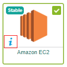
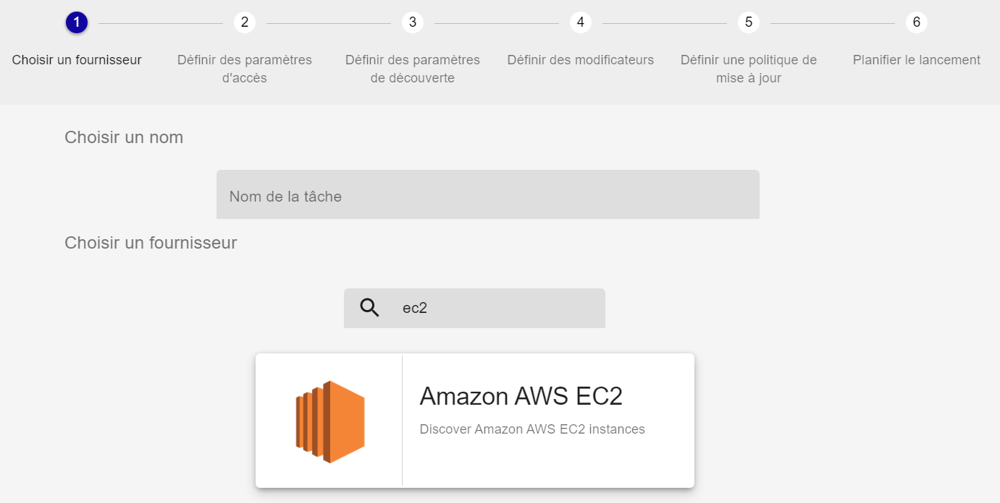

import Tabs from '@theme/Tabs';
import TabItem from '@theme/TabItem';

Dans ce tutoriel, nous allons utiliser le module [Autodiscovery](../monitoring/discovery/hosts-discovery.md) pour détecter des instances AWS EC2 et les mettre en supervision.

## Prérequis

Vous devez disposer :

- des informations d'identification pour le groupe d'instances AWS que vous souhaitez superviser (nom, AWS Access Key et AWS Secret Key)
- de la région dans laquelle se trouvent vos instances.

## Étape 1 : Installer le plugin Amazon EC2

1. Assurez-vous que votre [licence](../administration/licenses.md) commerciale ou votre licence gratuite [IT-100](it100.md) est installée.

2. [Installez](../monitoring/discovery/installation.md) le module d'autodécouverte.

3. Rendez les connecteurs de supervision disponibles :

    - Si vous avez une licence en ligne, les connecteurs de supervision sont déjà disponibles dans l'interface.
    - Si vous avez une licence hors ligne, dans le terminal de votre serveur central, entrez :
     
<Tabs groupId="sync">
<TabItem value="Alma / RHEL / Oracle Linux 8" label="Alma / RHEL / Oracle Linux 8">

``` shell
dnf install centreon-pack-*
```

</TabItem>
<TabItem value="Alma / RHEL / Oracle Linux 9" label="Alma / RHEL / Oracle Linux 9">

``` shell
dnf install centreon-pack-*
```

</TabItem>
<TabItem value="Debian 11 & 12" label="Debian 11 & 12">

```shell
apt install centreon-pack-*
```

</TabItem>

</Tabs>

4. Pour installer le connecteur de supervision Amazon EC2, allez à la page **Configuration > Gestionnaire de connecteurs de supervision**.

5. Dans le champ **Keyword**, entrez **Amazon EC2** puis cliquez sur **Rechercher**.

6. Cliquez sur le `+` dans le coin supérieur droit du connecteur de supervision. Le connecteur de supervision a maintenant une bordure verte et une coche dans le coin supérieur droit : les modèles de configuration et les fournisseurs de découverte sont maintenant installés.

7. Suivez [cette procédure](/monitoring-connectors/integrations/plugin-packs/procedures/cloud-aws-ec2)
 (sections [Plugin dependencies](/monitoring-connectors/integrations/plugin-packs/procedures/cloud-aws-ec2#plugin-dependencies) et 
[Setup](/monitoring-connectors/integrations/plugin-packs/procedures/cloud-aws-ec2#setup)) pour finir d'installer le connecteur de supervision. (Vous pouvez également accéder à la documentation d'un connecteur de supervision en cliquant sur le `i`.)

  

## Étape 2 : Configurer la tâche de découverte

1. Allez à la page **Configuration > Hôtes > Découverte**, puis cliquez sur **Ajouter**.

2. Entrez un nom pour votre tâche de découverte, puis sélectionnez le fournisseur **Amazon AWS EC2**. Cliquez sur **Suivant**.

    

3. Si votre infrastructure le demande, renseignez les détails du proxy désiré.

4. Cliquez sur le `+` à droite de la liste **Choisir des identifants**. Renseignez les champs nom, AWS Access Key et AWS Secret Key, 
puis cliquez sur **Confirmer**. Cliquez sur **Suivant**.

5. Entrez la région où se situent vos instances EC2 (par exemple, **eu-north-1**). Cliquez sur **Suivant**.

6. Éditez ou ajoutez des [modificateurs](../monitoring/discovery/hosts-discovery.md#comment-utiliser-les-modificateurs) :
    - Faites correspondre `host.name` à l'attribut `discovery.results.name`. Les noms de vos hôtes dans Centreon seront ceux définis dans cet attribut (c'est-à-dire le hostname de l'instance).
    - Dans notre exemple, nous allons exclure les instances dont le hostname contient "test".

    

    Cliquez sur **Suivant**.

7. Sélectionnez **Analyse manuelle** : nous devrons ajouter manuellement les hôtes à la liste des hôtes à superviser. Cliquez sur **Suivant**.

8. Sélectionnez **Exécuter immédiatement** puis cliquez sur **Finir**. La tâche de découverte apparaît dans la liste des tâches.
    
    

## Étape 3 : Sauvegarder les hôtes et les mettre en supervision

1. Après quelques secondes, rafraîchissez la page. Une coche verte devrait apparaître dans la colonne **Statut**.

    

2. Survolez la ligne correspondant à la tâche qui vient de se terminer puis cliquez sur **Afficher le résultat de la tâche** (l'icône flèche). Une liste d'hôtes apparaît.

    
    
    Des icônes vous permettent d'identifier l'action qui sera effectuée sur l'hôte :
   
   - L'icône **plus** signifie que cet hôte n’existe pas encore et sera créé.
   - L'icône **flèche** signifie que cet hôte existe déjà et sa configuration sera mise à jour.

3. Sélectionnez les hôtes que vous souhaitez ajouter à la liste des hôtes supervisés, puis cliquez sur **Enregistrer**. 

4. Allez à la page **Configuration > Hôtes > Hôtes** et vérifiez que les hôtes que vous avez sélectionnés à l'étape précedente apparaissent bien dans la liste. Attention, les hôtes ont été ajoutés à la liste des hôtes mais ils ne sont pas encore supervisés.

5. [Déployez la configuration](../monitoring/monitoring-servers/deploying-a-configuration.md). Les hôtes apparaissent à la page **Statut des ressources** : ils sont maintenant supervisés.

