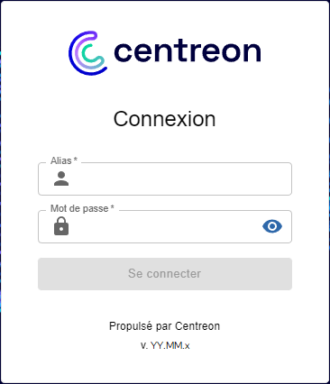
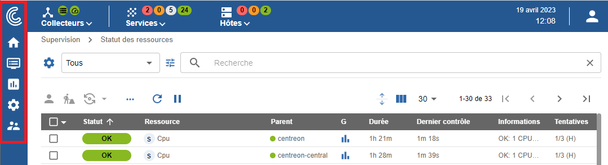
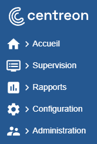
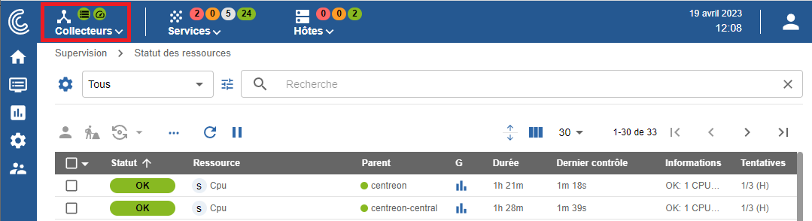
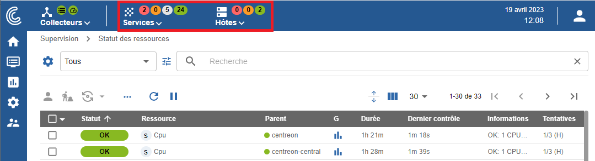

import Tabs from '@theme/Tabs';
import TabItem from '@theme/TabItem';

## Première connexion à l'interface

Pour vous connecter à l'interface web, rendez-vous à l'adresse : `http://ADRESSE_IP/centreon`.

> Remplacez **ADRESSE_IP** par l'adresse IP ou le FQDN du serveur web Centreon.

Renseignez le nom d'utilisateur et le mot de passe associé et cliquez sur le bouton **Se connecter** :

>Si vous avez installé Centreon depuis une [VM](../installation/installation-of-a-central-server/using-virtual-machines.md), les identifiants par défaut sont **admin/Centreon!123**.
Si ce n'est pas le cas, l'identifiant par défaut est **admin** et le mot de passe est celui que vous avez défini à [l'étape 5 de l'installation web](../installation/web-and-post-installation.md#étape-5--admin-information).

Vous êtes maintenant connecté à l'interface web Centreon.

## Menus

L'interface web de Centreon est composée de plusieurs menus, chaque menu a une fonction bien précise (cliquez sur le logo Centreon en haut à gauche de l'écran pour afficher les libellés) :

* Le menu **Accueil** affiche les [vues personnalisées](create-custom-view.md). Votre espace de travail peut être vide pour l'instant. Une fois que vous aurez configuré les widgets
  personnalisables, vous verrez les données et les graphiques en fonction de votre personnalisation.
* Le menu **Supervision** regroupe l'état de tous les éléments supervisés en temps réel et en différé au travers de la
  visualisation des logs.
* Le menu **Rapports** permet de visualiser de manière intuitive (via des diagrammes) l'évolution de la supervision sur
  une période donnée.
* Le menu **Configuration** permet de configurer l'ensemble des éléments supervisés ainsi que l'infrastructure de supervision.
* Le menu **Administration** permet de configurer la plateforme Centreon (authentification, proxy, extensions...) ainsi que de visualiser l'état général des serveurs.

## Bandeau supérieur

### Section Collecteurs

La partie gauche du bandeau supérieur montre la santé de votre plateforme en temps réel :

* Si tous les collecteurs sont en cours d'exécution ou non : l'icône devient rouge lorsqu'un collecteur n'a pas envoyé de données au serveur central depuis au moins 15 minutes.
* Si les contrôles sont en retard ou non. Si l'icône est orange ou rouge, cela peut indiquer que vos collecteurs supervisent de trop nombreuse ressources.

Cliquez sur l'icône **Collecteurs** pour développer le menu. Dans le menu, cliquez sur **Configurer les collecteurs** pour accéder à la page **Configuration > Collecteurs > Collecteurs**.

### Section hôtes et services ("top counters")

Dans le bandeau supérieur, à côté de la section Collecteurs, des statistiques indiquent le nombre de ressources supervisées, avec un statut spécifique :

* Pour les services: le nombre de services avec le statut **CRITIQUE**, **ALERTE**, **INCONNU** et **OK**.
* Pour les hôtes : le nombre d'hôtes avec le statut **INDISPONIBLE**, **INJOIGNABLE** et **DISPONIBLE**.

Ces nombres incluent les alertes non confirmées (SOFT), mais n'incluent pas les ressources acquittées ou en maintenance. Les ressources en attente sont indiquées par une pastille bleue sur les icônes **hôtes** ou **services**.

Cliquez sur un cercle représentant un statut :

* La page **Supervision > Statut des ressources** s'ouvre.
* La page est filtrée selon le type de ressource et le statut correspondant.

Cliquez sur les icônes **hôtes** ou **services** pour développer le menu et afficher le détail des hôtes et services.

## Fonctionnalités de personnalisation

Vous pouvez profiter de [fonctionnalités de personnalisation](../monitoring/basic-objects/customization.md) pour une meilleure utilisation de Centreon :

- [Passer en mode sombre](../monitoring/basic-objects/customization.md#passer-en-mode-sombre)
- [Changer la langue de l'interface utilisateur](../monitoring/basic-objects/customization.md#changer-la-langue-de-linterface-utilisateur)
- [Réinitialiser le mot de passe](../monitoring/basic-objects/customization.md#réinitialiser-le-mot-de-passe)
- [Définir une page par défaut après connexion](../monitoring/basic-objects/customization.md#définir-une-page-par-défaut-après-connexion)
