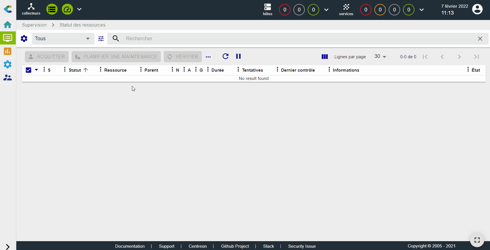
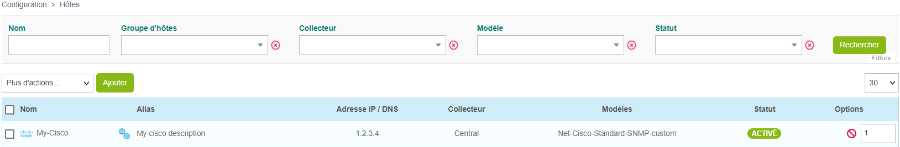

import Tabs from '@theme/Tabs';
import TabItem from '@theme/TabItem';

## Superviser un routeur Cisco avec SNMP

Dans ce tutoriel, nous partons du principe que votre plate-forme Centreon est installée et fonctionne correctement, et que vous disposez au moins d'une édition [Centreon IT 100](it100.md) qui fournit des connecteurs de supervision Centreon (votre [licence](../administration/licenses.md) est déjà configurée).

Votre routeur Cisco sera supervisé à l'aide du connecteur de supervision [Cisco standard](/monitoring-connectors/integrations/plugin-packs/procedures/network-cisco-standard-snmp). (Plus d'informations sur les connecteurs de supervision [ici](../monitoring/pluginpacks.md)).

## Prérequis

### Sur le routeur Cisco que vous souhaitez superviser

La première étape consiste à activer et à configurer un service SNMP sur votre appareil Cisco.
Veuillez vous référer à la documentation de votre appareil Cisco pour savoir comment configurer le service SNMP. La procédure de surveillance des Plugins Packs [Cisco standard](/monitoring-connectors/integrations/plugin-packs/procedures/network-cisco-standard-snmp) inclut un exemple.

### Flux réseau

L'équipement doit être accessible depuis le collecteur Centreon sur le port SNMP UDP/161.

### Sur le collecteur

Connectez-vous à votre collecteur en SSH et installez le plugin standard Cisco (voir la [procédure de surveillance pour le connecteur de supervision **Cisco standard**](/monitoring-connectors/integrations/plugin-packs/procedures/network-cisco-standard-snmp) pour plus d'informations) :

<Tabs groupId="sync">
<TabItem value="Alma / RHEL / Oracle Linux 8" label="Alma / RHEL / Oracle Linux 8">

``` shell
dnf install centreon-plugin-Network-Cisco-Standard-Snmp
```

</TabItem>
<TabItem value="Alma / RHEL / Oracle Linux 9" label="Alma / RHEL / Oracle Linux 9">

``` shell
dnf install centreon-plugin-Network-Cisco-Standard-Snmp
```

</TabItem>
<TabItem value="Debian 11 & 12" label="Debian 11 & 12">

```shell
apt install centreon-plugin-network-cisco-standard-snmp
```

</TabItem>

</Tabs>

### Sur le serveur central

Dans l'interface web, allez à la page **Configuration > Gestionnaire de connecteurs de supervision**, recherchez et installez le connecteur de supervision **Cisco standard** :


## Configurer l'hôte et déployer la configuration

1. Allez à la page **Configuration > Hôtes > Hôtes** et cliquez sur **Ajouter** :

  

2. Remplissez les informations suivantes :

  * Le nom du routeur (1)
  * Une description du routeur (2)
  * L'adresse IP du routeur (3)
  * La version et la communauté SNMP (4)
  * Sélectionnez le collecteur qui supervisera votre routeur (gardez "Central" si vous n'avez pas d'autre collecteur) (5)

3. Cliquez sur **+ Ajouter une nouvelle entrée** dans le champ **Modèles** (6), puis sélectionnez le modèle **Net-Cisco-Standard-SNMP-custom** (7) dans la liste :

  

4. Cliquez sur **Sauvegarder** (8). Votre équipement a été ajouté à la liste des hôtes :

  

5. Allez à la page **Configuration > Services > Services par hôte**. Un ensemble d'indicateurs a été créé automatiquement.

  

  Vous pouvez également utiliser le raccourci situé à côté du nom de l'hôte pour accéder directement à la page **Configuration > Services > Services par hôte**. La liste sera filtrée par le nom de l'hôte :

  

  

6. [Déployez la configuration](../monitoring/monitoring-servers/deploying-a-configuration.md).

7. Allez dans **Supervision > Statut des ressources** et sélectionnez **Toutes** dans le filtre **Statut des ressources**. Dans un premier temps, les ressources apparaissent avec le statut **En attente**, ce qui signifie qu'aucun contrôle n'a encore été exécuté :

   

   Après quelques minutes, les premiers résultats du contrôle apparaissent :

   

   Si tous les services ne sont pas dans un état OK, vérifiez la cause de l'erreur et corrigez le problème.