Pour créer des vues standard, vous devez utiliser le client **Centreon MAP Desktop**.

## Meilleures pratiques et limites

Dans un environnement de production, vous pouvez avoir beaucoup de vues et d'informations à partager avec vos utilisateurs finaux.

Voici quelques bonnes pratiques à garder à l'esprit lorsque vous créez des vues.

**Limitations du contenu** : essayez de ne pas avoir plus de \N~100 000 éléments chargés à la fois. Un élément chargé est un élément dans une vue **ouverte**.
Une vue ouverte est une vue qu'au moins **un** utilisateur regarde (en utilisant le client lourd ou l'interface web).

Vous trouverez ci-dessous quelques bonnes pratiques utiles pour vous aider à concevoir des vues optimisées :

- Nous recommandons **vivement** d'activer l'optimisation ACL (*gate.useResourcesAccess=false*).
- Lorsque vous souhaitez visualiser les statuts des applications, nous vous recommandons vivement de les modéliser à l'aide des [Activités Métier](../service-mapping/introduction.md).
  Cela vous aidera à limiter le nombre d'éléments que vous devez ajouter à une vue. 
  L'ajout d'une Activité Métier à une vue signifie qu'un seul élément est ajouté au lieu de tous les hôtes et services que vous auriez ajoutés dans la vue pour modéliser l'application autrement.
- Évitez de dupliquer les mêmes ressources (groupes d'hôtes, groupes de services, hôtes, services) dans la même vue ou dans plusieurs vues.
- Si une vue semble contenir "trop d'éléments" (voir *Limitations du contenu* ci-dessus), essayez de regrouper conceptuellement plusieurs éléments afin de les répartir sur plusieurs vues.
- Créez des vues comportant moins de 5 niveaux (drill down).
- N'affichez pas plus de 100 éléments dans un seul niveau de vue. (élément : conteneur, hôte, groupe d'hôtes, service, activité métier)
- N'affichez pas plus de 10 widgets dans un seul niveau de vue.

**Comment calculer le nombre d'éléments?**

Voici un exemple qui peut vous aider : imaginons une vue ouverte par un utilisateur, contenant 10 conteneurs, chaque conteneur contenant 10 hôtes, chaque hôte contenant 10 services.

`Nombre d'éléments : 10 conteneurs + 10 conteneurs * (10 hôtes + 10 hôtes * 10 services) = 1110 éléments.``

1110 éléments seront chargés lorsqu'au moins un utilisateur ouvrira cette vue.
Selon les limitations du contenu, cela signifie que vous pouvez avoir 100 vues comme celle-ci ouvertes par au moins un utilisateur.

*Ces limitations/recommandations sont basées sur un serveur Centreon Map disposant de 8 Go de RAM, 8vCPU (2.6Ghz), Google Chrome (dernière version) avec un minimum de 5 Go de mémoire sur l'ordinateur.*

> Vous ne pouvez pas ajouter d'objets (par exemple, du texte, une jauge, un camembert, un graphique, etc.) à un hôte, un groupe d'hôtes, un groupe de services ou une activité métier, ni en modifier/copier/coller le contenu.

## Connexion du client lourd

Pour connecter le client lourd au serveur, vous devez d'abord créer un profil :

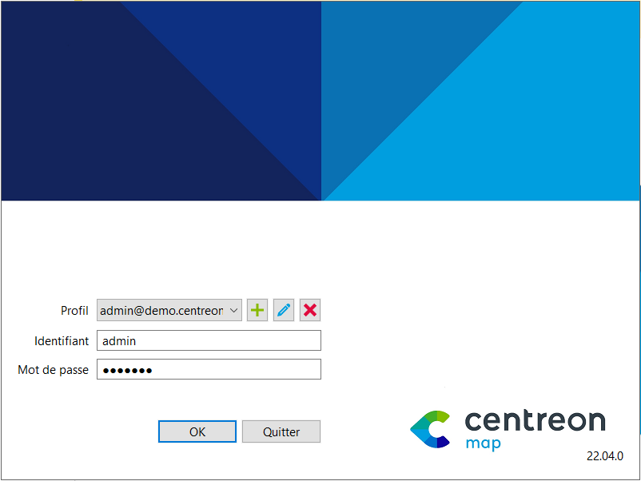

Ajoutez un profil en cliquant sur le "+" à droite de la fenêtre **Créer ou éditer un profil** :

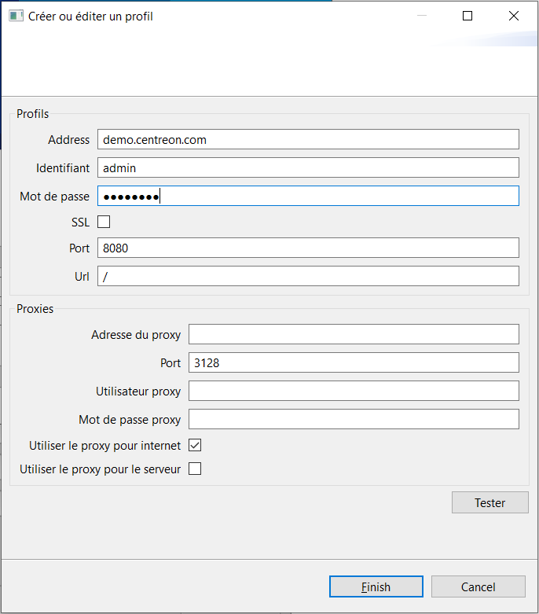

- **Adresse** : Adresse du serveur MAP
- **Identifiant** : Votre nom d'utilisateur Centreon Web
- **Mot de passe** : Mot de passe associé à votre nom d'utilisateur Centreon web
- **SSL** : Cochez cette case si le serveur MAP est configuré en HTTPS.
- **Port** : Port d'écoute pour le serveur MAP -- il utilise *8080* par défaut et *8443* si vous avez configuré HTTPS.
- **URL** : L'URL pour atteindre le serveur MAP. La valeur par défaut est "/".

S'il y a un proxy entre votre ordinateur et le serveur MAP ou internet, configurez-le ici :

- **Adresse du proxy** : Adresse du serveur proxy
- **Port** : Port du serveur proxy
- **Utilisateur proxy** (non obligatoire) : Login du serveur proxy
- **Mot de passe proxy** (non obligatoire) : Mot de passe de connexion pour le serveur proxy
- **Utiliser le proxy pour internet** : Cochez cette case si un proxy est nécessaire pour se connecter à internet. 
  Il sera utile pour télécharger automatiquement les mises à jour pour le client lourd.
- **Utiliser le proxy pour le serveur** : Cochez cette case si un proxy est nécessaire pour atteindre votre serveur MAP.

## Ajouter une vue

### Vue vide

Voici comment créer votre première vue :

Une fois que vous êtes connecté à votre client lourd, vous verrez cet écran :

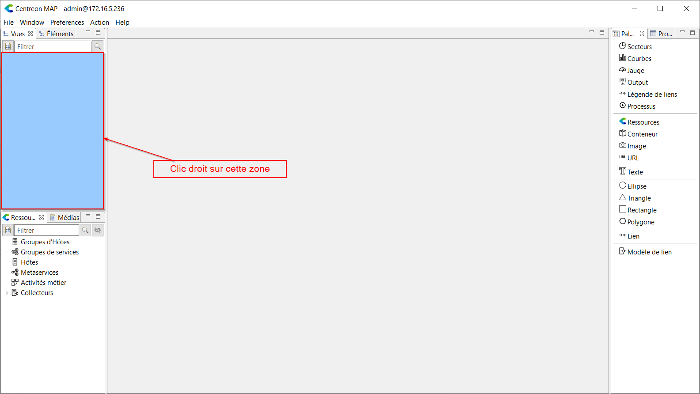

Cliquez sur **File > Create view** ou faites un clic droit sur le panneau vide de gauche, puis cliquez sur **Ajouter**.

Un nouvel assistant apparaît. Saisissez un nom pour la nouvelle vue (et une description facultative).

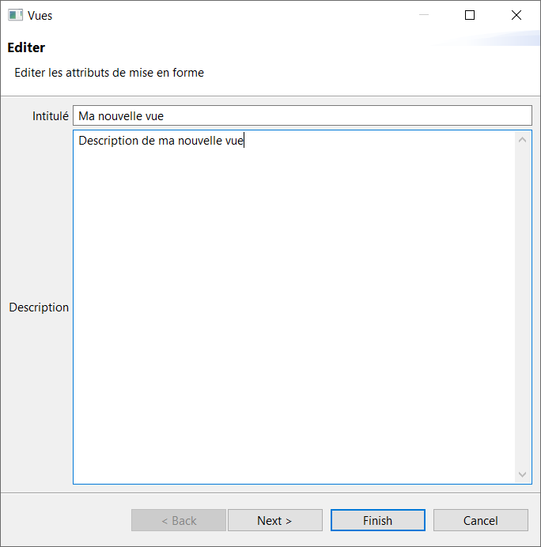

Vous pouvez ensuite cliquer sur **Finish** pour créer la vue ou sur **Next** pour y associer une image.

Une fois cela fait, vous verrez votre nouvelle vue dans l'onglet **Vues** du panneau de gauche.

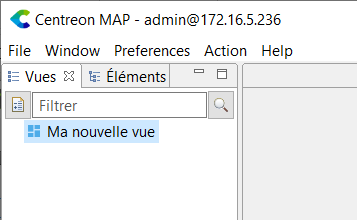

Maintenant, double-cliquez sur la vue pour l'ouvrir.
Votre panneau principal aura un fond blanc et vous pourrez commencer à y ajouter des éléments : il suffit de glisser-déposer des ressources depuis le panneau de ressources vers le panneau principal.

> Vous ne pouvez pas ajouter d'objets (par exemple, une jauge, un camembert ou un graphique) à un hôte, un groupe d'hôtes, un groupe de services ou une activité métier, ni modifier/copier-coller leur contenu.

Félicitations, vous venez de créer votre première vue.

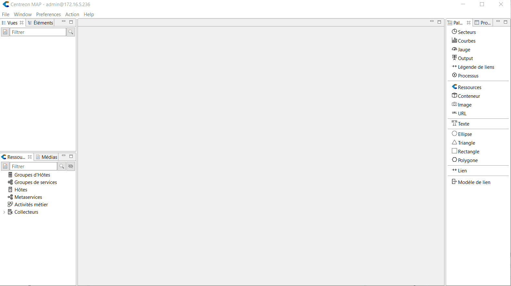

### À partir d'un conteneur existant

Lorsque vous souhaitez partager le sous-niveau d'une vue à un profil différent sans dupliquer son contenu ou sans attribuer un accès complet à la vue principale, vous pouvez créer une autre vue qui est directement liée à un conteneur.

Pour ce faire, faites un clic droit sur le conteneur ou à l'intérieur du conteneur cible et cliquez sur **Créer une vue à partir de ce conteneur**.

> Si vous renommez la vue qui est liée au conteneur, le conteneur sera automatiquement renommé.

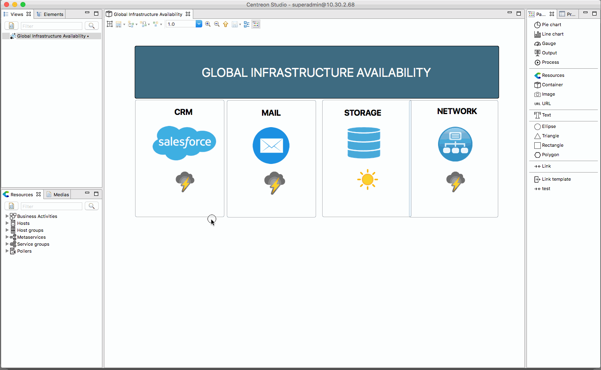

### Ajouter un fond géographique

Après avoir lié votre compte Mapbox, vous pouvez créer une vue standard et définir un arrière-plan géographique :

1. Ouvrez votre client lourd,
2. Ouvrez une vue,
3. Faites un clic droit sur l'arrière-plan de la vue puis cliquez sur **Éditer**,
4. Cochez la case **Géographique**.

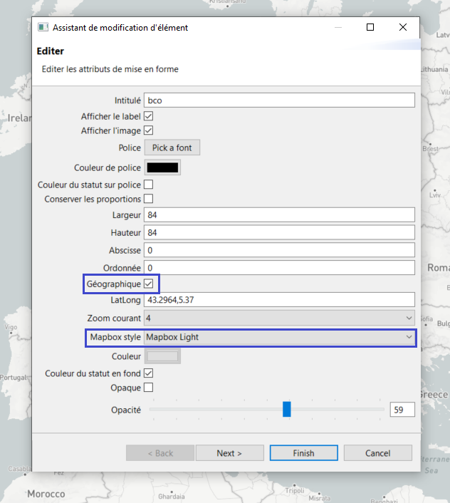

Votre vue apparaît alors comme un fond géographique sur lequel vous pouvez zoomer et vous déplacer.

Par défaut, le monde entier est affiché. Chaque fois que vous ouvrez la vue, le zoom est réglé sur sa valeur par défaut : 1. Vous pouvez modifier ce paramètre. Naviguez dans votre vue, zoomez et allez au point exact où vous souhaitez que votre vue s'ouvre par défaut.
Utilisez ensuite le bouton **Sauvegarder les latlong et zoom courants** en haut de votre client de bureau.

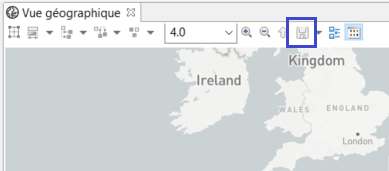

Chaque fois que vous ouvrez cette vue, que ce soit via le client lourd ou l'interface Web, la vue géographique apparaît toujours avec le niveau de zoom prédéfini.

## Modifier le style des objets

Lorsque vous affichez une ressource (groupe, hôte, services, activité métier, etc.) ou un conteneur dans une vue, trois styles différents peuvent être appliqués :

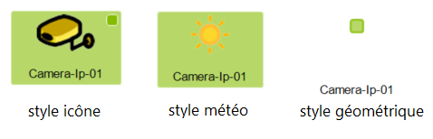

Pour modifier le style d'un élément, il suffit de faire un clic droit dessus, de sélectionner le menu **Style** et de choisir le style souhaité.
Vous pouvez également sélectionner plusieurs éléments en même temps.

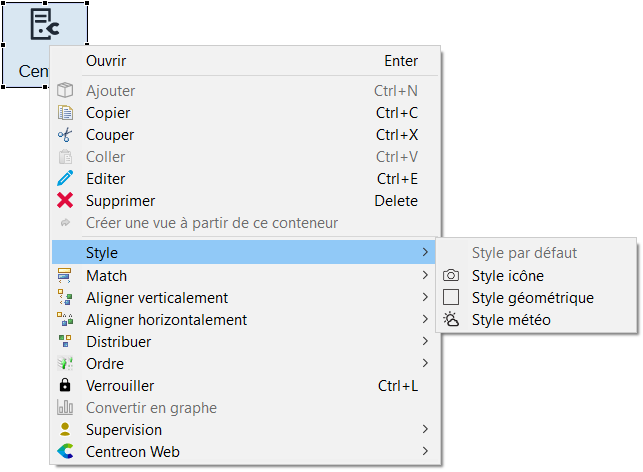

Le style par défaut d'une vue géographique est **Style géométrique**.

Le style par défaut d'une vue standard est **Style icône**.

## Utiliser les widgets

Des répresentations de données dédiées appelées "Widgets" sont disponibles dans l'onglet **Palette** du panneau de droite :

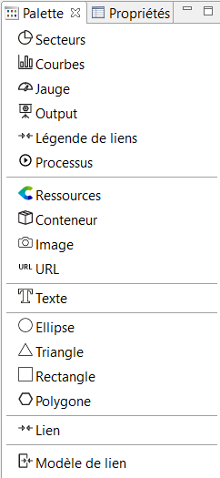

Voici une description de tous les widgets disponibles dans Centreon MAP :

### Graphes

Un graphique décrit un service et affiche les données de performance qui lui sont liées.
Vous pouvez spécifier différents paramètres (le nombre de points que vous souhaitez afficher, les lignes de pile, les lignes de remplissage, etc :)

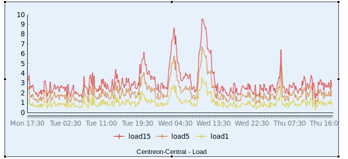

Une fois que vous avez créé le graphique, vous pouvez le modifier sur la page de l'assistant, en sélectionnant les lignes que vous souhaitez afficher, leur couleur et d'autres propriétés :

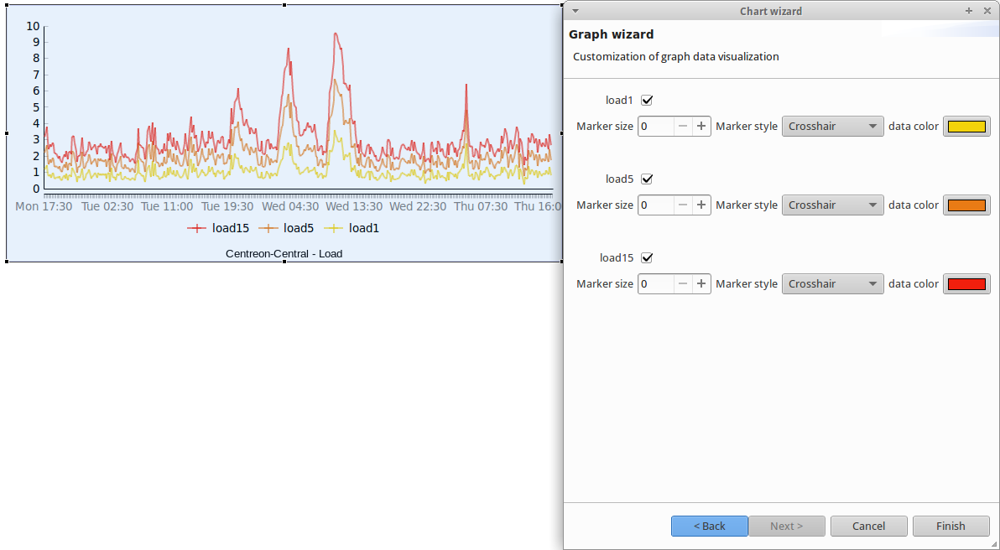

### Jauges

Une jauge affiche le pourcentage d'une mesure. Créez une jauge en sélectionnant un service et en choisissant la mesure que vous souhaitez afficher.

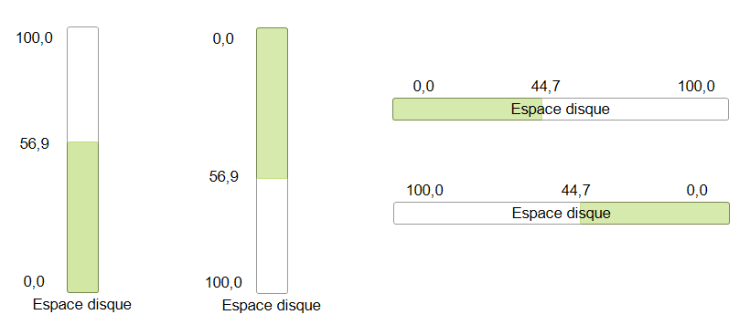

Vous pouvez placer une jauge dans n'importe quelle position et dans n'importe quelle direction (de gauche à droite, de bas en haut, etc.). Par défaut, la couleur de la jauge est associée à l'état du service.

### Camemberts

Un camembert affiche l'état d'un hôte, de groupes d'hôtes ou de groupes de services.

Pour un hôte, le nombre d'états OK, Alerte, Critique et NA sera affiché.
Pour un groupe d'hôtes, le nombre d'hôtes dans les états OK, Alerte, Critique et NA sera affiché.

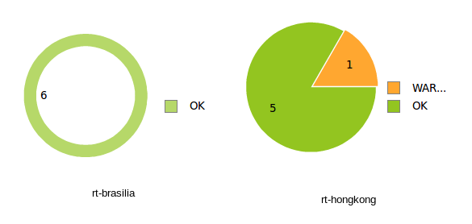

### Output

#### Comportement par défaut

Le widget Output décrit la sortie d'un service.

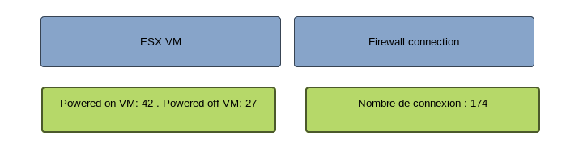

Par défaut, le fond est de la même couleur que le statut.
Cependant, vous pouvez le modifier en double-cliquant sur la sortie et en modifiant la case à cocher **Couleur du statut en fond** dans l'assistant de sortie.

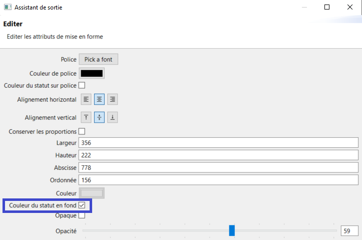

#### Personnalisation de la sortie

Vous pouvez personnaliser la sortie en ajoutant des propriétés de services et de métriques.
Pour ce faire, éditez la sortie (en double-cliquant) puis cliquez deux fois sur le bouton **Next**.

Vous verrez cette page :

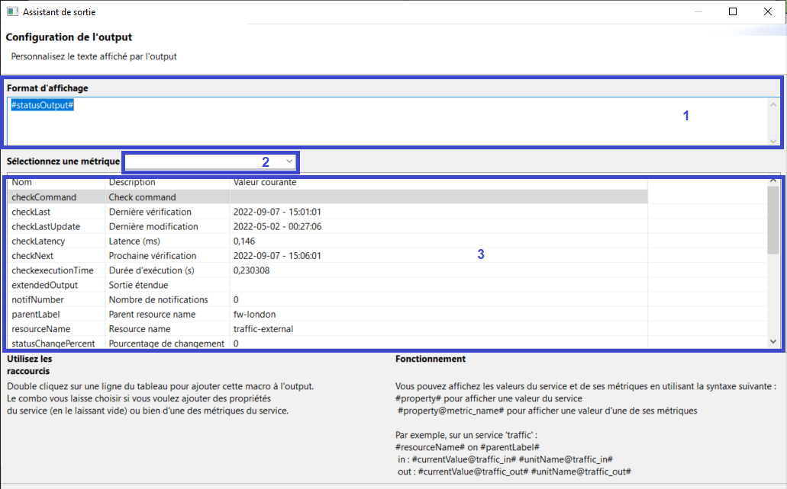

Ici, vous pouvez créer le contenu affiché en utilisant les propriétés énumérées dans le tableau (3).
Double-cliquez sur une ligne du tableau et elle sera insérée dans la sortie.

Par défaut, les propriétés listées appartiennent au service.
Si vous voulez ajouter des **propriétés liées à une métrique** (comme la valeur de la métrique, son minimum, son maximum), sélectionnez la métrique que vous voulez utiliser avec la liste déroulante (2).
Le tableau (3) affichera alors les propriétés de la métrique.

> Lorsque vous créez une nouvelle sortie, la colonne *Valeur réelle* peut ne pas être remplie.
> Cependant, dès que vous cliquez sur le bouton **Finish**, ces propriétés seront remplies.
> Elles apparaîtront lorsque vous modifierez le widget de sortie.

#### Exemple

Vous souhaitez afficher le nombre d'utilisateurs connectés à un VPN ainsi que son nom.
Le service que vous utilisez a une métrique appelée "clients" qui représente le nombre d'utilisateurs connectés.

Pour afficher la sortie suivante :

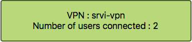

Configurez le widget de sortie comme suit :

```text
VPN : #parentLabel#
Number of users connected : #currentValue@clients#
```

### URL

Le widget URL est associé à une URL. Double-cliquez dessus pour ouvrir l'URL.

Par exemple, si l'URL pointe vers une plateforme d'assistance, double-cliquez dessus pour ouvrir la page web de l'assistance dans votre navigateur web par défaut.

### Processus

Ce widget peut être utilisé pour déclencher une action sur n'importe quelle ressource en fonction d'une commande.

Voici un exemple :

Vous avez un site web interne qui utilise Apache, et parfois Apache crashe.
Votre équipe d'ingénieurs étudie le problème qui explique ces pannes, mais votre priorité est de vous assurer que les utilisateurs finaux peuvent accéder au site Web.
Vous pouvez utiliser le widget "processus" en attribuant une commande telle que "services httpd restart" de sorte que lorsque le processus Apache crashe, les utilisateurs peuvent immédiatement redémarrer le service Apache à partir de la vue en double-cliquant sur le widget.

Lorsque vous créez un widget processus, vous devez choisir un service.

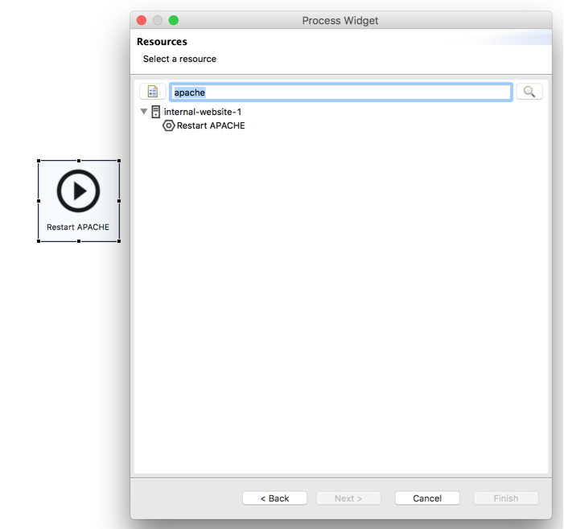

Pour créer un service dédié à une "action" :

1. Créez une commande (**Configuration > Commandes > Ajouter**) qui contient "service httpd restart" (n'oubliez pas d'activer le shell).
2. Liez la commande à un service passif.
3. Liez le service passif à un hôte (par exemple, l'hôte qui héberge le site Web).

Vous pouvez ensuite affecter ce service au widget.

## Créer des liens entre les objets

Lorsque vous utilisez Centreon MAP, vous pouvez créer des liens entre tous les éléments. Il existe trois types de liens :

- Lien simple : Relie deux éléments en couleur.
- Lien d'état : Utilise une couleur basée sur l'état d'un service.
- Lien métrique : Affiche le % d'une métrique, apparaissant dans une couleur en fonction de cette valeur.

Vous pouvez utiliser le concept de "modèle de lien" dans Centreon MAP pour accélérer la création de nombreux liens ayant les mêmes propriétés.

> Lorsque vous supprimez un modèle de lien, cela supprime tous les liens créés avec ce modèle.

### Liens simples

Le lien simple dans cette vue montre la connexion logique entre différents éléments.

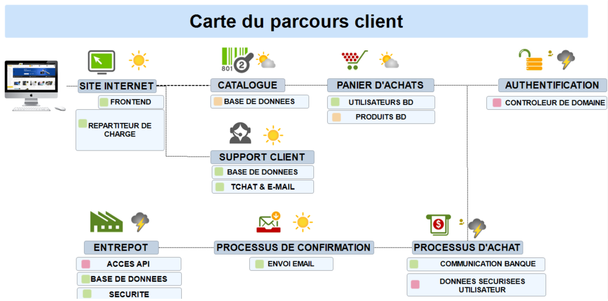

### Liens d'état

Les liens d'état peuvent être utilisés pour représenter la capacité d'une ressource à atteindre une autre ressource/zone de l'infrastructure, qu'il s'agisse d'un service sur l'un des deux éléments connectés ou d'une autre ressource.

Les lignes sur cette vue montrent la capacité des utilisateurs à se connecter à un système utilisant Citrix et ensuite la capacité des différentes zones techniques à se joindre les unes aux autres.
Des informations détaillées sont disponibles lorsque vous passez votre souris sur un lien **sur l'interface web**.

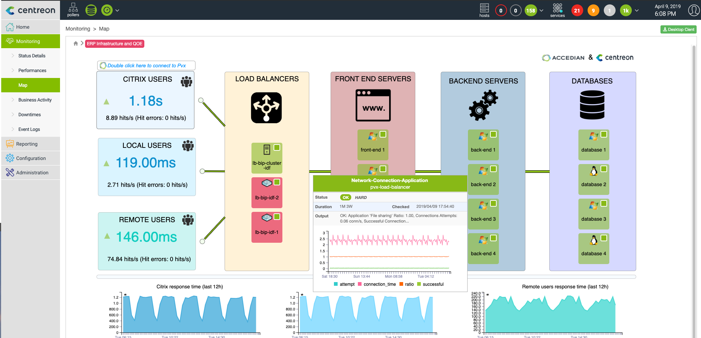

### Lien métrique

Lorsque vous configurez un lien métrique, choisissez une métrique à laquelle l'associer.
Pour les liens **doubles**, vous devez choisir deux métriques.

Un bon exemple est la métrique "traffic". Vous avez généralement un *traffic\_in* et un *traffic\_out* associés à votre service "traffic".

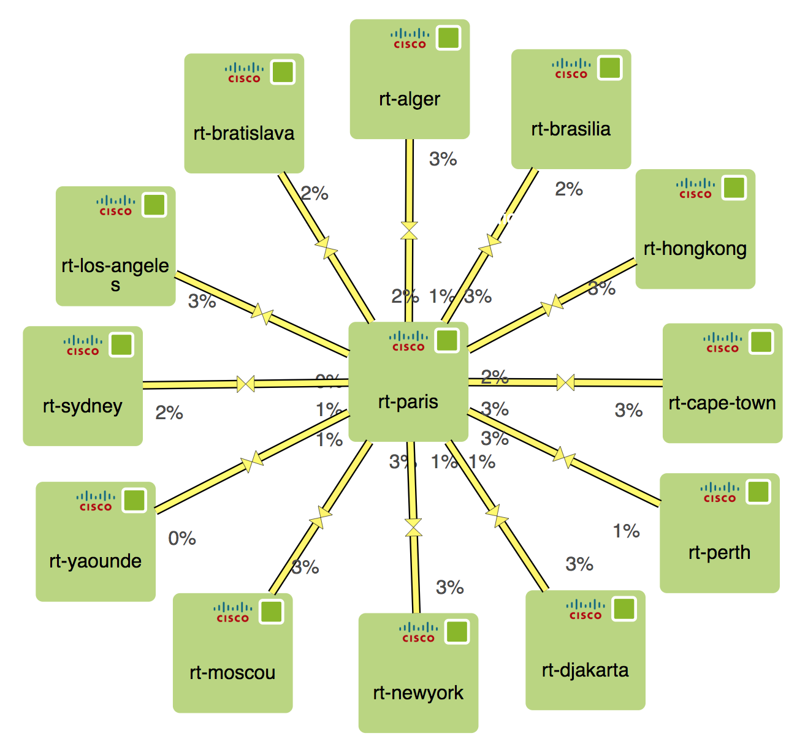

Des informations détaillées sont disponibles lorsque la souris survole un lien **sur l'interface web**.

> La couleur que vous voyez sur le lien n'est visible que pour vous, vous pouvez vouloir configurer la couleur des liens **globalement** pour tous les utilisateurs.

## Ajout d'images

Par défaut, toutes les images ajoutées à Centreon sont automatiquement disponibles pour Centreon MAP afin qu'elles puissent être liées aux objets et ajoutées aux vues.
Ces images sont importées dans le dossier "centreon" et **vous ne pouvez pas ajouter ou modifier des images dans ce dossier**.
Toutefois, si vous souhaitez ajouter de nouveaux médias qui ne seront utilisés que dans Centreon MAP, suivez la procédure suivante :

1. Ouvrez le panneau **Médias**.
2. Créez au moins un dossier.
3. Faites un clic droit sur le nouveau dossier.
4. Cliquez sur **Importer**.

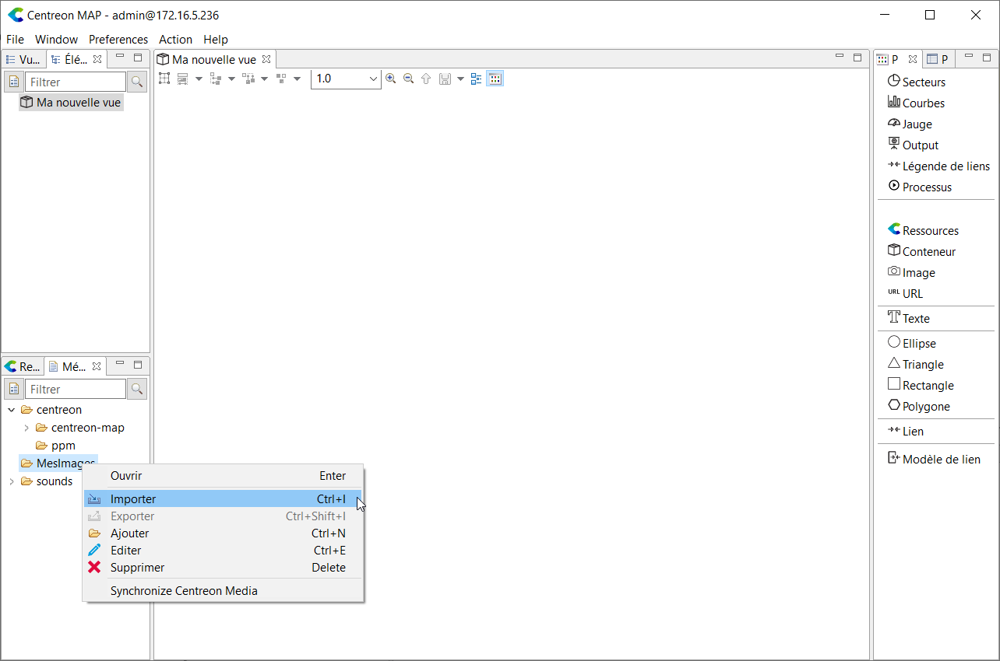

Lorsque vous ajoutez de nouvelles images à votre plate-forme Centreon (et non à partir de Centreon MAP), vous pouvez cliquer sur **Actions > Synchroniser les médias** afin que les images ajoutées ou supprimées de Centreon soient reflétées dans Centreon MAP.

Les formats suivants peuvent être utilisés dans Centreon MAP :

- PNG
- GIF (s'animera uniquement sur l'interface Web)
- JPEG.

## Créer une commande système (Desktop uniquement)

Centreon MAP vous permet de lancer des applications installées sur votre ordinateur en utilisant les paramètres de votre Centreon.
Faites un *clic droit* sur un hôte dans Centreon MAP pour démarrer directement une session Putty / SSH, sans entrer de paramètres.

### Exemple pour Linux avec Terminator

Voici comment créer une commande SSH en utilisant le binaire *terminator*.

Commencez par créer une nouvelle commande système. Allez à la page **Préférences**, sous le menu **System**. Puis entrez ce qui suit :

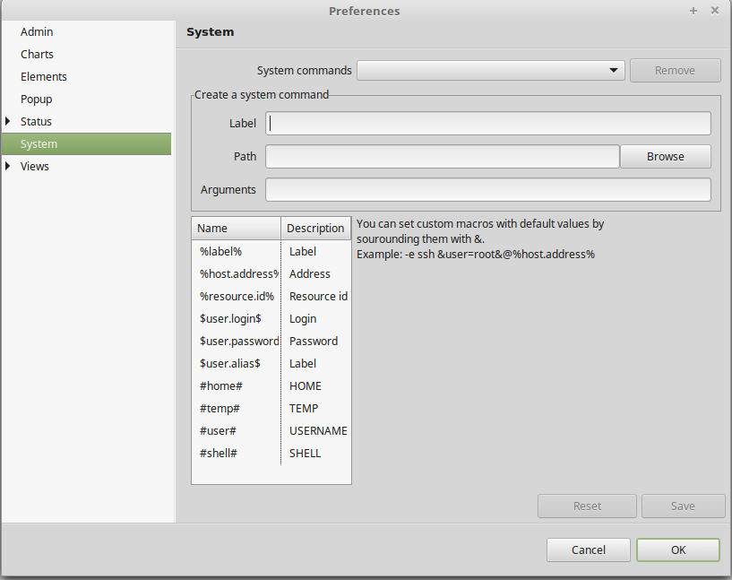

- Étiquette : SSH
- Chemin d'accès : terminator
- Arguments :

  ```text
  -e ssh [root@%host.address%](mailto:root@%host.address%)
  ```

Ici, `%host.address%` sera automatiquement remplacé par l'adresse de l'hôte de l'élément sur lequel vous avez fait un clic droit.

Cliquez sur **Sauvegarder**.

Votre commande est maintenant disponible pour chaque élément sur lequel vous faites un clic droit dans le sous-menu **Système**.

### Exemple pour Windows avec Putty


### Configuration avancée

Dans les paramètres, vous pouvez utiliser des variables provenant de l'élément que vous avez sélectionné et aussi de votre compte, comme le nom d'utilisateur et le mot de passe.
Pour ce faire, ajoutez les variables $user.login$ et $user.password$.
Ceci est pratique pour valider les utilisateurs sur un LDAP avec tous les serveurs connectés.

Vous pouvez également définir des paramètres par défaut et demander à l'utilisateur s'il souhaite les remplacer au moment de l'exécution. Pour ce faire, utilisez la syntaxe suivante :

```text
\&user=root&
```

La commande et les arguments seront :

```text
-ssh &user=root&@%host.address%
```

À chaque exécution de la commande, une invite s'affiche proposant la valeur par défaut.
L'utilisateur peut soit appuyer sur **Entrée** pour valider, soit la remplacer par une autre valeur.