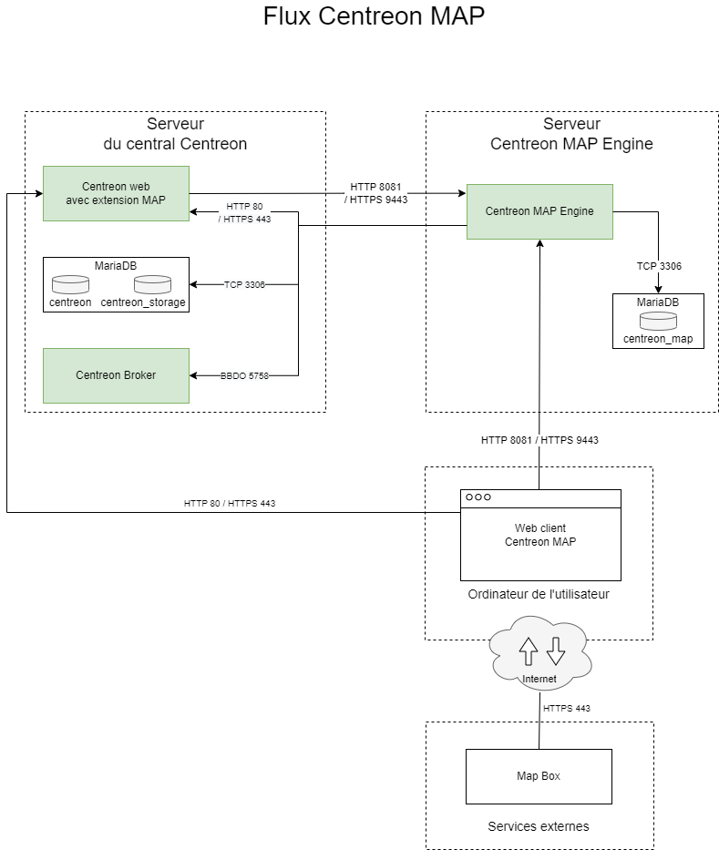
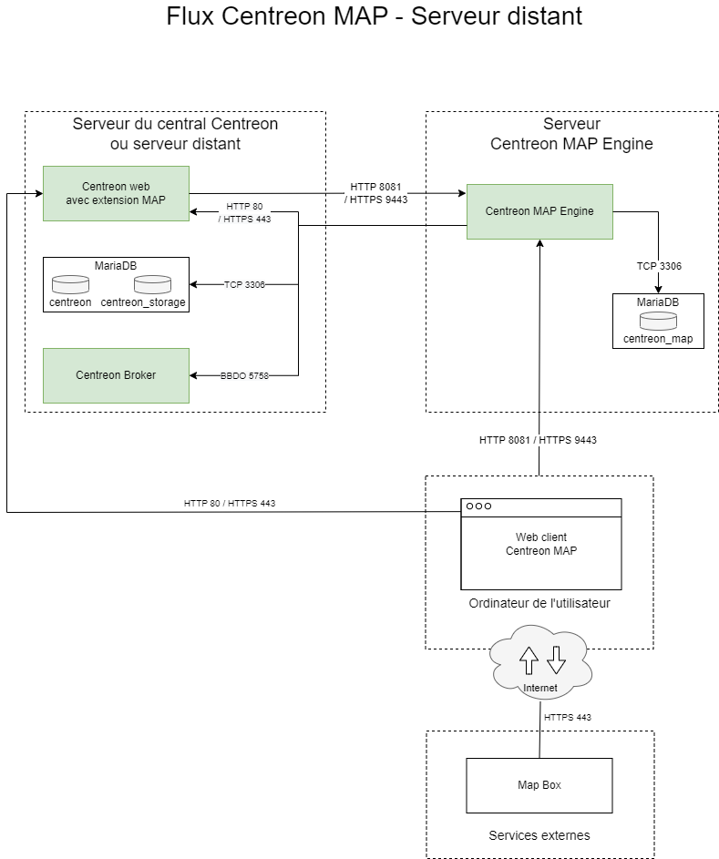

Cette page décrit l'architecture de Centreon MAP.

## Architecture standard

Le schéma ci-dessous décrit l'architecture de MAP.

- Vous pouvez installer Centreon MAP soit sur un serveur dédié, soit sur le serveur central.
- Centreon MAP ne nécessite aucune installation sur votre machine : cette solution est entièrement disponible dans l'interface web Centreon.

**Tableau des flux du réseau**

| Application    | Source     | Destination               | Port      | Protocole  | Objet                                                |
|----------------|------------|---------------------------|-----------|------------|-------------------------------------------------------------|
| MAP Server     | MAP server | Centreon central broker   | 5758      | TCP        | Obtenez des mises à jour du statut en temps réel             |
| MAP Server     | MAP server | Centreon MariaDB database | 3306      | TCP        | Récupérer la configuration et d'autres données de Centreon  |
| Web            | MAP server | Centreon central          | 80/443    | HTTP/HTTPS | Authentification et récupération des données                |
| Web interface  | User       | MAP server                | 8081/9443 | HTTP/HTTPS | Récupérer les vues et le contenu                             |
| Web interface  | User       | Internet\* (Mapbox)       | 443       | HTTPS      | Récupérer les données Mapbox                                 |

\**Avec ou sans proxy*

## Architecture avec un serveur distant

Le schéma ci-dessous décrit l'architecture de MAP avec un serveur distant :

