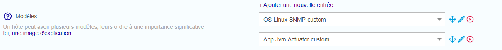

import Tabs from '@theme/Tabs';
import TabItem from '@theme/TabItem';

Cette page décrit comment superviser votre serveur Centreon MAP après installation.

> Veuillez noter que les endpoints spécifiés dans cette page ont été mis à jour suite à la dépréciation de la version bêta. Depuis la version 24.10, `beta` est remplacé par `latest` dans les chemins d'accès.

## Installer le connecteur Centreon MAP Engine

Centreon fournit un [connecteur de supervision et un plugin](/pp/integrations/plugin-packs/procedures/applications-monitoring-centreon-map-engine-actuator) pour superviser votre serveur Centreon MAP.

## Configurer vos services

Accédez à votre interface web Centreon. Allez à la page **Configuration > Hôtes > Hôtes**, puis cliquez sur **Ajouter**.

Remplissez les informations de base sur votre hôte et ajoutez les modèles d'hôte suivants :

- OS-Linux-SNMP-custom
- App-Jvm-actuator-custom




Pour superviser la JVM centreon-map, veuillez utiliser les valeurs de macro suivantes :

| Nom                     | Valeur                                    |
| :---------------------- | :---------------------------------------- |
| ACTUATORCUSTOMMODE      | ```centreonmap```                         |
| ACTUATORAPIURLPATH      | ```/centreon-map/api/latest```           |
| ACTUATORAPIUSERNAME     | Le nom d'utilisateur Api doit être défini |
| ACTUATORAPIPASSWORD     | Le mot de passe Api doit être défini      |

> N'oubliez pas de cocher la case "Créer aussi les services liés aux modèles".

Vous pouvez maintenant exporter votre configuration, et votre serveur Centreon MAP sera supervisé.


Vous pouvez également vérifier l'URL suivante, qui indique si le serveur est opérationnel ou non :

<Tabs groupId="sync" queryString>
<TabItem value="HTTP" label="HTTP">

```shell
http://<MAP_IP>:8080/centreon-map/api/latest/actuator/health.
```

</TabItem>
<TabItem value="HTTPS" label="HTTPS">

```shell
https://<MAP_IP>:8443/centreon-map/api/latest/actuator/health.
```

</TabItem>
</Tabs>
