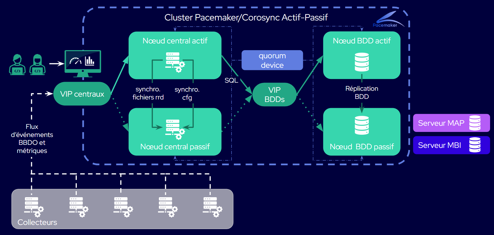

import Tabs from '@theme/Tabs';
import TabItem from '@theme/TabItem';

## Schéma d'un cluster Centreon HA

## Quels sont les éléments constituant Centreon HA ?

Centreon HA consiste en un ensemble d'outils de clustering en surcouche de deux serveurs centraux Centreon jumeaux qui gèrent des collecteurs (dans une [architecture distribuée](../architectures.md#architecture-distribuée)), avec deux bases de données jumelles distantes. Les outils HA gèrent les processus qui seraient normalement gérés par les serveurs centraux ou les bases de données elles-mêmes. Dans le contexte de la HA, ces processus sont appelés « ressources ».

* Un cluster Centreon HA comprend 5 membres :

   * 2 serveurs centraux Centreon : un nœud actif, un nœud passif. Grâce à des scripts de synchronisation, les mêmes données existeront sur les deux serveurs de sorte que si le nœud actif tombe en panne, le nœud passif prendra sa place. Les serveurs centraux ne supervisent pas vos ressources (les collecteurs le font). Dans cette documentation, nous appellerons les serveurs centraux « nœud central 1 » et « nœud central 2 » pour les différencier : gardez à l'esprit qu'ils peuvent tous deux jouer le rôle de nœud actif ou passif.
   * 2 nœuds de base de données. Il s'agit de bases de données distantes et répliquées. Il y a un nœud de base de données actif et un nœud de base de données passif, et toutes les données sont synchronisées d'un nœud à l'autre.
   * 1 serveur appelé « quorum device », dont le seul but est de décider quel serveur central/quelle base de données est le nœud actif et quel est le nœud passif. Ceci est obligatoire pour éviter les problèmes de « split brain ». Vous pouvez définir l'un de vos collecteurs comme quorum device.

   > Bien que le cluster Centreon HA soit techniquement un cluster à 5 membres, il fonctionne en fait comme deux clusters indépendants à 2 nœuds : un cluster central et un cluster de base de données (plus un serveur qui agit comme quorum device pour les deux clusters). Grâce aux contraintes d'emplacement, seuls les processus Centreon s'exécutent sur les nœuds centraux, et seuls les processus de base de données s'exécutent sur les nœuds de base de données. Le cluster de serveurs centraux et le cluster de bases de données sont indépendants : le cluster de bases de données ne bascule que lorsque le nœud de bases de données actif tombe en panne, et non lorsque le nœud central actif bascule.

* Outils de clustering :
   - Scripts de haute disponibilité Centreon, contenus dans le paquet **centreon-ha-web**. Ils comprennent le service **centreon_central_sync**, qui synchronise tous les processus Centreon nécessaires (« ressources »). De plus, dans le paquet **centreon-ha-common**, des scripts gèrent la réplication de la base de données et l'automatisation de son processus de basculement.
   - Corosync : permet aux membres du cluster de communiquer en temps réel, de vérifier si les nœuds actifs sont opérationnels et de prendre la décision de basculer si nécessaire (pour les serveurs centraux ou pour les bases de données).
   - Pacemaker : démarre, arrête et contrôle l'état des processus Centreon. Vous devez indiquer à Pacemaker quels processus doivent être contrôlés : ces processus sont appelés « ressources ».
      - crm_mon : un outil en ligne de commande qui permet de connaître l'état du cluster en temps réel.
      - pcs : un outil en ligne de commande qui vous permet de configurer Corosync et Pacemaker.

* Les collecteurs, qui effectuent la supervision proprement dite.

* Une « IP virtuelle (VIP) centrale » auquel les collecteurs envoient les données collectées, de sorte que la VIP puisse transmettre les données au nœud central actif actuel.

* Une « IP virtuelle (VIP) base de données » auquel le nœud central actif envoie les données, afin que la VIP puisse les transmettre au nœud de base de données actif actuel.

## Quels sont les processus gérés par Centreon HA ?

Voici la liste des processus (ressources) qui seront gérés par les outils HA dans le cluster central :

* Daemons applicatifs du serveur central :
  * centreon-engine (ordonnanceur)
  * centreon-broker (multiplexeur)
  * centreon-gorgone (gestionnaire de tâches)
  * tous les fichiers de configuration (répliqués à l'aide du processus **centreon-central-sync**)
  * snmptrapd et centreontrapd (processus de gestion des traps système et applicatifs)
* Daemons tiers du serveur central :
  * php-fpm
  * Serveur Apache (serveur web).

Toutes ces ressources sont décrites dans le tableau ci-dessous.

* Les ressources clones sont exécutées sur les nœuds actifs et passifs.
* Les ressources uniques (services primitifs), qui font partie du groupe fonctionnel `centreon`, s'exécutent sur un seul noeud.

### Cluster central

| Nom                     | Type                 | Description                                          |
| ----------------------- | -------------------- | ---------------------------------------------------- |
| `php`                   | service clone        | Service FastCGI Process Manager (`php-fpm`)          |
| `cbd_rrd`               | service clone        | Service Broker RRD (`cbd`)                           |
| `centreon`              | groupe               | Groupe de "services primitifs" Centreon              |
| `vip`                   | service primitif     | Adresse VIP address pour le cluster central          |
| `http`                  | service primitif     | Service Apache (`httpd24-httpd`)                     |
| `cbd_central_broker`    | service primitif     | Service Broker central (`cbd-sql`)                   |
| `gorgone`               | service primitif     | Service Gorgone (`gorgoned`)                         |
| `centreon_central_sync` | service primitif     | Service de synchronisation de fichiers               |
| `centengine`            | service primitif     | Service Centreon-Engine (`centengine`)               |
| `centreontrapd`         | service primitif     | Service de gestion des Traps SNMP (`centreontrapd`)  |
| `snmptrapd`             | service primitif     | Service d'écoute des Traps SNMP (`snmptrapd`)        |

**Note** : Les ressources du groupe `centreon` sont lancées l'une après l'autre dans l'ordre de la liste.

### Cluster de bases de données

| Nom                     | Type                 | Description                                          |
| ----------------------- | -------------------- | ---------------------------------------------------- |
| `ms_mysql`              | multi-state resource | Gère le processus `mysql` et effectue la réplication des données entre les deux bases de données.     |
| `ms_mysql-master`       | location             | Définit quelle base de données est le nœud actif     |
| `vip_mysql`             | service primitif     | Adresse VIP pour le cluster de base de données       |

## Nœuds actifs/passifs ou nœuds maître/esclave ?

Dans ce chapitre, nous parlerons de nœuds actifs/passifs. Vous remarquerez peut-être que la sortie de certaines commandes utilise les termes maître et esclave : il s'agit de termes propres à Pacemaker et Corosync. Le maître désigne le nœud actif et l'esclave le nœud passif.
