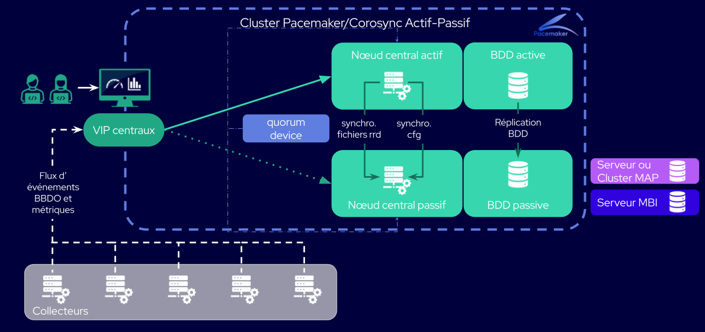

import Tabs from '@theme/Tabs';
import TabItem from '@theme/TabItem';

Si votre plateforme ne gère que de petites volumétries de données, où les bases de données sont hébergées sur les serveurs centraux, Centreon peut mettre en place une HA "simplifiée". En cas de problème, le serveur central et la base de données basculent simultanément, grâce à une contrainte de colocation.

Le seuil en-dessous duquel la base peut être intégrée au central est le même que pour une plateforme Centreon standard (voir [l'arbre de décision à la page **Architectures**](../architectures.md#de-quel-type-darchitecture-avez-vous-besoin-)).

## Schéma d'une architecture HA simplifiée



## Éléments d'une architecture HA simplifiée

Dans sa version simplifiée, le cluster HA est un cluster à 2 noeuds. Il comprend :
* 2 serveurs centraux, chacun avec sa base de données intégrée
* un serveur arbitre (le "quorum device"), qui décide quel serveur central est le noeud actif.

## Différences avec la HA 4 noeuds

Toutes les procédures décrites dans [la section HA de cette documentation](centreon-ha.md) sont également correctes pour une HA 2 noeuds, sauf les points suivants :

* La commande `pcs status` retournera un message du type :

```shell
Cluster Summary:
  * Stack: corosync
  * Current DC: @CENTRAL_ACTIVE_NAME@ (version 2.0.5-9.0.1.el8_4.1-ba59be7122) - partition with quorum
  * Last updated: Wed Sep 15 16:35:47 2021
  * Last change:  Wed Sep 15 10:41:50 2021 by root via crm_attribute on @CENTRAL_ACTIVE_NAME@
  * 2 nodes configured
  * 14 resource instances configured
Node List:
  * Online: [ @CENTRAL_ACTIVE_NAME@ @CENTRAL_PASSIVE_NAME@ ]
Full List of Resources:
  * Clone Set: ms_mysql-clone [ms_mysql] (promotable):
    * Masters: [ @CENTRAL_ACTIVE_NAME@ ]
    * Slaves: [ @CENTRAL_PASSIVE_NAME@ ]
  * Clone Set: php-clone [php]:
    * Started: [ @CENTRAL_ACTIVE_NAME@ @CENTRAL_PASSIVE_NAME@ ]
  * Clone Set: cbd_rrd-clone [cbd_rrd]:
    * Started: [ @CENTRAL_ACTIVE_NAME@ @CENTRAL_PASSIVE_NAME@ ]
  * Resource Group: centreon:
    * vip       (ocf::heartbeat:IPaddr2):        Started @CENTRAL_ACTIVE_NAME@
    * http      (systemd:httpd):         Started @CENTRAL_ACTIVE_NAME@
    * gorgone   (systemd:gorgoned):      Started @CENTRAL_ACTIVE_NAME@
    * centreon_central_sync     (systemd:centreon-central-sync):         Started @CENTRAL_ACTIVE_NAME@
    * cbd_central_broker        (systemd:cbd-sql):       Started @CENTRAL_ACTIVE_NAME@
    * centengine        (systemd:centengine):    Started @CENTRAL_ACTIVE_NAME@
    * centreontrapd     (systemd:centreontrapd):         Started @CENTRAL_ACTIVE_NAME@
    * snmptrapd (systemd:snmptrapd):     Started @CENTRAL_ACTIVE_NAME@
```

* Les seules contraintes à définir sont celles qui lient chaque central à sa base afin que les bascules soient simultanées.
L'output de la commande `pcs constraint` doit être le suivant :

```shell
Location Constraints:
Ordering Constraints:
Colocation Constraints:
  centreon with ms_mysql-clone (score:INFINITY) (rsc-role:Started) (with-rsc-role:Master)
  ms_mysql-clone with centreon (score:INFINITY) (rsc-role:Master) (with-rsc-role:Started)
Ticket Constraints:
```

* Il n'y a pas de VIP pour les bases de données puisque celles-ci sont intégrées aux noeuds centraux.
