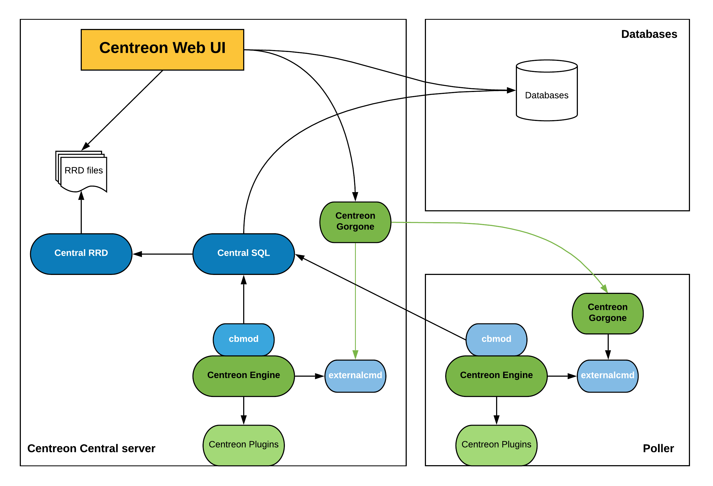
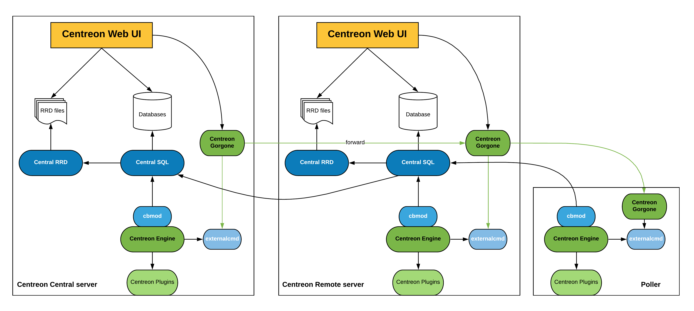

import Tabs from '@theme/Tabs';
import TabItem from '@theme/TabItem';

## Tableaux des flux réseau

### Tableaux des flux d'intégration de la plate-forme de supervision dans le SI

#### Serveur Central

| Depuis          | Vers           | Protocole  | Port               | Application                                                                    |
|-----------------|----------------|------------|--------------------|--------------------------------------------------------------------------------|
| Serveur Central | NTP server     | NTP        | UDP 123            | Synchronisation de l'horloge système                                           |
| Serveur Central | DNS server     | DNS        | UDP 53             | Résolution des nom de domaine                                                  |
| Serveur Central | SMTP server    | SMTP       | TCP 25             | Notification par mail                                                          |
| Serveur Central | LDAP(s) server | LDAP(s)    | TCP 389 (636)      | Authentification pour accéder à l'interface web Centreon                       |
| Serveur Central | DBMS server    | MySQL      | TCP 3306           | Accès aux bases de données Centreon (si déportées sur un serveur dédié)        |
| Serveur Central | HTTP Proxy     | HTTP(s)    | TCP 80, 8080 (443) | Si votre plate-forme nécessite un proxy web pour accéder à Centreon IT Edition |
| Serveur Central | Repository     | HTTP (FTP) | TCP 80 (FTP 20)    | Dépôt des paquets systèmes et applicatifs                                      |

#### Collecteur (Poller)

| Depuis     | Vers        | Protocole  | Port            | Application                               |
|------------|-------------|------------|-----------------|-------------------------------------------|
| Collecteur | NTP server  | NTP        | UDP 123         | Synchronisation de l'horloge système      |
| Collecteur | DNS server  | DNS        | UDP 53          | Résolution des nom de domaine             |
| Collecteur | SMTP server | SMTP       | TCP 25          | Notification par mail                     |
| Collecteur | Repository  | HTTP (FTP) | TCP 80 (FTP 20) | Dépôt des paquets systèmes et applicatifs |

#### Remote Server

| Depuis        | Vers           | Protocole  | Port            | Application                                                             |
|---------------|----------------|------------|-----------------|-------------------------------------------------------------------------|
| Remote Server | NTP server     | NTP        | UDP 123         | Synchronisation de l'horloge système                                    |
| Remote Server | DNS server     | DNS        | UDP 53          | Résolution des nom de domaine                                           |
| Remote Server | SMTP server    | SMTP       | TCP 25          | Notification par mail                                                   |
| Remote Server | LDAP(s) server | LDAP(s)    | TCP 389 (636)   | Authentification pour accéder à l'interface web Centreon                |
| Remote Server | DBMS server    | MySQL      | TCP 3306        | Accès aux bases de données Centreon (si déportées sur un serveur dédié) |
| Remote Server | Repository     | HTTP (FTP) | TCP 80 (FTP 20) | Dépôt des paquets systèmes et applicatifs                               |

> D'autres flux peuvent être nécessaires suivant le moyen d'authentification
> sélectionné (RADIUS, etc.) ou le moyen de notification mis en oeuvre.

### Tableau des flux de la plateforme

#### Collecteur (Poller)

| Depuis          | Vers            | Protocole    | Port         | Application                                                               |
|-----------------|-----------------|--------------|--------------|---------------------------------------------------------------------------|
| Serveur Central | Collecteur      | ZMQ          | TCP 5556     | Export des configurations Centreon (en fonction du type de communication) |
| Serveur Central | Collecteur      | SSH (legacy) | TCP 22       | Export des configurations Centreon (en fonction du type de communication) |
| Collecteur      | Serveur Central | BBDO         | TCP 5669     | Transfert des données de supervision collectées                           |
| Collecteur      | Serveur Central | HTTP(S)      | TCP 80 (443) | Enregistrement du collecteur                                              |

#### Remote Server

| Depuis          | Vers            | Protocole    | Port         | Application                                                               |
|-----------------|-----------------|--------------|--------------|---------------------------------------------------------------------------|
| Serveur Central | Remote Server   | ZMQ          | TCP 5556     | Export of Centreon configuration                                          |
| Remote Server   | Serveur Central | BBDO         | TCP 5669     | Transfert des données de supervision collectées                           |
| Remote Server   | Serveur Central | HTTP(S)      | TCP 80 (443) | Enregistrement du Remote Server                                           |
| Remote Server   | Collecteur      | ZMQ          | TCP 5556     | Export des configurations Centreon (en fonction du type de communication) |
| Remote Server   | Collecteur      | SSH (legacy) | TCP 22       | Export des configurations Centreon (en fonction du type de communication) |
| Collecteur      | Remote Server   | BBDO         | TCP 5669     | Transfert des données de supervision collectées                           |
| Collecteur      | Remote Server   | HTTP(S)      | TCP 80 (443) | Enregistrement du collecteur                                              |

> Si le Remote Server n'est pas utilisé comme proxy pour un Collecteur,
> les flux réseaux propres aux collecteurs s'appliquent.

#### Supervision

| Depuis             | Vers                               | Protocole  | Port      | Application |
|--------------------|------------------------------------|------------|-----------|-------------|
| Collecteur         | Equipements réseau, serveurs, etc. | SNMP       | UDP 161   | Supervision |
| Equipements réseau | Collecteur                         | Trap SNMP  | UDP 162   | Supervision |
| Collecteur         | Servers                            | NRPE       | TCP 5666  | Supervision |
| Collecteur         | Servers                            | NSClient++ | TCP 12489 | Supervision |

> Dans le cas où le serveur central Centreon fait office de collecteur,
> ne pas oublier d'ajouter les flux nécessaires de supervision.

> D'autres flux peuvent être nécessaires dans le cas de la supervision de
> bases de données, d'accès à des API, d'accès à des ports applicatifs, etc.

### Utilisateurs et groupes

Description des logiciels et utilisateurs liés :

<Tabs groupId="sync">
<TabItem value="Alma / RHEL / Oracle Linux 8" label="Alma / RHEL / Oracle Linux 8">

| Logiciel          | Service          | Utilisateur      | Commentaire     |
| ----------------- | ---------------- | ---------------- | --------------- |
| Apache            | httpd            | apache           | automatic start |
| PHP-FPM           | php-fpm          | apache           | automatic start |
| MariaDB/MySQL     | mariadb/mysqld   | mysql            | automatic start |
| Centreon          | centreontrapd    | centreon         | automatic start |
| Centreon Broker   | cbwd             | centreon-broker  | automatic start |
| Centreon Broker   | cbd              | centreon-broker  | automatic start |
| Centreon Engine   | centengine       | centreon-engine  | automatic start |
| Centreon Gorgone  | gorgoned         | centreon-gorgone | automatic start |

</TabItem>
<TabItem value="Alma / RHEL / Oracle Linux 9" label="Alma / RHEL / Oracle Linux 9">

| Logiciel          | Service          | Utilisateur      | Commentaire     |
| ----------------- | ---------------- | ---------------- | --------------- |
| Apache            | httpd            | apache           | automatic start |
| PHP-FPM           | php-fpm          | apache           | automatic start |
| MariaDB/MySQL     | mariadb/mysqld   | mysql            | automatic start |
| Centreon          | centreontrapd    | centreon         | automatic start |
| Centreon Broker   | cbwd             | centreon-broker  | automatic start |
| Centreon Broker   | cbd              | centreon-broker  | automatic start |
| Centreon Engine   | centengine       | centreon-engine  | automatic start |
| Centreon Gorgone  | gorgoned         | centreon-gorgone | automatic start |

</TabItem>
<TabItem value="Debian 11 & 12" label="Debian 11 & 12">

| Software          | Service          | User             | Comment         |
| ----------------- | ---------------- | ---------------- | --------------- |
| Apache            | apache2          | www-data         | automatic start |
| PHP-FPM           | php-fpm          | apache           | automatic start |
| MariaDB/MySQL     | mariadb/mysqld   | mysql            | automatic start |
| Centreon          | centreontrapd    | centreon         | automatic start |
| Centreon Broker   | cbwd             | centreon-broker  | automatic start |
| Centreon Broker   | cbd              | centreon-broker  | automatic start |
| Centreon Engine   | centengine       | centreon-engine  | automatic start |
| Centreon Gorgone  | gorgoned         | centreon-gorgone | automatic start |

</TabItem>
</Tabs>

Description des logiciels optionnels et utilisateurs liés :

| Logiciel        | Service         | User      | Commentaire                                          |
|-----------------|-----------------|-----------|------------------------------------------------------|
| Centreon VMware | centreon_vmware | centreon  | non installé par défaut                              |
| RRDtool         | rrdcached       | rrdcached | non activé et non parémétré dans Centreon par défaut |

Description des groupes et utilisateurs liés pour les éditions Centreon Open Source et IT Edition :

| Groupe           | Utilisateurs                                                     |
|------------------|------------------------------------------------------------------|
| apache           | nagios,centreon,centreon-gorgone                                 |
| centreon         | centreon-engine,centreon-broker,apache,centreon-gorgone          |
| centreon-broker  | centreon,nagios,centreon-engine,apache,centreon-gorgone          |
| centreon-engine  | centreon-broker,apache,nagios,centreon,centreon-gorgone          |
| centreon-gorgone | centreon,apache,centreon-gorgone,centreon-engine,centreon-broker |
| rrdcached        | centreon-broker,apache                                           |

Description des groupes et utilisateurs liés pour l'édition Centreon Business Edition :

| Groupe           | Utilisateurs                                                                 |
|----------------- |------------------------------------------------------------------------------|
| apache           | nagios,centreonBI,centreon,centreon-gorgone                                  |
| centreon         | centreon-engine,centreon-broker,apache,rrdcached,centreonBI,centreon-gorgone |
| centreon-broker  | centreon,nagios,centreon-engine,apache,rrdcached,centreon-gorgone            |
| centreon-engine  | centreon-broker,apache,nagios,centreon,centreon-gorgone                      |
| centreon-gorgone | centreon,apache,centreon-gorgone,centreon-engine,centreon-broker             |
| centreonBI       | apache                                                                       |
| centreon-map     |                                                                              |
| mysql            | centreonBI                                                                   |

Description des utilisateurs, umask et répertoire utilisateur pour les éditions Centreon Open Source et IT Edition :

| Utilisateur      | umask | home                      | Shell         |
|------------------|-------|---------------------------|---------------|
| root             | 0022  | /root                     | /bin/bash     |
| apache           | 0022  | /var/www                  | /sbin/nologin |
| centreon         | 0002  | /var/spool/centreon       | /bin/bash     |
| centreon-broker  | 0002  | /var/lib/centreon-broker  | /bin/bash     |
| centreon-engine  | 0002  | /var/lib/centreon-engine  | /bin/bash     |
| centreon-gorgone | 0002  | /var/lib/centreon-gorgone | /bin/bash     |
| mysql            | 0002  | /var/lib/mysql            | /sbin/nologin |
| rrdcached        | 0002  | /var/rrdtool/rrdcached    | /bin/bash     |

Description des utilisateurs, umask et répertoire utilisateur pour l'édition Centreon Business Edition :

| Utilisateur      | umask | home                      | Shell         |
|------------------|-------|---------------------------|---------------|
| root             | 0022  | /root                     | /bin/bash     |
| apache           | 0022  | /var/www                  | /sbin/nologin |
| centreon         | 0002  | /var/spool/centreon       | /bin/bash     |
| centreonBI       | 0002  | /home/centreonBI          | /bin/bash     |
| centreon-agent   | 0002  | /var/lib/centreon-agent   | /bin/bash     |
| centreon-broker  | 0002  | /var/lib/centreon-broker  | /bin/bash     |
| centreon-engine  | 0002  | /var/lib/centreon-engine  | /bin/bash     |
| centreon-gorgone | 0002  | /var/lib/centreon-gorgone | /bin/bash     |
| centreon-map     | 0002  | /home/centreon-map        | /bin/bash     |
| mysql            | 0002  | /var/lib/mysql            | /sbin/nologin |
| rrdcached        | 0002  | /var/rrdtool/rrdcached    | /bin/bash     |

## Dépendances logicielles

Le tableau suivant décrit les dépendances logicielles :

| Logiciel | Version    |
| -------- | ---------- |
| Apache   | 2.4        |
| GnuTLS   | \>= 2.0    |
| Net-SNMP | 5.7        |
| openssl  | \>= 1.0.1k |
| PHP      | 8.2        |
| RRDtools | 1.4.7      |
| zlib     | 1.2.3      |

## Architectures

### Serveur central seul

Si vous ne supervisez qu'un petit nombre d'hôtes, vous pouvez n'avoir besoin que d'un serveur central.

#### Entités

Plusieurs entités servent à mettre en place cette architecture :

* Le serveur Apache est chargé d'héberger l'interface web de Centreon
* Plusieurs bases de données MariaDB/MySQL sont chargées de stocker la configuration de Centreon, les informations de
  supervision ainsi que les données de performances
* Le moteur de supervision supervise le système d'informations
* Les informations de supervision sont envoyées via cbmod à Centreon Broker SQL
* Centreon Broker SQL est chargé d'insérer les données de supervision en base de données et de transmettre les données
  de performances à Centreon Broker RRD
* Centreon Broker RRD est chargé de générer les fichiers RRD (qui servent à générer les graphiques de performances)

#### Architecture

Le schéma ci-dessous résume le fonctionnement de l'architecture :

### Architecture distribuée

L'architecture distribuée consiste à avoir deux types d'entités :

* Le serveur central qui centralise les informations de supervision
* Un ou plusieurs collecteurs qui sont chargés de la supervision des équipements

Le serveur central regroupe les éléments suivants :

* L'interface web de Centreon
* La base de données (MariaDB/MySQL + RRD)
* Le moteur de supervision
* Le broker

Le serveur satellite a les éléments suivants :

* Le moteur de supervision
* Le module de broker qui permet l'envoi des informations de supervision vers le serveur central

Cette architecture a plusieurs intérêts :

* Elle permet la répartition de la charge de supervision entre plusieurs serveurs de supervision
* Isolation des flux réseaux : si votre infrastructure de supervision est chargée de superviser une DMZ, il est plus
simple (et sécurisant) de placer un serveur satellite sur le réseau DMZ

#### Entités

##### Serveur central

Le serveur central fonctionne de la manière suivante :

* Le serveur Apache est chargé d'héberger l'interface web de Centreon
* Plusieurs bases de données MariaDB/MySQL sont chargées de stocker la configuration de Centreon, les informations de supervision ainsi que les données de performances
* Le service Centreon Gorgone est chargé d'exporter la configuration des moteurs de supervision vers le serveur central et satellites ainsi que du redémarrage des moteurs de supervision
* Le moteur de supervision supervise le système d'informations
* Les informations de supervision sont envoyées via cbmod à Centreon Broker SQL
* Centreon Broker SQL est chargé d'insérer les données de supervision en base de données et de transmettre les données de performances à Centreon Broker RRD
* Centreon Broker RRD est chargé de générer les fichiers RRD (qui servent à générer les graphiques de performances)

##### Collecteur

Le collecteure fonctionne de la manière suivante :

* Le moteur de supervision supervise le système d'informations
* Les informations de supervision sont envoyées via cbmod au service Centreon Broker SQL hébergé sur le serveur Central

#### Architecture

Le schéma ci-dessous résume le fonctionnement de l'architecture :

### SGBD déporté

L'architecture distribuée avec base de données déportée consiste à avoir trois types d'entités :

* Le serveur central qui centralise les informations de supervision
* Un serveur de base de données chargée de stocker toutes les bases de données
* Un ou plusieurs collecteur qui sont chargés de la supervision des équipements

Le serveur central regroupe les éléments suivants :

* L'interface web de Centreon
* Le moteur de supervision
* Le broker
* Les fichiers RRD

Le serveur de base de données est chargé de stocker la base de données MariaDB/MySQL.

Le collecteur regroupe les éléments suivants :

* Le moteur de supervision
* Le module de broker qui permet l'envoi des informations de supervision vers le serveur central

Cette architecture a plusieurs intérêts :

* Elle permet la répartition de la charge de supervision entre plusieurs serveurs de supervision
* Isolation des flux réseaux : si votre infrastructure de supervision est chargée de superviser une DMZ, il est plus
  simple (et sécurisant) de placer un collecteur sur le réseau DMZ
* Avoir une base de données MariaDB/MySQL externalisée

#### Entités

##### Serveur de base de données

Le serveur de base de données sert uniquement à stocker la configuration de Centreon, les informations de supervision
ainsi que les données de performances au sein de la base de données MariaDB/MySQL.

##### Serveur central

Le serveur central fonctionne de la manière suivante :

* Le serveur Apache est chargé d'héberger l'interface web de Centreon
* Le serveur central récupère la configuration ainsi que les informations de supervision en se connectant au serveur de
  base de données
* Le service Centreon Gorgone est chargé d'exporter la configuration des moteurs de supervision vers le serveur central et
  collecteurs ainsi que du redémarrage des moteurs de supervision
* Le moteur de supervision supervise le système d'informations
* Les informations de supervision sont envoyées via cbmod à Centreon Broker SQL
* Centreon Broker SQL est chargé d'insérer les données de supervision en base de données et de transmettre les données de
  performances à Centreon Broker RRD
* Centreon Broker RRD est chargé de générer les fichiers RRD (qui servent à générer les graphiques de performances)

##### Collecteur

Le collecteur fonctionne de la manière suivante :

* Le moteur de supervision supervise le système d'informations
* Les informations de supervision sont envoyées via cbmod au service Centreon Broker SQL hébergé sur le serveur Central

#### Architecture

Le schéma ci-dessous résume le fonctionnement de l'architecture :

### Serveur distant

L'architecture distribuée avec Remote Server consiste à avoir trois types d'entités :

* Le serveur central qui centralise les informations de supervision et permet de configurer la supervision
* Un ou plusieurs collecteurs qui sont chargés de la supervision des équipements
* Un ou plusieurs Remote Server pour afficher et opérer sur un sous-ensemble des données collectées

Le serveur central regroupe les éléments suivants :

* L'interface web de Centreon (configuration, présentation et opération)
* Le moteur de supervision
* Le broker
* Les bases de données (MariaDB/MySQL + RRD)

Le Remote Server regroupe les éléments suivants :

* L'interface web de Centreon (présentation et opération d'un sous-ensemble des données)
* Le moteur de supervision
* Le broker
* Les bases de données (MariaDB/MySQL + RRD)

Le collecteur contient les éléments suivants :

* Le moteur de supervision
* Une interface web de Centreon minimaliste

Cette architecture a plusieurs intérêts :

* Elle permet la répartition de la charge de supervision entre plusieurs serveurs de supervision
* Isolation des flux réseaux : si votre infrastructure de supervision est chargée de superviser une DMZ, il est plus
  simple (et sécurisant) de placer un collecteur sur le réseau DMZ
* Disposer d'une interface web déportée afin de pouvoir consulter les éléments supervisés d'un sous ensemble

#### Entités

##### Serveur central

Le serveur central fonctionne normalement :

* Le serveur Apache est chargé d'héberger l'interface web de Centreon
* Plusieurs bases de données MariaDB/MySQL sont chargées de stocker la configuration de Centreon, les informations de supervision
  ainsi que les données de performances
* Le service Centreon Gorgone est chargé d'exporter la configuration des moteurs de supervision vers le serveur central et
  collecteurs ainsi que du redémarrage des moteurs de supervision
* Le moteur de supervision supervise le système d'informations
* Les informations de supervision sont envoyées via cbmod à Centreon Broker SQL
* Centreon Broker SQL est chargé d'insérer les données de supervision en base de données et de transmettre les données de
  performances à Centreon Broker RRD
* Centreon Broker RRD est chargé de générer les fichiers RRD (qui servent à générer les graphiques de performances)

##### Remote Server

Le Remote Server fonctionne normalement :

* Le serveur Apache est chargé d'héberger l'interface web de Centreon
* Plusieurs bases de données MariaDB/MySQL sont chargées de stocker les informations de supervision ainsi que les données de
  performances
* Le service Centreon Gorgone est chargé d'opérer sur les données collectées
* Le moteur de supervision supervise le système d'informations
* Les informations de supervision sont envoyées via cbmod à Centreon Broker SQL
* Centreon Broker SQL est chargé d'insérer les données de supervision en base de données et de transmettre les données
  de performances à Centreon Broker RRD localement. Il est également chargé de transmettre l'ensemble des informations
  au serveur Centreon Central.
* Centreon Broker RRD est chargé de générer les fichiers RRD (qui servent à générer les graphiques de performances)

##### Collecteur

Le collecteur fonctionne de la manière suivante :

* Le moteur de supervision supervise le système d'informations
* Les informations de supervision sont envoyées via cbmod au serveur Centreon central.

#### Architecture

Le schéma ci-dessous résume le fonctionnement de l'architecture :

