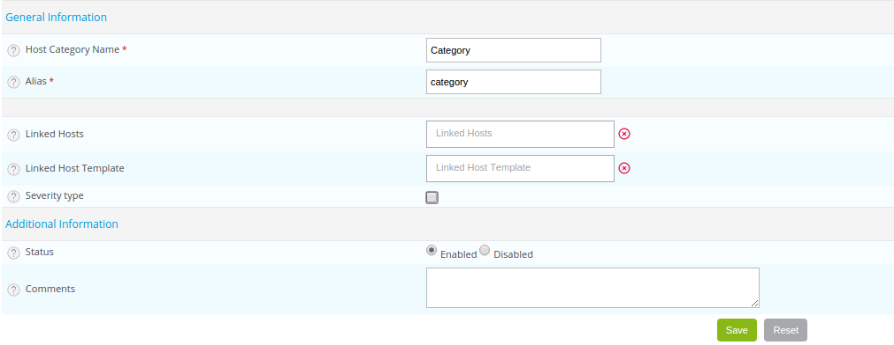
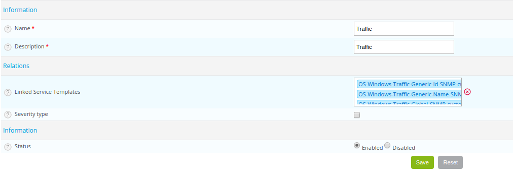

Les catégories vous permettent :

- d'organiser hôtes et services, afin de définir les droits des utilisateurs sur ceux-ci via les [ACLs](../administration/access-control-lists.md).
- de [filtrer la vue](../alerts-notifications/resources-status.md#filtering-events) dans la page **Statut des ressources**.
- de classifier les hôtes et services par sous-groupes dans les [rapports MBI](../reporting/concepts.md).
- de définir des types d'objets dans le module [Centreon MAP](../graph-views/introduction.md).

Il existe un type spécial de catégorie, nommé criticité. Les criticités vos permettent de faire la même chose que les catégories, mais également de :

- trier la vue de la page **Statut des ressources** par niveau de criticité, par exemple pour afficher les alertes les plus importantes en premier. (Les criticités sont affichées dans la colonne **S** de la page **Statut des ressources**.)

- filtrer les données dans les widgets **Host monitoring**, **Service monitoring** et **Open Tickets** dans les [vues personnalisées](../alerts-notifications/custom-views.md).

## Catégories d’hôtes

Rendez-vous dans le menu **Configuration > Hôtes > Catégories** et cliquez sur **Ajouter**

* Les champs **Nom** et **Alias** contiennent respectivement le nom et l’alias de la catégorie d’hôte.
* La liste **Hôtes liés** permet d’ajouter des hôtes à la catégorie.
* Si un modèle d’hôte est ajouté à **Linked host template** alors tous les hôtes qui héritent de ce modèle appartiennent
  à cette catégorie.
* La case  **Type de criticité** signifie que la catégorie d’hôtes à un niveau de criticité.
* Les champs **Niveau** et **Icône** définissent respectivement un niveau de criticité et une icône associée.
* Les champs **Statut** et **Commentaires** permettent d’activer ou de désactiver la catégorie d’hôte et de commenter celle-ci.

## Catégories de services

Rendez-vous dans le menu **Configuration > Services > Catégories** et cliquez sur **Ajouter**

* Les champs **Nom** et **Description** définissent le nom et la description de la catégorie de service.
* Si un modèle de service appartient à **Service Template Descriptions** alors tous les services appartenant à ce modèle
  de services font partie de cette catégorie.
* La case **Type de criticité** ignifie que la catégorie de service à un niveau de criticité.
* Les champs **Niveau** et **Icône** définissent respectivement un niveau de criticité et une icône associée.
* Le champ **Statut** permet d’activer ou de désactiver la catégorie de services.

## Criticité

### Créer une criticité

Pour créer une criticité :

1. Allez à la page **Configuration > Hôtes > Catégories** ou **Configuration > Service > Catégories** puis cliquez sur **Ajouter**.
2. Renseignez les champs **Nom** et **Alias**, puis cochez **Type de criticité**.
3. Définissez un niveau pour cette criticité (un chiffre qui permettra de trier les hôtes ou les services dans la page **Statut des ressources**), aisni qu'une icône qui apparaîtra dans la colonne **S** de la page **Statut des ressources**.
4. Cliquez sur **Sauvegarder**. La criticité apparaît dans la liste des criticités.

### Appliquer une criticité à un hôte ou un service

1. Éditez l'hôte ou le service (allez à la page **Configuration > Hôtes > Hôtes** ou **Configuration > Services > Services par hôte** puis cliquez sur l'hôte ou le service).
2. Dans l'onglet **Informations détaillées de l'hôte** pour les hôtes ou bien **Informtions complémentaires** pour les services, dans la section **Moteur de supervision**, sélectionnez la criticité désirée dans la liste **Niveau de criticité**.
3. Cliquez sur **Sauvegarder**.
4. [Deployez la configuration](../monitoring/monitoring-servers/deploying-a-configuration.md). Dans la page **Statut des ressources**, l'icône correspondant à la criticité apparaît dans la colonne **S**. Une infobulle affiche le niveau et le nom de la criticité. Cliquez sur l'en-tête de colonne pour trier la vue suivant le niveau de criticité.
