### Hostgroups-Incidents-1

#### Description

Ce rapport permet d'avoir une vue d'ensemble sur les incidents apparus
au niveau des hôtes.

#### Comment interpréter ce rapport

La page de garde permet de connaître la répartition des hôtes selon les
catégories d'hôtes et de services.

La première page du rapport affiche la répartition des évènements de
type exception ouverts/fermés par jour du mois et sur plusieurs mois
ainsi que leur répartition par groupe.

Sur la deuxième page on retrouve des informations de fiabilité et
maintenabilité des groupes d'hôtes (MTRS, MTBF,MTBSI).

Une page est ensuite générée pour chaque groupe d'hôtes afin de donner
des informations plus détaillées sur les évènements de type exception,
le MTTR, le MTBF et les hôtes les plus critiques sur ces deux derniers
indicateurs.

#### Page de garde

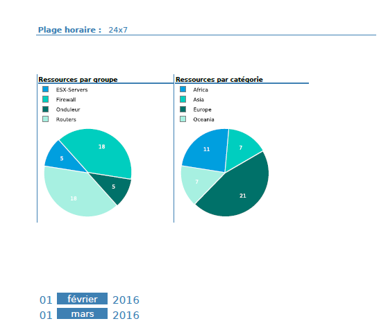

#### Première page

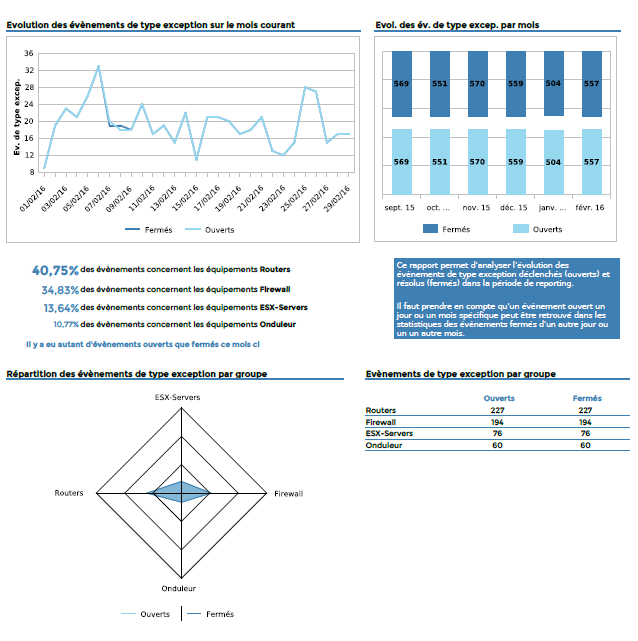

#### Deuxième page

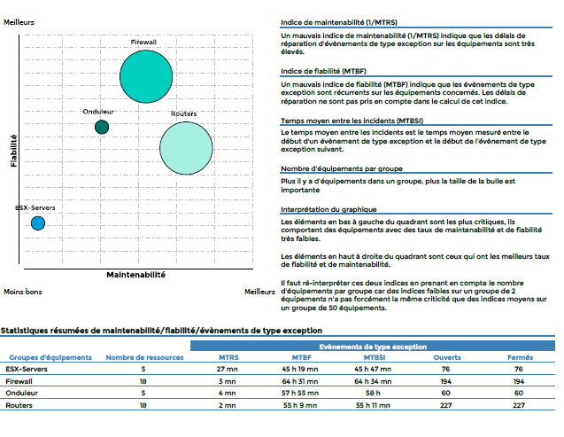

#### Pour chaque groupe

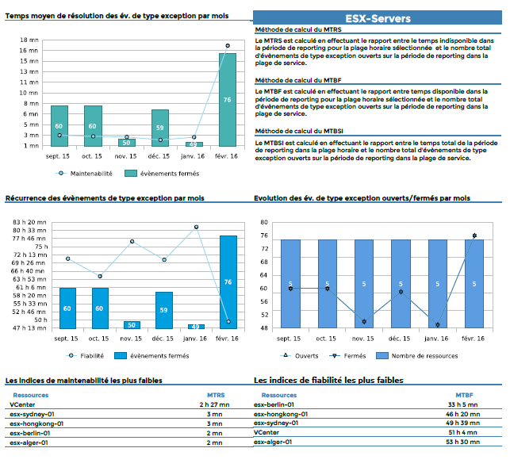

#### Paramètres

Les paramètres attendus dans ce rapport :

- Une periode de reporting
- Les objets Centreon suivant :

| Paramètres    | Type             | Description                                 |
| ------------- | ---------------- | ------------------------------------------- |
| Time period   | Liste déroulante | Plage horaire à utiliser                    |
| Host groups   | Multi sélection  | Sélection des groupes d'hôtes               |
| Host category | Multi sélection  | Catégories d'hôtes                          |
| Interval      | Champ texte      | Nombre de mois à afficher dans le graphique |

### Hostgroups-Availability-1

#### Description

Ce rapport affiche la disponibilité et les évènements de type exception
des hôtes et des services de plusieurs groupes d'hôtes. L'évolution de
ces indicateurs est également présente.

#### Comment interpréter ce rapport

Sur la première page on trouve une vue d'ensemble des indicateurs de
disponibilité et d'évènements de type exception pour les hôtes et les
services de tous les groupes d'hôtes, par catégories d'hôtes.

Deux pages sont ensuite générées pour chaque groupe d'hôtes :

- La première contient des graphiques d'évolution sur les indispobilités et les
  évènements de type exception des services et des hôtes du groupe
- La deuxième contient des TOP sur les hôtes les plus critiques en terme
  d'indisponibilité et d'évènements.

#### Première page

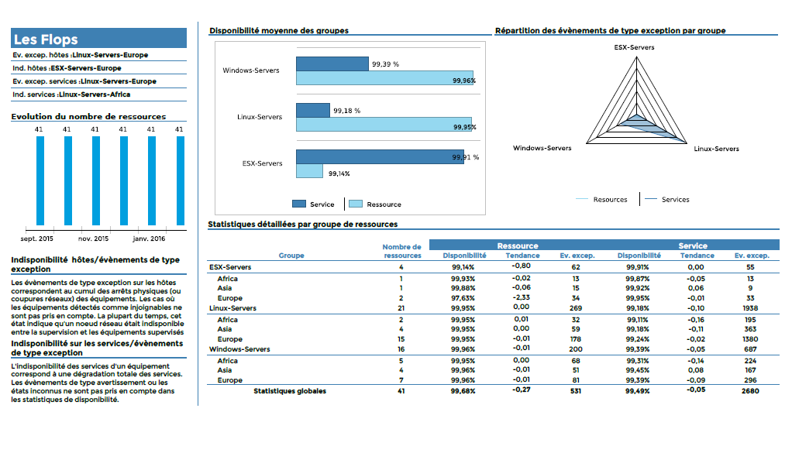

#### Pour chaque groupe d'hôtes

##### Première page

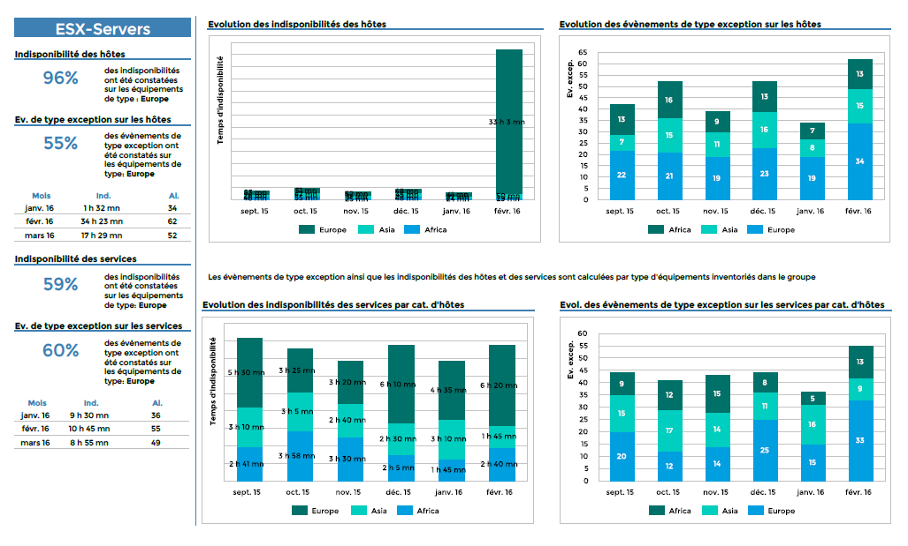

##### Deuxième page

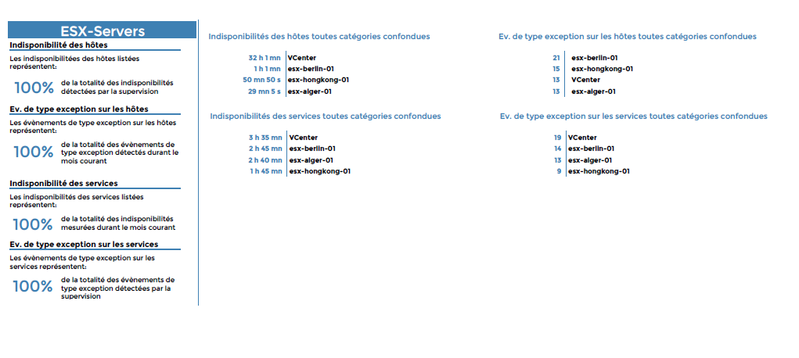

#### Paramètres

Les paramètres attendus dans ce rapport :

- Une periode de reporting
- Les objets Centreon suivant :

| Paramètres       | Type             | Description                                 |
| ---------------- | ---------------- | ------------------------------------------- |
| Time period      | Liste déroulante | Plage horaire à utiliser                    |
| Host groups      | Multi sélection  | Sélection des groupes d'hôtes               |
| Host category    | Multi sélection  | Catégories d'hôtes                          |
| Service category | Multi sélection  | Catégories de services                      |
| Interval         | Champ texte      | Nombre de mois à afficher dans le graphique |

### Hostgroup-Availability-2

Ce rapport donne la disponibilité et les évènements de type exception
d'un groupe d'hôtes.

#### Comment interpréter ce rapport

Sur la première page, l'évolution de la disponibilité et des évènements
de type exception est affichée pour les hôtes et les services du groupe.
L'évolution du nombre d'hôtes dans le groupe est également affichée.

Sur la deuxième page, la disponibilité et les alarmes des évènements de
type exception sont affichés par catégorie. De plus, des TOP 15 des
équipements les moins disponibles et ayant générés le plus d'évènements
sont affichés.

On retrouve sur les deux dernières pages la disponibilité et les
évènements de type exception sur les serivces. Les informations sont
réparties par catégories d'hôtes et de services. Des TOP 15 des
équipements sur lesquels il y a eu le plus d'évènements et
d'indisponibilité des services sont affichés.

#### Première page

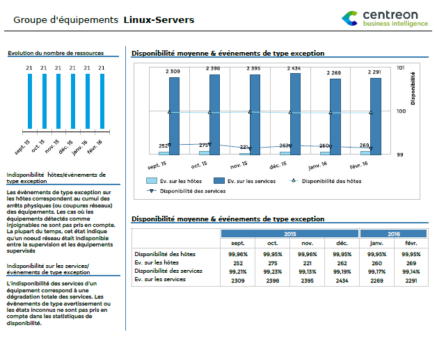

#### Deuxième page

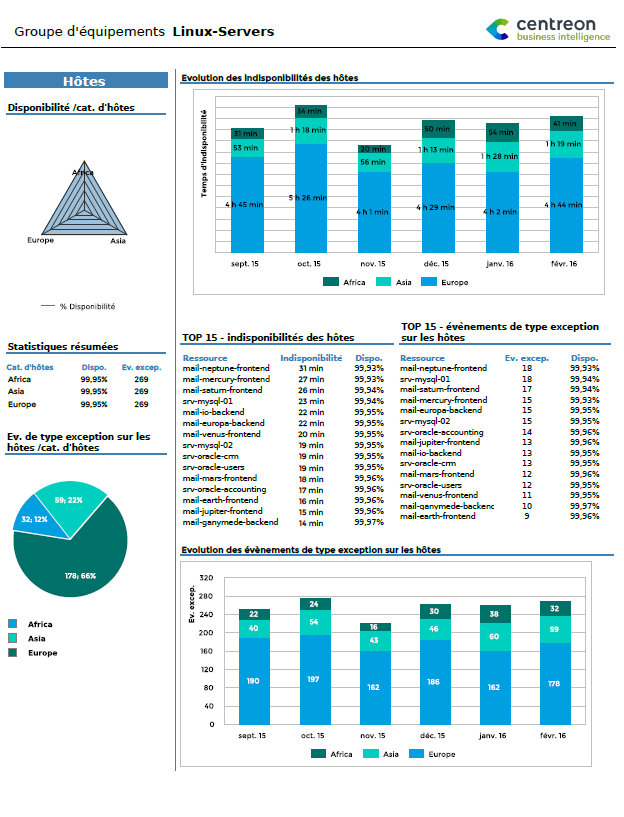

#### Troisième & quatrième pages

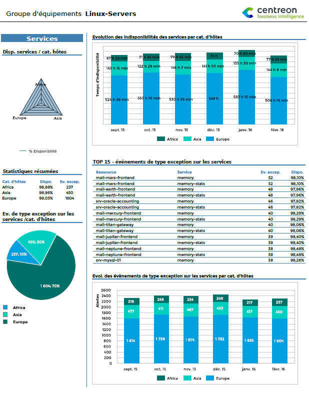

et

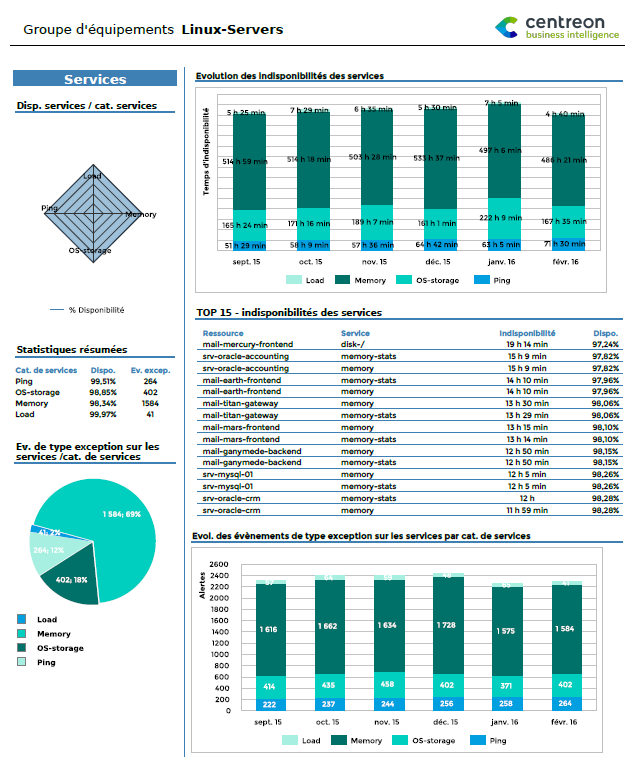

#### Paramètres

Les paramètres attendus dans ce rapport :

- Une periode de reporting
- Les objets Centreon suivant :

| Paramètres       | Type             | Description                                   |
|------------------|------------------|-----------------------------------------------|
| Time period      | Liste déroulante | Plage horaire à utiliser                      |
| Host group       | Liste déroulante | Sélection du groupe d’hôtes                   |
| Host category    | Multi sélection  | Catégories d’hôtes                            |
| Service category | Multi sélection  | Catégories de services                        |
| Interval         | Champ texte      | Nombre de mois à afficher dans les graphiques |

### Hostgroup-Host-Availability-List

Ce rapport est un tableau listant des informations des disponibilités et
d'évènements de type exception pour les hôtes d'un groupe d'hôtes.

#### Comment interpréter ce rapport

Pour chaque équipement sont affichés :le pourcentage de disponibilité,
le temps indisponible, le nombre d'évènements et les évolutions par
rapport à la période précédente.

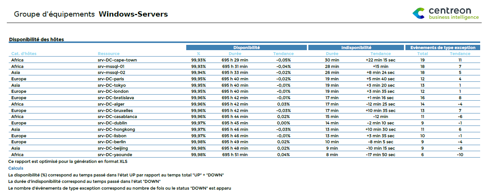

#### Paramètres

Les paramètres attendus dans ce rapport :

- Une periode de reporting
- Les objets Centreon suivant :

| Paramètres    | Type             | Description                 |
|---------------|------------------|-----------------------------|
| Time period   | Liste déroulante | Plage horaire à utiliser    |
| Host group    | Liste déroulante | Sélection du groupe d’hôtes |
| Host category | Multi sélection  | Catégories d’hôtes          |

### Hostgroup-Host-Event-List

Ce rapport affiche un listing des évènements non informatifs sur les
équipements d'un groupe d'hôtes.

#### Comment interpréter ce rapport

Ce rapport donne des statistiques détaillées sur les évènements : date
de début, date de fin, temps avant acquittement, "real MTRS",
"effective MTRS".

- *real MTRS* : temps total de résolution de l'évènement à partir de
  sa détection dans la plage horaire considérée
- *effective MTRS* : temps total de résolution de l'évènement à partir
  de sa détection et uniquement calculé dans la plage horaire
  considérée

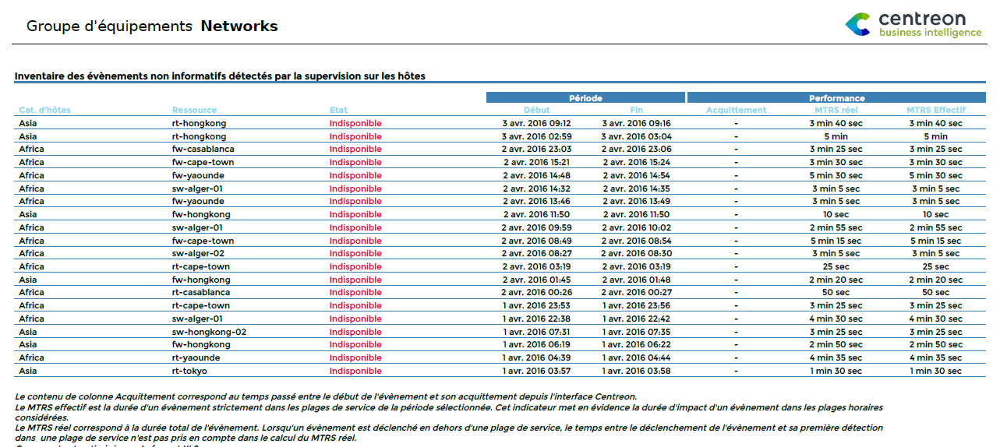

#### Paramètres

Les paramètres attendus dans ce rapport :

- Une periode de reporting
- Les objets Centreon suivant :

| Paramètres    | Type             | Description                 |
|---------------|------------------|-----------------------------|
| Time period   | Liste déroulante | Plage horaire à utiliser    |
| Host group    | Liste déroulante | Sélection du groupe d’hôtes |
| Host category | Multi sélection  | Catégories d’hôtes          |

### Hostgroup-Service-Availability-List

Ce rapport affiche un listing des disponibilités et des évènements sur
les services d'un groupe d'hôtes.

#### Comment interpréter ce rapport

Pour chaque service du groupe on retrouve : la disponibilité, le temps
d'indisponibilité, les évènements de type avertissement et exception
ainsi que l'évolution de ces différents indicateurs.

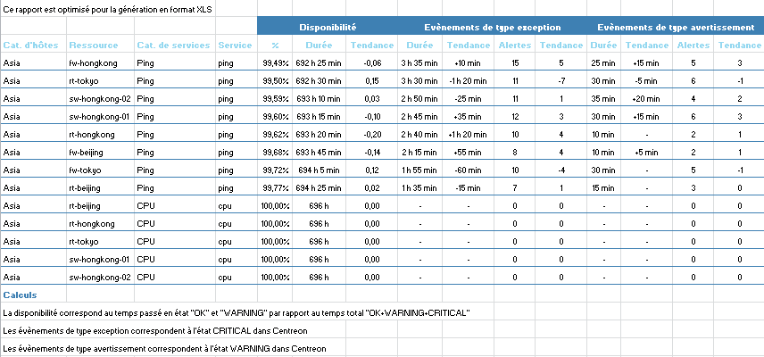

#### Paramètres

Les paramètres attendus dans ce rapport :

- Une periode de reporting
- Les objets Centreon suivant :

| Paramètres       | Type             | Description                          |
|------------------|------------------|--------------------------------------|
| Time period      | Liste déroulante | Plage horaire à utiliser             |
| Host group       | Liste déroulante | Sélection du groupe d’hôtes          |
| Host category    | Multi sélection  | Sélection des catégorie d’hôtes      |
| Service category | Multi sélection  | Sélection des catégories de services |

### Hostgroup-Service-Event-List

Ce rapport affiche un listing des évènements non informatifs sur les
services d'un groupe d'hôtes.

#### Comment interpréter ce rapport

Ce rapport donne des statistiques détaillées sur les évènements : date
de début, date de fin, temps avant acquittement, "real MTRS",
"effective MTRS".

- *real MTRS* : temps total de résolution de l'évènement à partir de
  sa détection dans la plage horaire considérée
- *effective MTRS* : temps total de résolution de l'évènement à partir
  de sa détection et uniquement calculé dans la plage horaire
  considérée

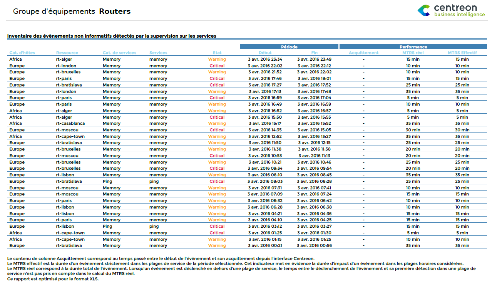

#### Paramètres

Les paramètres attendus dans ce rapport :

- Une periode de reporting
- Les objets Centreon suivant :

| Paramètres       | Type             | Description                 |
|------------------|------------------|-----------------------------|
| Time period      | Liste déroulante | Plage horaire à utiliser    |
| Host group       | Liste déroulante | Sélection du groupe d’hôtes |
| Host category    | Multi sélection  | Catégories d’hôtes          |
| Service category | Multi sélection  | Catégories de services      |

### Hostgroup-Service-Incident-Resolution-2

Pour un groupe d'hôte, ce rapport affiche les taux d'acquittement et
de résolution des évènements, les évènements les plus longues, les
incidateurs les moins fiables ainsi que les équipements générants le
plus de d'évènements.

#### Comment interpréter ce rapport

Le premier objet de ce rapport affichent le pourcentage d'évènements
acquittées et résolues dans un délai donné en paramètre

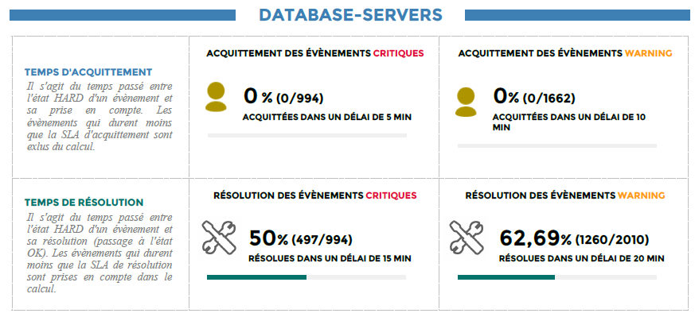

Le second objet affiche un TOP x des évènements les plus longues, avec
pour chaque évènement, l'heure de début et de fin ainsi que le temps
mis pour sa résolution. En rouge les incidateurs dans un status
"critical". En orange les indicateurs "warning", et en gris les
incidateurs "unknown".

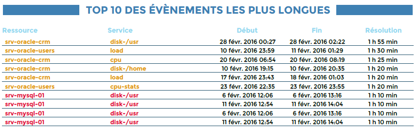

Le troisième objet de ce rapport représente un TOP x des indicateurs les
moins fiables.

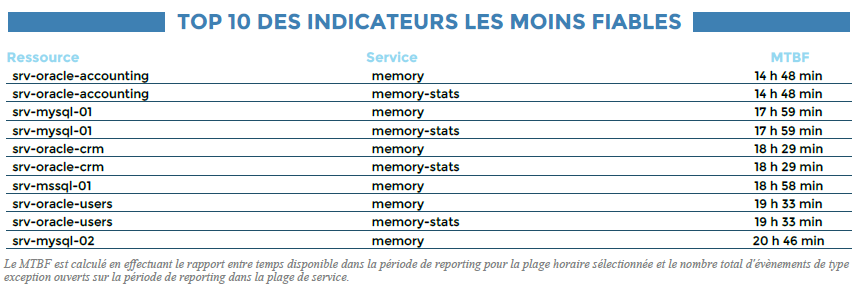

Enfin, un dernier TOP représentera les équipements générants le plus
d'évènements.

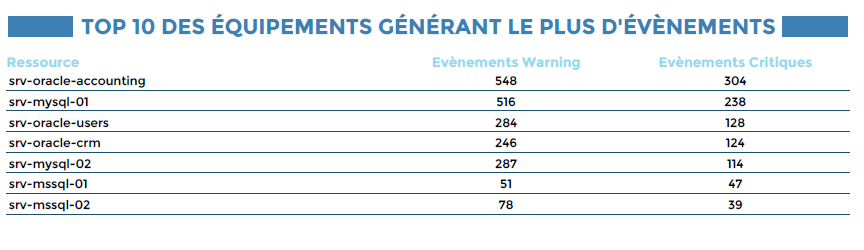

#### Paramètres

Les paramètres attendus dans ce rapport :

- Une periode de reporting
- Une SLA d'acquittement en minutes
- Une SLA de résolution en minutes
- Le nombre de lignes à afficher dans les TOP
- Les objets Centreon suivant :

| Paramètres       | Type             | Description                 |
|------------------|------------------|-----------------------------|
| Time period      | Liste déroulante | Plage horaire à utiliser    |
| Host group       | Liste déroulante | Sélection du groupe d’hôtes |
| Host category    | Multi sélection  | Catégories d’hôtes          |
| Service category | Multi sélection  | Catégories de services      |

### Hostgroup-Host-Pareto

Ce rapport met en évidence les hôtes responsables du plus grand nombre
d'évènements de type exception (statut DOWN) dans un groupe
d'équipements. La représentation est faite sous forme de diagramme de
pareto.

#### Comment interpréter ce rapport

Les hôtes resposables de 80% des évènements sont mis en avant dans ce
rapport (couleurs dans le graphique). Ils sont triés par ordre
décroissant en termes de nombre d'évènements générés. Le pourcentage
des évènements cumulé au fur et à mesure est aussi représenté.

Ce rapport permet donc de prendre des mesures correctrices sur les bons
hôtes en exploitant le principe de Pareto ou encore la loi des 80-20 :
environ 80 % des effets sont le produit de 20 % des causes.

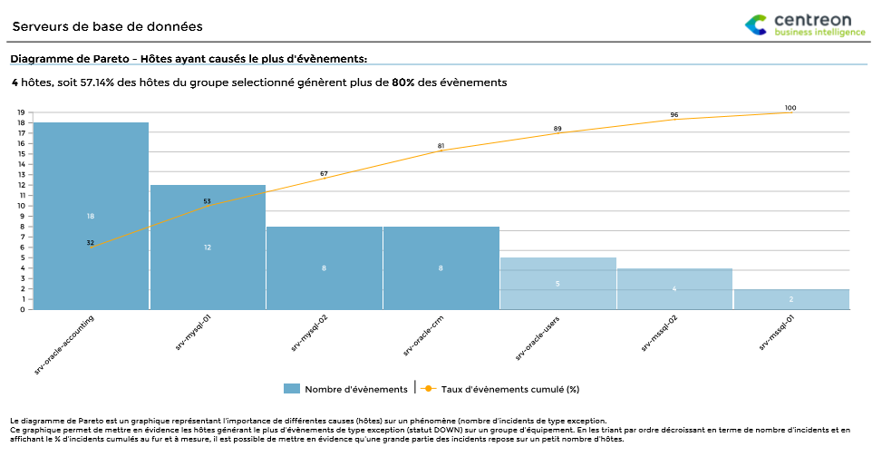

#### Paramètres

Les paramètres attendus dans ce rapport :

- Une periode de reporting
- Les objets Centreon suivant :

| Paramètres    | Type             | Description                 |
|---------------|------------------|-----------------------------|
| Time period   | Liste déroulante | Plage horaire à utiliser    |
| Host group    | Liste déroulante | Sélection du groupe d’hôtes |
| Host category | Multi sélection  | Catégories d’hôtes          |

### Hostgroups-Host-Current-Events

Ce rapport affiche les évènements en cours sur les hôtes au moment de sa
génération.

#### Comment interpréter ce rapport

Le rapport est composé de quatre parties, dans chaque partie, il est
possible de sélectionner un périmètre restreint en filtrant sur des
groupes d'hôtes et catégories de d'hôtes. Les données affichées sont
des données temps réel du moment de la génération.

- Les évènements en cours peuvent être triés par: état, durée et hôtes.
- Il est possible d'afficher / filtrer les hôtes acquittés ou en downtime.
- Seuls les évènements dans un état confirmé (hard) sont pris en compte dans le
  rapport.
- Il est possible générer le rapport sur moins de 4 parties, pour cela il suffit
  de renseigner la valeur -1 dans le titre dans la partie non utilisée

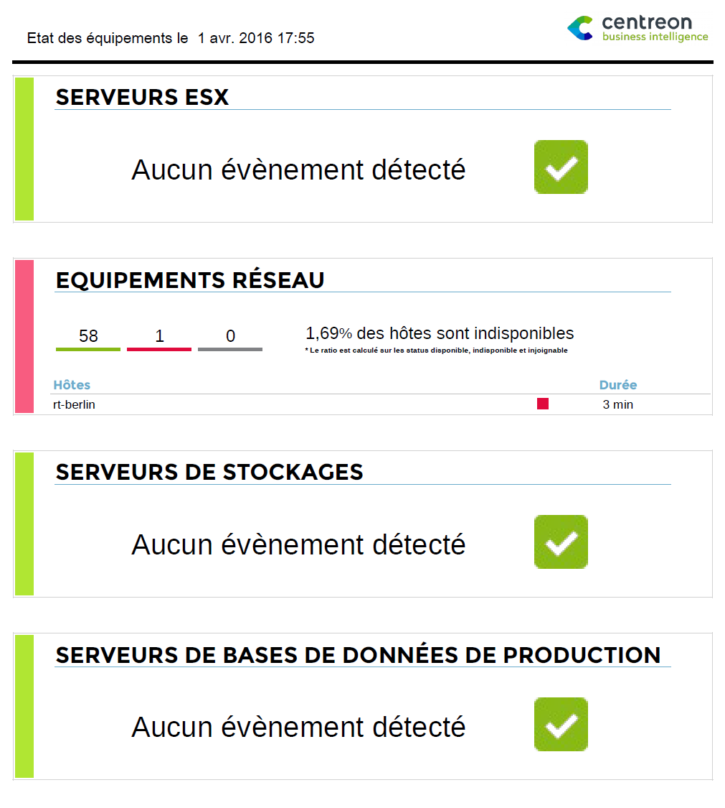

#### Paramètres

Les paramètres attendus dans ce rapport :

| Paramètres         | Type            | Description                                                     |
|--------------------|-----------------|-----------------------------------------------------------------|
| title              | Champs texte    | titre de la première partie du rapport                          |
| Hostgroups         | Multi sélection | Sélection des groupe d’hôtes de la partie 1 du rapport          |
| Host category      | Multi sélection | Catégories d’hôtes de la partie 1 du rapport                    |
| title              | Champs texte    | titre de la seconde partie du rapport                           |
| Hostgroups         | Multi sélection | Sélection des groupe d’hôtes de la partie 2 du rapport          |
| Host category      | Multi sélection | Catégories d’hôtes de la partie 2 du rapport                    |
| title              | Champs texte    | titre de la troisième partie du rapport                         |
| Hostgroups         | Multi sélection | Sélection des groupe d’hôtes de la partie 3 du rapport          |
| Host category      | Multi sélection | Catégories d’hôtes de la partie 3 du rapport                    |
| title              | Champs texte    | titre de la quatrième partie du rapport                         |
| Hostgroups         | Multi sélection | Sélection des groupe d’hôtes de la partie 4 du rapport          |
| Host category      | Multi sélection | Catégories d’hôtes de la partie 4 du rapport                    |
| sort\_by           | Radio bouton    | Permet de trier les résultats par état, durée ou hôte           |
| display\_ack       | Radio bouton    | Permet d’afficher ou de filtrer les hôtes acquittés             |
| display\_downtimes | Radio bouton    | Permet d’afficher ou de filtrer les hôtes dans un temps d’arrêt |

### Hostgroups-Service-Current-Events

Ce rapport affiche les évènements en cours sur les services au moment de
sa génération.

#### Comment interpréter ce rapport

Le rapport est composé de quatre parties, dans chaque partie, il est
possible de sélectionner un périmètre restreint en filtrant sur des
groupes d'hôtes, des catégories d'hôtes et de services. Les données
affichées sont des données temps réel du moment de la génération.

- Les évènements en cours peuvent être triés par: état, durée et hôtes.
- Il est possible d'afficher / filtrer les services acquittés ou en downtime.
- Il est possible de prendre en compte uniquement les services critiques.
- Seuls les évènements dans un état confirmé (hard) sont pris en compte dans le
  rapport.
- Il est possible générer le rapport sur moins de 4 parties, pour cela il suffit
  de renseigner la valeur -1 dans le titre dans la partie non utilisée

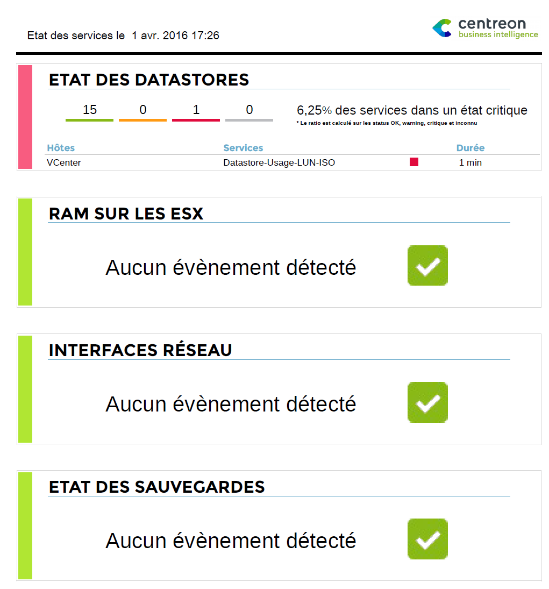

#### Paramètres

Les paramètres attendus dans ce rapport :

| Paramètres             | Type            | Description                                                        |
|------------------------|-----------------|--------------------------------------------------------------------|
| title                  | Champs texte    | titre de la première partie du rapport                             |
| Hostgroups             | Multi sélection | Sélection des groupe d’hôtes de la partie 1 du rapport             |
| Host category          | Multi sélection | Catégories d’hôtes de la partie 1 du rapport                       |
| Service category       | Multi sélection | Catégories de services de la partie 1 du rapport                   |
| title                  | Champs texte    | titre de la seconde partie du rapport                              |
| Hostgroups             | Multi sélection | Sélection des groupe d’hôtes de la partie 2 du rapport             |
| Host category          | Multi sélection | Catégories d’hôtes de la partie 2 du rapport                       |
| Service category       | Multi sélection | Catégories de services de la partie 2 du rapport                   |
| title                  | Champs texte    | titre de la troisième partie du rapport                            |
| Hostgroups             | Multi sélection | Sélection des groupe d’hôtes de la partie 3 du rapport             |
| Host category          | Multi sélection | Catégories d’hôtes de la partie 3 du rapport                       |
| Service category       | Multi sélection | Catégories de services de la partie 3 du rapport                   |
| title                  | Champs          | titre de la quatrième partie du                                    |
| Hostgroups             | Multi sélection | Sélection des groupe d’hôtes de la partie 4 du rapport             |
| Host category          | Multi sélection | Catégories d’hôtes de la partie 4 du rapport                       |
| Service category       | Multi sélection | Catégories de services de la partie 4 du rapport                   |
| sort\_by               | Radio bouton    | Permet de trier les résultats par état, durée ou hôte              |
| display\_ack           | Radio bouton    | Permet d’afficher ou de filtrer les services acquittés             |
| display–downtimes      | Radio bouton    | Permet d’afficher ou de filtrer les services dans un temps d’arrêt |
| display only\_critical | Radio bouton    | Permet d’afficher uniquement les services dans un état critique    |