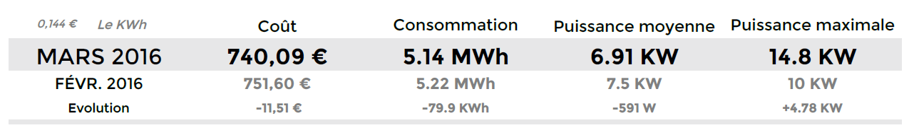
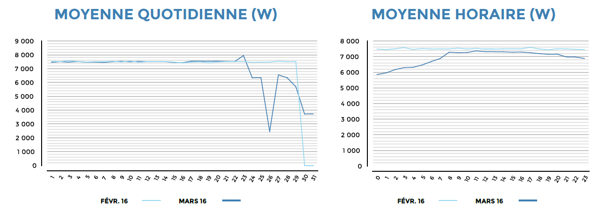
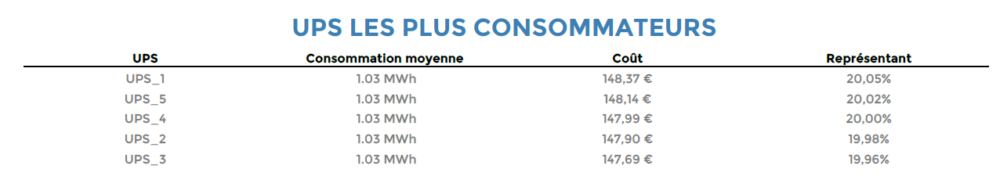
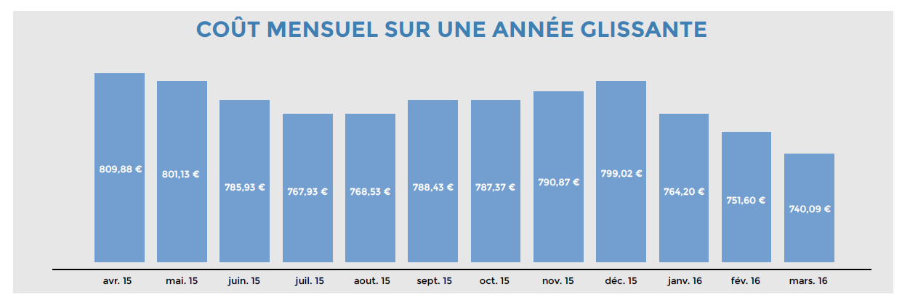

### Hostgroup-Electricity-Consumption-1

Ce rapport affiche les statisitques de la consommation éléctrique de vos
équipements branchés derrière un onduleur.

**Comment intérpréter le rapport?**

Le rapport prendra en entrée un groupe d'hôtes et des onduleurs, qui
seront filtrés sur des catégories d'hôtes, et la catégorie de services
contenant les services retournant la puissance en *watt* , prix du KWh,
pour afficher dans un premier tableau:

Le coût, la consommation , la puissance moyenne et la puissance maximale
sur le mois N, un rappel des mêmes valeurs sur le mois N-1, et
l'évolution entre le mois N et le mois N - 1.

Les 2 graphiques suivants affichent la répartition moyenne de la
puissance utilisée par heure de la journée et jour de mois, avec une
comparaison sur le mois N-1.

Ensuite, un TOP 5 des onduleurs les plus consommateurs, avec le
pourcentage de consommation de chaque UPS par rapport à la consommation
totale, la cossommation moyenne ainsi que le coût de chaque UPS sur le
mois.

> Si il y a plus de 5 onduleurs dans le groupe selectionné, seuls les 4
> les plus consommateurs seront affichés; la 5ème ligne regroupera le
> reste des onduleurs.

Enfin, l'évolution du coût total mensuel sur la dernière année.

#### Paramètres

Les paramètres attendus dans ce rapport :

- Une periode de reporting
- Les objets Centreon suivants:

| Paramètres                | Type             | Description                                                           |
|---------------------------|------------------|-----------------------------------------------------------------------|
| Time period               | Liste déroulante | Plage horaire à utiliser                                              |
| Host group                | Liste déroulante | Sélection du groupe d’hôte des UPS                                    |
| Host category             | Multi sélection  | Sélection des catégories d’hôtes à filter sur le groupe               |
| Service category          | Multi sélection  | Sélection des catégories de services contenant la puissance en sortie |
| Select metrics to include | Multi sélection  | Sélection la métrique retournant la puissance en sortie               |
| Prix KWh                  | Text             | Entrez le prix du KWh facturé par votre fournisseur                   |

#### Prérequis

Les prérequis pour faire fonctionner le rapport sont:

- Supervision de la puissance en sortie des onduleurs.
- Création d'une catégorie de services contenant l'ensemble des indicateurs
  retournant une puissance en sortie.
- Suffisament d'historique pour afficher les graphiques d'évolution.

La consommation d'un onduleur conrrespondera à la consommation de
l'esemble des équipements branchés derrière l'onduleur.
