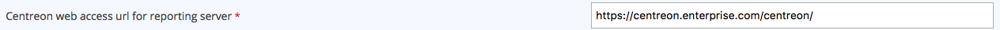
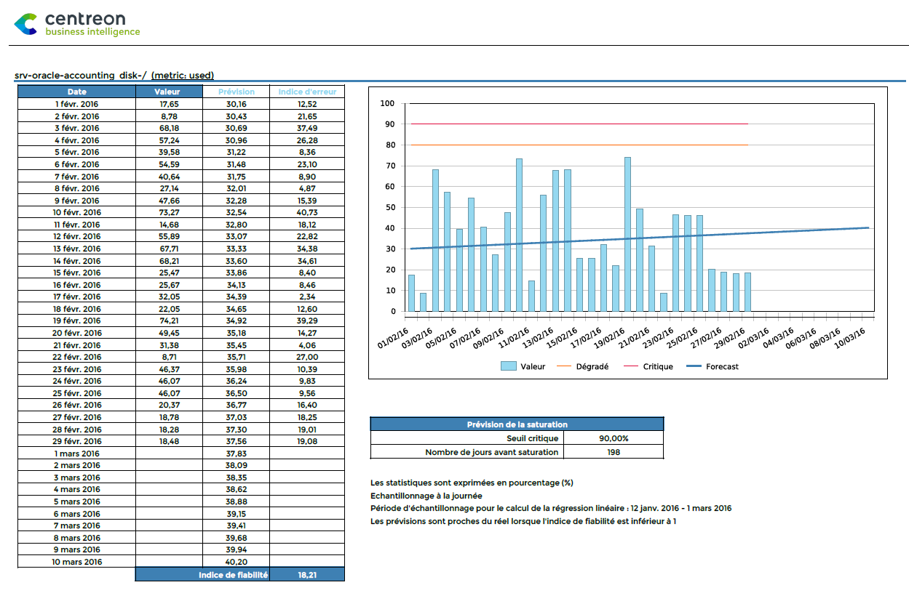
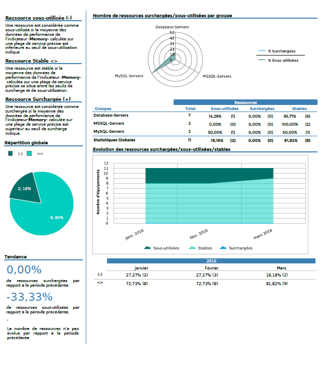
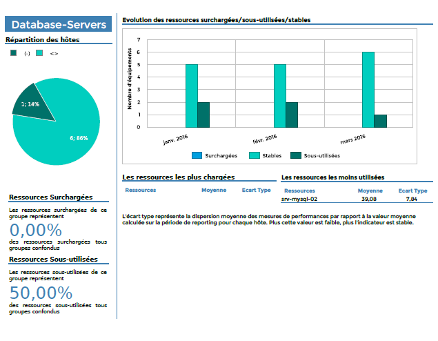
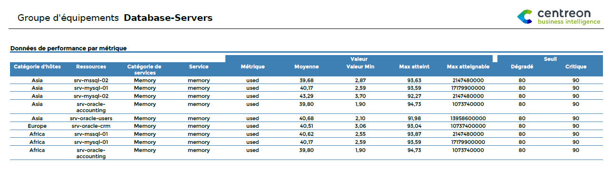
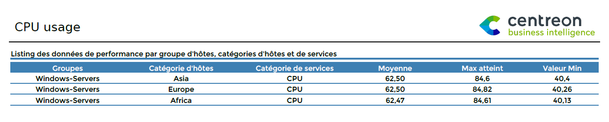

### Host-Graphs-V2

Ce rapport affiche les graphiques RRD des services d'un hôte pour les
catégories de services sélectionnées.


#### Paramètres

Les paramètres attendus par le rapport sont :

- La période de reporting
- Les objets Centreon suivant:

| Paramètres        | Type             | Description                                                                                                                   |
| ----------------- | ---------------- | ----------------------------------------------------------------------------------------------------------------------------- |
| Host              | Liste déroulante | Sélection de l'hôte                                                                                                           |
| Service category  | Liste déroulante | Catégorie de services                                                                                                         |
| Metric(s)         | Multi sélection  | Sélection des métriques à conserver. Si aucune métrique n'est selectionnée, les graphiques par métrique ne sont pas affichés. |
| Règle d'affichage | Check box        | Défini si les graphiques doivent être affichés pour chaque service, chaque métrique ou les deux                               |

#### Pre-requis

Configurez le champ ci-dessous à la page `Reporting > Business Intelligence >
General Options > Scheduler Options` :



Ce rapport depend de l'API de génération de graphique RRD de Centreon
qui est appelé en utilisant le champ ci-dessus. De ce fait, il doit être
possible d'effectuer une requête sur l'API en HTTP ou HTTPs *à partir
du serveur de reporting* et cela doit fonctionner.

Pour résumer un "curl" sur l'URL de l'API doit répondre sans erreur
de certificat, example :

``` shell
curl http://$CENTREON-IP-OR-DNS$/centreon/include/views/graphs/generateGraphs/generateImage.php?akey=$AUTH_KEY$&username=$USER$&hostname=$HOSTNAME$&service=$SERVICENAME$&start=$TIMESTAMPSTART$&end=$TIMESTAMPEND$
```

Remplacez par les bonnes valeurs les variable '$xxxx$'.

Exemple :

``` shell
http://centreon.enterprise.com//include/views/graphs/generateGraphs/generateImage.php?akey=af9c583c5f31bd2459c07&username=myUser&hostname=host-1&service=cpu&start=1490997600&end=1493157600
```

> Si votre serveur Central utilise SSL/TLS, et si le certificat est auto-signé
> ou signé par une autorité non reconnue, vous devez l'ajouter à la base
> des certificats de confiance :
>
> - Installer le paquet *ca-certificates* :
>
>   ``` shell
>   yum install -y ca-certificates
>   ```
>
> - Récupérer et stocker le certificat :
>
>   ``` shell
>   echo quit | openssl s_client -showcerts -servername <hostname> -connect <hostname>:<port> > /etc/pki/ca-trust/source/anchors/<hostname>.pem
>   ```
>
> La valeur de l'option *servername* doit être le nom d'hôte exact défini dans
> le certificat. Il doit aussi être le nom d'hôte défini dans l'interface web
> de Centreon et utilisé par le générateur des rapports pour contacter le
> serveur Central.
>
> - Recharger la base des certificats de confiance :
>
>   ```shell
>   update-ca-trust
>   ```
>
> CBIS doit être redémarré après ces actions.

### Hostgroup-Graphs-v2

Ce rapport affiche les graphiques RRD des services d'un groupe d'hôtes
pour les catégories de services sélectionnées.


#### Paramètres

Les paramètres attendus par le rapport sont :

- La période de reporting
- Les objets Centreon suivant:

| Paramètres        | Type             | Description                                                                                                                  |
| ----------------- | ---------------- | ---------------------------------------------------------------------------------------------------------------------------- |
| Host group        | Liste déroulante | Sélection du groupe d'hôtes                                                                                                  |
| Host category     | Multi sélection  | Catégories d'hôtes                                                                                                           |
| Service category  | Multi sélection  | Catégories de services                                                                                                       |
| Metric(s)         | Multi sélection  | Sélection des métriques à conserver. Si aucune métrique n'est selectionnée les graphiques par métrique ne sont pas affichés. |
| Règle d'affichage | Check box        | Défini si les graphiques doivent être affichés pour chaque service, chaque métrique ou les deux                              |

#### Pre-requis

Configurez le champ ci-dessous à la page *Reporting > Business
Intelligence > General Options > Scheduler Options* :


Ce rapport depend de l'API de génération de graphique RRD de Centreon
qui est appelé en utilisant le champ ci-dessus. De ce fait, il doit être
possible d'effectuer une requête sur l'API **à partir du serveur de
reporting** et cela doit fonctionner.

Exemple, à partir du serveur de reporting, le "curl" suivant doit
répondre et générer un fichier de type image :

``` shell
curl https://$CENTREON-IP-OR-DNS$/centreon/include/views/graphs/generateGraphs/generateImage.php?akey=$AUTH_KEY$&username=$USER$&hostname=$HOSTNAME$&service=$SERVICENAME$&start=$TIMESTAMPSTART$&end=$TIMESTAMPEND$
```

Remplacez par les bonnes valeurs les variable '$xxxx$'.

Exemple d'adresse :

``` shell
http://centreon.enterprise.com//include/views/graphs/generateGraphs/generateImage.php?akey=af9c583c5f31bd2459c07&username=myUser&hostname=host-1&service=cpu&start=1490997600&end=1493157600
```

> Si votre serveur Central utilise SSL/TLS, et si le certificat est auto-signé
> ou signé par une autorité non reconnu, vous devez ajouter l'ajouter à la base
> des certificats de confiance :
>
> - Installer le paquet *ca-certificates* :
>
>   ``` shell
>   yum install -y ca-certificates
>   ```
>
> - Récupérer et stocker le certificat :
>
>   ``` shell
>   echo quit | openssl s_client -showcerts -servername <hostname> -connect <hostname>:<port> > /etc/pki/ca-trust/source/anchors/<hostname>.pem
>   ```
>
> La valeur de l'option *servername* doit être le nom d'hôte exact défini dans
> le certificat. Il doit aussi être le nom d'hôte défini dans l'interface web
> de Centreon et utilisé par le générateur des rapports pour contacter le
> serveur Central.
>
> - Recharger la base des certificats de confiance :
>
>   ```shell
>   update-ca-trust
>   ```
>
> CBIS doit être redémarré après ces actions.

### Hostgroup-Capacity-Planning-Linear-Regression

Ce rapport affiche des graphiques d'évolution et de prévision des
performances des métriques pour un groupe d'hôtes.

#### Comment interpréter ce rapport

L'évolution de la valeur des métriques est affichée sur un graphique et
dans une table adjacente. Les prévisions sont calculées à partir des
valeurs prises sur la période ainsi que des valeurs avant la période de
reporting (paramètre Historical period in days...) et projetées sur le
futur, sur un nombre de jour défini en paramètre.



#### Paramètres

Les paramètres attendus dans ce rapport :

- Une periode de reporting
- Les objets Centreon suivant :

| Paramètres                                                    | Type             | Description                                                                                     |
|---------------------------------------------------------------|------------------|-------------------------------------------------------------------------------------------------|
| Time period                                                   | Liste déroulante | Plage horaire à utiliser                                                                        |
| Host group                                                    | Liste déroulante | Sélection du groupe d’hôtes                                                                     |
| Host category                                                 | Multi sélection  | Catégories d’hôtes                                                                              |
| Service category                                              | Multi sélection  | Catégories de services                                                                          |
| Metrics                                                       | Multi sélection  | Metriques à **inclure** dans le rapport                                                         |
| Historical period in days in addition of the reporting period | Champ texte      | Nombre de jours à prendre en compte **avant** la période de reporting pour calculer l’évolution |
| Forecast period in days                                       | Champ texte      | Nombre de jour sur lesquels projeter les valeurs                                                |

#### Pre-requis

Veillez à ce que les données de performance des métriques respectent
bien le format ci-dessous. Les valeurs maximum, warning et critique
doivent être présentes.

``` text
output-plugin | metric1=valeur(unité);seuil_warning;seuil_critique;minimum;maximum metric2=valeur ...
```

### Hostgroups-Rationalization-Of-Resources-1

Ce rapport permet d'avoir une vue d'ensemble de l'utlisation des
resources pour plusieurs groupes d'hôtes. L'idée ici étant d'établir
quelles sont les resources sous-utilisées, sur-chargées et combien sont
elles selon un critère paramétrable.

Sur la première page, la répartition en terme de charge est affichées
pour tous les groupes d'hôtes.

Une page pour chaque groupe d'hôtes est ensuite générée afin de
connaître la répartition par charge des équipements.

#### Page de résumé



#### Pour chaque groupe d'hôtes



#### Parameters

Les paramètes attendus par ce rapport sont :

- La période de reportin
- Les objets Centreon suivant:

| Parameter          | Parameter type   | Description                                                                                               |
|--------------------|------------------|-----------------------------------------------------------------------------------------------------------|
| Hostgroups         | Multi sélection  | Hostgroups à prendre en compte                                                                            |
| Host Categories    | Multi sélection  | Catégories d’hôtes                                                                                        |
| Service Categories | Liste déroulante | Catégorie de services                                                                                     |
| Metrics            | Multi sélection  | Métriques à utiliser                                                                                      |
| Time period        | Liste déroulante | Plage horaire à utiliser                                                                                  |
| Intervalle         | Champ texte      | Nombre de mois à afficher dans les graphiques                                                             |
| overloaded         | Champ texte      | Seuils haut à partir duquel la resources est considérée comment surchargée. *Unité: voir les pré-requis*  |
| underused          | Champ texte      | Seuils haut à partir duquel la resources est considérée comme sous-utilisée. *Unité: voir les pré-requis* |

#### Prerequisites

Ce rapport peut être généré sur un indicateur retournant une valeur maximum ou
non.

- Dans le cas d'un indicateur sans valeur maximum (ex: nombre de visiteurs), les
  seuils doivent être dans la **même unité** que l'indicateur (ex: nombre de
  visiteurs).
- Dans le cas d'un indicateurs possédant une valeur maximum est présente, les
  seuils doivent être en **pourcentage** (entre 0 et 100).

### Hostgroup-Service-Metric-Performance-List

Ce rapport affiche la valeur moyenne, les valeurs minimum & maximum
atteintes, la valeur maximum possible (lorsqu'elle existe) ainsi que
les seuils warning et critique pour toutes les métriques des services
correspondant au paramétrage.

- Si la valeur maximum est retournée par le plugin, les colonnes moyenne,
  minimum et maximum sont affichées en pourcentage (%). Le calcul est le suivant
  : valeur / valeur maximum.
- Si la valeur maximum n'est pas retournée par le plugin, les colonnes moyenne,
  minimum et maximum sont affichées dans l'unité de la métrique.



#### Paramètres

Les paramètres attendus dans ce rapport :

- Une periode de reporting
- Les objets Centreon suivant :

| Paramètres       | Type             | Description                             |
|------------------|------------------|-----------------------------------------|
| Time period      | Liste déroulante | Plage horaire à utiliser                |
| Host group       | Liste déroulante | Sélection du groupe d’hôtes             |
| Host category    | Multi sélection  | Catégories d’hôtes                      |
| Service category | Multi sélection  | Catégories de services                  |
| Metrics          | Multi sélection  | Metriques à **inclure** dans le rapport |

### Hostgroups-Categories-Performance-List

Ce rapport affiche la valeur moyenne, les valeurs minimum & maximum
atteintes par toutes les catégories de services et d'hôtes, par groupe
d'hôtes.

- Si la valeur maximum est retournée par le plugin, les colonnes
  moyenne, minimum et maximum sont affichées en pourcentage (%). Le
  calcul est le suivant : valeur / valeur maximum.
- Si la valeur maximum n'est pas retournée par le plugin, les
  colonnes moyenne, minimum et maximum sont affichées dans l'unité de
  la métrique.



#### Paramètres

Les paramètres attendus dans ce rapport :

- Une periode de reporting
- Les objets Centreon suivant :

| Paramètres       | Type             | Description                             |
|------------------|------------------|-----------------------------------------|
| Time period      | Liste déroulante | Plage horaire à utiliser                |
| Hosts group      | Multi sélection  | Sélection des groupes d’hôtes           |
| Host category    | Multi sélection  | Catégories d’hôtes                      |
| Service category | Multi sélection  | Catégories de services                  |
| Metrics          | Multi sélection  | Metriques à **inclure** dans le rapport |
