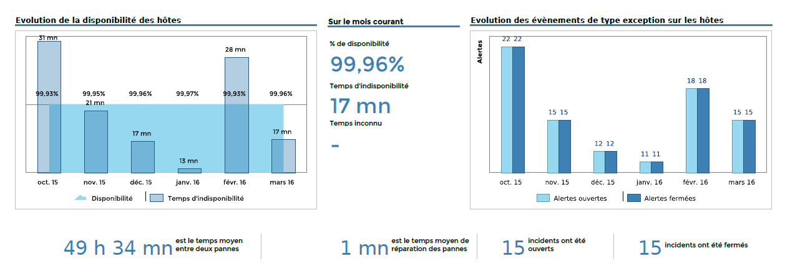
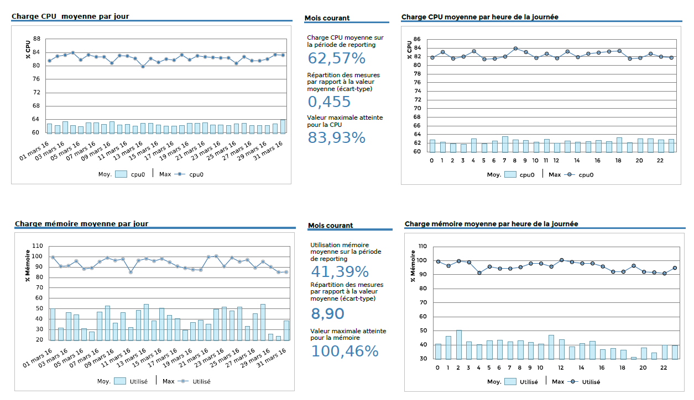
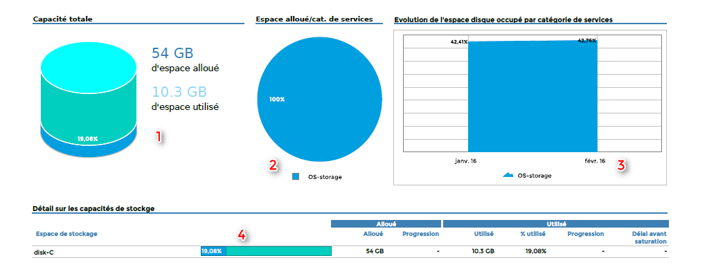
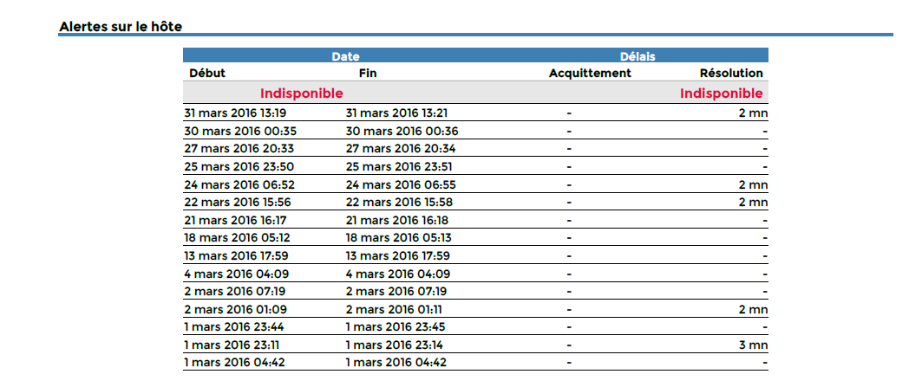
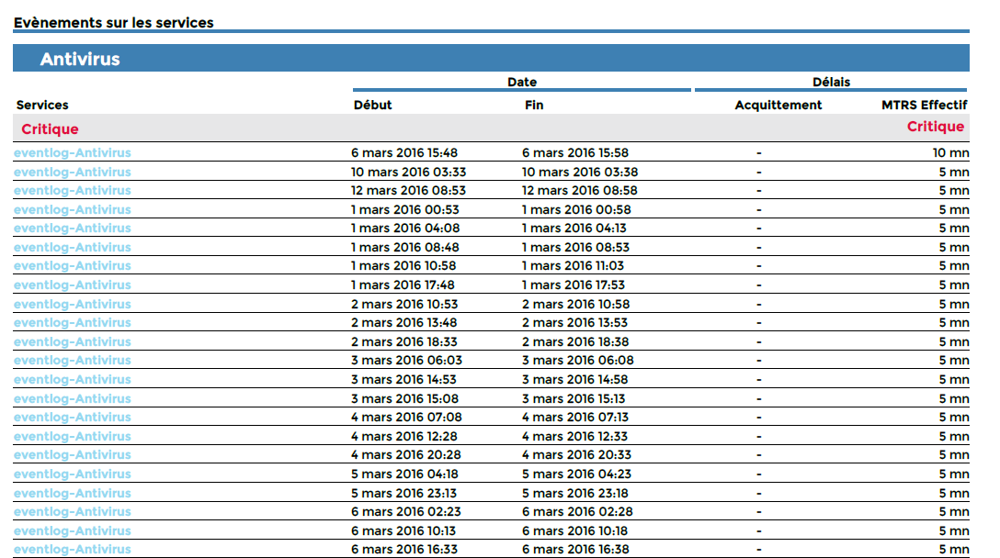
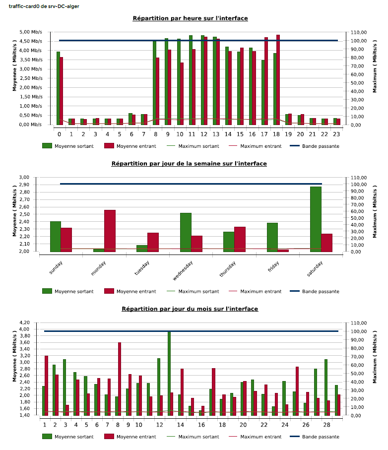

### Host-Detail-2

Ce rapport contient des statistiques de disponibilité, d'alarmes, de
stockage, de mémoire et de CPU pour un équipement (hôte).

Il est à utiliser lorsque vous souhaitez étudier le comportement d'un
équipement en particulier et que vous collectez les indicateurs suivant
sur cet hôte : Stockage, CPU et mémoire.

#### Comment interpréter ce rapport

La premiège page affiche les statistiques de disponibilité de
l'équipement.

La deuxième page affiche les statistiques de performance de
l'équipement (CPU et mémoire).

La troisième page affiche les statistiques de stockage par partition.

Enfin, une page d'annexe affiche toutes les alarmes apparues sur cet
hôte.

#### Première page



#### Deuxième page



#### Troisième page



1 - Statistique de stockage sur le dernier jour de la période de
reporting

2 - Statistique de stockage sur le dernier jour de la période de
reporting

3 - Statistique de stockage le dernier jour de chaque mois

4 - Statistique de stockage du dernier jour de la période comparé à la
veille du premier jour de la période

#### Annexe





#### Paramètres

Les paramètres attendus dans ce rapport :

- Une periode de reporting
- Les objets Centreon suivant :

| Paramètres               | Type             | Description                                              |
| ------------------------ | ---------------- | -------------------------------------------------------- |
| Time period              | Liste déroulante | Plage horaire à utiliser                                 |
| Interval                 | Champ texte      | Nombre de mois à afficher dans le graphique              |
| Host                     | Liste déroulante | Sélection de l'hôte                                      |
| CPU service category     | Liste déroulante | Catégorie de services contenant les services de CPU      |
| CPU metric(s)            | Multi sélection  | Sélection des métriques de CPU à utiliser                |
| Storage service category | Multi sélection  | Catégorie de services contenant les services de stockage |
| Storage Metric(s)        | Multi sélection  | Sélection des métriques de Stockage à utiliser           |
| Memory service category  | Liste déroulante | Catégorie de services contenant les services de mémoire  |
| Memory metric(s)         | Multi sélection  | Sélection des métriques de mémoire à utiliser            |

#### Pre-requis

Pour assurer la cohérence des données dans les graphiques et tableaux de
performance, certains pré-requis sont à respecter concernant le retour
des plugins.

Les données de performance retournées par les plugins de CPU, mémoire et
stockage doivent être formatées de cette manière :

``` text
output-plugin | metric1=valueunit;warning_treshold;critical_treshold;minimum;maximum metric2=value ...
```

Il est important de contrôler que la valeur maximum est bien retournée.
Enfin, assurez vous que les plugins de mémoire et de stockage retournent
des valeurs en Octet.

> **Important**
>
> Ce rapport est compatible avec la plage horaire 24x7 uniquement. Cette
> dernière doit aussi être configurée dans le menu "General options |
> Capacity statistic agregated by month | Live services for capacity
> statistics calculation"

### Host-Detail-3

Ce rapport contient des statistiques de disponibilité, d'alarmes, de
stockage, de mémoire, de CPU et de traffic pour un équipement (hôte).

Il est à utiliser lorsque vous souhaitez étudier le comportement d'un
équipement en particulier et que vous collectez les indicateurs suivant
sur cet hôte : Stockage, CPU, mémoire et traffic.

#### Comment interpréter ce rapport

La premiège page affiche les statistiques de disponibilité de l'équipement.

La deuxième page affiche les statistiques de performance de l'équipement
(CPU et mémoire).

La troisième page affiche les statistiques de stockage par partition.

La quatrième page affiche les statistiques de performance sur le traffic
entrant et sortant.

Enfin, une page d'annexe affiche toutes les alarmes apparues sur cet hôte.

#### Première page


#### Deuxième page


#### Troisième page


1 - Statistique de stockage sur le dernier jour de la période de
reporting

2 - Statistique de stockage sur le dernier jour de la période de
reporting

3 - Statistique de stockage le dernier jour de chaque mois

4 - Statistique de stockage du dernier jour de la période comparé à la
veille du premier jour de la période

#### Quatrième page



#### Annexe


#### Paramètres

Les paramètres attendus dans ce rapport :

- Une periode de reporting
- Les objets Centreon suivant :

| Paramètres               | Type             | Description                                                |
| ------------------------ | ---------------- | ---------------------------------------------------------- |
| Time period              | Liste déroulante | Plage horaire à utiliser                                   |
| Interval                 | Champ texte      | Nombre de mois à afficher dans le graphique                |
| Host                     | Liste déroulante | Sélection de l'hôte                                        |
| CPU service category     | Liste déroulante | Catégorie de services contenant les services de CPU        |
| CPU metric(s)            | Multi sélection  | Sélection des métriques de CPU à utiliser                  |
| Storage service category | Multi sélection  | Catégorie de services contenant les services de stockage   |
| Storage Metric(s)        | Multi sélection  | Sélection des métriques de Stockage à utiliser             |
| Memory service category  | Liste déroulante | Catégorie de services contenant les services de mémoire    |
| Memory metric(s)         | Multi sélection  | Sélection des métriques de mémoire à utiliser              |
| Traffic service category | Multi sélection  | Catégorie de services contenant les service traffic        |
| Traffic In metric        | Liste déroulante | Sélection de la métrique qui représente le traffic entrant |
| Traffic out metric       | Liste déroulante | Sélection de la métrique qui représente le traffic sortant |

#### Pre-requis

Pour assurer la cohérence des données dans les graphiques et tableaux de
performance, certains pré-requis sont à respecter concernant le retour
des plugins.

Les données de performance retournées par les plugins de CPU, mémoire,
traffic et stockage doivent être formatées de cette manière :

``` text
output-plugin | metric1=valueunit;warning_treshold;critical_treshold;minimum;maximum metric2=value ...
```

Il est important de contrôler que la valeur maximum est bien retournée.
Enfin, assurez vous que les plugins de mémoire et de stockage retournent
des valeurs en Octet; et les plugins de traffic retournent des valeurs
en Ko/s

> **Important**
>
> Ce rapport est compatible avec la plage horaire 24x7 uniquement. Cette
> dernière doit aussi être configurée dans le menu "General options |
> Capacity statistic agregated by month | Live services for capacity
> statistics calculation"

### Hostgroup-Host-Details-1

Pour un groupe d'équipement donné en entrée, Ce rapport affiche les
statistiques de disponibilité, d'alarmes, de stockage, de mémoire,de
CPU et de traffic pour chaque équipement présent dans le groupe.

#### Comment interpréter ce rapport

Pour chaque équipement, le rapport est divisé en quatre parties:

- La premiège partie affiche les statistiques de disponibilité de l'équipement.
- La deuxième partie affiche les statistiques de performance de l'équipement
  (CPU et mémoire).
- La troisième partie affiche les statistiques de stockage par partition.
- La quatrième partie affiche les statistiques et distribution du traffic
  entrant et sortant des interfaces de l'équipement.

#### Première partie


#### Deuxième partie


#### Troisième partie


1 - Statistique de stockage sur le dernier jour de la période de
reporting

2 - Statistique de stockage sur le dernier jour de la période de
reporting

3 - Statistique de stockage le dernier jour de chaque mois

4 - Statistique de stockage du dernier jour de la période comparé à la
veille du premier jour de la période

#### Quatrième partie


#### Paramètres

Les paramètres attendus dans ce rapport :

- Une periode de reporting
- Les objets Centreon suivant :

| Paramètres               | Type             | Description                                              |
| ------------------------ | ---------------- | -------------------------------------------------------- |
| Time period              | Liste déroulante | Plage horaire à utiliser                                 |
| Interval                 | Champ texte      | Nombre de mois à afficher dans le graphique              |
| Hostgroup                | Liste déroulante | Sélection du groupe d'hôtes                              |
| Host Category            | Multi sélection  | Sélection de catégories d'hôtes                          |
| CPU service category     | Liste déroulante | Catégorie de services contenant les services de CPU      |
| CPU metric(s)            | Multi sélection  | Sélection des métriques de CPU à utiliser                |
| Storage service category | Multi sélection  | Catégorie de services contenant les services de stockage |
| Storage Metric(s)        | Multi sélection  | Sélection des métriques de Stockage à utiliser           |
| Memory service category  | Liste déroulante | Catégorie de services contenant les services de mémoire  |
| Memory metric(s)         | Multi sélection  | Sélection des métriques de mémoire à utiliser            |
| Traffic service category | Liste déroulante | Catégorie de services contenant les services de traffic  |
| Traffic In metric        | Liste déroulante | Sélection de la métrique récupérant le traffic entrant   |
| Traffic Out metric       | Liste déroulante | Sélection de la métrique récupérant le traffic sortant   |

#### Pre-requis

Pour assurer la cohérence des données dans les graphiques et tableaux de
performance, certains pré-requis sont à respecter concernant le retour
des plugins.

Les données de performance retournées par les plugins de CPU, mémoire,
stockage et traffic doivent être formatées de cette manière :

``` text
output-plugin | metric1=valueunit;warning_treshold;critical_treshold;minimum;maximum metric2=value ...
```

Il est important de contrôler que la valeur maximum est bien retournée.
Enfin, assurez vous que les plugins de mémoire et de stockage retournent
des valeurs en Octet et ceux du traffic retournent des valeurs en Ko/s

> **Important**
>
> Ce rapport est compatible avec la plage horaire 24x7 uniquement. Cette
> dernière doit aussi être configurée dans le menu "General options |
> Capacity statistic agregated by month | Live services for capacity
> statistics calculation"
