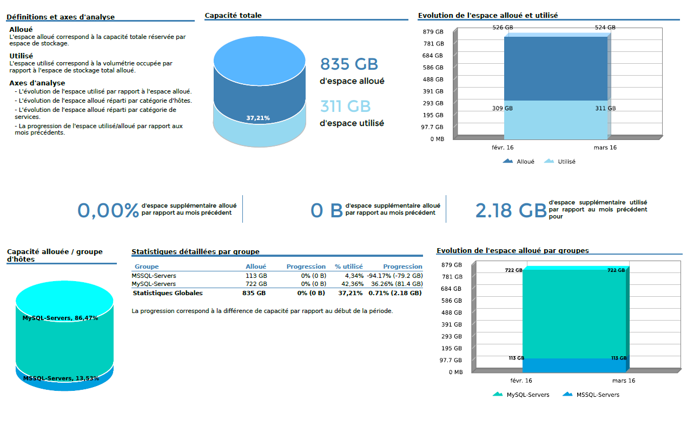
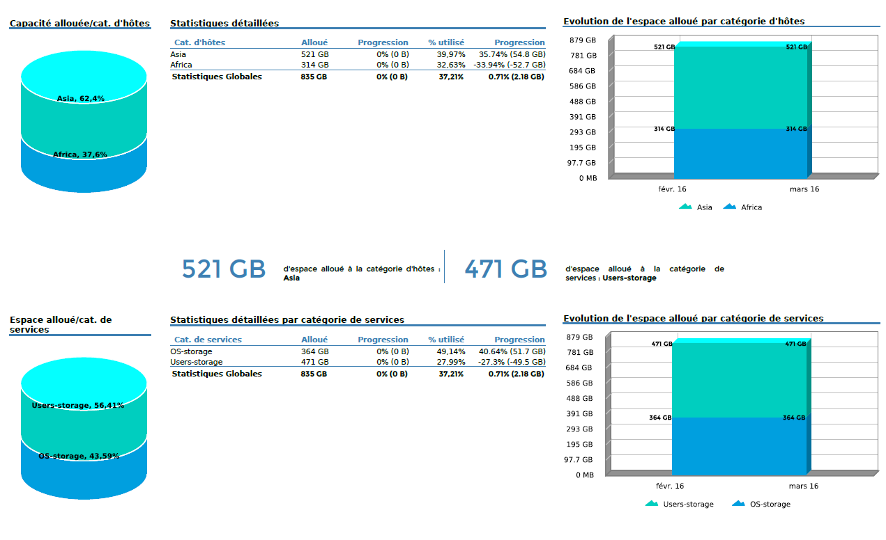
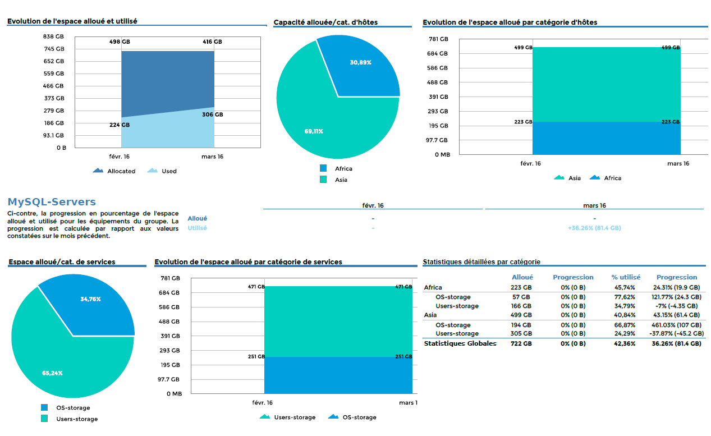
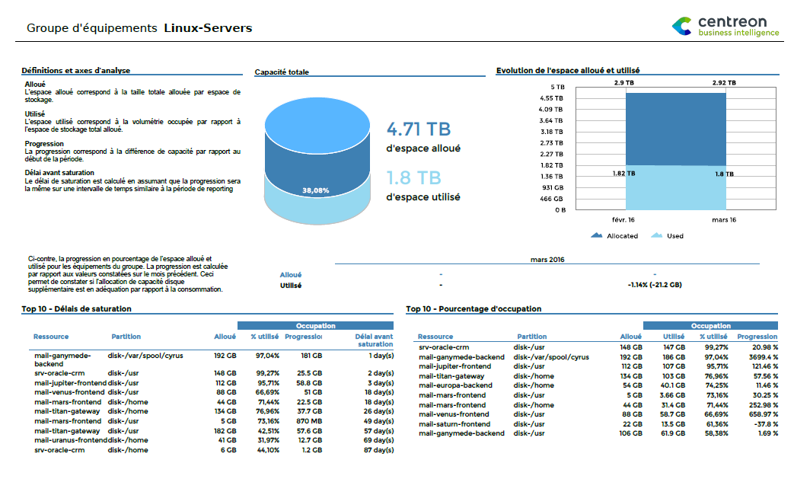
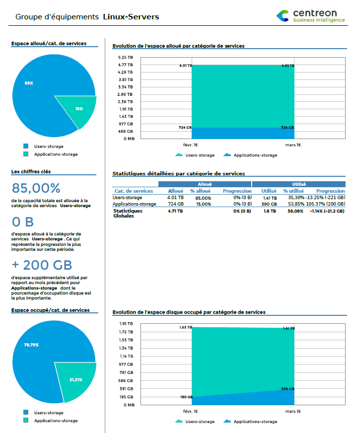
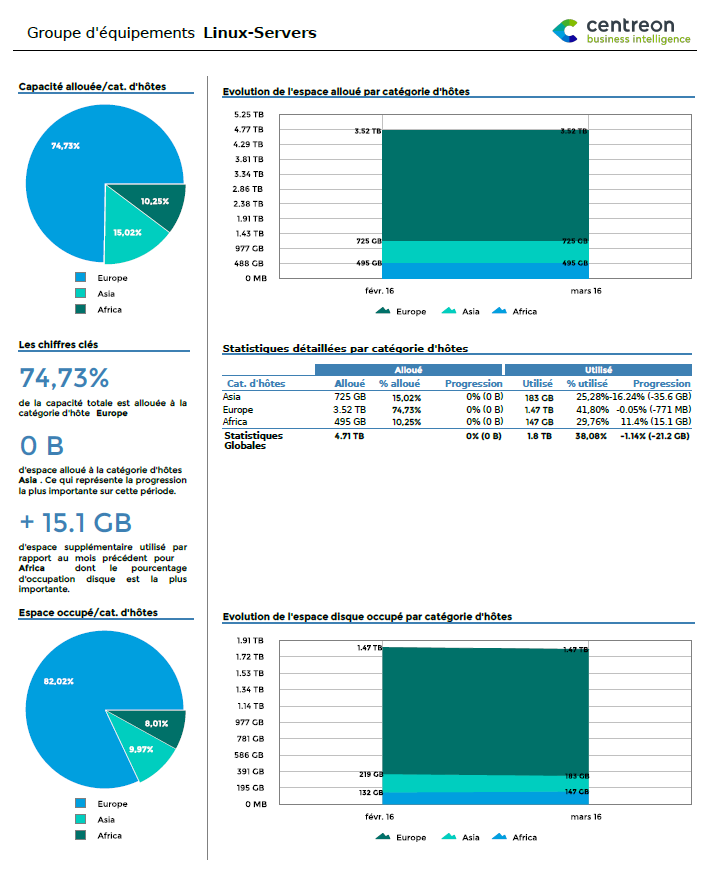
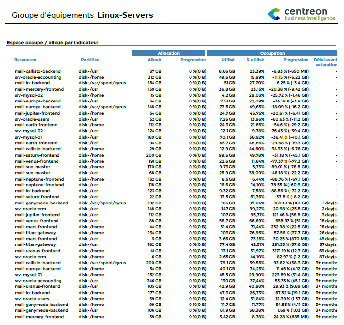
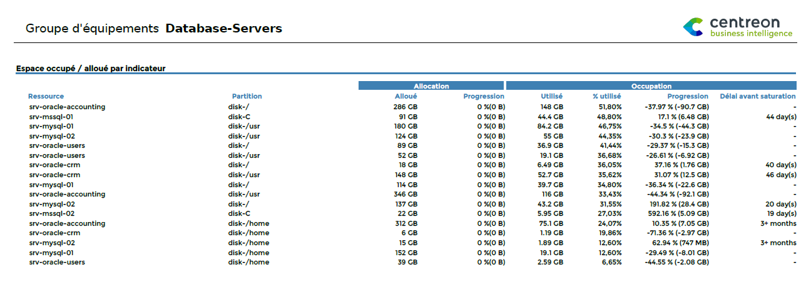

### Hostgroups-Storage-Capacity-1

Ce rapport affiche des statistiques d'allocation et d'utilisation des
espaces de stockage de plusieurs groupes d'hôtes.

#### Comment interpréter ce rapport

Sur la première page les informations sont résumées pour tous les groupes
d'hôtes, par groupe d'hôtes.

Sur la deuxième page, ces mêmes informations sont réparties par catégories
d'hôtes et de services.

Pour chaque groupe d'hôtes, les mêmes indicateurs sont repris et
affichés par catégories d'hôtes et de services.

#### Première page



#### Deuxième page



#### Pour chaque groupe d'hôtes



> Les statistiques affichées dans les tableaux et les graphques par mois
> correspondent aux valeurs mesurées le dernier jour des mois. Les
> statistiques de type "Snapshot" (en opposition aux évolutions par
> mois) correspondent aux valeurs des indicateurs mesurés le dernier jour
> de la période de reporting. Lorsqu'une évolution est affichée dans un
> tableau, il faut comprendre qu'elle est calculée en comparant la valeur
> du dernier jour de la période avec la valeur de la veille du premier
> jour de la période de reporting.

#### Paramètres

Les paramètres attendus dans ce rapport :

- Une periode de reporting
- Les objets Centreon suivant :

| Paramètres       | Type             | Description                                                            |
|------------------|------------------|------------------------------------------------------------------------|
| Time period      | Liste déroulante | Plage horaire à utiliser. /! Seule la plage 24x7 doit être utilisée /! |
| Host groups      | Multi sélection  | Sélection des groupes d’hôtes                                          |
| Host category    | Multi sélection  | Catégories d’hôtes                                                     |
| Service category | Multi sélection  | Catégories de services de **stockage**                                 |
| Metrics          | Multi sélection  | Metriques à **exclure** du le rapport                                  |
| Intervalle       | Champ texte      | Nombre de mois à afficher dans les graphiques                          |

#### Pré-requis

Pour assurer la cohérence des données dans les graphiques et tableaux de
performance, certains pré-requis sont à respecter concernant le retour
des plugins.

Les données de performance retournées par les plugins de stockage
doivent être formatées de cette manière :

``` text
output-plugin | metric1=valueunit;warning_treshold;critical_treshold;minimum;maximum metric2=value ...
```

Il est important de contrôler que la valeur maximum est bien retournée.
Enfin, assurez vous que les plugins de stockage retournent des valeurs
en Octet.

> **Important**
>
> - Le paramétrage de l'ETL doit comprendre les catégories de services de
>   stockage. Dans le cas contraire, les graphiques d'évolutions sont
>   vides.
> - Ce rapport est uniquement compatible avec la plage horaire 24x7. Cette
>   dernière doit aussi être configurée dans le menu "General options |
>   Capacity statistic agregated by month | Live services for capacity
>   statistics calculation"

### Hostgroup-Storage-Capacity-2

Ce rapport fourni des statistiques détaillées sur les espaces de
stockage d'un groupe d'hôtes.

#### Comment interpréter ce rapport

Sur la première page, une information agrégée au niveau du groupe
d'hôtes est disponible. On y retrouve l'espace total utilisé et alloué
ainsi que l'évolution de ces valeurs. On y trouve également 2 tableaux
de type "TOP" affichant les espaces de stockage les plus critiques.

Sur la deuxième page on trouve des statistiques sur les espaces alloués
et occupés par catégorie de services puis sur la page suivante par
catégories d'hôtes.

Sur la quatrième page, un listing de tous les espaces de stockage du
groupe d'hôtes est disponible. On y retrouve des informations sur les
espaces alloués et utilisés, leur évolution et leur nombre de jours
avant saturation.

#### Première page



#### Deuxième page



#### Troisième page



#### Quatrième page



#### Paramètres

Les paramètres attendus dans ce rapport :

- Une periode de reporting
- Les objets Centreon suivant :

| Paramètres       | Type             | Description                                                            |
|------------------|------------------|------------------------------------------------------------------------|
| Time period      | Liste déroulante | Plage horaire à utiliser. /! Seule la plage 24x7 doit être utilisée /! |
| Host group       | Liste déroulante | Sélection du groupe d’hôtes                                            |
| Host category    | Multi sélection  | Catégories d’hôtes                                                     |
| Service category | Multi sélection  | Catégories de services de **stockage**                                 |
| Metrics          | Multi sélection  | Metriques à **exclure** du le rapport                                  |
| Intervalle       | Champ texte      | Nombre de mois à afficher dans les graphiques                          |

#### Pre-requis

Pour assurer la cohérence des données dans les graphiques et tableaux de
performance, certains pré-requis sont à respecter concernant le retour
des plugins.

Les données de performance retournées par les plugins de stockage
doivent être formatées de cette manière :

``` text
output-plugin | metric1=valueunit;warning_treshold;critical_treshold;minimum;maximum metric2=value ...
```

Il est important de contrôler que la valeur maximum est bien retournée.
Enfin, assurez vous que les plugins de stockage retournent des valeurs
en Octet.

> **Important**
>
> - Le paramétrage de l'ETL doit comprendre les catégories de services de
>   stockage. Dans le cas contraire, les graphiques d'évolutions sont
>   vides.
> - Ce rapport est compatible avec la plage horaire 24x7 uniquement. Cette
>   dernière doit aussi être configurée dans le menu "General options |
>   Capacity statistic agregated by month | Live services for capacity
>   statistics calculation"

### Hostgroup-Storage-Capacity-List

Ce rapport est un listing des espaces de stockage d'un groupe d'hôtes.

#### Comment interpréter ce rapport

Pour chaque espace de stockage, des informations détaillées sur
l'espace alloué, utilisé, leurs évolutions relative ainsi que le nombre
de jours avant saturation (estimation basée sur les données de la
période)



#### Paramètres

Les paramètres attendus dans ce rapport :

- Une periode de reporting
- Les objets Centreon suivant :

| Paramètres       | Type             | Description                                                            |
|------------------|------------------|------------------------------------------------------------------------|
| Time period      | Liste déroulante | Plage horaire à utiliser. /! Seule la plage 24x7 doit être utilisée /! |
| Host group       | Liste déroulante | Sélection du groupe d’hôtes                                            |
| Host category    | Multi sélection  | Catégories d’hôtes                                                     |
| Service category | Multi sélection  | Catégories de services de **stockage**                                 |
| Metrics          | Multi sélection  | Metriques à **exclure** du le rapport                                  |

#### Pre-requis

Pour assurer la cohérence des données dans les graphiques et tableaux de
performance, certains pré-requis sont à respecter concernant le retour
des plugins.

Les données de performance retournées par les plugins de stockage
doivent être formatées de cette manière :

``` text
output-plugin | metric1=valueunit;warning_treshold;critical_treshold;minimum;maximum metric2=value ...
```

Il est important de contrôler que la valeur maximum est bien retournée.
Enfin, assurez vous que les plugins de stockage retournent des valeurs en Octet.
