### VMWare-Cluster-Performances-1

Ce rapport présente les performances d'un cluster d'ESX en terme de
consommation CPU, utilisation mémoire, hébergement des machines
virtuelles et utilisation des datastores.

#### Comment interpréter ce rapport

Pour un cluster d'ESX et une période donnée en entrée, le rapport
affiche:

Sur la page 1:

Le nombre total des datastores présents sur le cluster, l'espace moyen
utilisé sur l'esemble des datastores en pourcentage et en octets, la
dernière valeur remontée sur la période, ainsi que l'espace total
alloué sur l'ensemble des datastores. Ces 3 dernières valeurs, une
évolution par rapport à la période précedente est affichée.

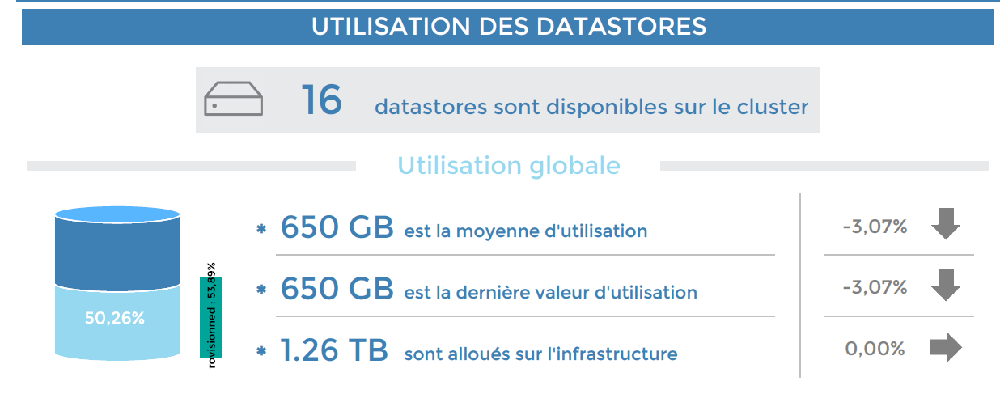

Ensuite, les 5 datastores les plus utlisés et les 5 datastores les moins
utilisés sont mis en évidence, avec pour chaque datastore: le
pourcentage d'utilisation,le maximum atteint ainsi que l'espace
alloué.

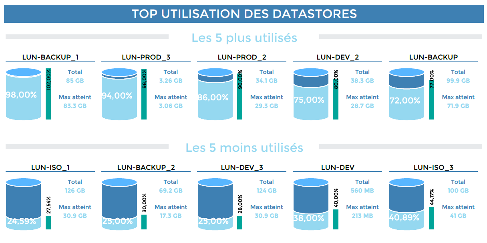

Enfin, toujours sur les datastores, ceux générant le plus et le moins
d'entrées/sorties par seconde en lecture et écriture sont mis en avant
dans des TOP 5 et des BOTTOM 5.

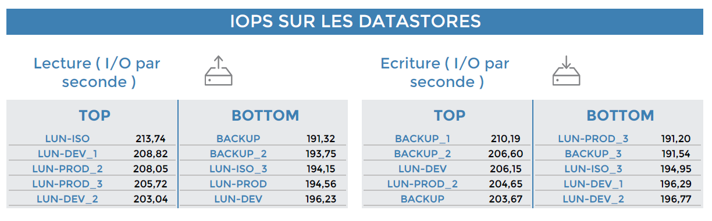

Sur la page 2:

La consommation CPU moyenne sur l'ensemble des ESXs du cluster ainsi
que l'evolution par rapport à la période précedente est affiché.

Les ESXs utilisants le consommant le plus de CPU et ceux consommant le
moins de CPU sont mis en avant, avec pour chaque ESXs, la moyenne
d'utilisation et la valeur maximale atteinte.

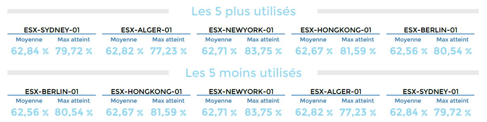

ensuite, l'utilisation moyenne de la mémoire vive sur l'ensemble des
ESXs du cluster ainsi ainsi que la mémoire totale allouée sont affichés:

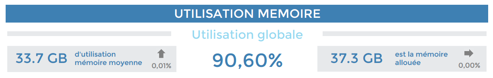

La mise en avant des ESXs utilisants le plus de RAM, et ceux utilisant
le moins de RAM, avec pour chaque ESX, l'utilisation moyenne sur la
période, la RAM totale disponible et la valeure maximale atteinte.

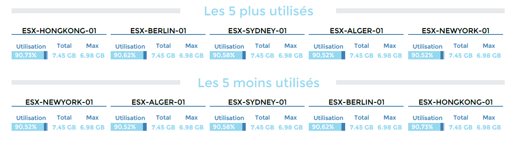

Enfin, des informations sur le nombre moyen de VMs allumées et éteintes
sur le cluster

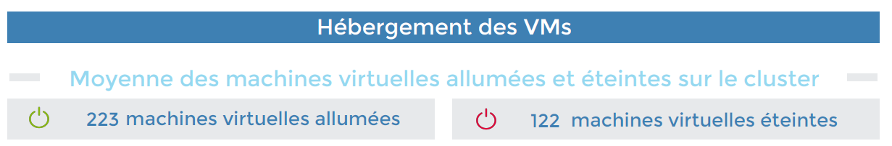

et la mise en avant des ESXs hébergeant le plus le moins de VMs allumées
et éteintes:

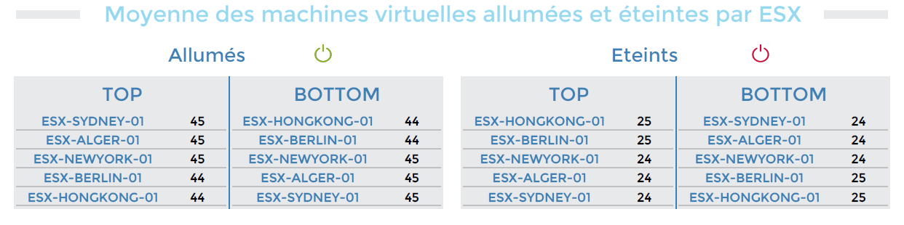

#### Paramètres

Les paramètres attendus dans ce rapport :

- Une periode de reporting
- Les objets Centreon suivant :

| Paramètres                 | Type             | Description                                                                                                                             |
|----------------------------|------------------|-----------------------------------------------------------------------------------------------------------------------------------------|
| Time period                | Liste déroulante | Plage horaire à utiliser                                                                                                                |
| Host group                 | Liste déroulante | Sélection du cluster                                                                                                                    |
| Host category              | Multi sélection  | Sélection des catégories d’hôtes à filter sur le cluster                                                                                |
| Datastore Service category | Multi sélection  | Sélection des catégories de services contenant l’utilisation datastores                                                                 |
| IOPs Service category      | Multi sélection  | Sélection des catégories de services contenant les IOPS des datastore                                                                   |
| CPU Service category       | Multi sélection  | Sélection des catégories de services contenant la CPU des ESXs                                                                          |
| Memory Service category    | Multi sélection  | Sélection des catégories de services contenant la mémoire des ESXs                                                                      |
| VM count Service category  | Multi sélection  | Sélection des catégories de services contenant le VMcount sur les ESXs                                                                  |
| Datastore usage (filtre)   | Champ texte      | Entrer la partie commune sur laquelle vous souhaitez filtrer les datastores. Cette partie sera également supprimée (% pour tout garder) |
| Datastore iops (filtre)    | Champ texte      | Entrer la partie commune sur laquelle vous souhaitez filtrer les datastores. Cette partie sera également supprimée (% pour tout garder) |

#### Prérequis

Ce rapport est developpé pour une compatibilié avec le connecteur de supervision
Virt-VMware2-ESX et le connecteur Centreon-VMWare-2.0

Les prérequis pour le bon fonctionnement du rapport sont:

Mise en place de la Supervision des indicateurs suivants:

- Un service CPU, Memory et VMcount pour chaque ESX.
- Un service Datastore-usage par datastore, qui sera rattaché ou à
  un seul ESX du cluster, ou alors au vCenter. Par défaut, le
  service aura la nomenclature suivante: Datastore-Usage-xxxx où
  xxxx sera le nom du datastore.
- Un service Datastore-IOPS par datastore, qui sera rattaché ou à un
  seul ESX du cluster, ou alors au vCenter. Par défaut, Le service
  aura la nomenclature suivante: Datastore-Iops-xxxx où xxxx sera le
  nom du datastore.

Création de groupes d'hôtes correspondants aux cluster. Un cluster (
groupe d'hôte) contiendra :

- Un ensemble d'ESXs (hôte)
- Le vCenter uniquement si les services Datastore-usage et
  Datastore-IOPS sont rattaché au vCenter et non à un ESX du cluster.

Création d'au moins une catégorie d'hôtes contenant le cluster entier
(ESXs + vCenter). Si vous avez plusieurs cluster, vous pouvez les
répartir dans plusieurs catégories d'hôtes afin d'être en mesure de
filtrer le rapport sur un cluster précisémment.

Création des services catégories suivantes:

- CPU-ESX: qui regroupe l'ensemble des indicateurs CPU sur les ESXs.
- Memory-ESX : qui regroupe l'ensemble des indicateurs MEmory sur les ESXs.
- VMcount-ESX: qui regroupe l'ensemble des indicateurs VMcount sur les ESXs.
- Datastore-usage: qui regroupe l'ensemble des indicateurs de l'utilisation des
  datastores.
- Datastore-IOPS : qui regroupe l'ensemble des indicateurs des IOPS sur les
  datastores.

> Si le nom d'un datastore ou d'un serveur ESX contient plus de 16 caractères,
> les 16 premiers seront affichés, et complétés par 3 points de suspension

### VMWare-VM-Performances-List

Ce rapport affiche les statistiques sur l'utilsiation vCPU, mémoire et
IOPS sur les machines virtuelles vues par le vCenter.

Le rapport est optimisé pour une génération en xlsx dans le but de créer
les filters et les tris souhaités.

#### Comment interpréter ce rapport

Le premier onglet affiche des informations sur la période de réporting,
la plage de service selectionnée ainsi que le jour et l'heure de la
création du rapport.

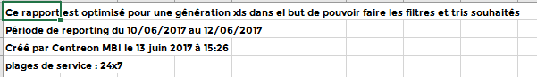

Le second usage affiche la liste de toutes les VMs vues par le vCenter
et l'utilisation vCPU ( moyenne, moyenne formatée, max, max formaté) et
mémoire (moyenne, moyenne formatée, max, max formaté, utilisation en %,
utilisation en % formatée) sur chaque VM.

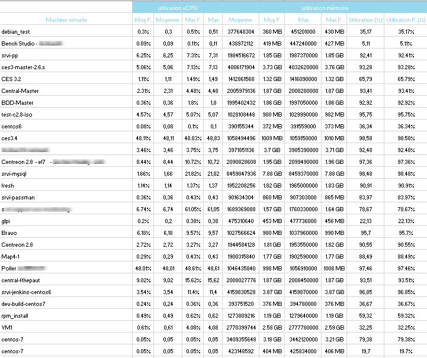

Le dernier onglet affiche la listes des VM par datastore et leur
utilisation des IOPS en lécture et en écriture en affichant la moyenne
et le maximum atteint.

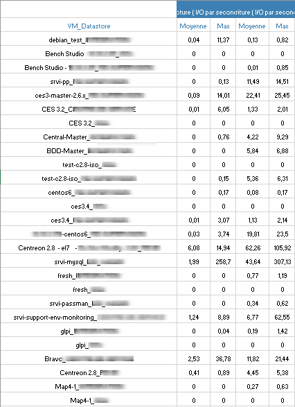

#### Paramètres

Les paramètres attendus dans ce rapport :

- Une periode de reporting
- Les objets Centreon suivant :

| Paramètres       | Type             | Description                                                                     |
|------------------|------------------|---------------------------------------------------------------------------------|
| Time period      | Liste déroulante | Plage horaire à utiliser                                                        |
| Host to report   | Liste déroulante | Sélection du cluster                                                            |
| Host category    | Multi sélection  | Sélection des catégories d’hôtes à filter sur le cluster                        |
| Service category | Multi sélection  | Sélection des catégories de services contenant les statistiques globales par VM |

#### Prérequis

Ce rapport est developpé pour une compatibilité avec le connecteur de supervision
Virt-VMware2-ESX et le connecteur Centreon-VMWare-2.0

Les prérequis pour le bon fonctionnement du rapport sont:

Mise en place de la Supervision des indicateurs suivants sur le vCenter:

- Un service Vm-Cpu-Global.
- Un service Vm-Memory-Global.
- Un service Vm-Datastore-Iops-Global.

Création de la catégorie de services suivante:

- VM-Statistics: qui regroupe l'ensemble des indicateurs Vm-Cpu-Global,
  Vm-Memory-Global et Vm-Datastore-Iops-Global.
