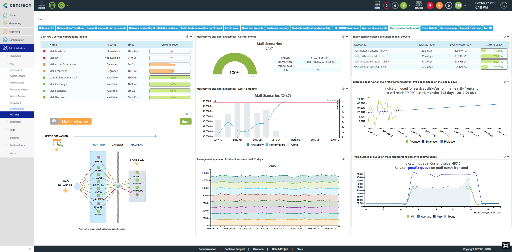

## Reporting complet: Centreon MBI

La fonctionnalité de "Reporting" de Centreon se base sur l'extension appellée
"Centreon Monitoring Business Intelligence" (Centreon MBI)

> Centreon MBI est une **extension** Centreon qui requiert une [licence](../administration/licenses.md) valide. Pour plus d'information,
> contactez [Centreon](mailto:sales@centreon.com).

Centreon Monitoring Business Intelligence est une solution d'aide à la
décision et facilite la gestion de votre infrastructure IT. Centreon MBI
vous apporte une visibilité complète sur vos infrastructures et vos
activités avec un reporting aux normes ITIL  sur les évènements, les
compteurs de performances ainsi que les données de capacité provenant de Centreon.

Vous pouvez suivre la santé de votre SI grâce à de nombreux modèles de
rapports paramétrables

Centreon MBI fournit un ensemble complet de rapports standards sur:

-   La gestion de capacité
-   La gestion de disponibilité
-   La gestion des niveaux de services (SLA : Service Level Agreement)
    management
-   La gestion des performances

**Voici quelques exemples de rapports disponibles dans Centreon MBI** : [Exemple de rapports](../assets/reporting/Centreon-MBI-Exemples-de-rapports.pdf)

Et également grâce à de nombreux widgets de reporting exploitables
directement sur Centreon

Principales fonctionnalités:

-   Planification et génération des rapports aux formats PDF, Excel,
    Word et PPT
-   Visualisation web & interactive des statistiques grâce aux widgets
    fournis exploitables directement sur Centreon
-   Publication des rapports par email et par d'autres protocoles
    standards (FTP, CIFS, ...)
-   Gestion des listes de contrôle d'accès
-   Interface d'administration et d'exploitation intégrée dans
    Centreon
-   Bibliothèques de développement de rapports

## Quels sont les formats de sortie possibles ?
  
* MBI génère des rapports dans différents formats : PDF, CSV, XLSX, DOCX, PPTX, ODT, ODS, ODP.
* Tous les rapports ne peuvent pas être exportés dans tous les formats : consultez notre [tableau des formats](#formats-supportés) pour en savoir plus.
* Par défaut, ces rapports peuvent être téléchargés à partir de la page **Rapports > Monitoring Business Intelligence > Report view**, mais ils peuvent également être configurés pour être envoyés à des personnes spécifiques lorsqu'ils sont générés.
* Les données des rapports peuvent également être affichées dans vos [vues personnalisées](../alerts-notifications/custom-views.md) Centreon à l'aide de [widgets](widgets.md) dédiés.

### Formats supportés

| Category | Report | PDF | CSV\* | XLSX | DOCX | PPTX | ODT | ODS | ODP |
|---|---|---|---|---|---|---|---|---|---|
| **Business activity monitoring** | BV-BA-Availabilities-1 | Meilleur format | Non-OK | OK | OK | OK | OK | OK | OK |
| | BA-Availability-1 | Meilleur format | Non-OK | OK | OK | OK | OK | OK | OK |
| | BV-BA-Availabilities-List | Meilleur format | Non-OK | OK | OK | OK | OK | OK | OK |
| | BA-Event-List | Meilleur format | Non-OK | OK | OK | OK | OK | OK | OK |
| | BV-BA-Current-Health-VS-Past | Meilleur format | Non-OK | OK | OK | OK | OK | OK | OK |
| | BV-BA-Availabilities-Calendars | Meilleur format | Non-OK | OK | OK | OK | OK | OK | OK |
| **Availability & Events** | Hostgroups-Incidents-1 | Meilleur format | Non-OK | OK | OK | OK | OK | OK | OK |
| | Hostgroups-Availability-1 | Meilleur format | Non-OK | OK | OK | OK | OK | OK | OK |
| | Hostgroup-Availability-2 | Meilleur format | Non-OK | OK | OK | OK | OK | OK | OK |
| | Hostgroup-Service-Incident-Resolution-2 | Meilleur format | Non-OK | OK | OK | OK | OK | OK | OK |
| | Hostgroup-Host-Availability-List | OK | Non-OK | Meilleur format | OK | OK | OK | OK | OK |
| | Hostgroup-Host-Event-List | OK | Non-OK | Meilleur format | OK | OK | OK | OK | OK |
| | Hostgroup-Service-Availability-List | OK | Non-OK | Meilleur format | OK | OK | OK | OK | OK |
| | Hostgroup-Service-Event-List | OK | Non-OK | Meilleur format | OK | OK | OK | OK | OK |
| | Hostgroup-Host-Pareto | Meilleur format | Non-OK | OK | OK | OK | OK | OK | OK |
| | Hostgroups-Host-Current-Events | Meilleur format | Non-OK | OK | OK | OK | OK | OK | OK |
| | Hostgroups-Service-Current-Events | Meilleur format | Non-OK | OK | OK | OK | OK | OK | OK |
| **Performance** | Host-Graphs-V2 | Meilleur format | Non-OK | OK | OK | OK | OK | OK | OK |
| | Hostgroup-Graphs-v2 | Meilleur format | Non-OK | OK | OK | OK | OK | OK | OK |
| | Hostgroup-Capacity-Planning-Linear-Regression | Meilleur format | Non-OK | OK | OK | OK | OK | OK | OK |
| | Hostgroups-Rationalization-Of-Resources-1 | Meilleur format | Non-OK | OK | OK | OK | OK | OK | OK |
| | Hostgroup-Service-Metric-Performance-List | OK | Non-OK | Meilleur format | OK | OK | OK | OK | OK |
| | Hostgroups-Categories-Performance-List | OK | Non-OK | Meilleur format | OK | OK | OK | OK | OK |
| **Storage** | Hostgroups-Storage-Capacity-1 | Meilleur format | Non-OK | OK | OK | OK | OK | OK | OK |
| | Hostgroup-Storage-Capacity-2 | Meilleur format | Non-OK | OK | OK | OK | OK | OK | OK |
| | Hostgroup-Storage-Capacity-List | OK | Non-OK | Meilleur format | OK | OK | OK | OK | OK |
| **Network** | Hostgroup-Traffic-By-Interface-And-Bandwith-Ranges | Meilleur format | Non-OK | OK | OK | OK | OK | OK | OK |
| | Hostgroup-Traffic-average-By-Interface | Meilleur format | Non-OK | OK | OK | OK | OK | OK | OK |
| | Hostgroup-monthly-network-percentile | Meilleur format | Non-OK | OK | OK | OK | OK | OK | OK |
| **Virtualization** | VMWare-Cluster-Performances-1 | Meilleur format | Non-OK | OK | OK | OK | OK | OK | OK |
| | VMWare-VM-Performances-List | OK | Non-OK | Meilleur format | OK | OK | OK | OK | OK |
| **Electric consumption** | Hostgroup-Electricity-Consumption-1 | Meilleur format | Non-OK | OK | OK | OK | OK | OK | OK |
| **Profiling** | Host-Detail-2 | Meilleur format | Non-OK | OK | OK | OK | OK | OK | OK |
| | Host-Detail-3 | Meilleur format | Non-OK | OK | OK | OK | OK | OK | OK |
| | Hostgroup-Host-Details-1 | Meilleur format | Non-OK | OK | OK | OK | OK | OK | OK |
| **Inventory & Configuration** | Hostgroups-Host-Templates | OK | Non-OK | Meilleur format | OK | OK | OK | OK | OK |
| | Hostgroups-Service-Templates | OK | Non-OK | Meilleur format | OK | OK | OK | OK | OK |
| | Poller-Performances | Meilleur format | Non-OK | OK | OK | OK | OK | OK | OK |
| | Hosts-not-classified | OK | Non-OK | Meilleur format | OK | OK | OK | OK | OK |
| | Services-not-classified | OK | Non-OK | Meilleur format | OK | OK | OK | OK | OK |
| **Database diagnostics** | Content-diagnostic | OK | Non-OK | Meilleur format | OK | OK | OK | OK | OK |
| | Content-diagnostic-availability | OK | Non-OK | Meilleur format | OK | OK | OK | OK | OK |
| | Content-diagnostic-performance | OK | Non-OK | Meilleur format | OK | OK | OK | OK | OK |
| | Metric-integrity-check | OK | Non-OK | Meilleur format | OK | OK | OK | OK | OK |

\* Le format CSV ne concerne que les rapports personnalisés.
