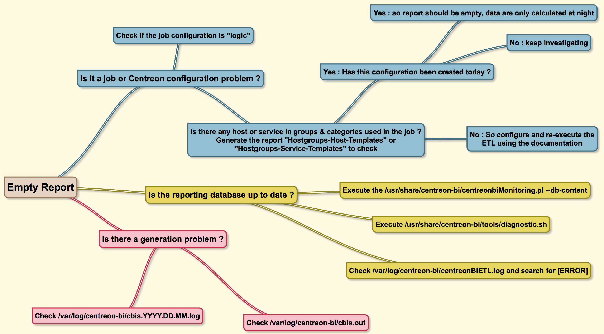

import Tabs from '@theme/Tabs';
import TabItem from '@theme/TabItem';

> Il est fortement recommandé d'installer le [connecteur Centreon MBI](/pp/integrations/plugin-packs/procedures/applications-monitoring-centreon-mbi), qui permet de superviser le statut de votre serveur MBI.

Avant d'aller plus loin, assurez-vous que MBI est à jour (faites une [mise à jour](update.md) ou une [montée de version](upgrade.md) si nécessaire).

Pendant [sa phase de calcul quotidienne](how-mbi-works.md#phase-2--lancement-de-letl-les-données-sont-copiées-sur-mbi-puis-agrégées), l'ETL peut rencontrer divers problèmes :

- erreurs de base de données (table MySQL endommagée, disque plein)
- erreurs de connexion à la base de données (délai d'attente MySQL expiré, problèmes DNS)
- erreurs informatiques (serveur en panne).

Si vous [supervisez votre serveur MBI avec votre Centreon](installation.md#supervisez-votre-serveur-mbi-avec-centreon), certaines de ces erreurs seront signalées par le connecteur.

## Établir un diagnostic

Utilisez la commande suivante pour confirmer que MBI est configuré correctement :

```shell
/usr/share/centreon-bi/tools/diagnostic.sh
```

Résultat attendu :

```shell
#################### Check connection to databases ####################


 --> Connection to monitoring databases:


########## Java ##########

    [OK]      Java 17 installed
    [OK]      Connection to centreon database on db successful
    [OK]      Connection to centreon_storage database on db successful

 --> Connection to reporting server:

    [OK]      Connection to centreon on db-bi successful
    [OK]      Connection to centreon_storage on db-bi successful

####################          CBIS deamon          ####################

    [OK]      CBIS is running

####################       ETL configuration       ####################

   [INFO]     Use large memory tweaks  option is disabled
    [OK]      ETL log file exists
    [OK]      ETL cron activated 

####################    Retention configuration    ####################

    [OK]      Retention file exists
    [OK]      Purge cron activate 
    [OK]      Purge option is enabled
```

Utilisez cette commande pour vérifier l'état du service **CBIS** :

```shell
systemctl status cbis
```

Résultat attendu :

```shell
● cbis.service - Centreon MBI Scheduler
   Loaded: loaded (/usr/lib/systemd/system/cbis.service; enabled; vendor preset: disabled)
   Active: active (running) since Wed 2025-08-06 09:55:09 IST; 41min ago
 Main PID: 584 (java)
    Tasks: 39 (limit: 24325)
   Memory: 381.4M
   CGroup: /system.slice/cbis.service
           └─584 /usr/bin/java --add-opens java.base/java.lang=ALL-UNNAMED --add-opens java.base/javax.crypto=ALL-UNNAM>
```

Si nécessaire, exécutez la commande suivante pour démarrer **CBIS** :

```shell
systemctl start cbis && systemctl enable cbis
```

## Identifier des données ou partitions manquantes avec les commandes --partitions et --db-content

Le script **/usr/share/centreon-bi/etl/centreonbiMonitoring.pl** dispose des options **--db-content** et **--partitions** qui peuvent potentiellement identifier des problèmes liés aux données.

* **--db-content** indique la date des dernières données de chaque table présentant un problème.
* **--partitions** indique le nombre de partitions manquantes entre la première partition de la table et le moment présent, ainsi que depuis quand elles sont manquantes. Notez que cette option ne fonctionne pas s'il manque plusieurs périodes non consécutives.

### --db-content

Vérifiez la date des dernières données trouvées dans la base de données MBI :

```shell
/usr/share/centreon-bi/etl/centreonbiMonitoring.pl --db-content
```

Si tout est en ordre, vous devriez avoir le message suivant : **ETL execution OK, database is up-to-date**. Cependant, si des problèmes ont été identifiés, vous aurez quelque chose comme :

```shell
[mod_bam_reporting_ba_availabilities: 2025-07-27 00:00:00] [hoststateevents: 2025-07-28 00:00:00] [servicestateevents: 2025-07-28 00:00:00] [mod_bi_hoststateevents: 2025-07-28 00:00:00] [Table mod_bi_servicestateevents: EMPTY] [mod_bi_time: 2025-07-28 00:00:00] [mod_bi_hostavailability: 2025-07-27 00:00:00] [Table mod_bi_serviceavailability: EMPTY] [Table mod_bi_hgmonthavailability: EMPTY] [Table mod_bi_hgservicemonthavailability: EMPTY] [data_bin: 2025-07-27 23:59:55] [mod_bi_metricdailyvalue: 2025-07-27 00:00:00] [Table mod_bi_metricmonthcapacity: EMPTY]
```

Dans ce cas, vous devrez [reconstruire une partie de vos données](rebuilding-data.md#reconstruction-partielle--conserver-lhistorique-de-vos-données). Vous devrez par exemple reconstruire **data_bin** pour le 28 juillet.

### --partitions

Vous pouvez également vérifier que les partitions sont à jour (afin d'avoir un vue plus détaillée de ce qu'il manque) avec la commande suivante :

```shell
/usr/share/centreon-bi/etl/centreonbiMonitoring.pl --partitions
```

La commande devrait renvoyer **All partitions are up-to-date**. Cependant, si des problèmes ont été identifiés, vous aurez quelque chose comme :

```shell
[mod_bi_hostavailability, last partition:2025-07-28 00:00:00 missing 42 part.][mod_bi_serviceavailability, last partition:2025-07-28 00:00:00 missing 42 part.][mod_bi_metrichourlyvalue, last partition:2025-06-05 00:00:00 missing 67 part.][mod_bi_metricdailyvalue, last partition:2025-07-28 00:00:00 missing 42 part.][data_bin, last partition:2025-07-28 00:00:00 missing 14 part.]
```

Dans l'exemple ci-dessus, 42 partitions manquantes ont été identifiées pour la table **mod_bi_hostavailability** (et la dernière partition a été créée le 28 juillet).

Dans ce cas, vous devrez [reconstruire une partie de vos données](rebuilding-data.md#reconstruction-partielle--conserver-lhistorique-de-vos-données).

### Comprendre les résultats des commandes

Si les commandes **--partitions** et **--db-content** indiquent qu'il y a un problème avec l'une de vos tables, vous devrez peut-être effectuer une [reconstruction partielle de vos données](rebuilding-data.md#reconstruction-partielle--conserver-lhistorique-de-vos-données). Veillez à utiliser les options appropriées dans tous les cas lors de la reconstruction (y compris l'option **--no-purge** qui vous évite de supprimer des données importantes).

| Tables                                                   | Signification                                                                      | Actions à réaliser                                 |
|------------------------------------------------------------------|------------------------------------------------------------------------------|------------------------------------------------|
| `hoststateevents`, `servicestateevents`,<br/>`mod_bam_reporting*`, `data_bin` | Problème avec les données brutes importées depuis Centreon.                            | Identifier et réparer le problème avec les données brutes. (Peut-être aurez-vous besoin de calculer des évènements avec [**eventReportBuilder** sur le serveur central](how-mbi-works.md#phase-1--les-données-sont-préparées-par-le-serveur-central)). Après avoir résolu le problème, exécutez le script d'import pour importer les données manquantes [en utilisant les options appropriées](rebuilding-data.md#options-pour-une-reconstruction-partielle) (`/usr/share/centreon-bi/etl/importData.pl`). |
| `mod_bi_servicemetrics`,`mod_bi_hosts`, `mod_bi_services`,  `mod_bi_hostgroups`                                             | Problème avec les **données des dimensions**.                 |  Après avoir résolu le problème, exécutez le script de dimensions pour rétablir la cohérence des dimensions, [en utilisant les options appropriées](rebuilding-data.md#options-pour-une-reconstruction-partielle) (`/usr/share/centreon-bi/etl/importData.pl`).  (`/usr/share/centreon-bi/etl/dimensionsBuilder.pl`)   |
| `mod_bi_*availability`                                             | Problème avec les **données de disponibilité agrégées**, pas avec les données brutes            | Après avoir résolu le problème, exécutez le script d'agrégation de disponibilité [en utilisant les options appropriées](rebuilding-data.md#options-pour-une-reconstruction-partielle) (`/usr/share/centreon-bi/etl/importData.pl`) (`/usr/share/centreon-bi/etl/eventStatisticsBuilder.pl`). |
| `mod_bi_metric*`                                                   | Problème avec les **données des métriques agrégées** (par exemple, performance), pas avec les données brutes. | Après avoir résolu le problème, exécutez le script d'agrégation des métriques. [en utilisant les options appropriées](rebuilding-data.md#options-pour-une-reconstruction-partielle) (`/usr/share/centreon-bi/etl/importData.pl`) (`/usr/share/centreon-bi/etl/perfdataStatisticsBuilder.pl`).  |

Si vous rencontrez des problèmes, vérifiez que MBI est bien configuré selon notre [procédure de configuration post-installation](installation.md#étape-4--configurez-letl-dans-linterface-de-centreon).

## CBIS ne démarre pas

Utilisez SSH pour vous connecter à votre serveur de reporting MBI et passez en root pour vérifier les logs suivants :

* **/var/log/centreon-bi/cbis.out**
* **/var/log/centreon-bi/cbis.date-of-the-day.log**

Si vous trouvez un problème pertinent dans l'un de ces deux fichiers, corrigez le problème (par exemple, une erreur lors de la connexion à la base de données) puis redémarrez manuellement le service **CBIS** :

```shell
systemctl restart cbis
```

<!--/etc/centreon-bi/startCBIS.sh-->

## Où sont stockés les logs ?

Utilisez SSH pour vous connecter à votre serveur MBI et passez en root.

Naviguez jusqu'aux logs MBI situés dans **var/log/centreon-bi**.

CBIS crée un nouveau fichier log pour chaque jour, situé dans **/var/log/centreon-bi** et nommé **bis.date-du-jour.log**. La date est au format suivant : **AAAA-MM-JJ**.

## Le rapport que j'ai généré est vide

Lorsqu'un rapport est vide, analysez-le de la manière suivante :



* La première étape est de vérifier que les données sont bien disponibles dans la base de données avec les commandes [**--partitions** et **--db-content**](#identifier-des-données-ou-partitions-manquantes-avec-les-commandes---partitions-et---db-content).

* Puis vérifiez que les deux premières phases du traitement des données se sont terminées dans les temps : lisez notre page [**Comment fonctionne MBI**](how-mbi-works.md).

## Je ne peux pas télécharger les rapports générés

* Confirmez que la [règle de publication **Default**](reports-publication-rule.md#fonctionnement-de-la-règle-de-publication-default) qui utilise le protocole SFTP est appliquée et [configurée correctement](reports-publication-rule.md#configuration-de-la-règle-de-publication-default) (la règle de publication **Default** sert à transférer les rapports générés depuis le serveur MBI vers le serveur central).

* Vérifiez que le serveur central et le serveur MBI sont synchronisés : le fuseau horaire et la date doivent être exactement les mêmes sur les deux serveurs pour que les rapports puissent être téléchargés.

```shell
timedatectl
```

Si les fuseaux horaires sont différents, [modifiez le fichier PHP correspondant](installation.md#prérequis-logiciels). Par example, entrez **date.timezone = Europe/Paris** sur les deux serveurs. Vous devez ensuite redémarrer **php-fpm**:

```shell
systemctl restart php-fpm
```

* Vérifiez que le processus CBIS démarre avec les mêmes fuseaux horaires que les deux serveurs. Vérifiez dans les logs CBIS si l'heure affichée devant les logs correspond à l'heure du serveur. Tout d'abord, redémarrez CBIS :

```shell
systemctl restart cbis
```

Vérifiez ensuite l'heure et le fuseau horaire en exécutant la commande **date**, puis comparez la date avec celle indiquée dans les logs.

```shell
tail -f /var/log/centreon-bi/cbis.YYYY-MM-DD.log
```

La date et l'heure doivent correspondre avec celles qui apparaissent dans les logs.

<!--Enfin, vérifiez que le contenu du fichier /etc/sysconfig/clock correspond à la commande date. Si ce n'est pas le cas, modifiez le fichier clock et redémarrez CBIS :

```shell
systemctl restart cbis
```-->

## Je ne vois pas les modèles de rapports/les hôtes dont j'ai besoin

Si vous ne voyez pas certains [modèles de rapport](concepts.md#modèles-de-rapports-report-designs) ou certaines ressources, il est possible que votre administrateur ne vous ait pas accordé les autorisations nécessaires.
[Les droits des utilisateurs sur MBI peuvent être configurés](share.md) par un administrateur à partir de la page **Administration > ACL > Centreon MBI > ACL rules**. Les administrateurs peuvent y choisir les modèles de rapport, les tâches et les groupes de tâches auxquels chaque utilisateur est autorisé à accéder.
