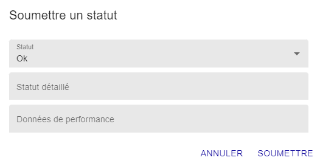
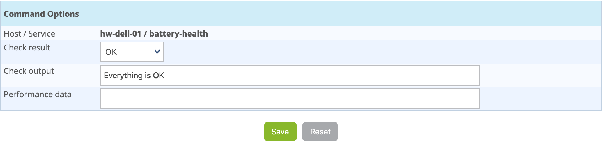

import Tabs from '@theme/Tabs';
import TabItem from '@theme/TabItem';

## Soumettre un résultat

### Principe

Pour les services ayant la propriété de contrôle passif, il est possible
d'envoyer manuellement un résultat à l'ordonnanceur afin que celui-ci
soit pris en compte par l'ordonnanceur.

### En pratique

<Tabs groupId="sync">
<TabItem value="Depuis la page Statut des ressources" label="Depuis la page Statut des ressources">

1. Allez à la page **Supervision > Statut des ressources**.

2. Sélectionnez le service désiré.

3. Dans le menu **Plus d'actions**, cliquez sur **Soumettre un statut**.

    La fenêtre suivante s'ouvre :
    
    

    -   Le champ **Statut** définit le statut qu'aura le service une fois le résultat soumis.
    -   Le champ **Output** définit le message à afficher pour le
        service dans la colonne **Information**.
    -   Le champ **Données de performance** permet de définir des données de
        performance pour la génération des graphiques.

</TabItem>
<TabItem value="Depuis la page de supervision temps réel" label="Depuis la page de supervision temps réel">

Accédez à la page de détails de l'objet.
Dans la catégorie **Service Commands** cliquez sur **Submit result for
this service**.

La fenêtre suivante s'affiche :

-   Les champs **Host Name** et **Service** définissent l'hôte et le
    service pour lequel le résultat sera soumis
-   Le champ **Check result**définit le statut du service
-   Le champ **Check output** définit le message à afficher pour le
    service
-   Le champ **Performance data** permet de définir des données de
    performances pour la génération des graphiques

</TabItem>
</Tabs>