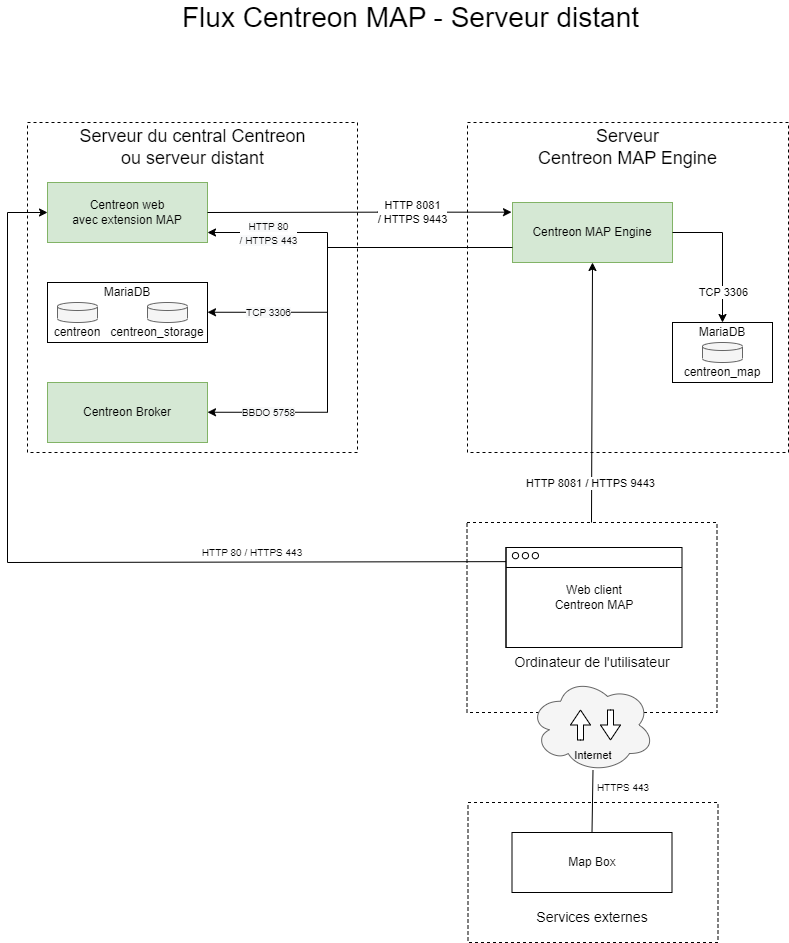

## Installation de Centreon MAP sur un serveur distant

L'installation de l'extension Centreon MAP sur un serveur distant Centreon doit se faire exactement comme l'installation sur un serveur central, seules la configuration et la désinstallation sont différentes.

Si votre serveur distant Centreon n'a pas encore été installé, veuillez vous référer à la [documentation](../installation/installation-of-a-remote-server/using-packages.md) suivante.

Reportez-vous ensuite à la [procédure d'installation](map-web-install.md) pour installer les 2 composants principaux :

- L'interface web
- Le serveur

Après cela, vous devrez effectuer des étapes supplémentaires, expliquées ci-dessous, pour terminer l'installation de Centreon MAP pour votre serveur distant Centreon.

## Architecture

Le schéma ci-dessous décrit l'architecture de MAP avec un serveur distant :



## Synchronisation des images

Ajoutez l'accès à la page de synchronisation des images **Administration > Paramètres > Images** :

```shell
[root@remote ~]# mysql centreon
MariaDB [centreon]> update topology SET topology_show='1' where topology_name='Images' ;
```

## Configuration de Centreon Broker

Pour pouvoir afficher les statuts en temps réel, **Centreon MAP** nécessite de recevoir ces données en provenance du Broker du serveur distant Centreon.

Pour ce faire, vous devez vous connecter au serveur central et modifier la configuration de Centreon Broker Master du serveur distant Centreon. Allez dans le menu **Configuration > Collecteurs > Configuration de Centreon Broker** et modifiez la configuration du **serveur distant**.

Dans l'onglet **Output**, créez une nouvelle sortie avec les paramètres suivants :


Pour finir l'installation, générez et déployez la configuration du serveur distant Centreon en sélectionnant le mode **Redémarrer**.

## Désinstallation de Centreon MAP

Sur un serveur distant, vous pouvez désinstaller le module Centreon MAP de la même manière que sur le serveur central Centreon. Toutes les configurations de Centreon Broker pour le serveur distant Centreon liées au module Centreon MAP doivent être supprimées manuellement. Consultez la section [Configuration de Centreon Broker](#configuration-de-centreon-broker) pour savoir quelles sorties vous devez supprimer pour votre ou vos serveurs distants Centreon.
