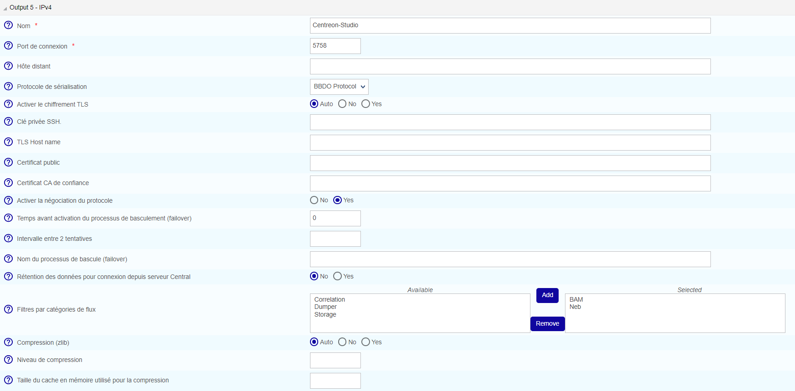

import Tabs from '@theme/Tabs';
import TabItem from '@theme/TabItem';

Ce chapitre décrit les procédures avancées permettant de sécuriser votre plateforme MAP.

> Si vous souhaitez utiliser MAP en HTTPS, vous devez sécuriser à la fois votre plateforme Centreon et MAP. Suivez cette [procédure](../administration/secure-platform.md) pour sécuriser votre plateforme Centreon.

> Des erreurs de modification de fichiers de configuration peuvent entraîner des dysfonctionnements du logiciel. Nous vous recommandons de faire une sauvegarde du fichier avant de le modifier et de ne changer que les paramètres conseillés par Centreon.

## Configurer HTTPS/TLS sur le serveur MAP

### Configurer HTTPS/TLS avec une clé reconnue

> Cette section décrit comment ajouter une **clé reconnue** au serveur MAP.
>
> Si vous souhaitez créer une clé auto-signée et l'ajouter à votre serveur, veuillez vous référer à la [section suivante](#configuration-httpstls-avec-une-clé-auto-signée).

Vous aurez besoin de :

- Un fichier de clé, appelé **key.key**.
- Un fichier de certificat, appelé **certificate.crt**.

Accédez au serveur Centreon MAP par SSH.

Créez un fichier PKCS12 avec la ligne de commande suivante :

```shell
openssl pkcs12 -inkey key.key -in certificate.crt -export -out keys.pkcs12
```

Ensuite, importez ce fichier dans un nouveau keystore (un dépôt Java de certificats de sécurité) :

```shell
keytool -importkeystore -srckeystore keys.pkcs12 -srcstoretype pkcs12 -destkeystore map.jks
```

Placez le fichier keystore ci-dessus (map.jks) dans le dossier **/etc/centreon-map/**, et définissez les paramètres ci-dessous dans **/etc/centreon-map/map-config.properties** :

```text
centreon-map.keystore=/etc/centreon-map/map.jks
centreon-map.keystore-pass=xxx
```

> Remplacez la valeur "xxx" de keystore-pass par le mot de passe que vous avez utilisé pour le keystore et adaptez le chemin vers le keystore (s'il a été modifié).

### Configuration HTTPS/TLS avec une clé auto-signée

> L'activation du mode TLS avec une clé auto-signée obligera chaque utilisateur à ajouter une exception pour le certificat avant d'utiliser l'interface web.
>
> Ne l'activez que si votre Centreon utilise également ce protocole.
>
> Les utilisateurs devront ouvrir l'URL :
> 
> ```shell
> https://<MAP_IP>:9443/centreon-map/api/beta/actuator/health
> ```
>
> **La solution que nous recommandons est d'utiliser une méthode de clé reconnue, comme expliqué ci-dessus.**

Sur le serveur Centreon MAP, créez un keystore.

Allez dans le dossier où Java est installé :

```shell
cd $JAVA_HOME/bin
```

Ensuite, générez un fichier keystore avec la commande suivante :

```shell
keytool -genkey -alias map -keyalg RSA -keystore /etc/centreon-map/map.jks
```

La valeur de l'alias "map" et le chemin du fichier keystore **/etc/centreon-map/map.jks** peuvent être modifiés, mais à moins d'une raison spécifique, nous conseillons de conserver les valeurs par défaut.

Fournissez les informations nécessaires lors de la création du keystore.

À la fin du formulaire, lorsque le "mot de passe de la clé" est demandé, utilisez le même mot de passe que celui utilisé pour le keystore lui-même en appuyant sur la touche **Entrée**.

Placez le fichier keystore ci-dessus (**map.jks**) dans le dossier **/etc/centreon-map/**, et définissez les paramètres ci-dessous dans **/etc/centreon-map/map-config.properties** :

```text
centreon-map.keystore=/etc/centreon-map/map.jks
centreon-map.keystore-pass=xxx
```

> Remplacez la valeur keystore-pass "xxx" par le mot de passe que vous avez utilisé pour le keystore et adaptez le chemin (s'il a été modifié dans le keystore).

### Activer le profil TLS du service Centreon MAP

1. Arrêtez le service Centreon MAP :

    ```shell
    systemctl stop centreon-map-engine
    ```

2. Modifiez le fichier `/etc/centreon-map/centreon-map.conf`, en ajoutant `,tls` après le profil `prod` :

    ```text
    RUN_ARGS="--spring.profiles.active=prod,tls"
    ```

3. Définissez le paramètre `centreon.url` dans **/etc/centreon-map/map-config.properties** pour activer le protocole de communication HTTPS avec le serveur Centreon :

```shell
centreon.url=https://<server-address>
```

4. Redémarrez le service Centreon MAP :

    ```shell
    systemctl start centreon-map-engine
    ```

Le serveur MAP est maintenant configuré pour répondre aux demandes provenant de HTTPS sur le port 9443.

Pour modifier le port par défaut, reportez-vous à la [procédure dédiée](./map-web-change-port.md).

> N'oubliez pas de modifier l'URL côté Centreon dans le champ **Adresse du serveur Centreon MAP** du menu **Administration > Extensions > Map > Options**.

## Configurer TLS sur la connexion Broker

Une sortie Broker supplémentaire pour Centreon Central (centreon-broker-master) a été créée pendant l'installation.

Vous pouvez la vérifier dans votre interface web Centreon, à la page **Configuration > Collecteurs > Configuration de Centreon Broker**, en éditant la configuration **centreon-broker-master**.

La configuration éditée doit ressembler à ceci :



### Configuration de Broker

Vous pouvez activer la sortie TLS et configurer la clé privée et le certificat public de Broker comme décrit ci-dessous :


1. Pour créer un certificat auto-signé, vous pouvez utiliser les commandes suivantes :

```text
openssl req -new -newkey rsa:2048 -nodes -keyout broker_private.key -out broker.csr
openssl x509 -req -in broker.csr -CA ca.crt -CAkey ca.key -CAcreateserial -out broker_public.crt -days 365 -sha256
```

2. Et ensuite, copiez la clé privée et le certificat dans le répertoire **/etc/centreon/broker_cert/** :

```text
mv broker_private.key /etc/centreon/broker_cert/
mv broker_public.crt /etc/centreon/broker_cert/
```

> Le champ "Trusted CA's certificate" est facultatif. Si vous activez l'authentification client de Broker en définissant ce "ca\_certificate.crt", vous devez alors configurer un [keystore pour le serveur MAP](#configurer-httpstls-sur-le-serveur-map)
>
> Vous devez pousser la nouvelle configuration du broker et redémarrer le broker après la configuration.

### Configuration du serveur MAP

Tout d'abord, vous devez [activer HTTPS/TLS sur le serveur web](../administration/secure-platform.md#activer-le-mode-https-sur-le-serveur-web)

Ensuite, définissez les paramètres suivants dans la configuration du serveur MAP dans :

**/etc/centreon-map/centreon-map.conf**

Définissez le protocole de communication avec le serveur Centreon comme étant HTTPS :

```shell
centreon.url=https://<server-address>
```

Pour activer la connexion par socket TLS avec le Broker :

```text
broker.tls=true
```

#### Configuration avec un certificat auto-signé

Si le certificat public de Broker est auto-signé, vous devez créer un trust store contenant le certificat donné ou son certificat CA avec la ligne de commande suivante :

```shell
keytool -import -alias centreon-broker -file broker_public.crt -keystore truststore.jks
```

- "broker_public.crt" est le certificat public de Broker ou son certificat CA au format PEM,
- "truststore.jks" est le trust store généré au format JKS,
- un mot de passe du trust store est requis pendant la génération.

Ensuite, mettez le fichier de sortie généré **truststore.jks** dans **/etc/centreon-studio** de l'hôte du serveur MAP.

1. Ajoutez les paramètres de trust store dans **/etc/centreon-map/map-config.properties** :

```text
centreon-map.truststore=/etc/centreon-map/truststore.jks
centreon-map.truststore-pass=XXXX
```

> Remplacez la valeur "xxx" de trustStorePassword par le mot de passe que vous avez utilisé pour générer le trust store.

En attendant, vous devez activer le profil "tls_broker" du service Centreon MAP.

2. Editez le fichier **/etc/centreon-studio/centreon-map.conf**, et remplacez ",tls" par ",tls_broker" après le profil "prod" :

```text
RUN_ARGS="--spring.profiles.active=prod,tls_broker"
```

> Le profil "tls_broker" implique le profil "tls". Ainsi, le service Centreon MAP sert nécessairement HTTPS.

Une fois que vous avez ajouté un truststore, Centreon MAP l'utilisera pour valider les certificats auto-signés.
Cela signifie que si vous utilisez un certificat auto-signé pour le serveur central, vous devez l'ajouter au truststore.
Si vous ne le faites pas, la page **Supervision > Map** sera vide, et les journaux (**/var/log/centreon-map/centreon-map.log**) afficheront l'erreur suivante : `unable to find valid certification path to requested target`.

1. Copiez le certificat **.crt** du serveur central sur le serveur MAP.

2. Ajoutez le certificat au truststore :

    ```shell
    keytool -import -alias centreon-broker -file central_public.crt -keystore truststore.jks
    ```

#### Configuration avec un certificat CA reconnu

Si le certificat public de Broker est signé par une autorité de certification reconnue, le truststore par défaut de la JVM "cacerts **/etc/pki/java/cacerts**" sera utilisé. Il n'y a rien à configurer pour le service Centreon MAP.

## Configurer TLS sur une base de données MySQL ou MariaDB

Cette section décrit comment activer SSL sur un serveur MySQL/MariaDB et configurer une application Spring Boot pour se connecter de manière sécurisée en utilisant la vérification de l'autorité de certification (mode VERIFY_CA).

> **Note :** Cette procédure couvre uniquement le mode VERIFY_CA. Dans ce mode, le certificat du serveur est validé par une autorité de certification de confiance, mais le nom d’hôte/adresse IP n’est pas vérifié. Pour d’autres modes de vérification SSL, consultez la section [référence des modes SSL](#référence-des-modes-ssl).

- Sélectionnez l’onglet correspondant à la base de données que vous souhaitez utiliser.

### Étape 1 - Générer les clés et certificats

<Tabs groupId="db" queryString>
<TabItem value="MySQL" label="MySQL">

**1. Créez un répertoire** (`/etc/mysql/newcerts` dans cet exemple) pour stocker vos fichiers de certificats :

    ```shell
    mkdir -p /etc/mysql/newcerts
    cd /etc/mysql/newcerts
    ```

**2. Générez l’autorité de certification (CA).** La CA est utilisée pour signer les certificats serveur et client, établissant une chaîne de confiance.

    ```shell
    # Generate the CA private key
    openssl genrsa 2048 > ca-key.pem
    # Generate the CA self-signed certificate
    openssl req -new -x509 -nodes -days 365000 -key ca-key.pem -out ca-cert.pem
    ```

**3. Générez le certificat serveur.** Le certificat serveur est présenté par MySQL aux clients lors de la négociation SSL.

    ```shell
    # Generate the server private key and CSR (Certificate Signing Request)
    openssl req -newkey rsa:2048 -days 365000 -nodes -keyout server-key.pem -out server-req.pem
    
    # Convert the server key to RSA format (required by MySQL)
    openssl rsa -in server-key.pem -out server-key.pem
    
    # Sign the server certificate with the CA
    openssl x509 -req -in server-req.pem -days 365000 -CA ca-cert.pem -CAkey ca-key.pem -set_serial 01 -out server-cert.pem
    ```

**4. Générez le certificat client.** Le certificat client est utilisé par l’application pour s’authentifier auprès de MySQL (TLS mutuel).

    ```shell
    # Generate the client private key and CSR
    openssl req -newkey rsa:2048 -days 365000 -nodes -keyout client-key.pem -out client-req.pem
    # Convert the client key to RSA format
    openssl rsa -in client-key.pem -out client-key.pem
    # Sign the client certificate with the CA
    openssl x509 -req -in client-req.pem -days 365000 -CA ca-cert.pem -CAkey ca-key.pem -set_serial 01 -out client-cert.pem
    ```

**5. Vérifiez les certificats.** Assurez-vous que les certificats sont correctement signés par la CA avant de continuer.

    ```shell
    openssl verify -CAfile ca-cert.pem server-cert.pem client-cert.pem
    # Expected output:
    # server-cert.pem: OK
    # client-cert.pem: OK
    ```

</TabItem>
<TabItem value="MariaDB" label="MariaDB">

**1. Créez un répertoire** (`/etc/mariadb/newcerts` dans cet exemple) pour stocker vos fichiers de certificats :

    ```shell
    mkdir -p /etc/mariadb/newcerts
    cd /etc/mariadb/newcerts
    ```

**2. Générez l’autorité de certification (CA).** La CA est utilisée pour signer les certificats serveur et client, établissant une chaîne de confiance.

    ```shell
    # Generate the CA private key
    openssl genrsa 2048 > ca-key.pem
    
    # Generate the CA self-signed certificate
    openssl req -new -x509 -nodes -days 365000 -key ca-key.pem -out ca-cert.pem
    ```

**3. Générez le certificat serveur.** Le certificat serveur est présenté par MariaDB aux clients lors de la négociation SSL.

    ```shell
    # Generate the server private key and CSR (Certificate Signing Request)
    openssl req -newkey rsa:2048 -days 365000 -nodes -keyout server-key.pem -out server-req.pem
    
    # Convert the server key to RSA format (required by MariaDB)
    openssl rsa -in server-key.pem -out server-key.pem
    
    # Sign the server certificate with the CA
    openssl x509 -req -in server-req.pem -days 365000 \
    -CA ca-cert.pem -CAkey ca-key.pem -set_serial 01 \
    -out server-cert.pem
    ```

**4. Générez le certificat client.** Le certificat client est utilisé par l’application pour s’authentifier auprès de MariaDB (TLS mutuel). Ignorez cette section si vous n’avez besoin que de `REQUIRE SSL`.

    ```shell
    # Générer la clé privée client et la CSR
    openssl req -newkey rsa:2048 -days 365000 -nodes -keyout client-key.pem -out client-req.pem

    # Convertir la clé client au format RSA
    openssl rsa -in client-key.pem -out client-key.pem

    # Signer le certificat client avec la CA
    openssl x509 -req -in client-req.pem -days 365000 \
    -CA ca-cert.pem -CAkey ca-key.pem -set_serial 01 \
    -out client-cert.pem
    ```

**5. Vérifiez les certificats.** Assurez-vous que les certificats sont correctement signés par la CA avant de continuer.

    ```shell
    openssl verify -CAfile ca-cert.pem server-cert.pem client-cert.pem
    # Résultat attendu :
    # server-cert.pem: OK
    # client-cert.pem: OK
    ```

**6. Définissez la propriété des fichiers.** MariaDB exige la propriété de tous les fichiers de certificats.

</TabItem>
</Tabs>

### Étape 2 - Configurer le serveur MySQL/MariaDB

<Tabs groupId="db" queryString>
<TabItem value="MySQL" label="MySQL">

**1. Définissez la propriété des fichiers.** MySQL exige la propriété de tous les fichiers de certificats.

    > Assurez-vous d’utiliser le répertoire créé précédemment (`/etc/mysql/newcerts` dans cet exemple).

    ```shell
    chown -Rv mysql:root /etc/mysql/newcerts/*
    ```

**2. Modifiez la configuration du serveur MySQL.** Ajoutez le bloc suivant à votre fichier de configuration MySQL (généralement /etc/mysql/mysql.conf.d/mysqld.cnf) :

    ```shell
    [mysqld]
    ssl-ca   = /etc/mysql/newcerts/ca-cert.pem
    ssl-cert = /etc/mysql/newcerts/server-cert.pem
    ssl-key  = /etc/mysql/newcerts/server-key.pem
    # Restreindre aux versions TLS sécurisées uniquement
    tls_version = TLSv1.2,TLSv1.3
    ```

**3. Optionnel - Modifiez la configuration du client MySQL.** Cela permet à l’outil CLI mysql de se connecter en utilisant SSL.

    

**4. Redémarrez MySQL.**

    ```shell
    systemctl restart mysqld
    ```

**5. Vérifiez que SSL est actif.**

    

</TabItem>
<TabItem value="MariaDB" label="MariaDB">

> Assurez-vous d’utiliser le répertoire créé précédemment (`/etc/mariadb/newcerts` dans cet exemple).

**1. Ajoutez le bloc suivant à votre fichier de configuration MariaDB** (généralement `/etc/mariadb/mariadb.conf.d/50-server.cnf`) :

    ```shell
    [mariadb]
    ssl-ca   = /etc/mariadb/newcerts/ca-cert.pem
    ssl-cert = /etc/mariadb/newcerts/server-cert.pem
    ssl-key  = /etc/mariadb/newcerts/server-key.pem

    # Restreindre aux versions TLS sécurisées uniquement
    tls_version = TLSv1.2,TLSv1.3
    ```

**2. Optionnel - Modifiez la configuration du client MariaDB.** Cela permet à l’outil CLI mariadb de se connecter en utilisant SSL (/etc/mariadb/mariadb.conf.d/client.cnf) :

    ```shell
    [client-mariadb]
    ssl-ca   = /etc/mariadb/newcerts/ca-cert.pem
    ssl-cert = /etc/mariadb/newcerts/client-cert.pem
    ssl-key  = /etc/mariadb/newcerts/client-key.pem
    ```

**4. Redémarrez MariaDB.**

    ```shell
    systemctl restart mariadb
    ```

**5. Vérifiez que SSL est actif.**

    ```shell
    SHOW VARIABLES LIKE '%ssl%';
    -- have_ssl doit être YES
    -- ssl_ca, ssl_cert, ssl_key doivent pointer vers vos fichiers de certificats
    ```

</TabItem>
</Tabs>

### Étape 3 - Configurer l’utilisateur MySQL/MariaDB

<Tabs groupId="db" queryString>
<TabItem value="MySQL" label="MySQL">

**1. Exigez SSL pour l’utilisateur.**

    ```shell
    ALTER USER 'centreon_map'@'<ip_or_hostname>' REQUIRE SSL;
    -- Verify: ssl_type should now show ANY
    SELECT user, host, ssl_type FROM mysql.user WHERE user='centreon_map';
    ```

**2. Accordez les privilèges.**

    ```shell
    GRANT SELECT, INSERT, UPDATE, DELETE, CREATE, DROP, INDEX, ALTER,
          CREATE TEMPORARY TABLES, LOCK TABLES
      ON `centreon_map`.*
      TO `centreon_map`@`<ip_or_hostname>`;
    -- Verify grants
    SHOW GRANTS FOR 'centreon_map'@'<ip_or_hostname>';
    ```

</TabItem>
<TabItem value="MariaDB" label="MariaDB">

**1. Exigez SSL pour l’utilisateur.**

    ```shell
    - SSL uniquement (aucun certificat client requis)
    ALTER USER 'centreon_map'@'<ip_or_hostname>' REQUIRE SSL;

    -- Ou TLS mutuel (certificat client requis)
    -- ALTER USER 'centreon_map'@'<ip_or_hostname>' REQUIRE X509;

    -- Vérification : ssl_type doit maintenant afficher ANY (pour SSL) ou X509 (pour mTLS)
    SELECT user, host, ssl_type FROM mysql.user WHERE user='centreon_map';
    ```

**2. Accordez les privilèges.**

    ```shell
    GRANT SELECT, INSERT, UPDATE, DELETE, CREATE, DROP, INDEX, ALTER,
        CREATE TEMPORARY TABLES, LOCK TABLES
    ON `centreon_map`.* 
    TO `centreon_map`@`<ip_or_hostname>`;
    -- Vérifiez les droits
    SHOW GRANTS FOR 'centreon_map'@'<ip_or_hostname>';
    ```
</TabItem>
</Tabs>

### Étape 4 - Configurer JDBC (Spring Boot)

<Tabs groupId="db" queryString>
<TabItem value="MySQL" label="MySQL">

Depuis la migration vers MariaDB Connector/J, le connecteur MySQL n’est plus fourni. Même si votre serveur de base de données est MySQL, l’URL JDBC utilise le schéma `jdbc:mariadb://` et le pilote `org.mariadb.jdbc.Driver`. MariaDB Connector/J 3.x prend en charge nativement les fichiers PEM via le paramètre `serverSslCert` directement dans l’URL JDBC. Aucune conversion du keystore Java n'est nécessaire pour le mode SSL simple.

Un fichier keystore est requis que pour le protocole mTLS (authentification par certificat client) :

| Fichier           | Contenu         | Utilité                                      | Requis                |
|-------------------|-----------------|----------------------------------------------|-----------------------|
| ca-cert.pem    | Certificat CA   | Permet au pilote de vérifier l'identité du serveur MySQL | Oui - Toujours        |
| keystore.p12      | Certificat client + clé privée | Permet à MySQL de vérifier l’identité de l’application | Uniquement si REQUIRE X509 |

> **Remarque : mTLS est optionnel.** Il n’est requis que si l’utilisateur MySQL a été créé avec REQUIRE X509. Si l’utilisateur a été créé avec REQUIRE SSL, seul le fichier `serverSslCert` pointant vers l'autorité de certification est nécessaire, et les étapes relatives au keystore décrites ci-dessous peuvent être ignorées.


**1. Optionnel : Créez le KeyStore pour mTLS**.

    > **Remarque :** Ignorez cette étape si l’utilisateur MySQL a été créé avec REQUIRE SSL. Elle n’est requise que pour REQUIRE X509 (TLS mutuel). `keytool` ne peut pas importer une clé privée PEM directement, il faut donc d’abord convertir en PKCS12.

    1.1. Regroupez le certificat client et la clé dans un fichier PKCS12 :

        ```shell
        openssl pkcs12 -export \
        -in /etc/mysql/newcerts/client-cert.pem \
        -inkey /etc/mysql/newcerts/client-key.pem \
        -out /etc/mysql/newcerts/client.p12 \
        -name mysqlClient \
        -passout pass:changeit
        ```

**2. Définissez les permissions des fichiers.** Assurez-vous que seul l’utilisateur exécutant l’application Java peut lire les fichiers keystore.

    ```shell
    chown your_java_user: /etc/mysql/newcerts/keystore.p12
    chmod 640 /etc/mysql/newcerts/keystore.p12
    ```

**3. Définissez l’URL JDBC.** Ajoutez ce qui suit à votre fichier de configuration (/etc/centreon-map/*-database.properties) :

    ```shell
    *.connection.url=jdbc:mariadb://<ip_or_hostname>:3306/centreon_map?sslMode=verify-ca&serverSslCert=/etc/mysql/newcerts/ca-cert.pem&rewriteBatchedStatements=true
    ```

    > **Remarque : sslMode=trust pour MySQL 8.** Sur un serveur MySQL 8, le paramètre `sslMode=trust` est ajouté par défaut : pour une configuration d'authentification renforcée avec `caching_sha2_password`, remplacez `trust` par `verify-ca` (comme indiqué ci-dessus) ou `verify-full`. N'utilisez jamais `sslMode=disable` sur MySQL 8, car cela empêcherait l'authentification.

**4. Optionnel — uniquement si mTLS est activé (REQUIRE X509).** Ajoutez les options `keyStore`, et `keyStorePassword` and `keyStoreType` :

        ```shell
        *.connection.url=jdbc:mariadb://<ip_or_hostname>:3306/centreon_map?sslMode=verify-ca&serverSslCert=/etc/mysql/newcerts/ca-cert.pem&keyStore=/etc/mysql/newcerts/keystore.p12&keyStorePassword=changeit&keyStoreType=PKCS12&rewriteBatchedStatements=true
        ```

</TabItem>
<TabItem value="MariaDB" label="MariaDB">

Contrairement à MySQL Connector/J, **MariaDB Connector/J 3.x prend en charge les fichiers PEM nativement** via le paramètre `serverSslCert` directement dans l’URL JDBC. Aucune conversion keystore Java n’est nécessaire pour le mode SSL simple.

Un fichier keystore n’est requis que pour mTLS (authentification par certificat client) :

| Fichier           | Contenu         | Utilité                                      | Requis                |
|-------------------|-----------------|----------------------------------------------|-----------------------|
| ca-cert.pem       | Certificat CA   | Permet au driver de vérifier l’identité du serveur MariaDB | Oui - Toujours        |
| keystore.p12      | Certificat client + clé privée | Permet à MariaDB de vérifier l’identité de l’application | Uniquement si REQUIRE X509 |

> **Remarque : mTLS est optionnel.** Il n’est requis que si l’utilisateur MariaDB a été créé avec REQUIRE X509. Si l’utilisateur a été créé avec REQUIRE SSL, seul serverSslCert pointant vers la CA est nécessaire et les étapes keystore ci-dessous peuvent être ignorées.

**1. Optionnel - Créez le KeyStore pour mTLS.**

    Ignorez cette étape si l’utilisateur MariaDB a été créé avec REQUIRE SSL. Elle n’est requise que pour REQUIRE X509 (TLS mutuel).

    `keytool` ne peut pas importer une clé privée PEM directement, il faut donc regrouper via PKCS12.

        1.1. Regroupez le certificat client et la clé dans un fichier PKCS12 :

        ```shell
        openssl pkcs12 -export \
        -in /etc/mariadb/newcerts/client-cert.pem \
        -inkey /etc/mariadb/newcerts/client-key.pem \
        -out /etc/mariadb/newcerts/keystore.p12 \
        -name mariadbClient \
        -passout pass:changeit
        ```

**2. Définissez les permissions des fichiers.** Assurez-vous que seul l’utilisateur exécutant l’application Java peut lire les fichiers keystore.

        ```shell
        chown your_java_user: /etc/mariadb/newcerts/keystore.p12
        chmod 640 /etc/mariadb/newcerts/keystore.p12
        ```

**3. Définissez les permissions des fichiers.** Assurez-vous que seul l’utilisateur exécutant l’application Java peut lire les fichiers keystore.

    ```shell
    chown your_java_user: /etc/mariadb/newcerts/*.jks
    chmod 640 /etc/mariadb/newcerts/*.jks
    ```

**4. Définissez l’URL JDBC.** Ajoutez ce qui suit à votre fichier de configuration (/etc/centreon-map/*-database.properties) :

    ```shell
    *.connection.url=jdbc:mariadb://<ip_or_hostname>:3306/centreon_map?sslMode=verify-ca&serverSslCert=/etc/mariadb/newcerts/ca-cert.pem&rewriteBatchedStatements=true
    ```

**5. Optionnel — uniquement si mTLS est activé (REQUIRE X509).** Ajoutez les options keyStore, keyStorePassword et keyStoreType :

        ```shell
        *.connection.url=jdbc:mariadb://<ip_or_hostname>:3306/centreon_map?sslMode=verify-ca&serverSslCert=/etc/mariadb/newcerts/ca-cert.pem&keyStore=/etc/mariadb/newcerts/keystore.p12&keyStorePassword=changeit&keyStoreType=PKCS12&rewriteBatchedStatements=true
        ```

</TabItem>
</Tabs>

### Étape 5 - Vérifier l’expiration des certificats

<Tabs groupId="db" queryString>
<TabItem value="MySQL" label="MySQL">

Les certificats générés avec `-days 365000` sont valides pour environ 1000 ans, mais cela doit tout de même être surveillé dans des environnements à durée de vie plus courte.

**1. Vérifiez le certificat CA** :

    ```shell
    openssl x509 -in /etc/mysql/newcerts/ca-cert.pem -noout -dates
    # notBefore=...
    # notAfter=...
    ```

**2. Vérifiez le certificat serveur** :

    ```shell
    openssl x509 -in /etc/mysql/newcerts/server-cert.pem -noout -dates
    ```

**3. Vérifiez le KeyStore (mTLS uniquement)** :

    ```shell
    keytool -list -v -keystore /etc/mysql/newcerts/keystore.p12 -storepass changeit
    # Look for: Valid from ... until ...
    ```

</TabItem>
<TabItem value="MariaDB" label="MariaDB">

**1. Vérifiez le certificat CA** :

    ```shell
    openssl x509 -in /etc/mariadb/newcerts/ca-cert.pem -noout -dates
    # notBefore=...
    # notAfter=...
    ```

**2. Vérifiez le certificat serveur** :

    ```shell
    openssl x509 -in /etc/mariadb/newcerts/server-cert.pem -noout -dates
    ```

**3. Vérifiez le KeyStore (mTLS uniquement)** :

    ```shell
    keytool -list -v -keystore /etc/mariadb/newcerts/keystore.p12 -storepass changeit
    # Recherchez : Valid from ... until ...
    ```

</TabItem>
</Tabs>

### Référence des modes SSL

Le mode `VERIFY_CA` est le minimum recommandé en production. Ce tableau liste les autres modes disponibles selon vos exigences de sécurité :

| Mode         | Certificat serveur vérifié | Nom d’hôte/IP vérifié | Cas d’utilisation                  |
|--------------|---------------------------|----------------------|------------------------------------|
| `DISABLED`   | Non                       | Non                  | Développement uniquement — pas de chiffrement |
| `trust`      | Non                       | Non                  | Chiffre le trafic mais ne valide pas le certificat serveur |
| `verify-ca`  | Oui                       | Non                  | Utilisé dans cette procédure — valide la chaîne CA |
| `verify-full`| Oui                       | Oui                  | Le plus strict — vérifie aussi le nom d’hôte/IP dans le SAN du certificat |

> **Remarque :** Si vous souhaitez utiliser le mode `verify-full`, le certificat serveur doit inclure un champ Subject Alternative Name (SAN) correspondant exactement à l’IP ou au nom d’hôte utilisé dans l’URL JDBC. Le champ CN seul n’est pas suffisant pour les connexions basées sur l’IP.
