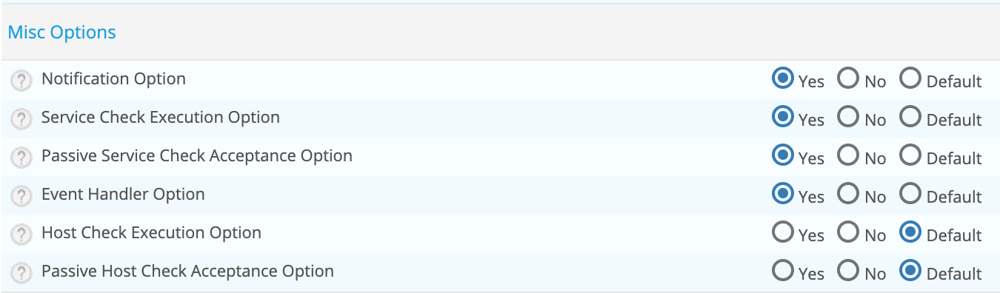
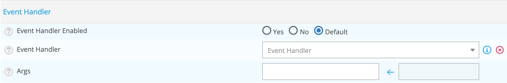

## Introduction

Le gestionnaire d'événements ou la correction automatique sont des commandes système facultatives (scripts ou
exécutables) qui sont exécutées chaque fois qu'un changement d'état d'un hôte ou d'un service se produit.

Une utilisation évidente du gestionnaire d'événements est la possibilité pour Centreon de résoudre proactivement les
problèmes avant que quiconque ne soit averti.

### Quand le gestionnaire d'événements est-il exécuté ?

Le gestionnaire d'événements est exécuté lorsqu'un service ou un hôte :

* Est dans un état problématique SOFT
* Entre initialement dans un état problématique HARD
* Récupère initialement d'un état problématique SOFT ou HARD
* Les états SOFT et HARD sont décrits [ici](../alerts-notifications/concepts.md#confirmation-du-statut)

### Types de gestionnaires d'événements

Il existe différents types de gestionnaires d'événements que vous pouvez définir pour gérer les changements d'état :

* Gestionnaire d'événements global pour les hôtes
* Gestionnaire d'événements global pour les services
* Gestionnaire d'événements spécifiques à un hôte
* Gestionnaire d'événements spécifiques à un service

Les gestionnaires d'événements globaux d'hôtes et de services sont exécutés pour chaque changement d'état d'hôte ou de
service qui se produit, immédiatement avant tout gestionnaire d'événement spécifique à l'hôte ou au service.

### Activation des gestionnaires d'événements

Les gestionnaires d'événements peuvent être activés ou désactivés sur un collecteur.

Les gestionnaires d'événements spécifiques à l'hôte et au service peuvent être activés ou désactivés dans vos définitions
d'hôte et de service. Les gestionnaires d'événements spécifiques ne seront pas exécutés si l'option globale est désactivée
sur votre collecteur.

### Ordre d'exécution du gestionnaire d'événements

Comme déjà mentionné, les gestionnaires d'événements globaux d'hôte et de service sont exécutés immédiatement avant les
gestionnaires d'événements spécifiques à l'hôte ou au service.

Les gestionnaires d'événements sont exécutés pour les problèmes HARD et les états de récupération immédiatement après
l'envoi des notifications.

## Configuration

### Créer une commande

Les commandes du gestionnaire d'événements seront probablement des scripts shell ou perl, mais il peut s'agir de
n'importe quel type d'exécutable pouvant être exécuté à partir d'un invite de commande. Au minimum, les scripts doivent
prendre les macros suivantes comme arguments :

* Pour les services : $SERVICESTATE$, $SERVICESTATETYPE$, $SERVICEATTEMPT$
* Pour les hôtes : $HOSTSTATE$, $HOSTSTATETYPE$, $HOSTATTEMPT$

Les scripts doivent examiner les valeurs des arguments qui leur sont transmis et prendre toutes les mesures nécessaires
en fonction de ces valeurs.

Les commandes du gestionnaire d'événements s'exécuteront normalement avec les mêmes autorisations que l'utilisateur sous
lequel Centreon Engine (utilisateur centreon-engine) s'exécute sur votre machine. Cela peut poser un problème si vous
souhaitez écrire un gestionnaire d'événements qui redémarre les services système, car les privilèges root sont
généralement requis pour effectuer ce type de tâches.

Idéalement, vous devez évaluer les types de gestionnaires d'événements que vous allez implémenter et accorder juste
assez de permissions à l'utilisateur Centreon Engine pour exécuter les commandes système nécessaires. Vous voudrez
peut-être essayer d'utiliser sudo pour ce faire.

Suivre [cette procédure pour créer une commande](./basic-objects/commands.md#adding-a-command).

> Utilisez ** Misc ** pour le type de commande pour classer vos commandes.

### Activer les gestionnaires d'événements sur votre plate-forme

Rendez-vous dans le menu **Configuration > Pollers > Engine configuration** et éditer toutes les configuration Centreon
Engine sur lesquelles vous souhaitez activer le gestionnaire d'évènements.

Dans l'onglet **Check Options**, activer l'option **Event Handler Option** :



### Configurer les gestionnaires d'événements

#### Globalement

Pour configurer globalement la correction automatique pour toutes les ressources d'un poller, se rendre dans le menu
**Configuration > Pollers > Engine configuration** et éditer la configuration Centreon Engine sur lesquelles vous
souhaitez activer la correction automatique globale.

Dans l'onglet **Check Options**, sélectionnez la commande pour les options **hosts and/or services event handler** :


Cliquer sur **Save**.

#### Sur des ressources sélectionnées

**Pour les hôtes**

Se rendre dans le menu **Configuration > Hosts > Hosts** et éditer la configuration de votre hôte. Dans l'onglet
**Data Processing** sélectionner la commande :



Cliquer sur **Save**.

> Vous pouvez configurer cette commande sur les modèles.

**Pour les services**

Se rendre dans le menu **Configuration > Services > Services by host** et éditer la configuration de votre hôte. Dans l'onglet
**Data Processing** sélectionner la commande :


Cliquer sur **Save**.

> Vous pouvez configurer cette commande sur les modèles.

### Exemple

L'exemple ci-dessous suppose que vous surveillez le serveur HTTP sur la machine locale. Nous supposerons que l'option
Max Check Attempts pour le service a une valeur de 4 ou plus (c'est-à-dire que le service est vérifié 4 fois avant
qu'il ne soit considéré comme ayant un réel problème). Un exemple de définition de service abrégé pourrait ressembler
à ceci ...

Le script du gestionnaire d'événements (/usr/lib/centreon/plugins/eventhandlers/restart-httpd).

```Shell
#!/bin/sh
#
# Event handler script for restarting the web server on the local machine
#
# Note: This script will only restart the web server if the service is
#       retried 3 times (in a "soft" state) or if the web service somehow
#       manages to fall into a "hard" error state.
#

# What state is the HTTP service in?
case "$1" in
OK)
	# The service just came back up, so don't do anything...
	;;
WARNING)
	# We don't really care about warning states, since the service is probably still running...
	;;
UNKNOWN)
	# We don't know what might be causing an unknown error, so don't do anything...
	;;
CRITICAL)
	# Aha!  The HTTP service appears to have a problem - perhaps we should restart the server...
	# Is this a "soft" or a "hard" state?
	case "$2" in

	# We're in a "soft" state, meaning that Centreon is in the middle of retrying the
	# check before it turns into a "hard" state and contacts get notified...
	SOFT)

		# What check attempt are we on?  We don't want to restart the web server on the first
		# check, because it may just be a fluke!
		case "$3" in

		# Wait until the check has been tried 3 times before restarting the web server.
		# If the check fails on the 4th time (after we restart the web server), the state
		# type will turn to "hard" and contacts will be notified of the problem.
		# Hopefully this will restart the web server successfully, so the 4th check will
		# result in a "soft" recovery.  If that happens no one gets notified because we
		# fixed the problem!
		3)
			echo -n "Restarting HTTP service (3rd soft critical state)..."
			# Call the init script to restart the HTTPD server
			/etc/rc.d/init.d/httpd restart
			;;
			esac
		;;

	# The HTTP service somehow managed to turn into a hard error without getting fixed.
	# It should have been restarted by the code above, but for some reason it didn't.
	# Let's give it one last try, shall we?  
	# Note: Contacts have already been notified of a problem with the service at this
	# point (unless you disabled notifications for this service)
	HARD)
		echo -n "Restarting HTTP service..."
		# Call the init script to restart the HTTPD server
		/etc/rc.d/init.d/httpd restart
		;;
	esac
	;;
esac
exit 0
```

L'exemple de script fourni ci-dessus tentera de redémarrer le serveur Web sur la machine locale :

* Une fois que le service a été revérifié pour la troisième fois et est dans un état SOFT CRITICAL
* Une fois que le service passe pour la première fois dans un état HARD CRITICAL

Le script devrait théoriquement redémarrer et le serveur Web et résoudre le problème avant que le service ne passe dans
un état de problème HARD, mais nous incluons un cas de secours dans le cas où cela ne fonctionne pas la première fois.
Il convient de noter que le gestionnaire d'événements ne sera exécuté que la première fois que le service tombe dans un
état de problème HARD. Cela empêche Centreon d'exécuter en continu le script pour redémarrer le serveur Web si le
service reste dans un état de problème HARD, vous ne souhaitez pas ce comportement.

Ensuite, créez une commande comme:

* Command Name: restart-httpd
* Command Type: Misc
* Command Line: $CENTREONPLUGINS$/eventhandlers/restart-httpd  $SERVICESTATE$ $SERVICESTATETYPE$ $SERVICEATTEMPT$

Maintenant, dans la définition du service, sélectionner la commande **restart-httpd** pour votre définition de
gestionnaire d'événements.
