import Tabs from '@theme/Tabs';
import TabItem from '@theme/TabItem';

> À partir d'avril 2023, nous changeons le nom de certains objets Centreon. "Connecteurs de supervision" est désormais le nouveau nom des Plugin Packs. Nous procédons à ce changement car les utilisateurs confondaient souvent deux termes similaires, Plugins et Plugin Packs, utilisant parfois l'un à la place de l'autre. Nous ne changeons que le nom ! Les fonctionnalités et les capacités restent les mêmes.

Un connecteur de supervision est un jeu téléchargeable
de modèles de configuration qui permet un déploiement rapide de la supervision de votre infrastructure IT. Les connecteurs de supervision sont le moyen le plus simple de mettre un hôte en supervision.

Un connecteur de supervision est constitué de deux éléments, installés séparément :

- Un plugin, qui exécute les commandes de supervision depuis un collecteur. Il peut être installé en ligne de commande ou automatiquement.
- Un pack, qui contient des commandes, des modèles de services et des modèles d’hôtes. Il est installé via l'interface de Centreon.
  Pour chaque type d’équipement, les modèles déterminent quels indicateurs seront
supervisés et définissent les valeurs par défaut des seuils Warning et
Critical (celles-ci sont modifiables par la suite).

  Certains packs contiennent aussi des [règles de découverte d'hôtes et de services](discovery/introduction.md).

La liste de tous les connecteurs de supervision disponibles dans la
bibliothèque en ligne Centreon et les procédures de mise en supervision
associées sont présentées dans la section [connecteurs de supervision](/pp/integrations/plugin-packs/getting-started/introduction).

## Prérequis

### Centreon Gestionnaire de connecteurs de supervision

Le module **Centreon Gestionnaire de connecteurs de supervision** permet de gérer l’installation et la
suppression des connecteurs de supervision. Il est installé par défaut. Il fait régulièrement l’objet de mises à jour, il est donc
recommandé de rester à jour sur ce composant.

Pour mettre à jour le module, lancez la commande :

<Tabs groupId="sync">
<TabItem value="Alma / RHEL / Oracle Linux 8" label="Alma / RHEL / Oracle Linux 8">

```shell
dnf update centreon-pp-manager
```

</TabItem>
<TabItem value="Alma / RHEL / Oracle Linux 9" label="Alma / RHEL / Oracle Linux 9">

```shell
dnf update centreon-pp-manager
```

</TabItem>
<TabItem value="Debian 12" label="Debian 12">

```shell
apt install --only-upgrade centreon-pp-manager
```

</TabItem>
</Tabs>

### Licence

Une [licence](../administration/licenses.md) est nécessaire pour accéder au catalogue complet des connecteurs de supervision. Contactez
les équipes [support Centreon](https://support.centreon.com) pour obtenir votre licence.

### Connecteurs

Certains connecteurs de supervision nécessitent aussi un Connecteur (ex : AS400 ou VMware)
ou un agent (ex : Windows NRPE). Dans ce cas, cela est indiqué dans la procédure de supervision du connecteur de supervision. La licence des connecteurs de supervision inclut la licence des connecteurs.

| Connecteur | Description                                                                                          |
|------------|------------------------------------------------------------------------------------------------------|
| NRPE       | Serveur NRPE packagé par Centreon avec les patchs nécessaires pour fonctionner avec les connecteurs de supervision |
| NSClient++ | NSClient++ packagé par Centreon et prêt à l’emploi à l’aide de Centreon plugins embarqués            |
| VMWare     | Démon Perl utilisant le SDK VMware pour contrôler les plateformes VMware                             |
| AS400      | Connecteur basé sur Java permettant d’exécuter des contrôles sur AS400                               |

## Installer un connecteur de supervision

Un connecteur de supervision s'installe en 4 étapes :

1. Accédez au catalogue des connecteurs de supervision.
2. Installez le pack.
3. Vérifiez la procédure de supervision.
4. Installez le plugin.

### Accéder au catalogue des connecteurs de supervision

* Si vous avez une [licence](../administration/licenses.md) **en ligne**, le catalogue des connecteurs de supervision est déjà disponible sur votre plateforme à la page **Configuration > Gestionnaire de connecteurs de supervision**.
* Si vous avez une licence **hors ligne** :
  - installez le dépôt des connecteurs de supervision (rendez-vous sur le [portail support Centreon](https://support.centreon.com/hc/fr/categories/10341239833105-D%C3%A9p%C3%B4ts) pour en obtenir l'adresse)
  - installez ou mettez à jour le catalogue des connecteurs de supervision
depuis votre serveur central :

<Tabs groupId="sync">
<TabItem value="Alma / RHEL / Oracle Linux 8" label="Alma / RHEL / Oracle Linux 8">

```shell
dnf install centreon-pack-*
```

ou :

```shell
dnf update centreon-pack-*
```
</TabItem>
<TabItem value="Alma / RHEL / Oracle Linux 9" label="Alma / RHEL / Oracle Linux 9">

```shell
dnf install centreon-pack-*
```

ou :

```shell
dnf update centreon-pack-*
```

</TabItem>
<TabItem value="Debian 12" label="Debian 12">

```shell
apt install centreon-pack-*
```

ou :

```shell
apt install --only-upgrade centreon-pack-\*
```

</TabItem>
</Tabs>

> Attention, même si la commande s'appelle `install`, elle ne fait que rendre le catalogue des connecteurs de supervision disponible. Elle n'installe pas ceux-ci. Suivez le reste de la procédure.

### Installer le pack

Vous avez maintenant accès au catalogue des connecteurs de supervision, à la page **Configuration > Gestionnaire de connecteurs de supervision** :


Pour installer un pack, cliquez sur le ``+``


Vous pouvez aussi cliquer sur le connecteur de supervision. Vous accéderez à sa description et un bouton ``+`` permettant
de l’installer.

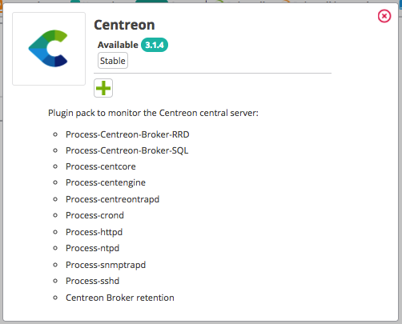

Une fois le pack installé, il apparaîtra avec un contour vert et une coche indiquant qu’il est installé.

| **Avant installation**                                           | **Après installation**                                          |
|------------------------------------------------------------------|-----------------------------------------------------------------|
|  | 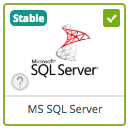 |

#### Gestion des dépendances

Il se peut que durant l’installation, certains objets du pack ne soient pas installés. Ces objets sont souvent des
objets de configuration additionnels et ne sont pas obligatoires pour déployer les modèles de configuration apportés par
le pack.

La plupart du temps, il est nécessaire de mettre à jour votre plate-forme Centreon, puis de réinstaller votre pack.

Dans l’exemple ci-dessus, l’objet “autodiscover” concerne une règle de découverte pour le module “Centreon Auto Discovery”,
mais celles-ci ne sont disponibles que pour Centreon en version 18.10.x :

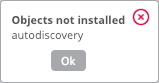

### Vérifier la procédure de supervision

Certains connecteurs de supervision demandent des étapes de configuration supplémentaires. Consultez la procédure de supervision associée à chaque pack installé pour comprendre le contenu du pack ainsi
que les prérequis nécessaires à son fonctionnement. Cliquez sur l'icône ``i`` de chaque pack pour accéder à la documentation associée :


### Installer le plugin

#### Installation automatique

1. [Installez le pack](#installer-le-pack).
2. Vérifiez dans la [procédure de supervision](#vérifier-la-procédure-de-supervision) si des étapes de configuration supplémentaires sont requises.
3. À la page **Configuration > Gestionnaire de connecteurs de supervision**, réglez **Installation automatique des plugins** sur **ON**.
4. Utilisez un modèle fourni par le pack pour mettre en supervision un hôte ou un service.
5. [Déployez la configuration](../monitoring/monitoring-servers/deploying-a-configuration.md) des collecteurs qui superviseront cet hôte ou ce service : les plugins correspondants seront installés automatiquement sur ces collecteurs.

#### Installation manuelle

La procédure de supervision comprend une section **Installation** qui vous indique comment installer le plugin, que ce soit avec une licence en ligne ou une licence hors ligne. Installez le plugin sur tous les collecteurs qui exécuteront les contrôles.

La commande d'installation suit le modèle suivant :

<Tabs groupId="sync">
<TabItem value="Alma / RHEL / Oracle Linux 8" label="Alma / RHEL / Oracle Linux 8">

```shell
dnf install centreon-plugin-$PLUGIN-PACK$
```

</TabItem>
<TabItem value="Alma / RHEL / Oracle Linux 9" label="Alma / RHEL / Oracle Linux 9">

```shell
dnf install centreon-plugin-$PLUGIN-PACK$
```

</TabItem>
<TabItem value="Debian 12" label="Debian 12">

```shell
apt install centreon-plugin-$PLUGIN-PACK$
```

</TabItem>
</Tabs>

dans laquelle ``$PLUGIN-PACK$`` correspond au nom du pack. Exemple :

<Tabs groupId="sync">
<TabItem value="Alma / RHEL / Oracle Linux 8" label="Alma / RHEL / Oracle Linux 8">

```shell
dnf install centreon-plugin-Cloud-Aws-Ec2-Api
```

</TabItem>
<TabItem value="Alma / RHEL / Oracle Linux 9" label="Alma / RHEL / Oracle Linux 9">

```shell
dnf install centreon-plugin-Cloud-Aws-Ec2-Api
```

</TabItem>
<TabItem value="Debian 12" label="Debian 12">

```shell
apt install centreon-plugin-cloud-aws-ec2-api
```

</TabItem>
</Tabs>

## Utiliser un connecteur de supervision

Appliquez un modèle issu d'un connecteur de supervision à un hôte ou à un service pour mettre celui-ci en supervision :

1. Créez l'hôte/le service, et dans le champ **Modèle(s)**, choisissez le modèle correspondant au connecteur de supervision désiré.

2. [Déployez](monitoring-servers/deploying-a-configuration.md) la configuration.

## Mettre à jour un connecteur de supervision

> Vous devez mettre à jour et le plugin et le pack.

### Mettre à jour un ou plusieurs packs

**Pour mettre à jour un pack :**

Si vous constatez une icône représentant une flèche sur un connecteur de supervision, cela veut dire qu’une mise à jour du pack est
disponible.

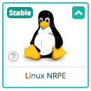

Pour le mettre à jour, cliquez sur la flèche,

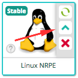

ou cliquez sur le connecteur de supervision. Une fenêtre affiche alors des informations relatives au connecteur de supervision, avec une icône flèche
permettant de le mettre à jour. Cliquez sur la flèche pour lancer la mise à jour :

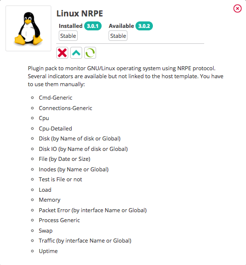

Confirmez la mise à jour.

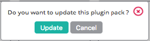

Votre pack est maintenant à jour. Vous pouvez maintenant [mettre à jour les plugins](#mettre-à-jour-les-plugins).

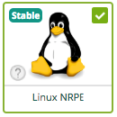

**Pour mettre à jour tous les packs :**

Vous pouvez également mettre à jour tous les packs en une seule fois : lorsque des mises à jour de packs sont disponibles, un bouton **Tout mettre à jour** apparaît.
Attention, vous devrez quand même [mettre à jour les plugins](#mettre-à-jour-les-plugins). 

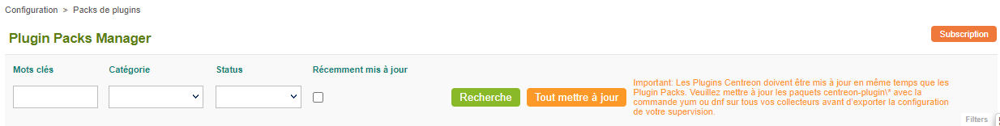

### Mettre à jour les plugins

À la page **Configuration > Gestionnaire de connecteurs de supervision**, si **Installation automatique des plugins** est à **ON**, les plugins seront mis à jour automatiquement lorsque vous déploierez la configuration d'un collecteur qui supervise un hôte ou un service qui utilise ce plugin.

Si **Installation automatique des plugins** est à **OFF**, utilisez la commande suivante pour mettre à jour les plugins :

1. Exécutez la commande suivante sur **tous les collecteurs**:

<Tabs groupId="sync">
<TabItem value="Alma / RHEL / Oracle Linux 8" label="Alma / RHEL / Oracle Linux 8">

```shell
dnf update centreon-plugin\*
```

</TabItem>
<TabItem value="Alma / RHEL / Oracle Linux 9" label="Alma / RHEL / Oracle Linux 9">

```shell
dnf update centreon-plugin\*
```

</TabItem>
<TabItem value="Debian 12" label="Debian 12">

```shell
apt-get --only-upgrade install centreon-plugin\*
```

</TabItem>
</Tabs>

2. [Déployez la configuration](monitoring-servers/deploying-a-configuration.md) sur tous les collecteurs. L'option **Redémarrer l'ordonnanceur** doit avoir la valeur **Redémarrer**.

3. Vérifiez qu’il n’y a pas de nouvelles erreurs suite à l’exécution des nouvelles sondes.

> C’est à vous de choisir si vous désirez installer les plugins sur tous les pollers, ou seulement sur le poller qui
> exécutera les contrôles. Gardez en tête que si vous n’installez par le plugin sur un poller, vous pourriez avoir des
> erreurs si vous décidez un jour de déplacer un hôte supervisé d’un poller avec le plugin vers un poller ne possédant
> pas le plugin. Par ailleurs, si vous mettez à jour les packs sur le serveur central, il est fortement recommandé de
> mettre à jour également les plugins associés sur les pollers, car de nouveaux contrôles sont parfois définis dans les
> packs, et ne fonctionneront pas s’ils n’ont pas la commande correspondante.

## Désinstaller un connecteur de supervision

Comme pour l’installation, la désinstallation du pack peut se faire soit en survolant le pack souhaité puis en cliquant
sur la croix rouge :


Ou alors en cliquant sur le pack, s’ouvre un pop-up affichant le nom, la version et la description du pack, ainsi qu’une
croix permettant la désinstallation :

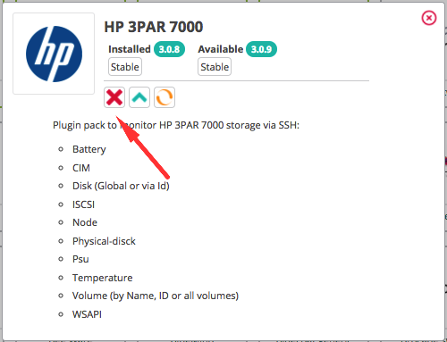

Confirmez la désinstallation.


Votre connecteur de supervision est désinstallé.

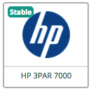

#### Gestion des dépendances

Si les modèles d’hôtes et de services créés par le connecteur de supervision sont utilisés par des hôtes et services actifs, le Plugin
Pack ne pourra être désinstallé.

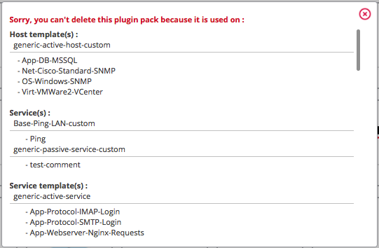

Pour pouvoir le désinstaller, soit vous :

* supprimez les hôtes ou services liés aux modèles fournis par ce connecteur de supervision
* déliez les hôtes ou services liés aux modèles fournis par ce connecteur de supervision

De plus, si vous tentez de désinstaller un pack dépendant d’un autre pack, la désinstallation ne pourra être faite que
si et seulement si ce pack n’est pas utilisé ni le(s) pack(s) dépendant(s). De plus, les packs dépendant seront
également supprimés.
