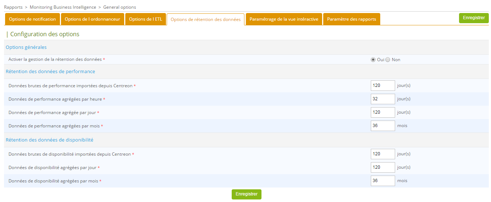

import Tabs from '@theme/Tabs';
import TabItem from '@theme/TabItem';

Ce chapitre présente l'architecture logicielle de l'extension **Centreon MBI** et fournit un aperçu de
l'intégration de l'extension au logiciel de supervision Centreon.

Ce document s'adresse aux administrateurs qui vont installer ou configurer Centreon MBI.

Quatre grandes étapes sont nécessaires pour installer Centreon MBI :

- Vérifiez les prérequis du système.
- Installez l'interface Centreon MBI dans l'application Centreon (Centreon MBI Server).
- Installez le serveur de reporting (Centreon MBI Reporting Server).
- Configurer l'extraction, la transformation et le chargement (ETL) dans l'interface MBI Centreon.

## Architecture

### Un serveur de reporting dédié

L'architecture et ces prérequis s'appliquent aux environnements de :

- test
- pré-production
- production.

Le schéma ci-dessous met en avant les principaux composants de Centreon MBI :


*La base de monitoring n'est pas nécessairement sur le même serveur que le serveur Centreon*

- **ETL** : Processus qui extrait, transforme et charge les données dans la
  base de données de reporting.
- **CBIS** : Ordonnanceur qui gère l'exécution et la publication des rapports.
- **Base de données de reporting** : Base de données MariaDB/MySQL qui contient les données de reporting
  et certaines données brutes extraites de la base de données de supervision.

### Tableaux des flux réseau

Le tableau ci-dessous présente les différents types de flux, par défaut,
entre le serveur BI dédié, le serveur Centreon et les bases de données :

| **Application** | **Source**               | **Destination**                      | **Port** | **Protocol** |
|-----------------|--------------------------|--------------------------------------|----------|--------------|
| ETL/CBIS        | Serveur de reporting     | Serveur de bases de données Centreon | 3306     | TCP          |
| SSH             | Serveur de reporting     | Serveur Centreon                     | 22       | TCP          |
| CBIS            | Serveur de reporting     | Serveur Centreon                     | 80       | HTTP*        |
| CBIS            | Centreon                 | Serveur de reporting                 | 1234     | TCP          |
| Widgets         | Serveur central Centreon | Serveur de reporting                 | 3306     | TCP          |

\**Uniquement requis pour les rapports Host-Graph-v2 et Hostgroup-Graph-v2 qui utilisent l'API Centreon pour générer des graphiques.*

### Informations sur les paquets

L'installation de Centreon MBI est basée sur deux paquets RPM :

- **Centreon-bi-server :** Installe l'interface MBI intégrée à l'interface de Centreon. Le paquet est installé sur le serveur central Centreon.
- **Centreon-bi-reporting-server** : Contient tous les composants nécessaires à l'exécution
  du serveur de reporting (planificateur de rapports, ETL, rapports standard). Il doit être
  installé sur un serveur dédié aux processus de reporting.

L'installation de la base de données doit être faite en même temps. Nous recommandons
fortement d'installer la base MariaDB/MySQL sur le serveur de reporting pour des raisons de
performances & d'isolation.

## Pré-requis

### Server Centreon central

#### Prérequis logiciels

Voir les [prérequis logiciels](../installation/prerequisites.md#logiciels).

<Tabs groupId="sync">
<TabItem value="Alma / RHEL / Oracle Linux 8" label="Alma / RHEL / Oracle Linux 8">

- Centreon Web 24.10
- Vérifiez que `date.timezone` est correctement configurée dans le fichier
  `/etc/php.d/50-centreon.ini` ou `/etc/php.d/20-timezone.ini` (même que celui retourné par la commande
  `timedatectl status`)
- Evitez l'utilisation des variables ci-dessous dans le fichier de
  configuration MariaDB `/etc/my.cnf`. Elles interrompent l'exécution de longues requêtes et peuvent arrêter les jobs d'ETL ou de génération de rapports :
  - wait_timeout
  - interactive_timeout
  
| Utilisateur          | Groupe                     |
|----------------------|----------------------------|
| centreonBI (nouveau) | apache,centreon,centreonBI |
| apache (existant)    | centreonBI                 |

</TabItem>
<TabItem value="Alma / RHEL / Oracle Linux 9" label="Alma / RHEL / Oracle Linux 9">

- Centreon Web 24.10
- Vérifiez que `date.timezone` est correctement configurée dans le fichier
  `/etc/php.d/50-centreon.ini` ou `/etc/php.d/20-timezone.ini` (même que celui retourné par la commande
  `timedatectl status`)
- Evitez l'utilisation des variables ci-dessous dans le fichier de
  configuration MariaDB `/etc/my.cnf`. Elles interrompent l'exécution de longues requêtes et peuvent arrêter les jobs d'ETL ou de génération de rapports :
  - wait_timeout
  - interactive_timeout
  
| Utilisateur          | Groupe                     |
|----------------------|----------------------------|
| centreonBI (nouveau) | apache,centreon,centreonBI |
| apache (existant)    | centreonBI                 |

</TabItem>
<TabItem value="Debian 12" label="Debian 12">

- Centreon Web 24.10
- Vérifiez que `date.timezone` est correctement configurée dans le fichier
  `/etc/php/8.2/mods-available/centreon.ini` ou `/etc/php/8.2/mods-available/timezone.ini` (même que celui retourné par la commande
  `timedatectl status`)
- Evitez l'utilisation des variables ci dessous dans le fichier de
  configuration MariaDB `/etc/mysql/mariadb.cnf`. Elles interrompent l'exécution de longues requêtes et peuvent arrêter les jobs d'ETL ou de génération de rapports :
  - wait_timeout
  - interactive_timeout

#### Utilisateurs et groupes

| Utilisateur          | Groupe                       |
|----------------------|------------------------------|
| centreonBI (nouveau) | www-data,centreon,centreonBI |
| apache (existant)    | centreonBI                   |

</TabItem>
</Tabs>

#### Description des utilisateurs, umask et répertoire personnel

| Utilisateur | umask | home             |
|-------------|-------|------------------|
| centreonBI  | 0002  | /home/centreonBI |

### Serveur de reporting dédié

#### Couche Matériel

<Tabs groupId="sync">
<TabItem value="Jusqu'à 500 hôtes" label="Jusqu'à 500 hôtes">

| Élément                     | Valeur     |
| ----------------------------| --------- |
| CPU   | 4 vCPU    |
| RAM                         | 16 Go      |

Votre serveur MBI doit être partitionné de la manière suivante :

| Groupe de volumes (LVM) | Partition               | Description | Taille                                                     |
|-| ----------------------------|-------------|----------------------------------------------------------|
| | /boot | images de boot | 1 Go |
|  vg_root | /                          | racine du système            | 20 Go                                |
| vg_root | swap                       | swap | 4 Go                               |
| vg_root | /var/log                   | contient tous les fichiers de log | 10 Go                                |
| vg_data | /var/lib/mysql  | base de données | 233 Go                               |
| vg_data | /var/backup | répertoire de sauvegarde | 10 Go |
| vg_data |   | Espace libre (non alloué) | 5 Go                               |

</TabItem>
<TabItem value="Jusqu'à 1 000 hôtes" label="Jusqu'à 1 000 hôtes">

| Élément                     | Valeur     |
| ----------------------------| --------- |
| CPU   | 4 vCPU    |
| RAM                         | 16 Go      |

Votre serveur MBI doit être partitionné de la manière suivante :

| Groupe de volumes (LVM) | Partition               | Description | Taille                                                     |
|-| ----------------------------|-------------|----------------------------------------------------------|
| | /boot | images de boot | 1 Go |
|  vg_root | /                          | racine du système            | 20 Go                                |
| vg_root | swap                       | swap | 4 Go                               |
| vg_root | /var/log                   | contient tous les fichiers de log | 10 Go                                |
| vg_data | /var/lib/mysql  | base de données | 465 Go                               |
| vg_data | /var/backup | répertoire de sauvegarde | 10 Go |
| vg_data |   | Espace libre (non alloué) | 5 Go                               |

</TabItem>
<TabItem value="Jusqu'à 2 500 hôtes" label="Jusqu'à 2 500 hôtes">

| Element                     | Value     |
| ----------------------------| --------- |
| CPU   | 4 vCPU    |
| RAM                         | 24 Go      |

Votre serveur MBI doit être partitionné de la manière suivante :

| Groupe de volumes (LVM) | Partition               | Description | Taille                                                     |
|-| ----------------------------|-------------|----------------------------------------------------------|
| | /boot | images de boot | 1 Go |
|  vg_root | /                          | racine du système            | 20 Go                                |
| vg_root | swap                       | swap | 4 Go                               |
| vg_root | /var/log                   | contient tous les fichiers de log | 10 Go                                |
| vg_data | /var/lib/mysql  | base de données | 1163 Go                               |
| vg_data | /var/backup | répertoire de sauvegarde | 10 Go |
| vg_data |   | Espace libre (non alloué) | 5 Go                               |

</TabItem>
<TabItem value="Jusqu'à 5 000 hôtes" label="Jusqu'à 5 000 hôtes">

| Element                     | Value     |
| ----------------------------| --------- |
| CPU   | 8 vCPU    |
| RAM                         | 24 Go      |

Votre serveur MBI doit être partitionné de la manière suivante :

| Groupe de volumes (LVM) | Partition               | Description | Taille                                                     |
|-| ----------------------------|-------------|----------------------------------------------------------|
| | /boot | images de boot | 1 Go |
|  vg_root | /                          | racine du système            | 20 Go                                |
| vg_root | swap                       | swap | 4 Go                               |
| vg_root | /var/log                   | contient tous les fichiers de log | 10 Go                                |
| vg_data | /var/lib/mysql  | base de données | 2326 Go                               |
| vg_data | /var/backup | répertoire de sauvegarde | 10 Go |
| vg_data |   | Espace libre (non alloué) | 5 Go                               |

</TabItem>
<TabItem value="Jusqu'à 10 000 hôtes" label="Jusqu'à 10 000 hôtes">

| Element                     | Value     |
| ----------------------------| --------- |
| CPU   | 12 vCPU    |
| RAM                         | 32 Go      |

Votre serveur MBI doit être partitionné de la manière suivante :

| Groupe de volumes (LVM) | Partition               | Description | Taille                                                     |
|-| ----------------------------|-------------|----------------------------------------------------------|
| | /boot | images de boot | 1 Go |
|  vg_root | /                          | racine du système            | 20 Go                                |
| vg_root | swap                       | swap | 4 Go                               |
| vg_root | /var/log                   | contient tous les fichiers de log | 10 Go                                |
| vg_data | /var/lib/mysql  | base de données | 4651 Go                               |
| vg_data | /var/backup | répertoire de sauvegarde | 10 Go |
| vg_data |   | Espace libre (non alloué) | 5 Go                               |

</TabItem>
<TabItem value="Plus de 10 000 hôtes" label="Plus de 10 000 hôtes">

Pour de grosses volumétries de données, contactez votre commercial Centreon.

</TabItem>
</Tabs>

Pour contrôler l'espace libre, utilisez la commande suivante en remplaçant
**vg_data** par le nom du groupe de volumes :

```shell
vgdisplay vg_data | grep -i free*
```

#### Couche interlogiciel et logiciel

- OS : voir la compatibilité [ici](../installation/compatibility.md#système-dexploitation)
- SGBD : voir la compatibilité [ici](../installation/compatibility.md#sgbd)
- Firewalld : Désactivé ([voir ici](../installation/installation-of-a-central-server/using-packages.md#Configurer-ou-désactiver-le-pare-feu))
- SELinux : Désactivé ([voir ici](../installation/installation-of-a-central-server/using-packages.md#Désactiver-SELinux))

> Assurez-vous que le fuseau horaire du serveur de reporting est le même que celui du serveur central, sinon les publications de rapports échoueront (lien vers le téléchargement manquant).
> Le même fuseau horaire doit être affiché avec la commande `timedatectl`.
> Vous pouvez changer le fuseau horaire avec cette commande :
>
>```shell
>timedatectl set-timezone Europe/Paris
>```

Veillez à optimiser MariaDB/MySQL sur votre serveur de reporting. Vous aurez besoin
d'au moins 12GB de mémoire vive afin d'utiliser le
[fichier suivant](../assets/reporting/installation/centreon.cnf).

Assurez-vous d'avoir un dossier **tmp** dans **/var/lib/mysql**.

> Ne définissez pas ces optimisations MariaDB/MySQL sur votre serveur de supervision.

Utilisateurs et groupes :

| Utilisateur | Groupe     |
|-------------|------------|
| centreonBI  | centreonBI |

Description des utilisateurs, umask et répertoire utilisateur :

| Utilisateur | umask | home             |
|-------------|-------|------------------|
| centreonBI  | 0002  | /home/centreonBI |

## Installer l'extension sur Centreon

Les actions listées dans ce chapitre doivent être exécutées sur le **serveur Central Centreon**.

1. Installez le dépôt Business : vous pouvez le trouver sur le [portail support](https://support.centreon.com/hc/fr/categories/10341239833105-D%C3%A9p%C3%B4ts).

2. Puis lancez la commande suivante :

<Tabs groupId="sync">
<TabItem value="Alma / RHEL / Oracle Linux 8" label="Alma / RHEL / Oracle Linux 8">

```shell
dnf install centreon-bi-server
```

</TabItem>
<TabItem value="Alma / RHEL / Oracle Linux 9" label="Alma / RHEL / Oracle Linux 9">

```shell
dnf install centreon-bi-server
```

</TabItem>
<TabItem value="Debian 12" label="Debian 12">

Installez **gpg**:

```shell
apt install gpg
```

Importez la clé du dépôt :

```shell
wget -O- https://apt-key.centreon.com | gpg --dearmor | tee /etc/apt/trusted.gpg.d/centreon.gpg > /dev/null 2>&1
```

Ajoutez le dépôt externe suivant (pour Java 8):

```shell
wget -qO - https://adoptopenjdk.jfrog.io/adoptopenjdk/api/gpg/key/public | apt-key add -
add-apt-repository --yes https://adoptopenjdk.jfrog.io/adoptopenjdk/deb/
apt update
```

Puis installez Centreon MBI:

```shell
apt install centreon-bi-server
```

</TabItem>
</Tabs>

### Activer l'extension

Le menu **Administration > Extension > Gestionnaire** vous permet
d'installer les différentes extensions détectées par Centreon. Cliquez sur la tuile  **Centreon MBI** pour l'installer.

Par la suite, téléchargez la licence envoyée par l'équipe Centreon pour pouvoir commencer à configurer les options générales.

### Configurer l'extension

Renseignez les valeurs suivantes dans les options générales de Centreon
MBI, menu **Rapports > Monitoring Business Intelligence > Paramètres globaux** :

| Onglet                                                                                 | Option                     | Value                                                                                |
|----------------------------------------------------------------------------------------|----------------------------|--------------------------------------------------------------------------------------|
| Options de  l'ordonnanceur                                                             | Hôte de CBIS               | Adresse IP du serveur de reporting                                                   |
| Options de l'ETL | Une base de données MySQL dédiée au reporting a été mise en place | Oui                        |                                                                                      |
| Widgets de reporting*                                                                  | Reporting MySQL database | Adresse IP de la base de reporting (par défaut = adresse IP du serveur de reporting) |

\* *Le test de connexion ne fonctionnera pas encore à ce moment de l'installation*

### Accès à la base de données Centrale

Téléchargez la licence envoyée par l'équipe Centreon pour pouvoir commencer à configurer les options générales.

<Tabs groupId="sync">
<TabItem value="Base de supervision locale au central" label="Base de supervision locale au central">


La base de données de supervision MariaDB/MySQL est hébergée sur le serveur de supervision central.

Lancez la commande ci-dessous pour autoriser le serveur de reporting à se connecter
aux bases de données du serveur de supervision. Utilisez l'option suivante :

```shell
perl /usr/share/centreon/www/modules/centreon-bi-server/tools/centreonMysqlRights.pl --root-password=@ROOTPWD@
```

**@ROOTPWD@** : Mot de passe root de la base MariaDB/MySQL de supervision.
S'il n'y a pas de mot de passe pour l'utilisateur "root", ne spécifiez pas l'option **root-password**.

</TabItem>
<TabItem value="Base de supervision déportée par rapport au central" label="Base de supervision déportée par rapport au central">

La base de données de supervision MariaDB/MySQL est hébergée sur un serveur dédié.

Connectez-vous par SSH au serveur de la base de données, et exécutez les commandes suivantes :

```SQL
CREATE USER 'centreonbi'@'$BI_ENGINE_IP$' IDENTIFIED BY 'centreonbi';
GRANT ALL PRIVILEGES ON centreon.* TO 'centreonbi'@'$BI_ENGINE_IP$';
GRANT ALL PRIVILEGES ON centreon_storage.* TO 'centreonbi'@'$BI_ENGINE_IP$';
```

**$BI_ENGINE_IP$** : Adresse IP du serveur de reporting.

</TabItem>
</Tabs>

Si vous utilisez la réplication MariaDB pour vos **bases de données de supervision**,
certaines vues sont créées lors de l'installation de Centreon MBI.
Vous devez les exclure de la réplication en ajoutant la ligne suivante dans le
fichier **my.cnf** du serveur esclave ou mariadb.cnf sur Debian 12.

```shell
replicate-wild-ignore-table=centreon.mod_bi_%v01,centreon.mod_bi_%V01
```

Ensuite, créez les vues manuellement sur le serveur esclave :

1. Téléchargez [le fichier suivant](../assets/reporting/installation/view_creation.sql) dans un répertoire temporaire (ici, **/tmp**), par exemple en utilisant **wget**.

2. Exécutez la commande suivante (changez le nom de votre répertoire temporaire si besoin):

```bash
mysql centreon < /tmp/view_creation.sql
```

#### Configuration spécifique à Debian 12

MariaDB doit écouter sur toutes les interfaces au lieu d'écouter sur localhost/127.0.0.1 (valeur par défaut). Éditez le fichier suivant :

```shell
/etc/mysql/mariadb.conf.d/50-server.cnf
```

Donnez au paramètre **bind-address** la valeur **0.0.0.0** et redémarrez **mariadb**.

```shell
systemctl restart mariadb
```

### Donner des droits à l'utilisateur cbis

Lorsque vous installez Centreon MBI, un [utilisateur](../monitoring/basic-objects/contacts.md) nommé **cbis** est créé automatiquement. Il permet au moteur de génération de rapports d'extraire les données de Centreon (en utilisant les APIs) afin de les insérer dans le rapport. Cet utilisateur doit [avoir accès à toutes les ressources supervisées par Centreon](../administration/access-control-lists.md) afin de pouvoir extraire les graphes de performance pour les rapports suivants :

- Host-Graph-v2
- Hostgroup-Graph-v2.

Pour tester la connexion entre le serveur de reporting MBI et l'API Centreon, utilisez la commande suivante pour télécharger un graphique. Remplacez les paramètres du graphique et les timestamps, et remplacez XXXXXXXXX par le jeton d'autologin de l'utilisateur **cbis**:

```bash
curl -XGET 'https://IP_CENTRAL/centreon/include/views/graphs/generateGraphs/generateImage.php?akey=XXXXXXXXX&username=CBIS&hostname=<nom_hôte>&service=<description-service>&start=<date_début>&end=<date_fin>' --output /tmp/image.png

```

Exemple :

```bash
curl -XGET 'https://10.1.1.1/centreon/include/views/graphs/generateGraphs/generateImage.php?akey=otmw3n1hu03bvt9e0caphuf50ph8sdthcsk8ofdk&username=CBIS&hostname=my-poller&service=Cpu&start=1623016800&end=1623621600' --output /tmp/image.png
```

Le résultat devrait ressembler au code ci-dessous, et l'image du graphe désiré doit avoir été téléchargée dans le répertoire `/tmp` :

```text
  % Total    % Received % Xferd  Average Speed   Time    Time     Time  Current
                                 Dload  Upload   Total   Spent    Left  Speed
100 18311  100 18311    0     0  30569      0 --:--:-- --:--:-- --:--:-- 30569
```

## Installer le serveur de reporting

### Installer les paquets

Vous devez disposer des informations suivantes avant de procéder au
processus d'installation :

- IP/DNS de la base de données de supervision
- IP/DNS de l'interface web Centreon
- IP/DNS de la base de données de reporting (localhost fortement recommandé)
- Accès (utilisateur/mot de passe) à la base de données de reporting
- Définir puis récupérer le mot de passe ssh de l'utilisateur centreonBI, sur le serveur Central (pour la mise à disposition des rapports générés sur l'interface)

#### Procédure

1. Installez le dépôt Centreon :

<Tabs groupId="sync">
<TabItem value="Alma / RHEL / Oracle Linux 8" label="Alma / RHEL / Oracle Linux 8">

```shell
dnf install -y dnf-plugins-core
dnf config-manager --add-repo https://packages.centreon.com/rpm-standard/24.10/el8/centreon-24.10.repo
dnf clean all --enablerepo=*
dnf update
```

</TabItem>
<TabItem value="Alma / RHEL / Oracle Linux 9" label="Alma / RHEL / Oracle Linux 9">

```shell
dnf install -y dnf-plugins-core
dnf config-manager --add-repo https://packages.centreon.com/rpm-standard/24.10/el9/centreon-24.10.repo
dnf clean all --enablerepo=*
dnf update
```

</TabItem>
<TabItem value="Debian 12" label="Debian 12">

```shell
echo "deb https://packages.centreon.com/apt-standard-24.10-stable/ $(lsb_release -sc) main" | tee /etc/apt/sources.list.d/centreon.list
echo "deb https://packages.centreon.com/apt-plugins-stable/ $(lsb_release -sc) main" | tee /etc/apt/sources.list.d/centreon-plugins.list
```

Ensuite, importez la clé du dépôt :

```shell
wget -O- https://apt-key.centreon.com | gpg --dearmor | tee /etc/apt/trusted.gpg.d/centreon.gpg > /dev/null 2>&1
apt update
```

</TabItem>
</Tabs>

2. Installez le dépôt Business. Vous pouvez le trouver sur le [portail du support](https://support.centreon.com/hc/fr/categories/10341239833105-D%C3%A9p%C3%B4ts).

3. Assurez-vous qu'une version de Java 17 (ou 18) est installée.
   
   - Pour vérifier quelle version de Java est installée, entrez la commande suivante :
   
   ```shell
   java -version
   ```
   
   - Pour une mise à jour de Java en version 17 (ou 18), allez sur la [page officielle de téléchargement d'Oracle](https://www.oracle.com/java/technologies/downloads/#java17).
   
   - Si plusieurs versions de Java sont installées, vous devez activer la bonne version. Affichez les versions installées avec la commande suivante puis sélectionnez la version 17 (ou 18) :
   
   ```shell
   sudo update-alternatives --config java
   ```

4. Installez le dépôt MariaDB :

<Tabs groupId="sync">
<TabItem value="Alma / RHEL / Oracle Linux 8" label="Alma / RHEL / Oracle Linux 8">

```shell
curl -LsS https://r.mariadb.com/downloads/mariadb_repo_setup | sudo bash -s -- --os-type=rhel --os-version=8 --mariadb-server-version="mariadb-10.11"
```

</TabItem>
<TabItem value="Alma / RHEL / Oracle Linux 9" label="Alma / RHEL / Oracle Linux 9">

```shell
curl -LsS https://r.mariadb.com/downloads/mariadb_repo_setup | sudo bash -s -- --os-type=rhel --os-version=9 --mariadb-server-version="mariadb-10.11"
```

</TabItem>
<TabItem value="Debian 12" label="Debian 12">

```shell
curl -LsS https://r.mariadb.com/downloads/mariadb_repo_setup | sudo bash -s -- --os-type=debian --os-version=12 --mariadb-server-version="mariadb-10.11"
```

</TabItem>
</Tabs>

5. Puis lancez la commande suivante:

<Tabs groupId="sync">
<TabItem value="RHEL 8" label="RHEL 8">

Installez le dépôt **epel** :

```shell
dnf install -y https://dl.fedoraproject.org/pub/epel/epel-release-latest-8.noarch.rpm
```

Activer les dépôts codeready-builder :

```shell
subscription-manager repos --enable codeready-builder-for-rhel-8-x86_64-rpms
```

Puis lancer l'installation :

```shell
dnf install centreon-bi-reporting-server MariaDB-server MariaDB-client
```

Dans le cas d'une installation basée sur une distribution vierge, installez la
clé GPG :

```shell
cd /etc/pki/rpm-gpg/
wget https://yum-gpg.centreon.com/RPM-GPG-KEY-CES
```

</TabItem>
<TabItem value="Oracle Linux 8" label="Oracle Linux 8">

Installez le dépôt **epel** :

```shell
dnf install -y https://dl.fedoraproject.org/pub/epel/epel-release-latest-8.noarch.rpm
```

Activer les dépôts codeready-builder :

```shell
dnf config-manager --set-enabled ol8_codeready_builder
```

Puis lancer l'installation :

```shell
dnf install centreon-bi-reporting-server MariaDB-server MariaDB-client
```

Dans le cas d'une installation basée sur une distribution vierge, installez la
clé GPG :

```shell
cd /etc/pki/rpm-gpg/
wget https://yum-gpg.centreon.com/RPM-GPG-KEY-CES
```

</TabItem>
<TabItem value="Alma 8" label="Alma 8">

Installez le dépôt **epel** :

```shell
dnf install -y https://dl.fedoraproject.org/pub/epel/epel-release-latest-8.noarch.rpm
```

Activer les dépôts powertools :

```shell
dnf config-manager --set-enabled 'powertools'
```

Puis lancer l'installation :

```shell
dnf install centreon-bi-reporting-server MariaDB-server MariaDB-client
```

Dans le cas d'une installation basée sur une distribution vierge, installez la
clé GPG :

```shell
cd /etc/pki/rpm-gpg/
wget https://yum-gpg.centreon.com/RPM-GPG-KEY-CES
```

</TabItem>
<TabItem value="RHEL 9" label="RHEL 9">

Installez le dépôt **epel** :

```shell
dnf install -y https://dl.fedoraproject.org/pub/epel/epel-release-latest-9.noarch.rpm
```

Activer les dépôts codeready-builder :

```shell
subscription-manager repos --enable codeready-builder-for-rhel-9-x86_64-rpms
```

Puis lancer l'installation :

```shell
dnf install centreon-bi-reporting-server MariaDB-server MariaDB-client
```

Dans le cas d'une installation basée sur une distribution vierge, installez la
clé GPG :

```shell
cd /etc/pki/rpm-gpg/
wget https://yum-gpg.centreon.com/RPM-GPG-KEY-CES
```

</TabItem>
<TabItem value="Oracle Linux 9" label="Oracle Linux 9">

Installez le dépôt **epel** :

```shell
dnf install -y https://dl.fedoraproject.org/pub/epel/epel-release-latest-9.noarch.rpm
```

Activer les dépôts codeready-builder :

```shell
dnf config-manager --set-enabled ol9_codeready_builder
```

Puis lancer l'installation :

```shell
dnf install centreon-bi-reporting-server MariaDB-server MariaDB-client
```

Dans le cas d'une installation basée sur une distribution vierge, installez la
clé GPG :

```shell
cd /etc/pki/rpm-gpg/
wget https://yum-gpg.centreon.com/RPM-GPG-KEY-CES
```

</TabItem>
<TabItem value="Alma 9" label="Alma 9">

Installez le dépôt **epel** :

```shell
dnf install -y https://dl.fedoraproject.org/pub/epel/epel-release-latest-9.noarch.rpm
```

Exécutez la commande suivante :

```shell
dnf config-manager --set-enabled 'crb' 
```

Puis lancer l'installation :

```shell
dnf install centreon-bi-reporting-server MariaDB-server MariaDB-client
```

Dans le cas d'une installation basée sur une distribution vierge, installez la
clé GPG :

```shell
cd /etc/pki/rpm-gpg/
wget https://yum-gpg.centreon.com/RPM-GPG-KEY-CES
```

</TabItem>
<TabItem value="Debian 12" label="Debian 12">

Installez le dépôt Centreon :

```shell
echo "deb https://packages.centreon.com/apt-standard-24.10-stable/ $(lsb_release -sc) main" | tee /etc/apt/sources.list.d/centreon.list
```


Installez les paquets prérequis :

```shell
apt install lsb-release ca-certificates apt-transport-https software-properties-common wget gnupg2
```

Ajouter le dépôt externe suivant (pour Java 8):

```shell
wget -qO - https://adoptopenjdk.jfrog.io/adoptopenjdk/api/gpg/key/public | apt-key add -
add-apt-repository --yes https://adoptopenjdk.jfrog.io/adoptopenjdk/deb/
apt update
```

Dans le cas d'une installation basée sur une distribution vierge, installez la
clé GPG :

```shell
wget -O- https://apt-key.centreon.com | gpg --dearmor | tee /etc/apt/trusted.gpg.d/centreon.gpg > /dev/null 2>&1
```

Puis lancer l'installation :

```shell
apt update
apt install centreon-bi-reporting-server mariadb-server mariadb-client
```

</TabItem>
</Tabs>

Activez le service **cbis** :

```shell
systemctl enable cbis
```

Démarrez et activez **gorgoned**:

```shell
systemctl start gorgoned && systemctl enable gorgoned
```

### Configurer le serveur de reporting

#### Optimisations MariaDB

<Tabs groupId="sync">
<TabItem value="Alma / RHEL / Oracle Linux 8" label="Alma / RHEL / Oracle Linux 8">

Assurez vous que [le fichier](../assets/reporting/installation/centreon.cnf) de configuration
optimisé fourni dans les pré-requis est bien présent dans `/etc/my.cnf.d/`, puis redémarrez
le service MariaDB :

```shell
systemctl restart mariadb
```

Il est nécessaire de modifier la limitation **LimitNOFILE**. Changer cette
option dans `/etc/my.cnf` NE fonctionnera PAS.

```shell
mkdir -p  /etc/systemd/system/mariadb.service.d/
echo -ne "[Service]\nLimitNOFILE=32000\n" | tee /etc/systemd/system/mariadb.service.d/limits.conf
systemctl daemon-reload
systemctl restart mariadb
```

Si le service MariaDB échoue lors du démarrage, supprimer les fichiers
*ib_logfile* (MariaDB doit absolument être stoppé) puis redémarrer à
nouveau MariaDB:

```shell
rm -f /var/lib/mysql/ib_logfile*
systemctl start mariadb
```

Si vous utilisez un fichier de socket spécifique pour MariaDB, modifiez le
fichier `/etc/my.cnf` et dans la section [client], ajoutez :

```shell
socket=$PATH_TO_SOCKET$
```

</TabItem>
<TabItem value="Alma / RHEL / Oracle Linux 9" label="Alma / RHEL / Oracle Linux 9">

Assurez vous que [le fichier](../assets/reporting/installation/centreon.cnf) de configuration
optimisé fourni dans les pré-requis est bien présent dans `/etc/my.cnf.d/`, puis redémarrez
le service MariaDB :

```shell
systemctl restart mariadb
```

Il est nécessaire de modifier la limitation **LimitNOFILE**. Changer cette
option dans `/etc/my.cnf` NE fonctionnera PAS.

```shell
mkdir -p  /etc/systemd/system/mariadb.service.d/
echo -ne "[Service]\nLimitNOFILE=32000\n" | tee /etc/systemd/system/mariadb.service.d/limits.conf
systemctl daemon-reload
systemctl restart mariadb
```

Si le service MariaDB échoue lors du démarrage, supprimer les fichiers
*ib_logfile* (MariaDB doit absolument être stoppé) puis redémarrer à
nouveau MariaDB:

```shell
rm -f /var/lib/mysql/ib_logfile*
systemctl start mariadb
```

Si vous utilisez un fichier de socket spécifique pour MariaDB, modifiez le
fichier `/etc/my.cnf` et dans la section [client], ajoutez :

```shell
socket=$PATH_TO_SOCKET$
```

</TabItem>
<TabItem value="Debian 12" label="Debian 12">

Assurez vous que [le fichier](../assets/reporting/installation/centreon.cnf) de configuration
optimisé fourni dans les pré-requis est bien présent dans `/etc/mysql/mariadb.conf.d/`.

Renommez le fichier en `80-centreon.cnf` :

```shell
mv centreon.cnf 80-centreon.cnf
```

MariaDB doit écouter toutes les interfaces au lieu de localhost/127.0.0.1, qui est la valeur par défaut.
Éditez le fichier suivant :

```shell
/etc/mysql/mariadb.conf.d/50-server.cnf
```

Définissez le paramètre **bind-address** à **0.0.0.0** et redémarrez mariadb.

```shell
systemctl restart mariadb
```

Il est nécessaire de modifier la limitation **LimitNOFILE**. Changer cette
option dans `/etc/mysql/mariadb.cnf` ne fonctionnera pas.

```shell
mkdir -p  /etc/systemd/system/mariadb.service.d/
echo -ne "[Service]\nLimitNOFILE=32000\n" | tee /etc/systemd/system/mariadb.service.d/limits.conf
systemctl daemon-reload
systemctl restart mariadb
```

Si le service MariaDB échoue lors du démarrage, supprimer les fichiers
*ib_logfile* (MariaDB doit absolument être stoppé) puis redémarrer à
nouveau MariaDB:

```shell
rm -f /var/lib/mysql/ib_logfile*
systemctl start mariadb
```

Si vous utilisez un fichier de socket spécifique pour MariaDB, modifiez le
fichier `/etc/mysql/mariadb.cnf` et dans la section [client], ajoutez :

```shell
socket=$PATH_TO_SOCKET$
```

</TabItem>
</Tabs>

### Sécuriser la base de données

Il est obligatoire de sécuriser l'accès root de la base de données avant d'installer Centreon.
Si vous utilisez une base de données locale, exécutez la commande suivante sur le serveur central, sinon sur le serveur de base de données :

<Tabs groupId="sync">
<TabItem value="MariaDB" label="MariaDB"> 

```shell
mariadb-secure-installation
```

</TabItem>
<TabItem value="MySQL" label="MySQL"> 

```shell
mysql_secure_installation
```

</TabItem>
</Tabs>

- Répondez **oui** à toutes les questions, sauf à "Disallow root login remotely?"
- Il est obligatoire de définir un mot de passe pour l'utilisateur **root** de la base de données. Vous aurez besoin de ce mot de passe pendant l'[installation web](../installation/web-and-post-installation.md).

> Pour plus d'informations, veuillez consulter la [documentation officielle de MariaDB](https://mariadb.com/kb/en/mysql_secure_installation/).

#### Commencer à configurer

Vérifiez que le MariaDB de reporting est bien démarré puis lancez les
commandes ci dessous et répondez aux questions:

```shell
/usr/share/centreon-bi/config/install.sh
```

Le script gère l'échange de clés SSH entre le serveur de supervision et le serveur de reporting, et configure la règle de publication SFTP par défaut
afin de publier les rapports sur l'interface web Centreon. Enfin, il active la sauvegarde et démarre le service CBIS.

Une fois l'installation terminée, poursuivez au chapitre suivant pour configurer l'ETL.

#### Problème avec l'échange de la clé SSH

Dans quelques cas, l'échange de clés SSH échoue.
Afin de résoudre le problème, procédez manuellement comme suit :

Connectez-vous avec l'utilisateur `centreonBI` :

```bash
su - centreonBI
```

Ensuite, générez une clé SSH :

```bash
ssh-keygen -t ed25519 -a 100 -f ~/.ssh/id_ed25519 -P "" -q
```

Et affichez la clé publique générée (afin de l'autoriser ensuite sur Centreon) :

```bash
cat /home/centreonBI/.ssh/id_ed25519.pub
```

Maintenant, **sur le serveur de supervision** :

Créez un dossier `.ssh` dont `centreonBI` sera propriétaire, restreingez les droits sur ce fichier et collez dans le fichier `authorized_keys` le contenu de sa clé publique sur le serveur de reporting (affichée précédemment) :

```bash
mkdir -p /home/centreonBI/.ssh/ && chown centreonBI: /home/centreonBI/.ssh/ && chmod 700 /home/centreonBI/.ssh/ && echo "@contenu de la clé publique@" > /home/centreonBI/.ssh/authorized_keys
```

L'échange de clés doit enfin être validé par une première connexion qui acceptera la signature du serveur SSH.
En tant que l'utilisateur `centreonBI` **depuis le serveur de reporting** :

```bash
ssh centreonBI@@MONITORING_SERVER@
```

Vous pouvez maintenant quitter la session `centreonBI` avec `exit` ou `Ctrl-D`.

Pour continuer, relancez le script d'installation (`/usr/share/centreon-bi/config/install.sh`) comme ci-dessus et répondez **Oui** lorsqu'on vous demande de procéder à l'échange de clés SSH.
Vous aurez une erreur lors de la création de l'USER car il existe déjà. Ce n'est pas une étape bloquante.

### ETL : Configuration

Centreon MBI intègre un ETL qui permet de :

- Synchroniser les données brutes de la supervision vers le serveur de
  reporting
- Alimenter les bases de données du serveur de reporting avec les
  données statistiques
- Contrôler la rétention des données sur le serveur de reporting

Avant de passer aux étapes suivantes, il est nécessaire de lire le chapitre des [bonnes pratiques](concepts.md#bonnes-pratiques-de-supervision) afin de
vous assurer que la configuration des objets dans Centreon (groupes, catégories...) est conforme aux attentes de Centreon MBI.

Dans le menu `Rapports > Monitoring Business Intelligence > Options générales > Options de l'ETL`, spécifiez les options
suivantes :

| Option                                                                                                                                   | Valeurs                                                                                                                                                                                                                                                                                                                                            |
|------------------------------------------------------------------------------------------------------------------------------------------|----------------------------------------------------------------------------------------------------------------------------------------------------------------------------------------------------------------------------------------------------------------------------------------------------------------------------------------------------|
| **Options générales**                                                                                                                    |                                                                                                                                                                                                                                                                                                                                                    |
| Une base de données MariaDB dédiée au reporting a été mise en place.                                                                     | Oui. Vous devez avoir un serveur de reporting dédié.                                                                                                                                                                                                                                                                                               |
| Espace de stockage des fichiers temporaires sur le serveur de reporting *                                                                | Dossier sur le serveur de reporting dans lequel les dumps de données seront positionnés                                                                                                                                                                                                                                                            |
| Type de statistiques à traiter                                                                                                           | Sélectionnez « Disponibilité uniquement » si vous utilisez uniquement les rapports de disponibilité.  Sélectionnez « Performance et capacité uniquement» si vous souhaitez utiliser uniquement les rapports de capacité et de performance. Sélectionnez «Tous» afin de calculer les statistiques pour les deux types de rapports.                  |
| Activer le stockage des tables temporaires en mémoire (uniquement si la mémoire physique allouée au serveur de reporting est suffisante) | Activé uniquement si votre configuration MariaDB et la mémoire physique allouée au serveur de reporting le permet.                                                                                                                                                                                                                                 |
| **Sélection du périmètre du reporting**                                                                                                  |                                                                                                                                                                                                                                                                                                                                                    |
| Groupes d'hôtes                                                                                                                          | Sélectionnez les groupes d’hôtes pour lesquels vous souhaitez conserver les statistiques.                                                                                                                                                                                                                                                          |
| Catégories d'hôtes                                                                                                                       | Sélectionnez les catégories d’hôtes pour lesquels vous souhaitez conserver les statistiques.                                                                                                                                                                                                                                                       |
| Catégories de services                                                                                                                   | Sélectionnez les catégories de services pour lesquels vous souhaitez conserver les statistiques.                                                                                                                                                                                                                                                   |
| **Calcul des données de disponibilité**                                                                                                  |                                                                                                                                                                                                                                                                                                                                                    |
| Sélectionner les plages de services pour le calcul des statistiques de disponibilité                                                     | Plages horaires (time periods) pour lesquelles les calculs de disponibilité des hôtes et des services sont réalisées                                                                                                                                                                                                                               |
| **Calcul des données de performance et de capacité**                                                                                     |                                                                                                                                                                                                                                                                                                                                                    |
| Granularité des données statistiques à calculer                                                                                          | Sélectionnez le ou les niveaux de granularité pour le calcul des données de performance (1)                                                                                                                                                                                                                                                        |
| Sélectionner les plages de services pour le calcul des statistiques de performance                                                       | Plages horaires sur les jours de la semaine pris en compte dans le calcul des données de capacité et de performance                                                                                                                                                                                                                                |
| **Capacity statistic aggregated by month**                                                                                               |                                                                                                                                                                                                                                                                                                                                                    |
|   Sélectionne la plage de service 24h/24, 7j/7 pour le calcul des statistiques mensuelles de capacité                                    | Sélectionnez la plage horaire 24x7.                                                                                                                                                                                                                                                                                                                |
| Sélectionner les catégories de services liées aux indicateurs de capacité                                                                | Sélectionnez les catégories de services ayant été rattachés à des services de type capacité                                                                                                                                                                                                                                                        |
| Exclure les métriques qui ne renvoient pas une indication d'utilisation des espaces de stockage                                          | Concerne uniquement les métriques liées aux services qui renvoient une information de capacité. Sélectionnez uniquement les métriques qui donnent une valeur maximale ou une valeur totale de capacité et non une valeur d’utilisation. (Par exemple, la métrique “ size ” returnée par le plugin check_centreon_snmp_remote_storage »)            |
| **Paramètres pour le calcul des centiles**                                                                                               |                                                                                                                                                                                                                                                                                                                                                    |
| Calculating centile aggregation by                                                                                                       | Sélectionnez la granularité des calculs. Le rapport de trafic fourni en standard avec BI 2.1 utilise les données au Mois.                                                                                                                                                                                                                          |
| Sélectionner les catégories de services sur lesquelles aggréger les données                                                              | Sélectionnez uniquement les catégories de services pertinentes (Ex: Traffic)                                                                                                                                                                                                                                                                       |
| Premier jour de la semaine                                                                                                               | Sélectionnez le premier jour à considérer pour les statistiques à la semaine                                                                                                                                                                                                                                                                       |
| Créer les combinaisons centile-plage horaire qui couvrent vos besoins (Format du centile : 00.0000)                                      | Créez des combinaisons centile/plage horaire sur lesquels les statistiques seront effectuées                                                                                                                                                                                                                                                       |

**(1)** Les rapports nécessitant une granularité des données à l'heure sont listés ci-dessous.
Si vous ne souhaitez pas utiliser ces rapports,désactivez le calcul des statistiques à l'heure:

- Hostgroup-Host-details-1

- Host-detail-v2
- Hostgroup-traffic-Average-Usage-By-Interface
- Hostgroup-traffic-by-Interface-And-Bandwith-Ranges

### ETL: Rétention de données

Le serveur de reporting contient des tables de statistiques spécifiques à Centreon MBI dans la base de données "centreon_storage".
L'espace de stockage utilisé par ces tables augmente chaque jour. Il est possible de contrôler la taille de ces tables en définissant
des règles de rétention des données.

Sous **Rapports > Monitoring Business Intelligence > Options Générales > Options de rétention des données**,
la rétention des données peut être gérée par :

- Type de données (disponibilité, performance).
- Granularité des données (données brutes, valeurs horaires, quotidiennes ou mensuelles).

> Avant d'activer les options de rétention de données, vérifiez que le moteur de reporting
> utilise un serveur MariaDB dédié, et que l'option correspondante est réglée sur
> **Oui** dans le menu **Reporting > Business Intelligence > Options générales Options ETL**.

Activez la gestion de la rétention des données en sélectionnant **Oui**, puis définissez les options de la configuration (exemple ci-dessous).



Pour activer la purge automatique des anciennes données, modifiez le fichier cron
**/etc/cron.d/centreon-bi-purge** sur le serveur de reporting, puis décommentez la ligne suivante :

```shell
#0 20 * * * root @CENTREON_BI_HOME@/*etl*/dataRetentionManager.pl >> @CENTREON_BI_LOG@/dataRetentionManager.log 2>&1
```

Évitez les périodes prévues pour les calculs statistiques avec Centreon MBI ETL et les générations de rapports.

Vous pouvez exécuter ce cron quotidiennement ou hebdomadairement, en fonction du temps d'exécution du batch et de la charge générée sur le serveur.

<Tabs groupId="sync">
<TabItem value="Alma / RHEL / Oracle Linux 8 / RHEL 7 / CentOS 7" label="Alma / RHEL / Oracle Linux 8 / RHEL 7 / CentOS 7">

Redémarrez le service cron :

```shell
systemctl restart crond
```

</TabItem>
<TabItem value="Debian 12" label="Debian 12">

Redémarrez le service cron :

```shell
systemctl restart cron
```

</TabItem>
</Tabs>

**BONNES PRATIQUES** : Sélectionnez différentes périodes de rétention en fonction de la granularité des données statistiques:

- Les valeurs agrégées par heure sont utilisées pour analyser une métrique sur une courte période, elles prennent
  beaucoup d'espace sur le disque. Vous n'aurez peut-être pas besoin de conserver ces statistiques plus de deux ou trois mois.
- Au-delà de cinq ou six mois, vous n'aurez peut-être besoin que de visualiser la tendance pour lesstatistiques de disponibilité ou de performance.
  Vous pourriez alors conserver lesdonnées agrégées quotidiennes pendant un maximum de six mois, par exemple, etconfigurer la conservation des données 
  agrégées mensuelles pour une période de plusieurs dizaines de mois.

Veuillez passer à la section suivante pour continuer l'installation.

### ETL : Execution

> Avant de continuer, assurez-vous que vous avez installé le fichier de configuration MariaDB comme indiqué ci-dessus dans les prérequis.
> Configurez et activez la rétention des données afin que seules les données requises soient importées et calculées.

#### Reconstruction des statistiques à partir des données historiques

Exécutez la commande suivante sur le serveur de reporting. Celle-ci va :

- Supprimer toutes les données existantes du serveur de reporting.
- Importer les données de supervision brutes du serveur de supervision vers le serveur de reporting (en fonction des paramètres de rétention).
- Remplir les tables contenant les statistiques de disponibilité des hôtes et des services.
- Remplir les tables contenant les statistiques de performance et de capacité des hôtes et des services.

```shell
/usr/share/centreon-bi/bin/centreonBIETL -r
```

#### Activer l'exécution quotidienne du script

Une fois le processus de reconstruction des données terminé, vous pouvez activer le calcul des
statistiques.
Sur le serveur de reporting, éditez le fichier **/etc/cron.d/centreon-bi-engine** et décommentez la ligne suivante :

```shell
#30 4 * * * root /usr/share/centreon-bi/bin/centreonBIETL -d >> /var/log/centreon-bi/centreonBIETL.log 2>&1
```

<Tabs groupId="sync">
<TabItem value="Alma / RHEL / Oracle Linux 8 / RHEL 7 / CentOS 7" label="Alma / RHEL / Oracle Linux 8 / RHEL 7 / CentOS 7">

Redémarrez le service cron sur le serveur de reporting :

```shell
systemctl restart crond
```

</TabItem>
<TabItem value="Debian 12" label="Debian 12">

Redémarrez le service cron sur le serveur de reporting :

```shell
systemctl restart cron
```

</TabItem>
</Tabs>

> Assurez-vous que le batch **centreonBIETL** ne démarre qu'une fois que le batch **eventReportBuilder** est terminé sur
> le serveur de supervision (consultez le fichier cron **/etc/cron.d/centreon** sur le serveur de supervision).

L'installation de Centreon MBI est maintenant terminée, consultez [le tutoriel](../getting-started/analyze-resources-availability.md).
